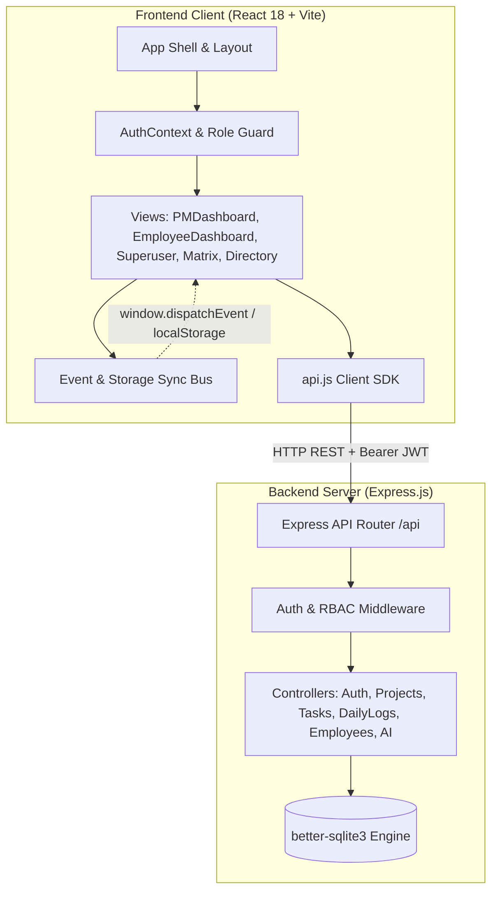
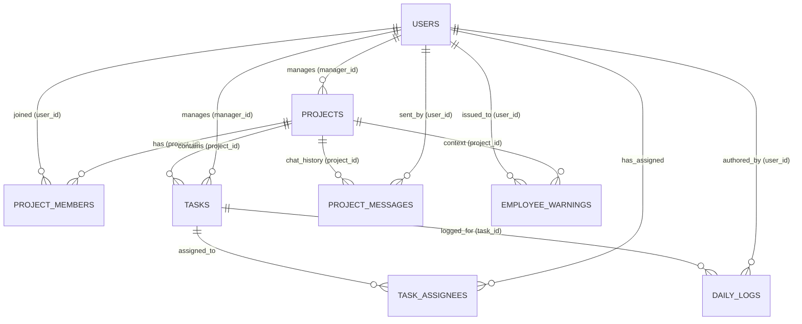
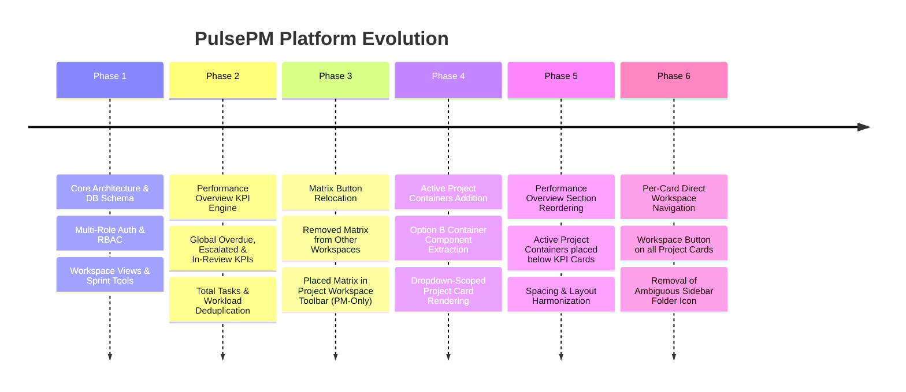

# PulsePM: Comprehensive Architecture, Code Flow & Implementation Plan

> **Platform:** PulsePM — Lightweight AI Project & Employee Management Platform  
> **Stack:** React 18 • Vite • Tailwind CSS • Node.js / Express • better-sqlite3 • Multi-Dimensional AI Synthesis Engine  
> **Document Version:** 1.0.0 (Production Blueprint)

---

## 1. Executive Summary & System Overview

**PulsePM** is a multi-role project management and workforce analytics platform engineered for modern agile development teams. It simplifies complex project management workflows into intuitive, high-performance visual interfaces while retaining relational data integrity and real-time cross-view reactivity.

### Key Capabilities
- **Role-Gated Dashboards:** Tailored user experiences for **Project Managers (PM)**, **Employees / Individual Contributors**, and **Superusers**.
- **Performance Overview & Analytics:** Global and project-scoped Key Performance Indicators (KPIs), including Overdue Tasks, Escalations, In-Review / QA queues, Bug-to-Feature Ratios, Backlog Size, and Workload Distribution.
- **Active Project Containers:** Quick-action project cards supporting one-click task provisioning, dedicated team chat with meeting schedulers, and direct scoped workspace access.
- **Unified Workspace ("Spaces") Experience:** Four synchronized execution views per project: **Overall Tasks**, **Sprint Task List**, **Kanban Drag-and-Drop Board**, and **Project Documentation Hub**.
- **Calendar Matrix Tracker:** Interactive heatmap matrix mapping task deliverables against daily submission activity and sprint schedules.
- **Multi-Dimensional AI Summary Engine:** Generative synthesis engine transforming raw daily logs into structured executive briefs across five distinct dimensions.
- **Workforce Directory & Employee 360° Analytics:** Comprehensive employee tracking, performance scoring, warnings management, and activity history.

---

## 2. High-Level System Architecture

PulsePM adopts a clean decoupled client-server architecture with a fast relational embedded database and an event-driven synchronization bus.



### Architectural Principles
1. **Zero Unnecessary Rerenders:** Local state combined with fine-grained custom window events (`pmpulse_*_updated`) ensures views update instantly without full application refreshes.
2. **Strict Role-Based Access Control (RBAC):** API endpoints enforce `authenticateToken`, `requirePM`, and `requireSuperuser` middlewares on every sensitive operation.
3. **Pure Client-Side Scoping with Server Ground Truth:** The database enforces foreign-key relational constraints while the client provides reactive filtering (e.g. Performance Overview dropdown-scoping).
4. **Resilient Local Persistence & Cross-Tab Reactivity:** Real-time synchronization across browser tabs using `storage` listeners for active tasks, documents, and board configurations.

---

## 3. Database Architecture & Schema Specification

PulsePM is backed by a relational SQLite database managed via `better-sqlite3` (`server/src/db/database.sqlite`), optimized with indexed lookups for date-matrix queries and multi-dimensional analytics.

### 3.1 Entity-Relationship Diagram



### 3.2 Database Tables & Definitions

#### `users`
Core identity table supporting multiple user types and management hierarchies.
- `id` (INTEGER PRIMARY KEY AUTOINCREMENT)
- `email` (TEXT UNIQUE NOT NULL)
- `password_hash` (TEXT NOT NULL)
- `full_name` (TEXT NOT NULL)
- `role_title` (TEXT NOT NULL, e.g. `'Frontend Dev'`, `'QA Lead'`)
- `user_type` (TEXT CHECK `superuser`, `pm`, `employee`)
- `status` (TEXT DEFAULT `'active'`)
- `is_first_login` (INTEGER DEFAULT `0`)
- `avatar_url` (TEXT)
- `manager_id` (INTEGER REFERENCES `users(id)`)
- `created_at` (DATETIME DEFAULT CURRENT_TIMESTAMP)

#### `projects`
Project containers managed by PMs.
- `id` (INTEGER PRIMARY KEY AUTOINCREMENT)
- `title` (TEXT NOT NULL)
- `description` (TEXT)
- `manager_id` (INTEGER REFERENCES `users(id)`)
- `start_date` (DATE)
- `end_date` (DATE)
- `status` (TEXT CHECK `'active'`, `'in-review'`, `'completed'`, `'archived'`)
- `created_at` (DATETIME DEFAULT CURRENT_TIMESTAMP)

#### `project_members`
Association table linking users to projects.
- `id` (INTEGER PRIMARY KEY AUTOINCREMENT)
- `project_id` (INTEGER REFERENCES `projects(id)`)
- `user_id` (INTEGER REFERENCES `users(id)`)
- `assigned_at` (DATETIME DEFAULT CURRENT_TIMESTAMP)
- *Constraint:* `UNIQUE(project_id, user_id)`

#### `tasks`
Task deliverables within project workspaces.
- `id` (INTEGER PRIMARY KEY AUTOINCREMENT)
- `project_id` (INTEGER REFERENCES `projects(id)`)
- `manager_id` (INTEGER REFERENCES `users(id)`)
- `title` (TEXT NOT NULL)
- `description` (TEXT)
- `start_date` (DATE NOT NULL)
- `end_date` (DATE NOT NULL)
- `status` (TEXT DEFAULT `'in_progress'`)
- `created_at` (DATETIME DEFAULT CURRENT_TIMESTAMP)

#### `task_assignees`
Many-to-many relationship supporting single or multiple assignees per task.
- `id` (INTEGER PRIMARY KEY AUTOINCREMENT)
- `task_id` (INTEGER REFERENCES `tasks(id)`)
- `user_id` (INTEGER REFERENCES `users(id)`)
- *Constraint:* `UNIQUE(task_id, user_id)`

#### `daily_logs`
Submissions tracking daily progress and absence reasons.
- `id` (INTEGER PRIMARY KEY AUTOINCREMENT)
- `task_id` (INTEGER REFERENCES `tasks(id)`)
- `user_id` (INTEGER REFERENCES `users(id)`)
- `manager_id` (INTEGER REFERENCES `users(id)`)
- `log_date` (DATE NOT NULL)
- `work_text` (TEXT)
- `has_worked` (INTEGER DEFAULT `1`)
- `no_work_reason` (TEXT)
- `created_at` (DATETIME DEFAULT CURRENT_TIMESTAMP)
- *Constraint:* `UNIQUE(task_id, user_id, log_date)`

#### `project_messages`
Team chat and meeting scheduling stream per project.
- `id` (INTEGER PRIMARY KEY AUTOINCREMENT)
- `project_id` (INTEGER REFERENCES `projects(id)`)
- `user_id` (INTEGER REFERENCES `users(id)`)
- `message` (TEXT NOT NULL)
- `message_type` (TEXT CHECK `'text'`, `'meeting'`, `'announcement'`)
- `metadata` (TEXT, JSON string for calendar dates/links)
- `created_at` (DATETIME DEFAULT CURRENT_TIMESTAMP)

#### `employee_warnings`
Formal warning notices issued by PMs to employees.
- `id` (INTEGER PRIMARY KEY AUTOINCREMENT)
- `user_id` (INTEGER REFERENCES `users(id)`)
- `project_id` (INTEGER REFERENCES `projects(id)`)
- `message` (TEXT NOT NULL)
- `created_at` (DATETIME DEFAULT CURRENT_TIMESTAMP)

---

## 4. Backend Server Architecture & API Catalog

The server is built with **Express.js** (`server/src/index.js`) and mounts RESTful endpoints under `/api`.

### 4.1 Middleware Pipeline
- `cors`: Handles Cross-Origin Resource Sharing with credentials support.
- `express.json()`: Parses incoming JSON payloads.
- Request Logger: Logs timestamps, methods, and URLs.
- `authenticateToken`: Validates JWT token from the `Authorization: Bearer <token>` header, extracts `req.user`.
- `requirePM`: Restricts routes to `user_type === 'pm'`.
- `requireSuperuser`: Restricts routes to `user_type === 'superuser'`.

### 4.2 Endpoint Catalog

| Endpoint | Method | Middleware | Controller Function | Description |
|---|---|---|---|---|
| `/api/auth/check-role` | POST | None | `checkRole` | Pre-flight validation of user account role |
| `/api/auth/login` | POST | None | `login` | Authenticates user; issues JWT token |
| `/api/auth/me` | GET | `authenticateToken` | `getMe` | Returns authenticated user session object |
| `/api/auth/users` | GET | None | `listAllUsers` | Lists user accounts for directory/switcher |
| `/api/auth/change-password` | POST | `authenticateToken` | `changePassword` | Updates authenticated user password |
| `/api/auth/set-permanent-password` | POST | None | `setPermanentPassword` | Completes initial first-time password set |
| `/api/projects` | GET | `authenticateToken` | `getProjects` | Lists all projects for the current PM |
| `/api/projects` | POST | `authenticateToken`, `requirePM` | `createProject` | Provisions a new project container |
| `/api/projects/all/tasks` | GET | `authenticateToken`, `requirePM` | `getAllProjectsTasks` | Aggregates all tasks across PM's active projects |
| `/api/projects/:id` | GET | `authenticateToken` | `getProjectById` | Fetches single project metadata |
| `/api/projects/:id` | PUT | `authenticateToken`, `requirePM` | `updateProject` | Updates title, status, or description |
| `/api/projects/:id` | DELETE | `authenticateToken`, `requirePM` | `deleteProject` | Deletes project and cascades tasks/logs |
| `/api/projects/:id/tasks` | POST | `authenticateToken`, `requirePM` | `createTask` | Creates a task under a specific project |
| `/api/projects/:id/members` | POST | `authenticateToken`, `requirePM` | `addProjectMember` | Adds a team member to a project |
| `/api/projects/:id/members/:userId`| DELETE | `authenticateToken`, `requirePM` | `removeProjectMember` | Removes a member from a project |
| `/api/workspaces/:id/tasks` | GET | `authenticateToken` | `getProjectTasks` | Fetches all tasks for project workspace |
| `/api/workspaces/:id/tasks/import` | POST | `authenticateToken`, `requirePM` | `importProjectTasks` | Bulk imports tasks via Excel (.xlsx) upload |
| `/api/workspaces/:id/tasks` | DELETE | `authenticateToken`, `requirePM` | `deleteProjectTasks` | Clears all tasks in a workspace |
| `/api/projects/:id/matrix` | GET | `authenticateToken`, `requirePM` | `getProjectMatrix` | Computes calendar heatmap matrix for project |
| `/api/matrix/fleet` | GET | `authenticateToken`, `requirePM` | `getFleetMatrix` | Fleet-wide calendar matrix across projects |
| `/api/tasks/:id/daily-log` | POST | `authenticateToken` | `submitDailyLog` | Submits employee daily work log |
| `/api/ai/summarize` | POST | `authenticateToken`, `requirePM` | `generateSummary` | Multi-dimensional AI executive summary |
| `/api/employees` | GET | `authenticateToken` | `getEmployees` | Retrieves all employee profiles |
| `/api/employees/:id/analytics` | GET | `authenticateToken`, `requirePM` | `getEmployeeAnalytics` | Generates 360° analytics for an employee |
| `/api/projects/:id/messages` | GET | `authenticateToken` | `getProjectMessages` | Retrieves project chat history |
| `/api/projects/:id/messages` | POST | `authenticateToken` | `sendProjectMessage` | Dispatches new chat/meeting message |
| `/api/pms` | GET/POST/DELETE | `authenticateToken`, `requireSuperuser` | `superuserController` | Superuser PM provisioning & management |

---

## 5. Frontend Component Hierarchy & State Flow

The client application is built with **React 18** using functional components and hooks (`useState`, `useEffect`, `useMemo`, `useRef`).

### 5.1 Application Component Tree

```mermaid
graph TD
    App[App.jsx]
    Auth[AuthContext.jsx]
    Sidebar[Sidebar.jsx]
    TopBar[TopBar Header & Search]
    
    App --> Auth
    App --> Sidebar
    App --> TopBar
    
    App --> PM[PMDashboard.jsx]
    App --> OW[OtherWorkspaces.jsx]
    App --> CM[CalendarMatrix.jsx]
    App --> WD[WorkforceDirectory.jsx]
    App --> E360[Employee360View.jsx]
    App --> AI[AISummaryHub.jsx]
    App --> ED[EmployeeDashboard.jsx]
    App --> SU[SuperuserDashboard.jsx]

    subgraph PMDashboard_Views["Inside PMDashboard.jsx"]
        Overview[sidebarView === 'overview']
        Workspace[sidebarView === 'workspace']
        
        Overview --> WelcomeBanner[Welcome Banner]
        Overview --> DropdownRow[Overview Filter Dropdown]
        Overview --> GlobalKPIs[Global KPI Cards (3 Cards)]
        Overview --> ProjectKPIs[Project-Specific KPI Cards (8 Cards)]
        Overview --> APC[ActiveProjectContainers.jsx]
        
        Workspace --> SpacesHeader[Spaces Header + Member Actions + Matrix Button]
        Workspace --> OverallTasksTab[Overall Tasks View]
        Workspace --> SprintListTab[Sprint Task List Table]
        Workspace --> KanbanBoardTab[Kanban Board (Drag & Drop)]
        Workspace --> DocsTab[Workspace Docs Hub]
    end

    subgraph Modals["Project & Task Modals"]
        NewProjModal[NewProjectModal]
        NewTaskModal[NewTaskModal]
        ChatModal[ProjectChatModal]
        MembersModal[AddMembersModal / CheckMembersModal]
    end

    APC --> NewTaskModal
    APC --> ChatModal
    OW --> NewProjModal
    OW --> NewTaskModal
    OW --> ChatModal
    Workspace --> MembersModal
```

### 5.2 State Management & Routing Architecture
- **Tab Routing:** Controlled in `App.jsx` via `activeTab` state (`'dashboard'`, `'other_workspaces'`, `'calendar_matrix'`, `'workforce'`, `'employee_360'`, `'ai_summary'`).
- **Workspace Scoping:** `selectedWorkspace` is held in `App.jsx` and passed down to `PMDashboard`. When a user navigates to a project via a "Workspace →" button or topbar search, `handleNavigateTab(tabId, projectId, view)` looks up the project, updates `selectedWorkspace`, and sets the view to `'workspace'`.
- **Cross-Component Events:** Custom events (`pmpulse_workspaceTasks_updated`, `pmpulse_listTasks_updated`, `pmpulse_boardTasks_updated`, `pmpulse_boardBacklogTasks_updated`) notify sibling components when tasks are imported, edited, or deleted.

---

## 6. End-to-End Data & Execution Flows

### Flow 1: Authentication & Role-Based Entry
1. User enters email and password on `LandingPage.jsx`.
2. `api.auth.login()` posts to `/api/auth/login`.
3. Server validates credentials against `users` table via `bcrypt` / password hash.
4. On success, server signs a JWT payload `{ id, email, user_type }` and returns `{ user, token }`.
5. `AuthContext.jsx` saves token to `localStorage.pulsepm_token` and updates `user` state.
6. `App.jsx` evaluates `user.user_type`:
   - `superuser` $\rightarrow$ Mounts `<SuperuserDashboard />`.
   - `pm` $\rightarrow$ Mounts PM views starting with `<PMDashboard />`.
   - `employee` $\rightarrow$ Mounts `<EmployeeDashboard />`.

### Flow 2: Performance Overview & Dynamic KPI Computation
1. PM navigates to Project Dashboard home (`sidebarView === 'overview'`).
2. `PMDashboard` invokes `fetchAllWorkspacesData()`:
   - Fetches all PM's projects via `api.projects.getAll()`.
   - Fetches all active project tasks via `api.projects.getAllTasks()`.
3. The user interacts with the **Performance Overview Dropdown**:
   - Option A: **"All Projects (Global)"** (`overviewFilter === 'all'`)
     - Displays 3 Global KPI Cards:
       - **Global Overdue Tasks:** Tasks with `dueDate < today` not in done-like statuses.
       - **Global Escalated Tasks:** Tasks with priority matching `'Highest'`, `'Escalated'`, or `'Critical'`.
       - **Global In-Review / QA:** Tasks with status matching `'In Review'`, `'QA'`, or `'Review'`.
     - Displays Active Project Containers showing all active projects.
   - Option B: **Specific Project Selected** (`overviewFilter === <projectId>`)
     - Displays 8 Project-Specific KPI Cards:
       - **Bug-to-Feature Ratio:** Counts `type === 'Bug'` vs. `type === 'Feature'`/`'Task'`.
       - **Overdue Tasks:** Project-scoped overdue items.
       - **Escalated Tasks:** Project-scoped critical items.
       - **In Review / QA:** Project-scoped review items.
       - **Backlog Size:** Tasks in backlog queue.
       - **Total Tasks:** Total task volume across sprint and backlog.
       - **Workload Distribution:** Member workload grouped by canonical `user_id` with deduplication and unassigned percentage.
       - **Active Docs:** Count of workspace documents.
     - Displays Active Project Containers filtered to strictly that one project.

### Flow 3: Project Workspace Navigation & Scoping Flow
1. PM views project cards in either **Other Workspaces** or **Active Project Containers** on Performance Overview.
2. PM clicks the **"Workspace →"** button on a card:
   - Button calls `onNavigateTab('dashboard', proj.id, 'workspace')` (or `onOpenWorkspace(proj)`).
3. `App.jsx` receives the request:
   - Looks up `proj.id` in `workspaces` array.
   - Sets `selectedWorkspace = targetProject`.
   - Sets `initialDashboardView = 'workspace'`.
   - Sets `activeTab = 'dashboard'`.
4. `PMDashboard.jsx` updates:
   - Mounts or updates with `sidebarView = 'workspace'`.
   - `useEffect(..., [selectedWorkspace])` fetches `/api/workspaces/${selectedWorkspace.id}/tasks` and `/api/workspaces/${selectedWorkspace.id}/docs`.
   - Header renders project name, `+ Members`, `Check members`, and `Matrix` button.
   - User seamlessly works within that project's Overall, List, Board, or Docs tabs.

### Flow 4: Task Creation, Kanban Board & Sprint Management Flow
1. **Task Creation:**
   - PM clicks `+ Task` on a project card $\rightarrow$ Opens `NewTaskModal` with pre-filled `projectId`.
   - Or PM uses inline creation on the Sprint List / Kanban Board.
2. **Kanban Drag-and-Drop:**
   - PM drags task card between columns (`To Do`, `In Progress`, `In Review`, `Done`, `Remove`).
   - `onDrop` handler updates column ID, commits state to `boardTasks` / `boardBacklogTasks`, and updates `localStorage`.
   - Dispatches `pmpulse_boardTasks_updated` event to synchronize KPI counters and List views.
3. **Bulk Excel Upload:**
   - PM selects `.xlsx` spreadsheet in Workspace view.
   - Uploads via multipart POST `/api/workspaces/:id/tasks/import`.
   - Server parses sheets with `xlsx`, normalizes columns (`Issue / Task`, `Responsible`, `Priority`, `Status`, `Dates`), inserts records into SQLite, and returns updated task list.

### Flow 5: Daily Log Submission & Calendar Matrix Heatmap Flow
1. **Daily Work Submission (Employee):**
   - Employee opens `<EmployeeDashboard />`.
   - Selects task deliverable, enters work description or selects "No Work Done" with required justification reason.
   - Submits to `POST /api/tasks/:id/daily-log`.
   - Server validates date constraint (`log_date`) and writes record to `daily_logs` table.
2. **Calendar Matrix Tracker (PM):**
   - PM clicks **"Matrix"** button in project toolbar or sidebar.
   - Loads `<CalendarMatrix selectedProjectId={id} />`.
   - Fetches matrix data from `GET /api/projects/:id/matrix`.
   - Server aggregates daily submissions across sprint dates, calculating submission status:
     - **Green:** Active submission made (`has_worked === 1`).
     - **Amber / Orange:** "No Work Done" reported with reason.
     - **Red:** Missing / overdue submission for past sprint day.
     - **Gray:** Future sprint day or weekend.
   - Interactive modal opens on cell click (`LogDetailModal`) to review detailed log entries or send warnings.

### Flow 6: AI Multi-Dimensional Summary Engine Flow
1. PM navigates to **AI Executive Summary Hub** (`activeTab === 'ai_summary'`).
2. Selects date range and project context.
3. Submits to `POST /api/ai/summarize`.
4. Server queries all `daily_logs`, `tasks`, and `project_messages` within the time window.
5. AI Synthesis Pipeline analyzes the dataset across five dimensions:
   - **Velocity & Progress:** Completed milestones vs. scheduled velocity.
   - **Blockers & Impediments:** Flagged stalls, missed logs, and blockers.
   - **Risk Assessment:** Overdue trajectories, unassigned workloads, and critical items.
   - **Resource Allocation:** Team member capacity, focus distribution, and overtime.
   - **Action Items & Next Sprints:** Concrete recommendations for PM intervention.
6. Returns polished markdown report displayed in `<AISummaryHub />` with copy and export capabilities.

---

## 7. Complete Project Implementation Plan & Evolution Roadmap

The platform has been systematically developed and enhanced across targeted phases.



### Phase Details

#### Phase 1 — Relational Core & Unified Workspace
- Initialized SQLite schema with tables for `users`, `projects`, `project_members`, `tasks`, `task_assignees`, `daily_logs`, `project_messages`, and `employee_warnings`.
- Established Express API router with JWT authentication and role checking.
- Built React client with Tailwind styling, Jira-inspired dark mode theme tokens, and dynamic sidebar navigation.
- Delivered the core PM Workspace tabs: Overall Tasks, Sprint List, Kanban Board, and Document Hub.

#### Phase 2 — Performance Overview & Global KPI Engine
- Built global project task aggregation endpoint `GET /api/projects/all/tasks`.
- Implemented robust date parser handling ISO strings, UK/European formatted dates, and Excel numeric timestamps.
- Implemented Global KPI calculations across all PM projects:
  - Global Overdue Tasks
  - Global Escalated Tasks
  - Global In-Review / QA Tasks
- Added project-specific Total Tasks KPI card.
- Deduplicated Workload Distribution by canonical `user_id` and excluded completed tasks from active workload calculations.

#### Phase 3 — UI Streamlining & Matrix Button Relocation
- Relocated the project-scoped "Matrix →" button from cards in `OtherWorkspaces.jsx` directly into that project's own workspace view header toolbar in `PMDashboard.jsx`.
- Enforced strict PM-only role gating (`user_type === 'pm'`) on the relocated Matrix button.
- Retained untouched `+ Task`, `Chat`, and `Delete` actions on Other Workspaces cards.

#### Phase 4 — Active Project Containers in Performance Overview
- Evaluated Option A (shared component refactor) vs. Option B (dedicated component creation). Adopted **Option B** to preserve `OtherWorkspaces.jsx` completely untouched.
- Created `client/src/components/ActiveProjectContainers.jsx`.
- Rendered project containers in Performance Overview with dropdown-driven scoping:
  - "All Projects (Global)": Renders all active projects managed by the PM.
  - Specific Project: Renders strictly that single project card.
- Replicated full modal functionality: `NewTaskModal` (`+ Task`), `ProjectChatModal` (`Chat`), and project deletion with refresh.

#### Phase 5 — Layout Optimization: Section Reordering
- Relocated the `ActiveProjectContainers` block to render **below** the KPI cards grid (both Global and Project-Specific sets).
- Preserved existing margin tokens (`mb-6` on header, `mt-6 mb-8` on containers) ensuring balanced vertical rhythm without extra wrappers.

#### Phase 6 — Direct Project Navigation & Sidebar Clean-up
- Added a dedicated **"Workspace →"** button to every project card in both `OtherWorkspaces.jsx` and `ActiveProjectContainers.jsx`.
- Positioned the button in the visual slot previously occupied by Matrix, styled with `btn-primary`, `Layout`, and `ArrowRight` icons.
- Updated `handleNavigateTab` in `App.jsx` to dynamically synchronize `selectedWorkspace` when navigating to a project.
- Removed the ambiguous, un-scoped `<Folder size={24} />` icon from the PMDashboard sidebar, preserving the underlying workspace route and components.

---

## 8. Deployment, Environment & Operational Guidelines

### 8.1 Development & Run Commands
- **Concurrent Development:**
  ```bash
  # From project root (runs both Express server on :5000 and Vite client on :5173):
  npm run dev
  ```
- **Backend Only:**
  ```bash
  cd server && npm run dev
  ```
- **Frontend Only:**
  ```bash
  cd client && npm run dev
  ```
- **Production Client Build:**
  ```bash
  cd client && npm run build
  ```

### 8.2 Environment Configuration
Server environment variables (`server/.env`):
```env
PORT=5000
JWT_SECRET=your_secure_jwt_secret_key_pulsepm
NODE_ENV=development
```

Client Vite configuration (`client/vite.config.js`):
- Dev proxy routes `/api` directly to `http://localhost:5000`.

### 8.3 Security & Operational Integrity
- Passwords hashed using standard cryptographic algorithms before storing in database.
- JWT tokens expire automatically; frontend handles `session_expired` events with session reauth modal.
- Foreign-key cascade rules (`ON DELETE CASCADE`) maintain relational integrity on project and user deletions.
