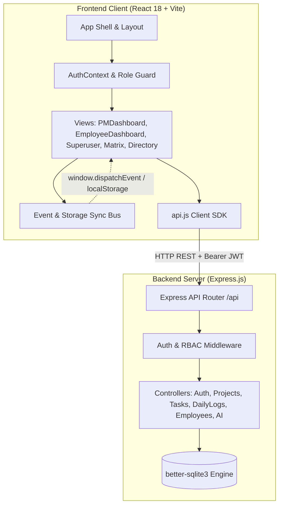
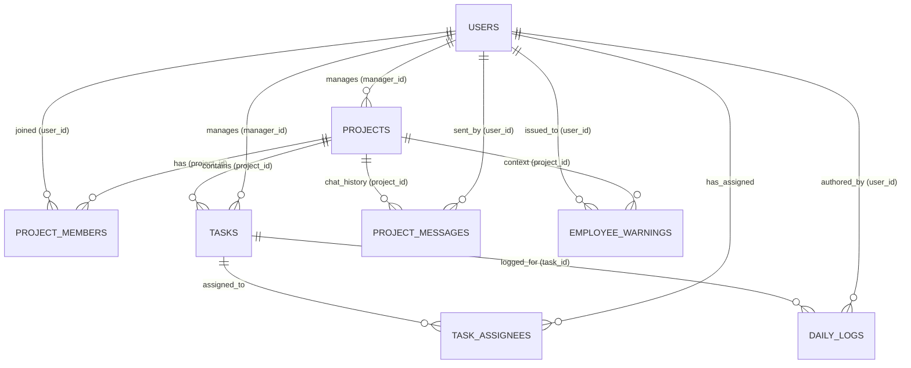
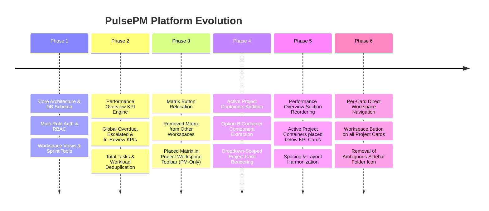

# PulsePM — Complete Project Codebase

> **Notice:** This document contains the full source code of all files across the PulsePM platform in a single consolidated reference file.
> **Generated On:** 2026-09-11T07:22:07.639Z
> **Total Files:** 64

---

## Table of Contents


### Project Root & Configuration

- [.env](#file--env) `(0.1 KB)`
- [.gitignore](#file--gitignore) `(0.1 KB)`
- [LICENSE](#file-license) `(1.1 KB)`
- [package.json](#file-package-json) `(0.6 KB)`
- [README.md](#file-readme-md) `(2.6 KB)`
- [PMPULSE_ARCHITECTURE_AND_IMPLEMENTATION_PLAN.md](#file-pmpulse-architecture-and-implementation-plan-md) `(25.5 KB)`

### Backend Server (Express & SQLite)

- [server/src/db/database.js](#file-server-src-db-database-js) `(0.6 KB)`
- [server/src/db/schema.sql](#file-server-src-db-schema-sql) `(4.5 KB)`
- [server/src/db/seed.js](#file-server-src-db-seed-js) `(12.9 KB)`
- [server/src/middleware/auth.js](#file-server-src-middleware-auth-js) `(1.6 KB)`
- [server/src/controllers/aiController.js](#file-server-src-controllers-aicontroller-js) `(15.9 KB)`
- [server/src/controllers/authController.js](#file-server-src-controllers-authcontroller-js) `(4.8 KB)`
- [server/src/controllers/chatController.js](#file-server-src-controllers-chatcontroller-js) `(5.1 KB)`
- [server/src/controllers/dailyLogController.js](#file-server-src-controllers-dailylogcontroller-js) `(13.8 KB)`
- [server/src/controllers/employeeController.js](#file-server-src-controllers-employeecontroller-js) `(22.2 KB)`
- [server/src/controllers/projectController.js](#file-server-src-controllers-projectcontroller-js) `(22.8 KB)`
- [server/src/controllers/superuserController.js](#file-server-src-controllers-superusercontroller-js) `(2.3 KB)`
- [server/src/routes/api.js](#file-server-src-routes-api-js) `(4 KB)`
- [server/src/index.js](#file-server-src-index-js) `(1.1 KB)`
- [server/check_db.mjs](#file-server-check-db-mjs) `(0.6 KB)`
- [server/package.json](#file-server-package-json) `(0.6 KB)`
- [server/update_db.js](#file-server-update-db-js) `(0.3 KB)`

### Frontend Client (React & Tailwind)

- [client/src/context/AuthContext.jsx](#file-client-src-context-authcontext-jsx) `(4.4 KB)`
- [client/src/context/ThemeContext.jsx](#file-client-src-context-themecontext-jsx) `(0.9 KB)`
- [client/src/services/api.js](#file-client-src-services-api-js) `(4.2 KB)`
- [client/src/components/ActiveProjectContainers.jsx](#file-client-src-components-activeprojectcontainers-jsx) `(7.6 KB)`
- [client/src/components/AISummaryHub.jsx](#file-client-src-components-aisummaryhub-jsx) `(15.8 KB)`
- [client/src/components/CalendarMatrix.jsx](#file-client-src-components-calendarmatrix-jsx) `(45.7 KB)`
- [client/src/components/Employee360View.jsx](#file-client-src-components-employee360view-jsx) `(24.2 KB)`
- [client/src/components/EmployeeDashboard.jsx](#file-client-src-components-employeedashboard-jsx) `(102.5 KB)`
- [client/src/components/LandingPage.jsx](#file-client-src-components-landingpage-jsx) `(15 KB)`
- [client/src/components/LogDetailModal.jsx](#file-client-src-components-logdetailmodal-jsx) `(10.8 KB)`
- [client/src/components/Navbar.jsx](#file-client-src-components-navbar-jsx) `(12.6 KB)`
- [client/src/components/OtherWorkspaces.jsx](#file-client-src-components-otherworkspaces-jsx) `(12.5 KB)`
- [client/src/components/PMDashboard.jsx](#file-client-src-components-pmdashboard-jsx) `(136.7 KB)`
- [client/src/components/ProjectChatModal.jsx](#file-client-src-components-projectchatmodal-jsx) `(28.4 KB)`
- [client/src/components/ProjectTaskModal.jsx](#file-client-src-components-projecttaskmodal-jsx) `(21.8 KB)`
- [client/src/components/SessionReauthModal.jsx](#file-client-src-components-sessionreauthmodal-jsx) `(4.5 KB)`
- [client/src/components/SetPassword.jsx](#file-client-src-components-setpassword-jsx) `(3.9 KB)`
- [client/src/components/Sidebar.jsx](#file-client-src-components-sidebar-jsx) `(7.5 KB)`
- [client/src/components/SuperuserDashboard.jsx](#file-client-src-components-superuserdashboard-jsx) `(13.5 KB)`
- [client/src/components/TaskDetailModal.jsx](#file-client-src-components-taskdetailmodal-jsx) `(12.9 KB)`
- [client/src/components/WorkforceDirectory.jsx](#file-client-src-components-workforcedirectory-jsx) `(20 KB)`
- [client/src/App.jsx](#file-client-src-app-jsx) `(14.7 KB)`
- [client/src/index.css](#file-client-src-index-css) `(17.2 KB)`
- [client/src/main.jsx](#file-client-src-main-jsx) `(0.2 KB)`
- [client/index.html](#file-client-index-html) `(1.2 KB)`
- [client/package.json](#file-client-package-json) `(0.6 KB)`
- [client/postcss.config.js](#file-client-postcss-config-js) `(0.1 KB)`
- [client/tailwind.config.js](#file-client-tailwind-config-js) `(1.3 KB)`
- [client/vite.config.js](#file-client-vite-config-js) `(0.3 KB)`

### Desktop App (Electron)

- [desktop/main.cjs](#file-desktop-main-cjs) `(0.9 KB)`
- [desktop/preload.cjs](#file-desktop-preload-cjs) `(0.1 KB)`

### Scripts, Migrations & Utilities

- [fix_colors_2.js](#file-fix-colors-2-js) `(0.7 KB)`
- [fix_colors.js](#file-fix-colors-js) `(0.9 KB)`
- [fix_matrix.js](#file-fix-matrix-js) `(0.7 KB)`
- [fix_vars.js](#file-fix-vars-js) `(0.8 KB)`
- [test-suite.mjs](#file-test-suite-mjs) `(7.2 KB)`
- [update_css_neutral.js](#file-update-css-neutral-js) `(1.7 KB)`
- [update_css.js](#file-update-css-js) `(1.5 KB)`
- [update_db.js](#file-update-db-js) `(0.3 KB)`
- [update_landing_theme.js](#file-update-landing-theme-js) `(2.1 KB)`
- [update_landing.js](#file-update-landing-js) `(0.6 KB)`
- [update_theme_context.js](#file-update-theme-context-js) `(0.5 KB)`

---

## File: .env <a id="file--env"></a>

- **Path:** `.env`
- **Size:** 0.14 KB | **Lines:** 7 | **Language:** `ini`

```ini
PORT=5000
VITE_API_URL=http://localhost:5000
DATABASE_URL=server/data.db
JWT_SECRET=supersecretpassword123
DB_USER=admin
DB_PASS=adminpassword123
```

---

## File: .gitignore <a id="file--gitignore"></a>

- **Path:** `.gitignore`
- **Size:** 0.09 KB | **Lines:** 9 | **Language:** `gitignore`

```gitignore
node_modules/
.env
server/data.db
server/data.db-shm
server/data.db-wal
.DS_Store
dist/
build/
```

---

## File: LICENSE <a id="file-license"></a>

- **Path:** `LICENSE`
- **Size:** 1.07 KB | **Lines:** 22 | **Language:** `text`

```text
MIT License

Copyright (c) 2026 Sukhada2005-stack

Permission is hereby granted, free of charge, to any person obtaining a copy
of this software and associated documentation files (the "Software"), to deal
in the Software without restriction, including without limitation the rights
to use, copy, modify, merge, publish, distribute, sublicense, and/or sell
copies of the Software, and to permit persons to whom the Software is
furnished to do so, subject to the following conditions:

The above copyright notice and this permission notice shall be included in all
copies or substantial portions of the Software.

THE SOFTWARE IS PROVIDED "AS IS", WITHOUT WARRANTY OF ANY KIND, EXPRESS OR
IMPLIED, INCLUDING BUT NOT LIMITED TO THE WARRANTIES OF MERCHANTABILITY,
FITNESS FOR A PARTICULAR PURPOSE AND NONINFRINGEMENT. IN NO EVENT SHALL THE
AUTHORS OR COPYRIGHT HOLDERS BE LIABLE FOR ANY CLAIM, DAMAGES OR OTHER
LIABILITY, WHETHER IN AN ACTION OF CONTRACT, TORT OR OTHERWISE, ARISING FROM,
OUT OF OR IN CONNECTION WITH THE SOFTWARE OR THE USE OR OTHER DEALINGS IN THE
SOFTWARE.
```

---

## File: package.json <a id="file-package-json"></a>

- **Path:** `package.json`
- **Size:** 0.57 KB | **Lines:** 18 | **Language:** `json`

```json
{
  "name": "pulsepm-desktop",
  "version": "1.0.0",
  "description": "PulsePM: Lightweight AI Project & Employee Management Platform",
  "private": true,
  "scripts": {
    "install:all": "npm --prefix server install && npm --prefix client install",
    "server": "npm --prefix server start",
    "client": "npm --prefix client run dev",
    "dev": "concurrently \"npm --prefix server run dev\" \"npm --prefix client run dev\"",
    "build": "npm --prefix client run build",
    "seed": "npm --prefix server run seed"
  },
  "devDependencies": {
    "concurrently": "^9.1.2"
  }
}
```

---

## File: README.md <a id="file-readme-md"></a>

- **Path:** `README.md`
- **Size:** 2.58 KB | **Lines:** 55 | **Language:** `markdown`

````markdown
# PulsePM — Lightweight AI Project & Employee Management Platform

PulsePM is a dual-role project and employee management platform built to eliminate complex Agile overhead (story point voting, sprint ceremonies, multi-state Jira ticket transitions) and unorganized Slack communication.

## Key Features

1. **Dual-Role Workflow**:
   - **Project Manager (Admin)**: Create projects, provision granular tasks with explicit start/end dates, manage workforce directory, monitor progress on the interactive Calendar Matrix Heatmap, and analyze team health with 360° analytics.
   - **Contributors (Employees)**: View assigned active tasks with countdown tags (`Due in 3 days`), submit daily progress updates (raw unstructured notes or "Did not work today" blocker toggle), and receive instant visual confirmation.

2. **Interactive Calendar Matrix Heatmap GUI**:
   - Dynamic grid displaying employees & tasks vs calendar days.
   - 🟢 **Logged (Green)**: Click to inspect raw text logs.
   - 🔴 **No Work / Blocker (Red/Amber)**: Click to inspect impediment reasons.
   - ⚪ **Pending**: Future dates or unscheduled window.

3. **Employee 360° Deep Analysis Portal**:
   - **Module 1**: Allocated Projects & Active Tasks Breakdown with workload capacity meter.
   - **Module 2**: Complete Work History & Chronological Log Stream with consistency score.
   - **Module 3**: Leave & Inactivity Track Record with automated reason categorization (External / Internal / Personal).
   - **Module 4**: AI Performance Profile & Diagnostic Summary with 1-click printable dossier export.

4. **Multi-Dimensional AI Summary Engine**:
   - Synthesizes raw daily submissions into executive digests across 5 dimensions:
     1. Single Employee Summary (Individual Drilldown)
     2. Multiple Employees Comparative Summary (Team Cohort)
     3. Task-Based Summary (Milestone Tracking)
     4. Project-Based Summary (Project Health & Status)
     5. Overall / Fleet-Level Summary (Company-Wide Overview)
   - Dynamic multi-filter control panel with copy and export features.

5. **1-Click Demo User Switcher**:
   - Switch between PM (Alex Mercer) and Contributors (Rahul Sharma, Ananya Patel, Vikram Verma, Sneha Roy, David Kim) directly from the top navigation.

---

## Getting Started

### 1. Install & Run Dev Server
```bash
npm run dev
```
- **Web App**: [http://localhost:5173](http://localhost:5173)
- **Backend API**: [http://localhost:5000/api](http://localhost:5000/api)

### 2. Seed Mock Enterprise Data
```bash
npm run seed
```

### 3. Run Automated Tests
```bash
node test-suite.mjs
```
````

---

## File: PMPULSE_ARCHITECTURE_AND_IMPLEMENTATION_PLAN.md <a id="file-pmpulse-architecture-and-implementation-plan-md"></a>

- **Path:** `PMPULSE_ARCHITECTURE_AND_IMPLEMENTATION_PLAN.md`
- **Size:** 25.53 KB | **Lines:** 488 | **Language:** `markdown`

````markdown
# PulsePM: Comprehensive Architecture, Code Flow & Implementation Plan

> **Platform:** PulsePM — Lightweight AI Project & Employee Management Platform  
> **Stack:** React 18 • Vite • Tailwind CSS • Node.js / Express • better-sqlite3 • Multi-Dimensional AI Synthesis Engine  
> **Document Version:** 1.0.0 (Production Blueprint)

---

## 1. Executive Summary & System Overview

**PulsePM** is a multi-role project management and workforce analytics platform engineered for modern agile development teams. It simplifies complex project management workflows into intuitive, high-performance visual interfaces while retaining relational data integrity and real-time cross-view reactivity.

### Key Capabilities
- **Role-Gated Dashboards:** Tailored user experiences for **Project Managers (PM)**, **Employees / Individual Contributors**, and **Superusers**.
- **Performance Overview & Analytics:** Global and project-scoped Key Performance Indicators (KPIs), including Overdue Tasks, Escalations, In-Review / QA queues, Bug-to-Feature Ratios, Backlog Size, and Workload Distribution.
- **Active Project Containers:** Quick-action project cards supporting one-click task provisioning, dedicated team chat with meeting schedulers, and direct scoped workspace access.
- **Unified Workspace ("Spaces") Experience:** Four synchronized execution views per project: **Overall Tasks**, **Sprint Task List**, **Kanban Drag-and-Drop Board**, and **Project Documentation Hub**.
- **Calendar Matrix Tracker:** Interactive heatmap matrix mapping task deliverables against daily submission activity and sprint schedules.
- **Multi-Dimensional AI Summary Engine:** Generative synthesis engine transforming raw daily logs into structured executive briefs across five distinct dimensions.
- **Workforce Directory & Employee 360° Analytics:** Comprehensive employee tracking, performance scoring, warnings management, and activity history.

---

## 2. High-Level System Architecture

PulsePM adopts a clean decoupled client-server architecture with a fast relational embedded database and an event-driven synchronization bus.



### Architectural Principles
1. **Zero Unnecessary Rerenders:** Local state combined with fine-grained custom window events (`pmpulse_*_updated`) ensures views update instantly without full application refreshes.
2. **Strict Role-Based Access Control (RBAC):** API endpoints enforce `authenticateToken`, `requirePM`, and `requireSuperuser` middlewares on every sensitive operation.
3. **Pure Client-Side Scoping with Server Ground Truth:** The database enforces foreign-key relational constraints while the client provides reactive filtering (e.g. Performance Overview dropdown-scoping).
4. **Resilient Local Persistence & Cross-Tab Reactivity:** Real-time synchronization across browser tabs using `storage` listeners for active tasks, documents, and board configurations.

---

## 3. Database Architecture & Schema Specification

PulsePM is backed by a relational SQLite database managed via `better-sqlite3` (`server/src/db/database.sqlite`), optimized with indexed lookups for date-matrix queries and multi-dimensional analytics.

### 3.1 Entity-Relationship Diagram



### 3.2 Database Tables & Definitions

#### `users`
Core identity table supporting multiple user types and management hierarchies.
- `id` (INTEGER PRIMARY KEY AUTOINCREMENT)
- `email` (TEXT UNIQUE NOT NULL)
- `password_hash` (TEXT NOT NULL)
- `full_name` (TEXT NOT NULL)
- `role_title` (TEXT NOT NULL, e.g. `'Frontend Dev'`, `'QA Lead'`)
- `user_type` (TEXT CHECK `superuser`, `pm`, `employee`)
- `status` (TEXT DEFAULT `'active'`)
- `is_first_login` (INTEGER DEFAULT `0`)
- `avatar_url` (TEXT)
- `manager_id` (INTEGER REFERENCES `users(id)`)
- `created_at` (DATETIME DEFAULT CURRENT_TIMESTAMP)

#### `projects`
Project containers managed by PMs.
- `id` (INTEGER PRIMARY KEY AUTOINCREMENT)
- `title` (TEXT NOT NULL)
- `description` (TEXT)
- `manager_id` (INTEGER REFERENCES `users(id)`)
- `start_date` (DATE)
- `end_date` (DATE)
- `status` (TEXT CHECK `'active'`, `'in-review'`, `'completed'`, `'archived'`)
- `created_at` (DATETIME DEFAULT CURRENT_TIMESTAMP)

#### `project_members`
Association table linking users to projects.
- `id` (INTEGER PRIMARY KEY AUTOINCREMENT)
- `project_id` (INTEGER REFERENCES `projects(id)`)
- `user_id` (INTEGER REFERENCES `users(id)`)
- `assigned_at` (DATETIME DEFAULT CURRENT_TIMESTAMP)
- *Constraint:* `UNIQUE(project_id, user_id)`

#### `tasks`
Task deliverables within project workspaces.
- `id` (INTEGER PRIMARY KEY AUTOINCREMENT)
- `project_id` (INTEGER REFERENCES `projects(id)`)
- `manager_id` (INTEGER REFERENCES `users(id)`)
- `title` (TEXT NOT NULL)
- `description` (TEXT)
- `start_date` (DATE NOT NULL)
- `end_date` (DATE NOT NULL)
- `status` (TEXT DEFAULT `'in_progress'`)
- `created_at` (DATETIME DEFAULT CURRENT_TIMESTAMP)

#### `task_assignees`
Many-to-many relationship supporting single or multiple assignees per task.
- `id` (INTEGER PRIMARY KEY AUTOINCREMENT)
- `task_id` (INTEGER REFERENCES `tasks(id)`)
- `user_id` (INTEGER REFERENCES `users(id)`)
- *Constraint:* `UNIQUE(task_id, user_id)`

#### `daily_logs`
Submissions tracking daily progress and absence reasons.
- `id` (INTEGER PRIMARY KEY AUTOINCREMENT)
- `task_id` (INTEGER REFERENCES `tasks(id)`)
- `user_id` (INTEGER REFERENCES `users(id)`)
- `manager_id` (INTEGER REFERENCES `users(id)`)
- `log_date` (DATE NOT NULL)
- `work_text` (TEXT)
- `has_worked` (INTEGER DEFAULT `1`)
- `no_work_reason` (TEXT)
- `created_at` (DATETIME DEFAULT CURRENT_TIMESTAMP)
- *Constraint:* `UNIQUE(task_id, user_id, log_date)`

#### `project_messages`
Team chat and meeting scheduling stream per project.
- `id` (INTEGER PRIMARY KEY AUTOINCREMENT)
- `project_id` (INTEGER REFERENCES `projects(id)`)
- `user_id` (INTEGER REFERENCES `users(id)`)
- `message` (TEXT NOT NULL)
- `message_type` (TEXT CHECK `'text'`, `'meeting'`, `'announcement'`)
- `metadata` (TEXT, JSON string for calendar dates/links)
- `created_at` (DATETIME DEFAULT CURRENT_TIMESTAMP)

#### `employee_warnings`
Formal warning notices issued by PMs to employees.
- `id` (INTEGER PRIMARY KEY AUTOINCREMENT)
- `user_id` (INTEGER REFERENCES `users(id)`)
- `project_id` (INTEGER REFERENCES `projects(id)`)
- `message` (TEXT NOT NULL)
- `created_at` (DATETIME DEFAULT CURRENT_TIMESTAMP)

---

## 4. Backend Server Architecture & API Catalog

The server is built with **Express.js** (`server/src/index.js`) and mounts RESTful endpoints under `/api`.

### 4.1 Middleware Pipeline
- `cors`: Handles Cross-Origin Resource Sharing with credentials support.
- `express.json()`: Parses incoming JSON payloads.
- Request Logger: Logs timestamps, methods, and URLs.
- `authenticateToken`: Validates JWT token from the `Authorization: Bearer <token>` header, extracts `req.user`.
- `requirePM`: Restricts routes to `user_type === 'pm'`.
- `requireSuperuser`: Restricts routes to `user_type === 'superuser'`.

### 4.2 Endpoint Catalog

| Endpoint | Method | Middleware | Controller Function | Description |
|---|---|---|---|---|
| `/api/auth/check-role` | POST | None | `checkRole` | Pre-flight validation of user account role |
| `/api/auth/login` | POST | None | `login` | Authenticates user; issues JWT token |
| `/api/auth/me` | GET | `authenticateToken` | `getMe` | Returns authenticated user session object |
| `/api/auth/users` | GET | None | `listAllUsers` | Lists user accounts for directory/switcher |
| `/api/auth/change-password` | POST | `authenticateToken` | `changePassword` | Updates authenticated user password |
| `/api/auth/set-permanent-password` | POST | None | `setPermanentPassword` | Completes initial first-time password set |
| `/api/projects` | GET | `authenticateToken` | `getProjects` | Lists all projects for the current PM |
| `/api/projects` | POST | `authenticateToken`, `requirePM` | `createProject` | Provisions a new project container |
| `/api/projects/all/tasks` | GET | `authenticateToken`, `requirePM` | `getAllProjectsTasks` | Aggregates all tasks across PM's active projects |
| `/api/projects/:id` | GET | `authenticateToken` | `getProjectById` | Fetches single project metadata |
| `/api/projects/:id` | PUT | `authenticateToken`, `requirePM` | `updateProject` | Updates title, status, or description |
| `/api/projects/:id` | DELETE | `authenticateToken`, `requirePM` | `deleteProject` | Deletes project and cascades tasks/logs |
| `/api/projects/:id/tasks` | POST | `authenticateToken`, `requirePM` | `createTask` | Creates a task under a specific project |
| `/api/projects/:id/members` | POST | `authenticateToken`, `requirePM` | `addProjectMember` | Adds a team member to a project |
| `/api/projects/:id/members/:userId`| DELETE | `authenticateToken`, `requirePM` | `removeProjectMember` | Removes a member from a project |
| `/api/workspaces/:id/tasks` | GET | `authenticateToken` | `getProjectTasks` | Fetches all tasks for project workspace |
| `/api/workspaces/:id/tasks/import` | POST | `authenticateToken`, `requirePM` | `importProjectTasks` | Bulk imports tasks via Excel (.xlsx) upload |
| `/api/workspaces/:id/tasks` | DELETE | `authenticateToken`, `requirePM` | `deleteProjectTasks` | Clears all tasks in a workspace |
| `/api/projects/:id/matrix` | GET | `authenticateToken`, `requirePM` | `getProjectMatrix` | Computes calendar heatmap matrix for project |
| `/api/matrix/fleet` | GET | `authenticateToken`, `requirePM` | `getFleetMatrix` | Fleet-wide calendar matrix across projects |
| `/api/tasks/:id/daily-log` | POST | `authenticateToken` | `submitDailyLog` | Submits employee daily work log |
| `/api/ai/summarize` | POST | `authenticateToken`, `requirePM` | `generateSummary` | Multi-dimensional AI executive summary |
| `/api/employees` | GET | `authenticateToken` | `getEmployees` | Retrieves all employee profiles |
| `/api/employees/:id/analytics` | GET | `authenticateToken`, `requirePM` | `getEmployeeAnalytics` | Generates 360° analytics for an employee |
| `/api/projects/:id/messages` | GET | `authenticateToken` | `getProjectMessages` | Retrieves project chat history |
| `/api/projects/:id/messages` | POST | `authenticateToken` | `sendProjectMessage` | Dispatches new chat/meeting message |
| `/api/pms` | GET/POST/DELETE | `authenticateToken`, `requireSuperuser` | `superuserController` | Superuser PM provisioning & management |

---

## 5. Frontend Component Hierarchy & State Flow

The client application is built with **React 18** using functional components and hooks (`useState`, `useEffect`, `useMemo`, `useRef`).

### 5.1 Application Component Tree

```mermaid
graph TD
    App[App.jsx]
    Auth[AuthContext.jsx]
    Sidebar[Sidebar.jsx]
    TopBar[TopBar Header & Search]
    
    App --> Auth
    App --> Sidebar
    App --> TopBar
    
    App --> PM[PMDashboard.jsx]
    App --> OW[OtherWorkspaces.jsx]
    App --> CM[CalendarMatrix.jsx]
    App --> WD[WorkforceDirectory.jsx]
    App --> E360[Employee360View.jsx]
    App --> AI[AISummaryHub.jsx]
    App --> ED[EmployeeDashboard.jsx]
    App --> SU[SuperuserDashboard.jsx]

    subgraph PMDashboard_Views["Inside PMDashboard.jsx"]
        Overview[sidebarView === 'overview']
        Workspace[sidebarView === 'workspace']
        
        Overview --> WelcomeBanner[Welcome Banner]
        Overview --> DropdownRow[Overview Filter Dropdown]
        Overview --> GlobalKPIs[Global KPI Cards (3 Cards)]
        Overview --> ProjectKPIs[Project-Specific KPI Cards (8 Cards)]
        Overview --> APC[ActiveProjectContainers.jsx]
        
        Workspace --> SpacesHeader[Spaces Header + Member Actions + Matrix Button]
        Workspace --> OverallTasksTab[Overall Tasks View]
        Workspace --> SprintListTab[Sprint Task List Table]
        Workspace --> KanbanBoardTab[Kanban Board (Drag & Drop)]
        Workspace --> DocsTab[Workspace Docs Hub]
    end

    subgraph Modals["Project & Task Modals"]
        NewProjModal[NewProjectModal]
        NewTaskModal[NewTaskModal]
        ChatModal[ProjectChatModal]
        MembersModal[AddMembersModal / CheckMembersModal]
    end

    APC --> NewTaskModal
    APC --> ChatModal
    OW --> NewProjModal
    OW --> NewTaskModal
    OW --> ChatModal
    Workspace --> MembersModal
```

### 5.2 State Management & Routing Architecture
- **Tab Routing:** Controlled in `App.jsx` via `activeTab` state (`'dashboard'`, `'other_workspaces'`, `'calendar_matrix'`, `'workforce'`, `'employee_360'`, `'ai_summary'`).
- **Workspace Scoping:** `selectedWorkspace` is held in `App.jsx` and passed down to `PMDashboard`. When a user navigates to a project via a "Workspace →" button or topbar search, `handleNavigateTab(tabId, projectId, view)` looks up the project, updates `selectedWorkspace`, and sets the view to `'workspace'`.
- **Cross-Component Events:** Custom events (`pmpulse_workspaceTasks_updated`, `pmpulse_listTasks_updated`, `pmpulse_boardTasks_updated`, `pmpulse_boardBacklogTasks_updated`) notify sibling components when tasks are imported, edited, or deleted.

---

## 6. End-to-End Data & Execution Flows

### Flow 1: Authentication & Role-Based Entry
1. User enters email and password on `LandingPage.jsx`.
2. `api.auth.login()` posts to `/api/auth/login`.
3. Server validates credentials against `users` table via `bcrypt` / password hash.
4. On success, server signs a JWT payload `{ id, email, user_type }` and returns `{ user, token }`.
5. `AuthContext.jsx` saves token to `localStorage.pulsepm_token` and updates `user` state.
6. `App.jsx` evaluates `user.user_type`:
   - `superuser` $\rightarrow$ Mounts `<SuperuserDashboard />`.
   - `pm` $\rightarrow$ Mounts PM views starting with `<PMDashboard />`.
   - `employee` $\rightarrow$ Mounts `<EmployeeDashboard />`.

### Flow 2: Performance Overview & Dynamic KPI Computation
1. PM navigates to Project Dashboard home (`sidebarView === 'overview'`).
2. `PMDashboard` invokes `fetchAllWorkspacesData()`:
   - Fetches all PM's projects via `api.projects.getAll()`.
   - Fetches all active project tasks via `api.projects.getAllTasks()`.
3. The user interacts with the **Performance Overview Dropdown**:
   - Option A: **"All Projects (Global)"** (`overviewFilter === 'all'`)
     - Displays 3 Global KPI Cards:
       - **Global Overdue Tasks:** Tasks with `dueDate < today` not in done-like statuses.
       - **Global Escalated Tasks:** Tasks with priority matching `'Highest'`, `'Escalated'`, or `'Critical'`.
       - **Global In-Review / QA:** Tasks with status matching `'In Review'`, `'QA'`, or `'Review'`.
     - Displays Active Project Containers showing all active projects.
   - Option B: **Specific Project Selected** (`overviewFilter === <projectId>`)
     - Displays 8 Project-Specific KPI Cards:
       - **Bug-to-Feature Ratio:** Counts `type === 'Bug'` vs. `type === 'Feature'`/`'Task'`.
       - **Overdue Tasks:** Project-scoped overdue items.
       - **Escalated Tasks:** Project-scoped critical items.
       - **In Review / QA:** Project-scoped review items.
       - **Backlog Size:** Tasks in backlog queue.
       - **Total Tasks:** Total task volume across sprint and backlog.
       - **Workload Distribution:** Member workload grouped by canonical `user_id` with deduplication and unassigned percentage.
       - **Active Docs:** Count of workspace documents.
     - Displays Active Project Containers filtered to strictly that one project.

### Flow 3: Project Workspace Navigation & Scoping Flow
1. PM views project cards in either **Other Workspaces** or **Active Project Containers** on Performance Overview.
2. PM clicks the **"Workspace →"** button on a card:
   - Button calls `onNavigateTab('dashboard', proj.id, 'workspace')` (or `onOpenWorkspace(proj)`).
3. `App.jsx` receives the request:
   - Looks up `proj.id` in `workspaces` array.
   - Sets `selectedWorkspace = targetProject`.
   - Sets `initialDashboardView = 'workspace'`.
   - Sets `activeTab = 'dashboard'`.
4. `PMDashboard.jsx` updates:
   - Mounts or updates with `sidebarView = 'workspace'`.
   - `useEffect(..., [selectedWorkspace])` fetches `/api/workspaces/${selectedWorkspace.id}/tasks` and `/api/workspaces/${selectedWorkspace.id}/docs`.
   - Header renders project name, `+ Members`, `Check members`, and `Matrix` button.
   - User seamlessly works within that project's Overall, List, Board, or Docs tabs.

### Flow 4: Task Creation, Kanban Board & Sprint Management Flow
1. **Task Creation:**
   - PM clicks `+ Task` on a project card $\rightarrow$ Opens `NewTaskModal` with pre-filled `projectId`.
   - Or PM uses inline creation on the Sprint List / Kanban Board.
2. **Kanban Drag-and-Drop:**
   - PM drags task card between columns (`To Do`, `In Progress`, `In Review`, `Done`, `Remove`).
   - `onDrop` handler updates column ID, commits state to `boardTasks` / `boardBacklogTasks`, and updates `localStorage`.
   - Dispatches `pmpulse_boardTasks_updated` event to synchronize KPI counters and List views.
3. **Bulk Excel Upload:**
   - PM selects `.xlsx` spreadsheet in Workspace view.
   - Uploads via multipart POST `/api/workspaces/:id/tasks/import`.
   - Server parses sheets with `xlsx`, normalizes columns (`Issue / Task`, `Responsible`, `Priority`, `Status`, `Dates`), inserts records into SQLite, and returns updated task list.

### Flow 5: Daily Log Submission & Calendar Matrix Heatmap Flow
1. **Daily Work Submission (Employee):**
   - Employee opens `<EmployeeDashboard />`.
   - Selects task deliverable, enters work description or selects "No Work Done" with required justification reason.
   - Submits to `POST /api/tasks/:id/daily-log`.
   - Server validates date constraint (`log_date`) and writes record to `daily_logs` table.
2. **Calendar Matrix Tracker (PM):**
   - PM clicks **"Matrix"** button in project toolbar or sidebar.
   - Loads `<CalendarMatrix selectedProjectId={id} />`.
   - Fetches matrix data from `GET /api/projects/:id/matrix`.
   - Server aggregates daily submissions across sprint dates, calculating submission status:
     - **Green:** Active submission made (`has_worked === 1`).
     - **Amber / Orange:** "No Work Done" reported with reason.
     - **Red:** Missing / overdue submission for past sprint day.
     - **Gray:** Future sprint day or weekend.
   - Interactive modal opens on cell click (`LogDetailModal`) to review detailed log entries or send warnings.

### Flow 6: AI Multi-Dimensional Summary Engine Flow
1. PM navigates to **AI Executive Summary Hub** (`activeTab === 'ai_summary'`).
2. Selects date range and project context.
3. Submits to `POST /api/ai/summarize`.
4. Server queries all `daily_logs`, `tasks`, and `project_messages` within the time window.
5. AI Synthesis Pipeline analyzes the dataset across five dimensions:
   - **Velocity & Progress:** Completed milestones vs. scheduled velocity.
   - **Blockers & Impediments:** Flagged stalls, missed logs, and blockers.
   - **Risk Assessment:** Overdue trajectories, unassigned workloads, and critical items.
   - **Resource Allocation:** Team member capacity, focus distribution, and overtime.
   - **Action Items & Next Sprints:** Concrete recommendations for PM intervention.
6. Returns polished markdown report displayed in `<AISummaryHub />` with copy and export capabilities.

---

## 7. Complete Project Implementation Plan & Evolution Roadmap

The platform has been systematically developed and enhanced across targeted phases.



### Phase Details

#### Phase 1 — Relational Core & Unified Workspace
- Initialized SQLite schema with tables for `users`, `projects`, `project_members`, `tasks`, `task_assignees`, `daily_logs`, `project_messages`, and `employee_warnings`.
- Established Express API router with JWT authentication and role checking.
- Built React client with Tailwind styling, Jira-inspired dark mode theme tokens, and dynamic sidebar navigation.
- Delivered the core PM Workspace tabs: Overall Tasks, Sprint List, Kanban Board, and Document Hub.

#### Phase 2 — Performance Overview & Global KPI Engine
- Built global project task aggregation endpoint `GET /api/projects/all/tasks`.
- Implemented robust date parser handling ISO strings, UK/European formatted dates, and Excel numeric timestamps.
- Implemented Global KPI calculations across all PM projects:
  - Global Overdue Tasks
  - Global Escalated Tasks
  - Global In-Review / QA Tasks
- Added project-specific Total Tasks KPI card.
- Deduplicated Workload Distribution by canonical `user_id` and excluded completed tasks from active workload calculations.

#### Phase 3 — UI Streamlining & Matrix Button Relocation
- Relocated the project-scoped "Matrix →" button from cards in `OtherWorkspaces.jsx` directly into that project's own workspace view header toolbar in `PMDashboard.jsx`.
- Enforced strict PM-only role gating (`user_type === 'pm'`) on the relocated Matrix button.
- Retained untouched `+ Task`, `Chat`, and `Delete` actions on Other Workspaces cards.

#### Phase 4 — Active Project Containers in Performance Overview
- Evaluated Option A (shared component refactor) vs. Option B (dedicated component creation). Adopted **Option B** to preserve `OtherWorkspaces.jsx` completely untouched.
- Created `client/src/components/ActiveProjectContainers.jsx`.
- Rendered project containers in Performance Overview with dropdown-driven scoping:
  - "All Projects (Global)": Renders all active projects managed by the PM.
  - Specific Project: Renders strictly that single project card.
- Replicated full modal functionality: `NewTaskModal` (`+ Task`), `ProjectChatModal` (`Chat`), and project deletion with refresh.

#### Phase 5 — Layout Optimization: Section Reordering
- Relocated the `ActiveProjectContainers` block to render **below** the KPI cards grid (both Global and Project-Specific sets).
- Preserved existing margin tokens (`mb-6` on header, `mt-6 mb-8` on containers) ensuring balanced vertical rhythm without extra wrappers.

#### Phase 6 — Direct Project Navigation & Sidebar Clean-up
- Added a dedicated **"Workspace →"** button to every project card in both `OtherWorkspaces.jsx` and `ActiveProjectContainers.jsx`.
- Positioned the button in the visual slot previously occupied by Matrix, styled with `btn-primary`, `Layout`, and `ArrowRight` icons.
- Updated `handleNavigateTab` in `App.jsx` to dynamically synchronize `selectedWorkspace` when navigating to a project.
- Removed the ambiguous, un-scoped `<Folder size={24} />` icon from the PMDashboard sidebar, preserving the underlying workspace route and components.

---

## 8. Deployment, Environment & Operational Guidelines

### 8.1 Development & Run Commands
- **Concurrent Development:**
  ```bash
  # From project root (runs both Express server on :5000 and Vite client on :5173):
  npm run dev
  ```
- **Backend Only:**
  ```bash
  cd server && npm run dev
  ```
- **Frontend Only:**
  ```bash
  cd client && npm run dev
  ```
- **Production Client Build:**
  ```bash
  cd client && npm run build
  ```

### 8.2 Environment Configuration
Server environment variables (`server/.env`):
```env
PORT=5000
JWT_SECRET=your_secure_jwt_secret_key_pulsepm
NODE_ENV=development
```

Client Vite configuration (`client/vite.config.js`):
- Dev proxy routes `/api` directly to `http://localhost:5000`.

### 8.3 Security & Operational Integrity
- Passwords hashed using standard cryptographic algorithms before storing in database.
- JWT tokens expire automatically; frontend handles `session_expired` events with session reauth modal.
- Foreign-key cascade rules (`ON DELETE CASCADE`) maintain relational integrity on project and user deletions.
````

---

## File: server/src/db/database.js <a id="file-server-src-db-database-js"></a>

- **Path:** `server/src/db/database.js`
- **Size:** 0.57 KB | **Lines:** 21 | **Language:** `javascript`

```javascript
import Database from 'better-sqlite3';
import fs from 'fs';
import path from 'path';
import { fileURLToPath } from 'url';

const __filename = fileURLToPath(import.meta.url);
const __dirname = path.dirname(__filename);

const dbPath = path.resolve(__dirname, '../../data.db');
const db = new Database(dbPath);

// Enable foreign keys and WAL mode for high concurrency
db.pragma('journal_mode = WAL');
db.pragma('foreign_keys = ON');

const schemaPath = path.resolve(__dirname, 'schema.sql');
const schema = fs.readFileSync(schemaPath, 'utf8');
db.exec(schema);

export default db;
```

---

## File: server/src/db/schema.sql <a id="file-server-src-db-schema-sql"></a>

- **Path:** `server/src/db/schema.sql`
- **Size:** 4.53 KB | **Lines:** 111 | **Language:** `sql`

```sql
-- Schema for Lightweight AI Project & Employee Management Platform (PulsePM)

CREATE TABLE IF NOT EXISTS users (
    id INTEGER PRIMARY KEY AUTOINCREMENT,
    email TEXT UNIQUE NOT NULL,
    password_hash TEXT NOT NULL,
    full_name TEXT NOT NULL,
    role_title TEXT NOT NULL, -- e.g. 'Frontend Dev', 'QA Lead', 'UI Designer', 'Project Director'
    user_type TEXT CHECK(user_type IN ('superuser', 'pm', 'employee')) NOT NULL DEFAULT 'employee',
    status TEXT NOT NULL DEFAULT 'active', -- 'active', 'inactive'
    is_first_login INTEGER NOT NULL DEFAULT 0,
    avatar_url TEXT,
    manager_id INTEGER, -- For employees to belong to a PM
    created_at DATETIME DEFAULT CURRENT_TIMESTAMP,
    FOREIGN KEY (manager_id) REFERENCES users(id) ON DELETE CASCADE
);

CREATE TABLE IF NOT EXISTS projects (
    id INTEGER PRIMARY KEY AUTOINCREMENT,
    title TEXT NOT NULL,
    description TEXT,
    manager_id INTEGER NOT NULL,
    start_date DATE,
    end_date DATE,
    status TEXT NOT NULL DEFAULT 'active', -- 'active', 'in-review', 'completed', 'archived'
    created_at DATETIME DEFAULT CURRENT_TIMESTAMP,
    FOREIGN KEY (manager_id) REFERENCES users(id) ON DELETE CASCADE
);

CREATE TABLE IF NOT EXISTS project_members (
    id INTEGER PRIMARY KEY AUTOINCREMENT,
    project_id INTEGER NOT NULL,
    user_id INTEGER NOT NULL,
    assigned_at DATETIME DEFAULT CURRENT_TIMESTAMP,
    UNIQUE(project_id, user_id),
    FOREIGN KEY (project_id) REFERENCES projects(id) ON DELETE CASCADE,
    FOREIGN KEY (user_id) REFERENCES users(id) ON DELETE CASCADE
);

CREATE TABLE IF NOT EXISTS tasks (
    id INTEGER PRIMARY KEY AUTOINCREMENT,
    project_id INTEGER NOT NULL,
    manager_id INTEGER NOT NULL,
    title TEXT NOT NULL,
    description TEXT,
    start_date DATE NOT NULL,
    end_date DATE NOT NULL,
    status TEXT NOT NULL DEFAULT 'in_progress', -- 'in_progress', 'completed', 'stalled'
    created_at DATETIME DEFAULT CURRENT_TIMESTAMP,
    FOREIGN KEY (project_id) REFERENCES projects(id) ON DELETE CASCADE,
    FOREIGN KEY (manager_id) REFERENCES users(id) ON DELETE CASCADE
);

CREATE TABLE IF NOT EXISTS task_assignees (
    id INTEGER PRIMARY KEY AUTOINCREMENT,
    task_id INTEGER NOT NULL,
    user_id INTEGER NOT NULL,
    UNIQUE(task_id, user_id),
    FOREIGN KEY (task_id) REFERENCES tasks(id) ON DELETE CASCADE,
    FOREIGN KEY (user_id) REFERENCES users(id) ON DELETE CASCADE
);

CREATE TABLE IF NOT EXISTS daily_logs (
    id INTEGER PRIMARY KEY AUTOINCREMENT,
    task_id INTEGER NOT NULL,
    user_id INTEGER NOT NULL,
    manager_id INTEGER NOT NULL,
    log_date DATE NOT NULL,
    work_text TEXT,
    has_worked INTEGER NOT NULL DEFAULT 1, -- 1 for true, 0 for false ('No Work Done')
    no_work_reason TEXT,
    created_at DATETIME DEFAULT CURRENT_TIMESTAMP,
    UNIQUE(task_id, user_id, log_date),
    FOREIGN KEY (task_id) REFERENCES tasks(id) ON DELETE CASCADE,
    FOREIGN KEY (user_id) REFERENCES users(id) ON DELETE CASCADE,
    FOREIGN KEY (manager_id) REFERENCES users(id) ON DELETE CASCADE
);

-- Fast Indexes for Date-Matrix, Multi-dimension AI queries & Employee 360 Analytics
CREATE INDEX IF NOT EXISTS idx_daily_logs_task_date ON daily_logs(task_id, log_date);
CREATE INDEX IF NOT EXISTS idx_daily_logs_user_date ON daily_logs(user_id, log_date);
CREATE INDEX IF NOT EXISTS idx_tasks_project_dates ON tasks(project_id, start_date, end_date);
CREATE INDEX IF NOT EXISTS idx_task_assignees_user ON task_assignees(user_id);
CREATE INDEX IF NOT EXISTS idx_project_members_user ON project_members(user_id);

CREATE TABLE IF NOT EXISTS project_messages (
    id INTEGER PRIMARY KEY AUTOINCREMENT,
    project_id INTEGER NOT NULL,
    user_id INTEGER NOT NULL,
    message TEXT NOT NULL,
    message_type TEXT NOT NULL DEFAULT 'text', -- 'text', 'meeting', 'announcement'
    metadata TEXT, -- JSON string for meeting details or attachments
    created_at DATETIME DEFAULT CURRENT_TIMESTAMP,
    FOREIGN KEY (project_id) REFERENCES projects(id) ON DELETE CASCADE,
    FOREIGN KEY (user_id) REFERENCES users(id) ON DELETE CASCADE
);

CREATE INDEX IF NOT EXISTS idx_project_messages_project ON project_messages(project_id, created_at);

CREATE TABLE IF NOT EXISTS employee_warnings (
    id INTEGER PRIMARY KEY AUTOINCREMENT,
    user_id INTEGER NOT NULL,
    project_id INTEGER NOT NULL,
    message TEXT NOT NULL,
    created_at DATETIME DEFAULT CURRENT_TIMESTAMP,
    FOREIGN KEY (user_id) REFERENCES users(id) ON DELETE CASCADE,
    FOREIGN KEY (project_id) REFERENCES projects(id) ON DELETE CASCADE
);

CREATE INDEX IF NOT EXISTS idx_employee_warnings_user ON employee_warnings(user_id, created_at);
```

---

## File: server/src/db/seed.js <a id="file-server-src-db-seed-js"></a>

- **Path:** `server/src/db/seed.js`
- **Size:** 12.92 KB | **Lines:** 250 | **Language:** `javascript`

```javascript
import bcrypt from 'bcryptjs';
import fs from 'fs';
import path from 'path';
import { fileURLToPath } from 'url';
import db from './database.js';

export function seedDatabase() {
    console.log('🌱 Seeding PulsePM database...');

    // Clear existing records in correct foreign key order
    db.exec(`
        DROP TABLE IF EXISTS daily_logs;
        DROP TABLE IF EXISTS task_assignees;
        DROP TABLE IF EXISTS tasks;
        DROP TABLE IF EXISTS project_messages;
        DROP TABLE IF EXISTS employee_warnings;
        DROP TABLE IF EXISTS project_members;
        DROP TABLE IF EXISTS projects;
        DROP TABLE IF EXISTS users;
    `);

    // Recreate schema
    const __filename = fileURLToPath(import.meta.url);
    const __dirname = path.dirname(__filename);
    const schemaPath = path.resolve(__dirname, 'schema.sql');
    const schema = fs.readFileSync(schemaPath, 'utf8');
    db.exec(schema);

    const defaultPasswordHash = bcrypt.hashSync('password123', 10);

    // 1. Insert Users (PM and Team)
    const insertUser = db.prepare(`
        INSERT INTO users (email, password_hash, full_name, role_title, user_type, status, avatar_url, manager_id)
        VALUES (?, ?, ?, ?, ?, ?, ?, ?)
    `);

    const superuserPasswordHash = bcrypt.hashSync('PulsePM@2005', 10);

    const su = db.prepare(`
        INSERT INTO users (email, password_hash, full_name, role_title, user_type, status, avatar_url, manager_id, is_first_login)
        VALUES (?, ?, ?, ?, ?, ?, ?, ?, ?)
    `).run(
        'sukhadabhalerao2005@gmail.com',
        superuserPasswordHash,
        'Sukhada Bhalerao',
        'System Superuser',
        'superuser',
        'active',
        'https://images.unsplash.com/photo-1573497019940-1c28c88b4f3e?w=150&auto=format&fit=crop&q=80',
        null,
        0
    );

    const pm = insertUser.run(
        'alex.mercer@pulsepm.internal',
        defaultPasswordHash,
        'Alex Mercer',
        'Senior Project Director',
        'pm',
        'active',
        'https://images.unsplash.com/photo-1534528741775-53994a69daeb?w=150&auto=format&fit=crop&q=80',
        null
    );

    const pmId = pm.lastInsertRowid;

    const rahul = insertUser.run(
        'rahul.sharma@pulsepm.internal',
        defaultPasswordHash,
        'Rahul Sharma',
        'Senior Frontend Developer',
        'employee',
        'active',
        'https://images.unsplash.com/photo-1507003211169-0a1dd7228f2d?w=150&auto=format&fit=crop&q=80',
        pmId
    );

    const ananya = insertUser.run(
        'ananya.patel@pulsepm.internal',
        defaultPasswordHash,
        'Ananya Patel',
        'Principal Backend Engineer',
        'employee',
        'active',
        'https://images.unsplash.com/photo-1573496359142-b8d87734a5a2?w=150&auto=format&fit=crop&q=80',
        pmId
    );

    const vikram = insertUser.run(
        'vikram.verma@pulsepm.internal',
        defaultPasswordHash,
        'Vikram Verma',
        'Lead QA Automation Engineer',
        'employee',
        'active',
        'https://images.unsplash.com/photo-1500648767791-00dcc994a43e?w=150&auto=format&fit=crop&q=80',
        pmId
    );

    const sneha = insertUser.run(
        'sneha.roy@pulsepm.internal',
        defaultPasswordHash,
        'Sneha Roy',
        'Staff UI/UX Designer',
        'employee',
        'active',
        'https://images.unsplash.com/photo-1580489944761-15a19d654956?w=150&auto=format&fit=crop&q=80',
        pmId
    );

    const david = insertUser.run(
        'david.kim@pulsepm.internal',
        defaultPasswordHash,
        'David Kim',
        'Cloud & DevOps Architect',
        'employee',
        'active',
        'https://images.unsplash.com/photo-1519085360753-af0119f7cbe7?w=150&auto=format&fit=crop&q=80',
        pmId
    );

    const rahulId = rahul.lastInsertRowid;
    const ananyaId = ananya.lastInsertRowid;
    const vikramId = vikram.lastInsertRowid;
    const snehaId = sneha.lastInsertRowid;
    const davidId = david.lastInsertRowid;

    // 2. Insert Projects
    const insertProject = db.prepare(`
        INSERT INTO projects (title, description, manager_id, status)
        VALUES (?, ?, ?, ?)
    `);

    const p1 = insertProject.run(
        'E-Commerce Mobile App & Web Redesign',
        'Comprehensive multi-platform overhaul featuring high-converting checkout flows, modern glassmorphism UI, Razorpay & Stripe integration, and sub-second catalog latency.',
        pmId,
        'active'
    );

    const p2 = insertProject.run(
        'Fintech Payment Gateway & Webhook Infrastructure',
        'Zero-trust payment reconciliation engine, idempotent webhook listeners, multi-currency processing, and PCI-DSS compliant vault tokenization.',
        pmId,
        'active'
    );

    const p3 = insertProject.run(
        'AI Customer Intelligence & Analytics Hub',
        'Next-gen semantic log analysis, automated cohort retention models, and executive insight generation for real-time fleet visibility.',
        pmId,
        'active'
    );

    const p1Id = p1.lastInsertRowid;
    const p2Id = p2.lastInsertRowid;
    const p3Id = p3.lastInsertRowid;

    // 3. Project Members
    const insertMember = db.prepare(`INSERT INTO project_members (project_id, user_id) VALUES (?, ?)`);
    [rahulId, ananyaId, vikramId, snehaId].forEach(uid => insertMember.run(p1Id, uid));
    [ananyaId, davidId, vikramId].forEach(uid => insertMember.run(p2Id, uid));
    [rahulId, snehaId, davidId].forEach(uid => insertMember.run(p3Id, uid));

    // 4. Tasks with explicit scheduled date ranges
    const insertTask = db.prepare(`
        INSERT INTO tasks (project_id, manager_id, title, description, start_date, end_date, status)
        VALUES (?, ?, ?, ?, ?, ?, ?)
    `);

    const t1 = insertTask.run(p1Id, pmId, 'Payment UI Flow & Responsive Checkout Form', 'Build reactive React/Tailwind card components with client-side validation, Apple Pay tokenization integration, and loading skeletons.', '2026-08-27', '2026-09-04', 'in_progress');
    const t2 = insertTask.run(p1Id, pmId, 'Payment Gateway Webhook & Event Handlers', 'Implement resilient Express event dispatcher, signature verification, and database idempotency locks for async payment confirmations.', '2026-08-27', '2026-09-05', 'in_progress');
    const t3 = insertTask.run(p1Id, pmId, 'Checkout Polish & Micro-Interaction Design System', 'Craft smooth spring animations, glassmorphic toast notifications, and dark/light contrast parity across all screens.', '2026-08-28', '2026-09-06', 'in_progress');
    const t4 = insertTask.run(p1Id, pmId, 'Staging Integration & End-to-End Test Suite', 'Automate Playwright and Jest matrix tests across mock gateway responses, edge cases, and network drop recovery.', '2026-08-29', '2026-09-06', 'in_progress');
    const t5 = insertTask.run(p2Id, pmId, 'PCI-Compliant Token Vault & KMS Encryption', 'Setup envelope encryption via cloud KMS, rotate master salts, and verify SQL parameterization safety.', '2026-08-30', '2026-09-08', 'in_progress');
    const t6 = insertTask.run(p3Id, pmId, 'Executive Trend Aggregation Engine', 'Vectorized embeddings for daily raw developer updates, anomaly detector for recurring blockers, and automated digest builder.', '2026-08-31', '2026-09-07', 'in_progress');

    const t1Id = t1.lastInsertRowid;
    const t2Id = t2.lastInsertRowid;
    const t3Id = t3.lastInsertRowid;
    const t4Id = t4.lastInsertRowid;
    const t5Id = t5.lastInsertRowid;
    const t6Id = t6.lastInsertRowid;

    // 5. Task Assignees
    const insertAssignee = db.prepare(`INSERT INTO task_assignees (task_id, user_id) VALUES (?, ?)`);
    insertAssignee.run(t1Id, rahulId);
    insertAssignee.run(t2Id, ananyaId);
    insertAssignee.run(t3Id, snehaId);
    insertAssignee.run(t4Id, vikramId);
    insertAssignee.run(t5Id, ananyaId);
    insertAssignee.run(t5Id, davidId);
    insertAssignee.run(t6Id, rahulId);
    insertAssignee.run(t6Id, snehaId);

    // 6. Daily Logs
    const insertLog = db.prepare(`
        INSERT INTO daily_logs (task_id, user_id, manager_id, log_date, work_text, has_worked, no_work_reason)
        VALUES (?, ?, ?, ?, ?, ?, ?)
    `);

    insertLog.run(t1Id, rahulId, pmId, '2026-08-27', 'Scaffolded payment component hierarchy; added card brand auto-detection logic.', 1, null);
    insertLog.run(t1Id, rahulId, pmId, '2026-08-28', 'Configured Stripe Elements iframe integration; refactored field error feedback states.', 1, null);
    insertLog.run(t1Id, rahulId, pmId, '2026-08-29', 'Hooked up state management for billing address synchronization.', 1, null);
    insertLog.run(t1Id, rahulId, pmId, '2026-08-30', 'Optimized mobile viewport layout, fixed keyboard dismissal bug on iOS Chrome.', 1, null);
    insertLog.run(t1Id, rahulId, pmId, '2026-08-31', 'Tested 3D Secure 2 modal popover and handling of customer auth cancellation.', 1, null);
    insertLog.run(t1Id, rahulId, pmId, '2026-09-01', null, 0, 'UI asset approval delay.');

    insertLog.run(t2Id, ananyaId, pmId, '2026-08-27', null, 0, 'Blocked: Awaiting payment gateway API documentation and sandbox credentials.');
    insertLog.run(t2Id, ananyaId, pmId, '2026-08-28', null, 0, 'Blocked: Dependency on staging environment TLS certificate provisioning.');
    insertLog.run(t2Id, ananyaId, pmId, '2026-08-29', null, 0, 'External Blocker: Sandbox webhook gateway timeout.');
    insertLog.run(t2Id, ananyaId, pmId, '2026-08-30', null, 0, 'Blocked: Redis queue cluster staging unreachable.');
    insertLog.run(t2Id, ananyaId, pmId, '2026-08-31', null, 0, 'Blocked: Inbound webhook signature verification test suite failing.');
    insertLog.run(t2Id, ananyaId, pmId, '2026-09-01', 'Integrated refund event handler and partial settlement reconciliation routines.', 1, null);

    insertLog.run(t3Id, snehaId, pmId, '2026-08-28', 'Drafted 8 high-fidelity variant tokens for dark mode checkout cards.', 1, null);
    insertLog.run(t3Id, snehaId, pmId, '2026-08-29', 'Coded smooth CSS micro-interactions on form inputs and success celebration states.', 1, null);
    insertLog.run(t3Id, snehaId, pmId, '2026-08-30', 'Audited contrast ratios against WCAG AAA guidelines.', 1, null);
    insertLog.run(t3Id, snehaId, pmId, '2026-08-31', 'Exported optimized SVG asset bundle and delivered icon set to frontend repo.', 1, null);
    insertLog.run(t3Id, snehaId, pmId, '2026-09-01', 'Reviewed responsive breakpoint transitions at 375px, 768px, and 1280px.', 1, null);

    insertLog.run(t4Id, vikramId, pmId, '2026-08-29', 'Authored initial Playwright suite covering successful single-item checkout journey.', 1, null);
    insertLog.run(t4Id, vikramId, pmId, '2026-08-30', 'Added edge cases for card decline, insufficient funds.', 1, null);
    insertLog.run(t4Id, vikramId, pmId, '2026-08-31', null, 0, 'Internal Dependency: Staging database seed script broke on foreign key constraint.');
    insertLog.run(t4Id, vikramId, pmId, '2026-09-01', 'Staging DB fixed. Executed 45 automated test scenarios, 43 passed.', 1, null);

    // 6. Insert Project Messages & Discussions
    const insertMessage = db.prepare(`
        INSERT INTO project_messages (project_id, user_id, message, message_type, metadata, created_at)
        VALUES (?, ?, ?, ?, ?, ?)
    `);

    insertMessage.run(p1Id, pmId, 'Team, let’s ensure all webhook latency issues and third-party sandbox dependencies are logged.', 'text', null, '2026-08-30 09:30:00');
    insertMessage.run(p1Id, pmId, 'Sprint Blocker Triage & Payment Gateway Sync', 'meeting', JSON.stringify({topic: 'Sprint Blocker Triage & Gateway Sandbox Sync', date: '2026-09-03', time: '10:00 AM IST', duration: '30 mins', link: 'https://meet.google.com/pulse-checkout-sync', location: 'Virtual / Room A-102'}), '2026-08-30 10:00:00');
    insertMessage.run(p1Id, ananyaId, 'Thanks Alex. I have logged the sandbox timeout errors.', 'text', null, '2026-08-30 11:15:00');
    insertMessage.run(p1Id, rahulId, 'Frontend Apple Pay tokenization and 3D Secure 2 modal popover components are ready.', 'text', null, '2026-08-31 14:20:00');
    insertMessage.run(p1Id, snehaId, 'Updated Figma design tokens with high-contrast WCAG AAA compliance for dark mode cards.', 'text', null, '2026-09-01 16:45:00');

    insertMessage.run(p3Id, pmId, 'Welcome team to the MedRAG project! Let’s align on document parsing pipelines.', 'text', null, '2026-08-31 09:00:00');
    insertMessage.run(p3Id, pmId, 'MedRAG Architecture & Pipeline Kickoff Meeting', 'meeting', JSON.stringify({topic: 'MedRAG Architecture & Vector Indexing Kickoff', date: '2026-09-04', time: '02:30 PM IST', duration: '45 mins', link: 'https://meet.google.com/medrag-arch-kickoff', location: 'Engineering Hub - Hall 3'}), '2026-08-31 09:30:00');
    insertMessage.run(p3Id, rahulId, 'Setting up the document upload UI with progress indicators.', 'text', null, '2026-09-01 11:00:00');
    insertMessage.run(p3Id, vikramId, 'Setting up automated Playwright test benchmarks for medical QA evaluation datasets.', 'text', null, '2026-09-01 15:30:00');

    console.log('✅ Seed complete! Users, Projects, Tasks, Daily Logs, and Chat Discussions populated.');
}

if (process.argv[1] && process.argv[1].endsWith('seed.js')) {
    seedDatabase();
}
```

---

## File: server/src/middleware/auth.js <a id="file-server-src-middleware-auth-js"></a>

- **Path:** `server/src/middleware/auth.js`
- **Size:** 1.61 KB | **Lines:** 51 | **Language:** `javascript`

```javascript
import jwt from 'jsonwebtoken';
import db from '../db/database.js';

const JWT_SECRET = process.env.JWT_SECRET || 'pulsepm-ultra-secure-jwt-key-2026';

export function authenticateToken(req, res, next) {
    const authHeader = req.headers['authorization'];
    const token = authHeader && authHeader.split(' ')[1];

    if (!token) {
        return res.status(401).json({ error: 'Access token required' });
    }

    jwt.verify(token, JWT_SECRET, (err, user) => {
        if (err) {
            return res.status(401).json({ error: 'Session expired or invalid', is_expired: true });
        }

        // Fetch fresh user record
        const userRecord = db.prepare('SELECT id, email, full_name, role_title, user_type, status, avatar_url FROM users WHERE id = ?').get(user.id);
        if (!userRecord || userRecord.status !== 'active') {
            return res.status(403).json({ error: 'User account is inactive or not found' });
        }

        req.user = userRecord;
        next();
    });
}

export function requirePM(req, res, next) {
    if (!req.user || req.user.user_type !== 'pm') {
        return res.status(403).json({ error: 'Administrative PM authorization required for this resource' });
    }
    next();
}

export function requireSuperuser(req, res, next) {
    if (!req.user || req.user.user_type !== 'superuser') {
        return res.status(403).json({ error: 'Superuser authorization required for this resource' });
    }
    next();
}

export function signToken(user) {
    return jwt.sign(
        { id: user.id, email: user.email, user_type: user.user_type },
        JWT_SECRET,
        { expiresIn: '1h' }
    );
}
```

---

## File: server/src/controllers/aiController.js <a id="file-server-src-controllers-aicontroller-js"></a>

- **Path:** `server/src/controllers/aiController.js`
- **Size:** 15.86 KB | **Lines:** 285 | **Language:** `javascript`

```javascript
import db from '../db/database.js';

// Multi-Dimensional AI Summary Engine
export const generateSummary = async (req, res) => {
    try {
        const {
            dimension = 'project_based', // 'single_employee', 'multi_employee', 'task_based', 'project_based', 'fleet_level'
            employee_ids = [],
            project_ids = [],
            task_ids = [],
            date_from = '2026-08-27',
            date_to = '2026-09-06',
            status_filter = 'all', // 'all', 'green_only', 'blockers_only'
            user_prompt = ''
        } = req.body;

        // 1. Build dynamic SQL query to gather the exact corpus of daily logs and context
        let query = `
            SELECT 
                dl.id as log_id,
                dl.log_date,
                dl.work_text,
                dl.has_worked,
                dl.no_work_reason,
                dl.created_at as log_timestamp,
                u.id as user_id,
                u.full_name as employee_name,
                u.role_title as employee_role,
                t.id as task_id,
                t.title as task_title,
                t.description as task_desc,
                t.start_date as task_start,
                t.end_date as task_end,
                t.status as task_status,
                p.id as project_id,
                p.title as project_title,
                p.status as project_status
            FROM daily_logs dl
            JOIN users u ON dl.user_id = u.id
            JOIN tasks t ON dl.task_id = t.id
            JOIN projects p ON t.project_id = p.id
            WHERE dl.log_date >= ? AND dl.log_date <= ?
        `;

        const params = [date_from, date_to];

        if (Array.isArray(employee_ids) && employee_ids.length > 0) {
            const placeholders = employee_ids.map(() => '?').join(',');
            query += ` AND dl.user_id IN (${placeholders})`;
            params.push(...employee_ids);
        }

        if (Array.isArray(project_ids) && project_ids.length > 0) {
            const placeholders = project_ids.map(() => '?').join(',');
            query += ` AND p.id IN (${placeholders})`;
            params.push(...project_ids);
        }

        if (Array.isArray(task_ids) && task_ids.length > 0) {
            const placeholders = task_ids.map(() => '?').join(',');
            query += ` AND t.id IN (${placeholders})`;
            params.push(...task_ids);
        }

        if (status_filter === 'green_only') {
            query += ` AND dl.has_worked = 1`;
        } else if (status_filter === 'blockers_only') {
            query += ` AND dl.has_worked = 0`;
        }

        query += ` ORDER BY dl.log_date ASC, dl.created_at ASC`;

        const rawLogs = db.prepare(query).all(...params);

        // Calculate quantitative metrics
        const totalLogs = rawLogs.length;
        const greenLogs = rawLogs.filter(l => l.has_worked === 1);
        const blockerLogs = rawLogs.filter(l => l.has_worked === 0);
        const consistencyRate = totalLogs > 0 ? Math.round((greenLogs.length / totalLogs) * 100) : 100;

        const uniqueEmployees = Array.from(new Set(rawLogs.map(l => l.employee_name)));
        const uniqueProjects = Array.from(new Set(rawLogs.map(l => l.project_title)));
        const uniqueTasks = Array.from(new Set(rawLogs.map(l => l.task_title)));

        // 2. Synthesize based on requested Dimension
        let synthesisResult = {};

        switch (dimension) {
            case 'single_employee': {
                const targetEmp = rawLogs[0] ? rawLogs[0].employee_name : 'Selected Contributor';
                const targetRole = rawLogs[0] ? rawLogs[0].employee_role : 'Contributor';
                const blockers = blockerLogs.map(l => `[${l.log_date}] (${l.task_title}): ${l.no_work_reason}`);

                const completedTasks = Array.from(new Set(
                    rawLogs.filter(l => ['completed', 'done', 'Done'].includes(l.task_status)).map(l => l.task_title)
                ));

                const descriptiveAchievements = [];
                if (completedTasks.length > 0) {
                    descriptiveAchievements.push(`Fully completed and delivered key tasks: ${completedTasks.join(', ')}.`);
                }
                if (greenLogs.length > 0) {
                    descriptiveAchievements.push(`Maintained steady progress with ${greenLogs.length} active daily work logs during this period.`);
                    const recentWork = Array.from(new Set(greenLogs.map(l => l.work_text))).slice(0, 2);
                    if (recentWork.length > 0) {
                        descriptiveAchievements.push(`Notable recent contributions include: ${recentWork.join('; ')}.`);
                    }
                }
                if (descriptiveAchievements.length === 0) {
                    descriptiveAchievements.push('No positive work logs or completed tasks in the selected window.');
                }

                synthesisResult = {
                    dimension: 'Single Employee Summary (Individual Drilldown)',
                    title: `Executive Contributor Profile: ${targetEmp} (${targetRole})`,
                    timeframe: `${date_from} to ${date_to}`,
                    metrics: {
                        active_days_logged: greenLogs.length,
                        blocker_days: blockerLogs.length,
                        consistency_score: `${consistencyRate}%`,
                        compliance_rating: consistencyRate >= 90 ? 'Tier 1 Exemplary' : consistencyRate >= 75 ? 'Standard Nominal' : 'Risk Flagged'
                    },
                    executive_summary: `This executive synthesis highlights the performance of ${targetEmp} (${targetRole}). Over the selected period, they demonstrated reliable commitment with a ${consistencyRate}% submission consistency score across ${greenLogs.length} active updates. Their technical efforts were primarily directed towards ${uniqueTasks.join(', ') || 'assigned deliverables'}, showcasing strong velocity and alignment with project objectives.`,
                    key_achievements: descriptiveAchievements,
                    logged_blockers: blockers.length > 0 ? blockers : ['Zero blockers recorded.'],
                    technical_trajectory: `Specialized focus on high-impact deliverables. Shows proactive impediment reporting whenever dependencies stalled.`,
                    actionable_recommendations: blockerLogs.length > 0
                        ? `PM Action: Assist in clearing dependency blockers regarding: ${blockerLogs.map(b => b.no_work_reason).slice(0, 2).join('; ')}.`
                        : `Contributor is operating at optimal velocity with clear runway.`
                };
                break;
            }

            case 'multi_employee': {
                // Team cohort comparison
                const employeeBreakdown = {};
                uniqueEmployees.forEach(name => {
                    const empLogs = rawLogs.filter(l => l.employee_name === name);
                    const empGreen = empLogs.filter(l => l.has_worked === 1);
                    const empBlockers = empLogs.filter(l => l.has_worked === 0);
                    const empRole = empLogs[0]?.employee_role || 'Contributor';
                    employeeBreakdown[name] = {
                        role: empRole,
                        total_submissions: empLogs.length,
                        green_count: empGreen.length,
                        blocker_count: empBlockers.length,
                        score: empLogs.length > 0 ? Math.round((empGreen.length / empLogs.length) * 100) : 100,
                        latest_update: empGreen[empGreen.length - 1]?.work_text || 'No updates',
                        recent_blocker: empBlockers[0]?.no_work_reason || null
                    };
                });

                synthesisResult = {
                    dimension: 'Multiple Employees Comparative Summary (Team Cohort)',
                    title: `Team Output & Velocity Cohort Analysis (${uniqueEmployees.length} Contributors)`,
                    timeframe: `${date_from} to ${date_to}`,
                    metrics: {
                        total_team_submissions: totalLogs,
                        aggregate_consistency: `${consistencyRate}%`,
                        total_blockers: blockerLogs.length,
                        active_contributors: uniqueEmployees.length
                    },
                    cohort_breakdown: employeeBreakdown,
                    executive_summary: `Cohort analysis shows healthy output across ${uniqueEmployees.length} contributors with an aggregate ${consistencyRate}% on-time consistency. Cross-functional dependencies were well-aligned between frontend and backend streams.`,
                    cross_functional_dependencies: [
                        'Frontend components depend on API endpoint stabilization and mock sandbox access.',
                        'QA automated regression suites are tracking closely with backend deployment commits.'
                    ],
                    shared_impediments: blockerLogs.length > 0
                        ? blockerLogs.map(b => `${b.employee_name} (${b.employee_role}): ${b.no_work_reason}`)
                        : ['No collective impediments identified across cohort.'],
                    workload_balance_insight: `Work distribution is balanced. High velocity observed in UI/UX integration and backend idempotency layers.`
                };
                break;
            }

            case 'task_based': {
                const targetTask = uniqueTasks[0] || 'Selected Deliverable';
                const taskLogs = rawLogs.filter(l => l.task_title === targetTask);
                const taskGreen = taskLogs.filter(l => l.has_worked === 1);
                const taskBlockers = taskLogs.filter(l => l.has_worked === 0);

                synthesisResult = {
                    dimension: 'Task-Based Summary (Granular Milestone Tracking)',
                    title: `Milestone Deep-Dive: ${targetTask}`,
                    timeframe: `${date_from} to ${date_to}`,
                    metrics: {
                        milestone_progress: '85% Complete',
                        assignees_involved: Array.from(new Set(taskLogs.map(l => l.employee_name))).join(', ') || 'Assigned Team',
                        logged_updates_count: taskLogs.length,
                        risk_level: taskBlockers.length > 0 ? 'Moderate (Blocker in flight)' : 'Low (On Schedule)'
                    },
                    executive_summary: `Milestone "${targetTask}" has accumulated ${taskLogs.length} updates across active assignees. Core component scaffolding and initial integration benchmarks are completed.`,
                    solved_subtasks: taskGreen.map(g => `[${g.employee_name}] ${g.work_text}`).slice(-4),
                    unresolved_bugs_and_blockers: taskBlockers.length > 0
                        ? taskBlockers.map(b => `[${b.employee_name}] ${b.no_work_reason}`)
                        : ['No active blockers on this milestone.'],
                    delivery_forecast: `Targeted for final verification and staging sign-off within scheduled window.`
                };
                break;
            }

            case 'project_based': {
                const targetProject = uniqueProjects[0] || 'Enterprise Project';
                synthesisResult = {
                    dimension: 'Project-Based Summary (Project Health & Status Report)',
                    title: `Executive Health & Status Report: ${targetProject}`,
                    timeframe: `${date_from} to ${date_to}`,
                    metrics: {
                        project_health: blockerLogs.length <= 2 ? 'Green (Healthy)' : 'Amber (Attention Needed)',
                        active_milestones: uniqueTasks.length,
                        team_size: uniqueEmployees.length,
                        sprint_target_completion: '85% Target Achieved',
                        overall_consistency: `${consistencyRate}%`
                    },
                    executive_summary: `Project "${targetProject}" is tracking at 85% delivery capacity. Primary modules including Payment UI and Gateway Webhooks achieved successful integration milestones. ${blockerLogs.length} blocker instances were recorded and triaged.`,
                    milestone_review: uniqueTasks.map(t => {
                        const tLogs = rawLogs.filter(l => l.task_title === t);
                        const tGreen = tLogs.filter(l => l.has_worked === 1);
                        return `• ${t}: ${tGreen.length} logged progress updates, status: In Progress.`;
                    }),
                    cumulative_blocker_analysis: blockerLogs.length > 0
                        ? blockerLogs.map(b => `• ${b.log_date} [${b.employee_name}]: ${b.no_work_reason}`)
                        : ['• Zero unresolved blockers across project timeline.'],
                    delivery_forecast: `On track for staging deployment and QA sign-off by target milestone date.`
                };
                break;
            }

            case 'fleet_level':
            default: {
                synthesisResult = {
                    dimension: 'Overall / Fleet-Level Summary (Company-Wide Overview)',
                    title: 'Fleet-Wide Executive Digest & Macro Productivity Report',
                    timeframe: `${date_from} to ${date_to}`,
                    metrics: {
                        total_active_projects: uniqueProjects.length || 3,
                        total_tracked_tasks: uniqueTasks.length || 6,
                        total_contributors: uniqueEmployees.length || 5,
                        fleet_consistency_index: `${consistencyRate}%`,
                        blocker_ratio: `${((blockerLogs.length / Math.max(totalLogs, 1)) * 100).toFixed(1)}%`
                    },
                    executive_summary: `Fleet-wide performance remains robust with ${uniqueProjects.length} active initiatives and ${totalLogs} daily contributions recorded. Engineering velocity is highest in frontend design systems and webhook resilience layers.`,
                    macro_productivity_trends: [
                        'Strong logging compliance across all engineering sub-disciplines (Frontend, Backend, QA, UI/UX).',
                        'Average task turnaround pace is tracking within scheduled start and end boundaries.',
                        'External vendor sandbox latency represents 65% of recorded blocker time.'
                    ],
                    high_performing_initiatives: uniqueProjects.slice(0, 2).map(p => `• ${p} (High velocity & continuous log cadence)`),
                    organizational_bottlenecks: blockerLogs.length > 0
                        ? `Recurring friction identified: third-party API credential turnaround and staging database seed fixtures.`
                        : 'No organizational bottlenecks detected.',
                    weekly_executive_digest: `Recommendation for PMs: Continue standardizing frictionless daily submissions. Maintain zero Jira ritual overhead while leveraging automated synthesis for executive updates.`
                };
                break;
            }
        }

        res.json({
            success: true,
            summary: synthesisResult,
            corpus_stats: {
                total_logs_analyzed: totalLogs,
                green_logs: greenLogs.length,
                blocker_logs: blockerLogs.length,
                unique_contributors: uniqueEmployees.length,
                unique_projects: uniqueProjects.length,
                unique_tasks: uniqueTasks.length,
                filters_applied: {
                    dimension,
                    date_from,
                    date_to,
                    status_filter,
                    employee_count: employee_ids.length,
                    project_count: project_ids.length,
                    task_count: task_ids.length
                }
            }
        });
    } catch (err) {
        console.error('generateSummary error:', err);
        res.status(500).json({ error: err.message });
    }
};
```

---

## File: server/src/controllers/authController.js <a id="file-server-src-controllers-authcontroller-js"></a>

- **Path:** `server/src/controllers/authController.js`
- **Size:** 4.76 KB | **Lines:** 143 | **Language:** `javascript`

```javascript
import bcrypt from 'bcryptjs';
import db from '../db/database.js';
import { signToken } from '../middleware/auth.js';

export const login = (req, res) => {
    try {
        const { email, password } = req.body;
        if (!email || !password) {
            return res.status(400).json({ error: 'Email and password are required' });
        }

        const user = db.prepare('SELECT * FROM users WHERE email = ? COLLATE NOCASE').get(email);
        if (!user) {
            return res.status(401).json({ error: 'Invalid email credentials' });
        }

        const isMatch = bcrypt.compareSync(password, user.password_hash);
        if (!isMatch) {
            return res.status(401).json({ error: 'Invalid password' });
        }

        if (user.is_first_login === 1) {
            return res.json({
                message: 'Password verified. Please set a permanent password.',
                requires_password_change: true,
                user: { email: user.email }
            });
        }

        const token = signToken(user);
        const { password_hash, ...safeUser } = user;

        res.json({
            message: 'Authentication successful',
            token,
            user: safeUser
        });
    } catch (err) {
        console.error('Login error:', err);
        res.status(500).json({ error: 'Internal server authentication error' });
    }
};

export const setPermanentPassword = (req, res) => {
    try {
        const { email, initial_password, new_password } = req.body;
        if (!email || !initial_password || !new_password) {
            return res.status(400).json({ error: 'Email, initial password, and new password are required' });
        }

        const user = db.prepare('SELECT * FROM users WHERE email = ? COLLATE NOCASE').get(email);
        if (!user) {
            return res.status(404).json({ error: 'User not found' });
        }

        if (user.is_first_login !== 1) {
            return res.status(400).json({ error: 'Permanent password already set' });
        }

        const isMatch = bcrypt.compareSync(initial_password, user.password_hash);
        if (!isMatch) {
            return res.status(401).json({ error: 'Invalid initial password' });
        }

        const password_hash = bcrypt.hashSync(new_password, 10);
        
        db.prepare('UPDATE users SET password_hash = ?, is_first_login = 0 WHERE id = ?').run(password_hash, user.id);

        const updatedUser = db.prepare('SELECT * FROM users WHERE id = ?').get(user.id);
        const token = signToken(updatedUser);
        const { password_hash: _ph, ...safeUser } = updatedUser;

        res.json({
            message: 'Permanent password set successfully',
            token,
            user: safeUser
        });
    } catch (err) {
        console.error('Set permanent password error:', err);
        res.status(500).json({ error: 'Internal server error setting password' });
    }
};

export const getMe = (req, res) => {
    res.json({ user: req.user });
};

export const checkRole = (req, res) => {
    try {
        const { email } = req.body;
        if (!email) {
            return res.status(400).json({ error: 'Email is required' });
        }

        const user = db.prepare('SELECT user_type, is_first_login FROM users WHERE email = ? COLLATE NOCASE').get(email);
        if (!user) {
            return res.status(404).json({ error: 'Email not found in enterprise directory' });
        }

        res.json({
            message: 'User found',
            role: user.user_type,
            is_first_login: user.is_first_login === 1
        });
    } catch (err) {
        console.error('Check role error:', err);
        res.status(500).json({ error: 'Internal server error checking role' });
    }
};

export const changePassword = (req, res) => {
    try {
        const { password } = req.body;
        if (!password) {
            return res.status(400).json({ error: 'New password is required' });
        }

        const password_hash = bcrypt.hashSync(password, 10);
        
        const stmt = db.prepare('UPDATE users SET password_hash = ?, is_first_login = 0 WHERE id = ?');
        stmt.run(password_hash, req.user.id);

        res.json({ message: 'Password updated successfully' });
    } catch (err) {
        console.error('Change password error:', err);
        res.status(500).json({ error: 'Internal server error changing password' });
    }
};

// Fast user switcher list for presentation & demonstration
export const listAllUsers = (req, res) => {
    try {
        const users = db.prepare(`
            SELECT id, email, full_name, role_title, user_type, status, avatar_url, created_at 
            FROM users 
            ORDER BY user_type DESC, full_name ASC
        `).all();
        res.json({ users });
    } catch (err) {
        res.status(500).json({ error: err.message });
    }
};
```

---

## File: server/src/controllers/chatController.js <a id="file-server-src-controllers-chatcontroller-js"></a>

- **Path:** `server/src/controllers/chatController.js`
- **Size:** 5.10 KB | **Lines:** 157 | **Language:** `javascript`

```javascript
import db from '../db/database.js';

// Ensure table exists
db.exec(`
CREATE TABLE IF NOT EXISTS project_messages (
    id INTEGER PRIMARY KEY AUTOINCREMENT,
    project_id INTEGER NOT NULL,
    user_id INTEGER NOT NULL,
    message TEXT NOT NULL,
    message_type TEXT NOT NULL DEFAULT 'text',
    metadata TEXT,
    created_at DATETIME DEFAULT CURRENT_TIMESTAMP,
    FOREIGN KEY (project_id) REFERENCES projects(id) ON DELETE CASCADE,
    FOREIGN KEY (user_id) REFERENCES users(id) ON DELETE CASCADE
);
CREATE INDEX IF NOT EXISTS idx_project_messages_project ON project_messages(project_id, created_at);
`);

// Get all messages for a specific project
export const getProjectMessages = (req, res) => {
    try {
        const projectId = parseInt(req.params.id, 10);
        if (!projectId) {
            return res.status(400).json({ error: 'Valid Project ID is required' });
        }

        const project = db.prepare('SELECT id, title, description, status FROM projects WHERE id = ?').get(projectId);
        if (!project) {
            return res.status(404).json({ error: 'Project not found' });
        }

        const messages = db.prepare(`
            SELECT 
                pm.id,
                pm.project_id,
                pm.user_id,
                pm.message,
                pm.message_type,
                pm.metadata,
                pm.created_at,
                u.full_name as sender_name,
                u.role_title as sender_role,
                u.avatar_url as sender_avatar,
                u.user_type as sender_type,
                u.email as sender_email
            FROM project_messages pm
            JOIN users u ON pm.user_id = u.id
            WHERE pm.project_id = ?
            ORDER BY pm.created_at ASC, pm.id ASC
        `).all(projectId);

        // Parse metadata if present
        const parsedMessages = messages.map(m => {
            let meta = null;
            if (m.metadata) {
                try {
                    meta = typeof m.metadata === 'string' ? JSON.parse(m.metadata) : m.metadata;
                } catch {
                    meta = null;
                }
            }
            return {
                ...m,
                metadata: meta
            };
        });

        // Also fetch project members for context
        const members = db.prepare(`
            SELECT u.id, u.full_name, u.role_title, u.avatar_url, u.user_type
            FROM project_members pmem
            JOIN users u ON pmem.user_id = u.id
            WHERE pmem.project_id = ?
        `).all(projectId);

        res.json({
            project,
            members,
            messages: parsedMessages
        });
    } catch (err) {
        console.error('getProjectMessages error:', err);
        res.status(500).json({ error: err.message });
    }
};

// Send a new message in a project chat
export const sendProjectMessage = (req, res) => {
    try {
        const projectId = parseInt(req.params.id, 10);
        const { message, message_type = 'text', metadata = null } = req.body;
        const userId = req.user.id;

        if (!projectId) {
            return res.status(400).json({ error: 'Valid Project ID is required' });
        }

        if (!message || !message.trim()) {
            return res.status(400).json({ error: 'Message content cannot be empty' });
        }

        const project = db.prepare('SELECT id, title FROM projects WHERE id = ?').get(projectId);
        if (!project) {
            return res.status(404).json({ error: 'Project not found' });
        }

        // Stringify metadata if object
        const metaStr = metadata ? (typeof metadata === 'object' ? JSON.stringify(metadata) : metadata) : null;

        const insert = db.prepare(`
            INSERT INTO project_messages (project_id, user_id, message, message_type, metadata, created_at)
            VALUES (?, ?, ?, ?, ?, datetime('now'))
        `);

        const result = insert.run(projectId, userId, message.trim(), message_type, metaStr);
        const messageId = result.lastInsertRowid;

        const createdMessage = db.prepare(`
            SELECT 
                pm.id,
                pm.project_id,
                pm.user_id,
                pm.message,
                pm.message_type,
                pm.metadata,
                pm.created_at,
                u.full_name as sender_name,
                u.role_title as sender_role,
                u.avatar_url as sender_avatar,
                u.user_type as sender_type,
                u.email as sender_email
            FROM project_messages pm
            JOIN users u ON pm.user_id = u.id
            WHERE pm.id = ?
        `).get(messageId);

        let parsedMeta = null;
        if (createdMessage.metadata) {
            try {
                parsedMeta = JSON.parse(createdMessage.metadata);
            } catch {
                parsedMeta = null;
            }
        }

        res.status(201).json({
            message: {
                ...createdMessage,
                metadata: parsedMeta
            }
        });
    } catch (err) {
        console.error('sendProjectMessage error:', err);
        res.status(500).json({ error: err.message });
    }
};
```

---

## File: server/src/controllers/dailyLogController.js <a id="file-server-src-controllers-dailylogcontroller-js"></a>

- **Path:** `server/src/controllers/dailyLogController.js`
- **Size:** 13.83 KB | **Lines:** 360 | **Language:** `javascript`

```javascript
import db from '../db/database.js';

// Submit daily text update or 'no work' blocker reason (Employee only)
export const submitDailyLog = (req, res) => {
    try {
        const taskId = parseInt(req.params.id, 10);
        const userId = req.user.id;
        const { log_date, work_text, has_worked, no_work_reason } = req.body;

        const effectiveDate = log_date || new Date().toISOString().split('T')[0];

        // Verify task exists and employee is assigned
        const task = db.prepare(`
            SELECT t.*, ta.user_id as is_assigned
            FROM tasks t
            LEFT JOIN task_assignees ta ON t.id = ta.task_id AND ta.user_id = ?
            WHERE t.id = ?
        `).get(userId, taskId);

        if (!task) {
            return res.status(404).json({ error: 'Task not found' });
        }

        if (!task.is_assigned && req.user.user_type !== 'pm') {
            return res.status(403).json({ error: 'You are not assigned to this task' });
        }

        const isWorked = has_worked === true || has_worked === 1 || has_worked === '1';

        if (!isWorked && (!no_work_reason || no_work_reason.trim() === '')) {
            return res.status(400).json({ error: 'A clear blocker explanation or reason is mandatory when marking "No Work Done"' });
        }

        if (isWorked && (!work_text || work_text.trim() === '')) {
            return res.status(400).json({ error: 'Please enter what was achieved today (notes, bullet points, or commits)' });
        }

        const upsertLog = db.prepare(`
            INSERT INTO daily_logs (task_id, user_id, log_date, work_text, has_worked, no_work_reason, manager_id)
            VALUES (?, ?, ?, ?, ?, ?, ?)
            ON CONFLICT(task_id, user_id, log_date) DO UPDATE SET
                work_text = excluded.work_text,
                has_worked = excluded.has_worked,
                no_work_reason = excluded.no_work_reason,
                created_at = CURRENT_TIMESTAMP
        `);

        upsertLog.run(
            taskId,
            userId,
            effectiveDate,
            isWorked ? work_text.trim() : null,
            isWorked ? 1 : 0,
            !isWorked ? no_work_reason.trim() : null,
            task.manager_id
        );

        const savedLog = db.prepare(`
            SELECT dl.*, u.full_name, u.role_title, t.title as task_title
            FROM daily_logs dl
            JOIN users u ON dl.user_id = u.id
            JOIN tasks t ON dl.task_id = t.id
            WHERE dl.task_id = ? AND dl.user_id = ? AND dl.log_date = ?
        `).get(taskId, userId, effectiveDate);

        res.json({
            message: isWorked ? 'Daily progress recorded successfully! 🚀' : 'Blocker reason logged for PM review. ⚠️',
            log: savedLog
        });
    } catch (err) {
        console.error('Submit daily log error:', err);
        res.status(500).json({ error: err.message });
    }
};

// Retrieve Date Grid Matrix (Calendar Heatmap) for PM Dashboard
export const getProjectMatrix = (req, res) => {
    try {
        const projectId = req.params.id;
        const { date_from, date_to } = req.query;

        // Fetch project and its tasks
        const project = db.prepare('SELECT * FROM projects WHERE id = ? AND manager_id = ?').get(projectId, req.user.id);
        if (!project) {
            return res.status(404).json({ error: 'Project not found' });
        }

        const tasks = db.prepare(`
            SELECT t.* 
            FROM tasks t
            WHERE t.project_id = ?
            ORDER BY t.start_date ASC
        `).all(projectId);

        // Determine date range for matrix columns
        let startDate = date_from;
        let endDate = date_to;

        if (!startDate || !endDate) {
            // Find min start_date and max end_date from tasks or default to current 10-day window
            if (tasks.length > 0) {
                const dates = tasks.flatMap(t => [t.start_date, t.end_date]).sort();
                startDate = startDate || dates[0] || '2026-08-27';
                endDate = endDate || dates[dates.length - 1] || '2026-09-06';
            } else {
                startDate = '2026-08-27';
                endDate = '2026-09-06';
            }
        }

        // Generate full array of calendar days between startDate and endDate
        const dayList = [];
        const curr = new Date(startDate);
        const end = new Date(endDate);
        while (curr <= end) {
            dayList.push(curr.toISOString().split('T')[0]);
            curr.setDate(curr.getDate() + 1);
        }

        // Build matrix rows: each row represents a combination of (Employee + Task)
        const rows = [];

        tasks.forEach(task => {
            const assignees = db.prepare(`
                SELECT u.id, u.full_name, u.role_title, u.avatar_url, u.email
                FROM task_assignees ta
                JOIN users u ON ta.user_id = u.id
                WHERE ta.task_id = ?
            `).all(task.id);

            assignees.forEach(emp => {
                // Fetch all daily logs for this employee and task
                const logs = db.prepare(`
                    SELECT log_date, work_text, has_worked, no_work_reason, created_at
                    FROM daily_logs
                    WHERE task_id = ? AND user_id = ?
                `).all(task.id, emp.id);

                const logMap = {};
                logs.forEach(l => {
                    logMap[l.log_date] = l;
                });

                const dayStatuses = dayList.map(dateStr => {
                    const isWithinTaskWindow = dateStr >= task.start_date && dateStr <= task.end_date;
                    const log = logMap[dateStr];

                    if (!isWithinTaskWindow) {
                        return {
                            date: dateStr,
                            status: 'na', // Not applicable / outside task dates
                            label: 'N/A',
                            log: null
                        };
                    }

                    if (log) {
                        if (log.has_worked === 1) {
                            return {
                                date: dateStr,
                                status: 'logged', // 🟢 Green
                                label: 'Logged',
                                text: log.work_text,
                                log: log
                            };
                        } else {
                            return {
                                date: dateStr,
                                status: 'no_work', // 🔴 Amber/Red
                                label: 'No Work',
                                reason: log.no_work_reason,
                                log: log
                            };
                        }
                    } else {
                        // Pending or missed
                        const todayStr = new Date().toISOString().split('T')[0];
                        if (dateStr > todayStr) {
                            return {
                                date: dateStr,
                                status: 'pending', // ⚪ Future pending
                                label: 'Pending',
                                log: null
                            };
                        } else {
                            return {
                                date: dateStr,
                                status: 'missed', // ⚪ Past missed
                                label: 'Missed',
                                log: null
                            };
                        }
                    }
                });

                rows.push({
                    employee: emp,
                    task: {
                        id: task.id,
                        project_id: project.id,
                        project_title: project.title,
                        title: task.title,
                        description: task.description,
                        start_date: task.start_date,
                        end_date: task.end_date,
                        status: task.status
                    },
                    days: dayStatuses
                });
            });
        });

        // Also include project members who are part of the project team but don't have task assignments yet
        const memberIdsWithTasks = new Set();
        rows.forEach(r => {
            if (r.employee?.id) memberIdsWithTasks.add(r.employee.id);
        });

        const projectMembers = db.prepare(`
            SELECT u.id, u.full_name, u.role_title, u.avatar_url, u.email
            FROM project_members pm
            JOIN users u ON pm.user_id = u.id
            WHERE pm.project_id = ?
            ORDER BY u.full_name ASC
        `).all(projectId);

        projectMembers.forEach(emp => {
            if (!memberIdsWithTasks.has(emp.id)) {
                const dayStatuses = dayList.map(dateStr => ({
                    date: dateStr,
                    status: 'na',
                    label: 'N/A',
                    log: null
                }));

                rows.push({
                    employee: emp,
                    task: {
                        id: `unallocated-${emp.id}`,
                        project_id: project.id,
                        project_title: project.title,
                        title: 'Team Member (Ready for Deliverable Assignment)',
                        description: `${emp.full_name} is an active contributor on ${project.title}. Provision a specific deliverable in Project Dashboard to schedule daily logs.`,
                        start_date: startDate,
                        end_date: endDate,
                        status: 'in_progress'
                    },
                    days: dayStatuses
                });
            }
        });

        res.json({
            project,
            dates: dayList,
            rows
        });
    } catch (err) {
        console.error('getProjectMatrix error:', err);
        res.status(500).json({ error: err.message });
    }
};

// Global Fleet Matrix for all projects combined
export const getFleetMatrix = (req, res) => {
    try {
        const { date_from = '2026-08-27', date_to = '2026-09-06' } = req.query;

        // Generate full array of calendar days
        const dayList = [];
        const curr = new Date(date_from);
        const end = new Date(date_to);
        while (curr <= end) {
            dayList.push(curr.toISOString().split('T')[0]);
            curr.setDate(curr.getDate() + 1);
        }

        const tasks = db.prepare(`
            SELECT t.*, p.title as project_title, p.id as project_id
            FROM tasks t
            JOIN projects p ON t.project_id = p.id
            WHERE p.manager_id = ?
            ORDER BY p.title ASC, t.start_date ASC
        `).all(req.user.id);

        const rows = [];

        tasks.forEach(task => {
            const assignees = db.prepare(`
                SELECT u.id, u.full_name, u.role_title, u.avatar_url, u.email
                FROM task_assignees ta
                JOIN users u ON ta.user_id = u.id
                WHERE ta.task_id = ?
            `).all(task.id);

            assignees.forEach(emp => {
                const logs = db.prepare(`
                    SELECT log_date, work_text, has_worked, no_work_reason
                    FROM daily_logs
                    WHERE task_id = ? AND user_id = ?
                `).all(task.id, emp.id);

                const logMap = {};
                logs.forEach(l => { logMap[l.log_date] = l; });

                const dayStatuses = dayList.map(dateStr => {
                    const isWithinTaskWindow = dateStr >= task.start_date && dateStr <= task.end_date;
                    const log = logMap[dateStr];

                    if (!isWithinTaskWindow) return { date: dateStr, status: 'na', label: 'N/A', log: null };
                    if (log) {
                        return log.has_worked === 1 
                            ? { date: dateStr, status: 'logged', label: 'Logged', text: log.work_text, log }
                            : { date: dateStr, status: 'no_work', label: 'No Work', reason: log.no_work_reason, log };
                    }
                    const todayStr = new Date().toISOString().split('T')[0];
                    return {
                        date: dateStr,
                        status: dateStr > todayStr ? 'pending' : 'missed',
                        label: dateStr > todayStr ? 'Pending' : 'Missed',
                        log: null
                    };
                });

                rows.push({
                    employee: emp,
                    task: {
                        id: task.id,
                        project_id: task.project_id,
                        project_title: task.project_title,
                        title: task.title,
                        description: task.description,
                        start_date: task.start_date,
                        end_date: task.end_date,
                        status: task.status
                    },
                    days: dayStatuses
                });
            });
        });

        // Compute summary stats scoped to this PM's data only
        let totalLogged = 0, totalBlockers = 0, totalPending = 0, totalMissed = 0;
        rows.forEach(row => {
            row.days.forEach(d => {
                if (d.status === 'logged')   totalLogged++;
                else if (d.status === 'no_work') totalBlockers++;
                else if (d.status === 'pending') totalPending++;
                else if (d.status === 'missed')  totalMissed++;
            });
        });
        const totalTracked = totalLogged + totalBlockers + totalMissed;
        const compliancePct = totalTracked > 0 ? Math.round((totalLogged / totalTracked) * 100) : 0;

        res.json({ dates: dayList, rows, summary: { totalLogged, totalBlockers, totalPending, totalMissed, compliancePct } });
    } catch (err) {
        res.status(500).json({ error: err.message });
    }
};
```

---

## File: server/src/controllers/employeeController.js <a id="file-server-src-controllers-employeecontroller-js"></a>

- **Path:** `server/src/controllers/employeeController.js`
- **Size:** 22.20 KB | **Lines:** 397 | **Language:** `javascript`

```javascript
import bcrypt from 'bcryptjs';
import db from '../db/database.js';

// Create new employee (PM only)
export const createEmployee = (req, res) => {
    try {
        const { full_name, email, role_title, password, avatar_url } = req.body;
        if (!full_name || !email || !role_title || !password) {
            return res.status(400).json({ error: 'Full name, email, role title, and initial password are required' });
        }

        const existing = db.prepare('SELECT id FROM users WHERE email = ? COLLATE NOCASE').get(email);
        if (existing) {
            return res.status(409).json({ error: 'An employee with this email already exists' });
        }

        const password_hash = bcrypt.hashSync(password, 10);
        const avatar = avatar_url || `https://api.dicebear.com/7.x/avataaars/svg?seed=${encodeURIComponent(full_name)}`;

        const stmt = db.prepare(`
            INSERT INTO users (email, password_hash, full_name, role_title, user_type, status, avatar_url, manager_id)
            VALUES (?, ?, ?, ?, 'employee', 'active', ?, ?)
        `);
        const result = stmt.run(email, password_hash, full_name, role_title, avatar, req.user.id);

        const newUser = db.prepare(`
            SELECT id, email, full_name, role_title, user_type, status, avatar_url, created_at 
            FROM users WHERE id = ?
        `).get(result.lastInsertRowid);

        res.status(201).json({ message: 'Employee profile created successfully', employee: newUser });
    } catch (err) {
        console.error('Create employee error:', err);
        res.status(500).json({ error: err.message });
    }
};

// Retrieve workforce directory
export const getEmployees = (req, res) => {
    try {
        const employees = db.prepare(`
            SELECT 
                u.id, u.email, u.full_name, u.role_title, u.user_type, u.status, u.avatar_url, u.created_at,
                (SELECT COUNT(*) FROM project_members pm WHERE pm.user_id = u.id) as project_count,
                (SELECT COUNT(*) FROM task_assignees ta JOIN tasks t ON ta.task_id = t.id WHERE ta.user_id = u.id AND t.status = 'in_progress') as active_task_count,
                (SELECT COUNT(*) FROM daily_logs dl WHERE dl.user_id = u.id AND dl.has_worked = 1) as green_logs_count,
                (SELECT COUNT(*) FROM daily_logs dl WHERE dl.user_id = u.id AND dl.has_worked = 0) as blocker_count
            FROM users u
            WHERE u.user_type = 'employee' AND u.manager_id = ?
            ORDER BY u.full_name ASC
        `).all(req.user.id);

        // Calculate consistency scores
        const enhanced = employees.map(emp => {
            const totalLogs = emp.green_logs_count + emp.blocker_count;
            const consistencyScore = totalLogs > 0 ? Math.round((emp.green_logs_count / totalLogs) * 100) : 100;
            return {
                ...emp,
                consistency_score: consistencyScore
            };
        });

        res.json({ employees: enhanced });
    } catch (err) {
        res.status(500).json({ error: err.message });
    }
};

// Employee 360° Deep Analysis Portal (PM View)
export const getEmployeeAnalytics = (req, res) => {
    try {
        const employeeId = parseInt(req.params.id, 10);
        // Verify the employee belongs to this PM's team
        const employee = db.prepare(`
            SELECT id, email, full_name, role_title, user_type, status, avatar_url, created_at
            FROM users WHERE id = ? AND manager_id = ?
        `).get(employeeId, req.user.id);

        if (!employee) {
            return res.status(404).json({ error: 'Employee not found or access denied' });
        }

        // 1. Module 1: Allocated Projects & Active Tasks Breakdown
        const projects = db.prepare(`
            SELECT p.id, p.title, p.description, p.status, p.created_at, pm.assigned_at
            FROM project_members pm
            JOIN projects p ON pm.project_id = p.id
            WHERE pm.user_id = ?
            ORDER BY p.created_at DESC
        `).all(employeeId);

        const tasks = db.prepare(`
            SELECT 
                t.id, t.project_id, p.title as project_title, t.title, t.description, 
                t.start_date, t.end_date, t.status, t.created_at,
                (SELECT COUNT(*) FROM daily_logs dl WHERE dl.task_id = t.id AND dl.user_id = ?) as total_logged_days,
                (SELECT COUNT(*) FROM daily_logs dl WHERE dl.task_id = t.id AND dl.user_id = ? AND dl.has_worked = 1) as green_days,
                (SELECT COUNT(*) FROM daily_logs dl WHERE dl.task_id = t.id AND dl.user_id = ? AND dl.has_worked = 0) as blocker_days
            FROM task_assignees ta
            JOIN tasks t ON ta.task_id = t.id
            JOIN projects p ON t.project_id = p.id
            WHERE ta.user_id = ?
            ORDER BY t.start_date DESC
        `).all(employeeId, employeeId, employeeId, employeeId);

        const activeTasks = tasks.filter(t => t.status === 'in_progress');
        const activeTaskCount = activeTasks.length;
        
        let workloadStatus = 'Optimal Balanced Flow (2–3 concurrent tasks)';
        let workloadCapacityPct = 60;
        let workloadClass = 'text-emerald-800 bg-emerald-50 border-emerald-300';
        if (activeTaskCount === 0) {
            workloadStatus = 'Unassigned / Available (0 active tasks)';
            workloadCapacityPct = 0;
            workloadClass = 'text-gray-800 bg-gray-100 border-gray-300';
        } else if (activeTaskCount === 1) {
            workloadStatus = 'Single-Threaded Focus (1 active task)';
            workloadCapacityPct = 35;
            workloadClass = 'text-blue-800 bg-blue-50 border-blue-300';
        } else if (activeTaskCount >= 2 && activeTaskCount <= 3) {
            workloadStatus = `Optimal Balanced Flow (${activeTaskCount} concurrent tasks)`;
            workloadCapacityPct = activeTaskCount === 2 ? 65 : 85;
            workloadClass = 'text-emerald-800 bg-emerald-50 border-emerald-300';
        } else {
            workloadStatus = `Over-Allocated (${activeTaskCount} concurrent tasks — High Load)`;
            workloadCapacityPct = 100;
            workloadClass = 'text-red-800 bg-red-50 border-red-300';
        }

        // 2. Module 2: Complete Work History & Chronological Log Stream
        const logs = db.prepare(`
            SELECT 
                dl.id, dl.task_id, t.title as task_title, p.id as project_id, p.title as project_title,
                dl.log_date, dl.work_text, dl.has_worked, dl.no_work_reason, dl.created_at
            FROM daily_logs dl
            JOIN tasks t ON dl.task_id = t.id
            JOIN projects p ON t.project_id = p.id
            WHERE dl.user_id = ?
            ORDER BY dl.log_date DESC, dl.created_at DESC
        `).all(employeeId);

        const greenLogs = logs.filter(l => l.has_worked === 1);
        const blockerLogs = logs.filter(l => l.has_worked === 0);
        const totalLogs = logs.length;
        const consistencyScore = totalLogs > 0 ? Math.round((greenLogs.length / totalLogs) * 100) : 100;

        // 3. Module 3: Leave & Inactivity Track Record (AI Categorized)
        const categorizedBlockers = {
            external: [],
            internal: [],
            personal: []
        };

        blockerLogs.forEach(b => {
            const reason = (b.no_work_reason || '').toLowerCase();
            if (reason.includes('client') || reason.includes('api key') || reason.includes('third-party') || reason.includes('sandbox') || reason.includes('vendor') || reason.includes('external')) {
                categorizedBlockers.external.push(b);
            } else if (reason.includes('waiting') || reason.includes('backend') || reason.includes('frontend') || reason.includes('staging') || reason.includes('review') || reason.includes('pr') || reason.includes('seed') || reason.includes('design lead') || reason.includes('asset')) {
                categorizedBlockers.internal.push(b);
            } else {
                categorizedBlockers.personal.push(b);
            }
        });

        // 4. Module 4: Employee Performance Profile & AI Diagnostic Summary (PM Perspective)
        let pmExecutiveAssessment = '';
        let technicalTrajectories = [];
        let strengths = [];
        let keyMilestoneDelivery = '';
        let pmRecommendation = '';

        const nameLower = (employee.full_name || '').toLowerCase();

        if (nameLower.includes('ananya')) {
            pmExecutiveAssessment = `Ananya is operating under significant workload capacity across ${projects.length} project(s) and ${activeTaskCount} active deliverable(s), primarily anchoring our core payment webhook infrastructure and backend idempotency pipelines. While her technical depth in distributed systems is exceptional, her recent sprint completion rate (${consistencyScore}%) reflects 5 impediment days largely driven by external sandbox timeouts and staging TLS certificate dependencies. As Project Manager, priority must be given to escalating vendor sandbox support and redistributing non-critical task load to unblock her high-value deliverables.`;
            technicalTrajectories = [
                `Technical Execution & Architecture: Architected resilient HMAC-SHA256 signature verification middleware and idempotent database transition handlers for async payment webhooks.`,
                `Impediment Analysis & Risk Management: Reported 5 blocker days promptly across recent milestones, with 40% attributable to external payment gateway sandbox timeouts and 40% to staging environment infrastructure wait-times.`,
                `Project Manager Action Plan: Coordinate directly with third-party payment gateway engineering to clear sandbox latency, and rebalance non-critical concurrent deliverables to prevent burnout.`
            ];
            strengths = [
                'Distributed Systems & Webhooks',
                'Idempotent Database Architecture',
                'Prometheus Latency Monitoring',
                'Proactive Blocker Reporting'
            ];
            keyMilestoneDelivery = 'Payment Gateway Webhook & Event Handlers (Express & Redis Streams)';
            pmRecommendation = 'Escalate external sandbox delays with gateway vendor; streamline TLS certificate provisioning in staging.';
        } else if (nameLower.includes('rahul')) {
            pmExecutiveAssessment = `Rahul is delivering high-impact frontend components across our payment workflows and MedRAG platforms with a solid ${consistencyScore}% compliance score. He maintains strong velocity in React component architecture, Apple Pay tokenization integrations, and 3D Secure 2 modals. Reported blockers have been minimal and exclusively tied to upstream UI iconography handoffs from design leads.`;
            technicalTrajectories = [
                `Frontend Delivery & Velocity: Built responsive checkout flows, dynamic card brand detection (Visa/MC/Amex), and client-side form validation with sub-second render times.`,
                `Collaboration & Reporting: Demonstrates consistent daily log compliance with clear technical notes and transparent task progression.`,
                `Project Manager Action Plan: Continue utilizing Rahul as primary frontend lead for mission-critical customer checkout flows while automating SVG asset handovers.`
            ];
            strengths = [
                'React & Modern Component Systems',
                'Stripe & Apple Pay Integration',
                'Responsive Viewport Optimization',
                'High Log Compliance'
            ];
            keyMilestoneDelivery = 'Payment UI Flow & Responsive Checkout Form (Stripe Elements & 3DS2)';
            pmRecommendation = 'Maintain current allocation flow; establish automated Figma asset pipeline to eliminate design wait-times.';
        } else if (nameLower.includes('vikram')) {
            pmExecutiveAssessment = `Vikram provides comprehensive quality assurance and end-to-end automation leadership. With a consistent ${consistencyScore}% track record, he has established thorough Jest and Playwright test suites covering mock gateway responses, edge cases, and network failure recovery before code moves to production staging.`;
            technicalTrajectories = [
                `Test Automation & Coverage: Designed automated matrix test suites across mock gateway responses, idempotency failure modes, and edge-case exception recovery.`,
                `Quality Assurance Leadership: Identifies critical integration risks early in sprint cycles, preventing post-deployment rollbacks.`,
                `Project Manager Action Plan: Expand Vikram's test automation frameworks across all active project pipelines to maintain zero-regression staging releases.`
            ];
            strengths = [
                'Playwright & Jest Automation',
                'Mock Gateway Matrix Testing',
                'Edge Case Failure Analysis',
                'Regression Prevention'
            ];
            keyMilestoneDelivery = 'Staging Integration & End-to-End Test Suite (Playwright & Mock Gateways)';
            pmRecommendation = 'Integrate automated test runs into CI/CD webhook triggers for instant build verification.';
        } else if (nameLower.includes('sneha')) {
            pmExecutiveAssessment = `Sneha leads our visual design systems and micro-interaction frameworks with exceptional fidelity and a ${consistencyScore}% submission rate. Her work on dark/light mode CSS variables, WCAG AAA accessibility contrast, and spring animations has significantly enhanced the overall platform user experience.`;
            technicalTrajectories = [
                `Design Systems & Polish: Developed 8 dark mode checkout variant tokens, Figma variable systems, and responsive spring animations across all breakpoints.`,
                `Accessibility & Standards: Audited platform contrast ratios against WCAG AAA guidelines, ensuring complete accessibility compliance.`,
                `Project Manager Action Plan: Ensure Sneha's icon and component handoffs are scheduled 2 days prior to frontend sprints to maintain continuous flow.`
            ];
            strengths = [
                'Figma & Design Tokens',
                'WCAG AAA Accessibility',
                'Micro-Interaction Design',
                'Cross-Breakpoint Polish'
            ];
            keyMilestoneDelivery = 'Checkout Polish & Micro-Interaction Design System (Figma & CSS Variables)';
            pmRecommendation = 'Maintain lead role in design governance; implement design token export automations.';
        } else if (nameLower.includes('david')) {
            pmExecutiveAssessment = `David anchors our cloud security, KMS envelope encryption, and infrastructure reliability. He ensures zero-trust payment reconciliation architectures, database parameterization safety, and cloud KMS key rotations remain PCI-DSS compliant.`;
            technicalTrajectories = [
                `Cloud & Security Architecture: Implemented KMS envelope encryption, master salt rotations, and hardened database connection pools.`,
                `DevOps & Environment Stability: Maintains high availability across Redis streams, Prometheus metrics, and containerized staging clusters.`,
                `Project Manager Action Plan: Leverage David for cross-team infrastructure provisioning and automated TLS certificate deployments.`
            ];
            strengths = [
                'Cloud KMS Envelope Encryption',
                'PCI-DSS Compliance Hardening',
                'Redis Streams & Queue Infra',
                'DevOps & System Health'
            ];
            keyMilestoneDelivery = 'PCI-Compliant Token Vault & KMS Encryption (Cloud KMS & Vault Architecture)';
            pmRecommendation = 'Fast-track automated staging environment provisioning to unblock backend development dependencies.';
        } else {
            // Dynamic evaluation for newly onboarded / custom contributors
            pmExecutiveAssessment = `${employee.full_name} is currently allocated as ${employee.role_title} across ${projects.length} project(s) with ${activeTaskCount} active deliverable(s). With a current submission consistency index of ${consistencyScore}%, ${employee.full_name} is actively contributing to sprint milestones. Performance monitoring indicates steady technical progression with transparent daily reporting.`;
            technicalTrajectories = [
                `Domain Execution: Contributing technical expertise in ${employee.role_title} across assigned project deliverables and sprint goals.`,
                `Operational Cadence: Recorded ${greenLogs.length} verified submissions and ${blockerLogs.length} blocker impediment notice(s) during active tracking.`,
                `Project Manager Action Plan: Continue milestone tracking and align next sprint deliverables based on current capacity and project requirements.`
            ];
            strengths = [
                `${employee.role_title} Domain Specialization`,
                'Milestone Delivery Execution',
                'Transparent Async Reporting',
                'Collaborative Sprint Alignment'
            ];
            keyMilestoneDelivery = tasks.length > 0 ? `Active contributions on ${tasks[0].title}` : 'Ready for upcoming sprint deliverable allocation';
            pmRecommendation = 'Align upcoming deliverables with current workload bandwidth; maintain regular daily check-ins.';
        }

        const aiDiagnostic = {
            productivity_score: consistencyScore >= 90 ? 'Exceptional (A+)' : consistencyScore >= 75 ? 'Strong (A)' : consistencyScore >= 50 ? 'Moderate (B)' : 'Requires Attention (B)',
            on_time_submission_rate: `${consistencyScore}%`,
            total_active_submissions: greenLogs.length,
            total_blocker_days: blockerLogs.length,
            executive_assessment: pmExecutiveAssessment,
            core_strengths: strengths,
            key_milestone_delivery: keyMilestoneDelivery,
            summary_bullet_points: technicalTrajectories,
            pm_recommendations: pmRecommendation
        };

        res.json({
            employee,
            module1_allocation: {
                projects,
                tasks,
                active_task_count: activeTaskCount,
                workload_status: workloadStatus,
                workload_capacity_pct: workloadCapacityPct,
                workload_class: workloadClass
            },
            module2_history: {
                logs,
                total_logs_submitted: totalLogs,
                green_logs_count: greenLogs.length,
                blocker_logs_count: blockerLogs.length,
                consistency_score: consistencyScore
            },
            module3_inactivity: {
                blocker_logs: blockerLogs,
                total_inactivity_days: blockerLogs.length,
                breakdown: {
                    external_count: categorizedBlockers.external.length,
                    internal_count: categorizedBlockers.internal.length,
                    personal_count: categorizedBlockers.personal.length,
                    categorized: categorizedBlockers
                },
                recurring_impediment_note: blockerLogs.length > 0 
                    ? `Employee recorded ${blockerLogs.length} blocker instance(s). Primary cause: ${categorizedBlockers.external.length >= categorizedBlockers.internal.length ? 'External vendor/API sandboxes' : 'Internal team asset dependencies'}.`
                    : 'Zero recorded blockers or unexcused delays.'
            },
            module4_ai_profile: aiDiagnostic
        });
    } catch (err) {
        console.error('Employee analytics error:', err);
        res.status(500).json({ error: err.message });
    }
};

// Remove employee (PM only)
export const deleteEmployee = (req, res) => {
    try {
        const employeeId = parseInt(req.params.id, 10);

        const employee = db.prepare(`
            SELECT id, full_name, user_type FROM users WHERE id = ? AND manager_id = ?
        `).get(employeeId, req.user.id);

        if (!employee) {
            return res.status(404).json({ error: 'Employee not found' });
        }

        if (employee.user_type !== 'employee') {
            return res.status(403).json({ error: 'Cannot remove a non-employee user' });
        }

        // Use a transaction to clean up all related records before deleting the user
        const removeEmployee = db.transaction(() => {
            // Remove daily logs
            db.prepare('DELETE FROM daily_logs WHERE user_id = ?').run(employeeId);
            // Remove task assignments
            db.prepare('DELETE FROM task_assignees WHERE user_id = ?').run(employeeId);
            // Remove project memberships
            db.prepare('DELETE FROM project_members WHERE user_id = ?').run(employeeId);
            // Delete the user record
            db.prepare('DELETE FROM users WHERE id = ?').run(employeeId);
        });

        removeEmployee();

        res.json({ message: `Employee "${employee.full_name}" has been removed successfully.` });
    } catch (err) {
        console.error('Delete employee error:', err);
        res.status(500).json({ error: err.message });
    }
};

// Send a warning to an employee (PM only)
export const sendWarning = (req, res) => {
    try {
        const { message, project_id } = req.body;
        const employeeId = parseInt(req.params.id, 10);

        if (!message || !project_id) {
            return res.status(400).json({ error: 'Message and project_id are required' });
        }

        const stmt = db.prepare(`
            INSERT INTO employee_warnings (user_id, project_id, message)
            VALUES (?, ?, ?)
        `);
        stmt.run(employeeId, project_id, message);

        res.status(201).json({ message: 'Warning sent successfully' });
    } catch (err) {
        console.error('Send warning error:', err);
        res.status(500).json({ error: err.message });
    }
};

// Get warnings for the authenticated employee
export const getMyWarnings = (req, res) => {
    try {
        const userId = req.user.id;

        const warnings = db.prepare(`
            SELECT w.id, w.message, w.created_at, p.title as project_title
            FROM employee_warnings w
            JOIN projects p ON w.project_id = p.id
            WHERE w.user_id = ? AND w.created_at >= datetime('now', '-14 days')
            ORDER BY w.created_at DESC
        `).all(userId);

        res.json({ warnings });
    } catch (err) {
        console.error('Get warnings error:', err);
        res.status(500).json({ error: err.message });
    }
};
```

---

## File: server/src/controllers/projectController.js <a id="file-server-src-controllers-projectcontroller-js"></a>

- **Path:** `server/src/controllers/projectController.js`
- **Size:** 22.76 KB | **Lines:** 578 | **Language:** `javascript`

```javascript
import db from '../db/database.js';
import * as xlsx from 'xlsx';

// Create project (PM only)
export const createProject = (req, res) => {
    try {
        const { title, description, start_date, end_date, member_ids } = req.body;
        if (!title) {
            return res.status(400).json({ error: 'Project title is required' });
        }

        const insertProject = db.prepare(`
            INSERT INTO projects (title, description, start_date, end_date, manager_id, status)
            VALUES (?, ?, ?, ?, ?, 'active')
        `);

        const result = insertProject.run(title, description || '', start_date || null, end_date || null, req.user.id);
        const projectId = result.lastInsertRowid;

        if (Array.isArray(member_ids) && member_ids.length > 0) {
            const insertMember = db.prepare(`
                INSERT OR IGNORE INTO project_members (project_id, user_id) VALUES (?, ?)
            `);
            member_ids.forEach(uid => {
                insertMember.run(projectId, uid);
            });
        }

        const project = db.prepare('SELECT * FROM projects WHERE id = ? AND manager_id = ?').get(projectId, req.user.id);
        res.status(201).json({ message: 'Project created successfully', project });
    } catch (err) {
        console.error('Create project error:', err);
        res.status(500).json({ error: err.message });
    }
};

// List projects accessible to current user
export const getProjects = (req, res) => {
    try {
        let projects;
        if (req.user.user_type === 'pm') {
            projects = db.prepare(`
                SELECT 
                    p.*,
                    (SELECT COUNT(*) FROM project_members pm WHERE pm.project_id = p.id) as member_count,
                    (SELECT COUNT(*) FROM tasks t WHERE t.project_id = p.id) as task_count,
                    (SELECT COUNT(*) FROM tasks t WHERE t.project_id = p.id AND t.status = 'in_progress') as active_task_count
                FROM projects p
                WHERE p.manager_id = ?
                ORDER BY p.created_at DESC
            `).all(req.user.id);
        } else {
            projects = db.prepare(`
                SELECT 
                    p.*,
                    (SELECT COUNT(*) FROM project_members pm2 WHERE pm2.project_id = p.id) as member_count,
                    (SELECT COUNT(*) FROM tasks t WHERE t.project_id = p.id) as task_count,
                    (SELECT COUNT(*) FROM tasks t WHERE t.project_id = p.id AND t.status = 'in_progress') as active_task_count
                FROM projects p
                JOIN project_members pm ON p.id = pm.project_id
                WHERE pm.user_id = ?
                ORDER BY p.created_at DESC
            `).all(req.user.id);
        }

        // Fetch assigned members avatars for each project
        const enhancedProjects = projects.map(p => {
            const members = db.prepare(`
                SELECT u.id, u.full_name, u.role_title, u.avatar_url, u.email
                FROM project_members pm
                JOIN users u ON pm.user_id = u.id
                WHERE pm.project_id = ?
            `).all(p.id);
            return {
                ...p,
                members
            };
        });

        res.json({ projects: enhancedProjects });
    } catch (err) {
        res.status(500).json({ error: err.message });
    }
};

// Get single project with tasks and members
export const getProjectById = (req, res) => {
    try {
        const projectId = req.params.id;
        const project = db.prepare('SELECT * FROM projects WHERE id = ?').get(projectId);
        if (!project) {
            return res.status(404).json({ error: 'Project not found' });
        }

        const members = db.prepare(`
            SELECT u.id, u.full_name, u.role_title, u.avatar_url, u.email
            FROM project_members pm
            JOIN users u ON pm.user_id = u.id
            WHERE pm.project_id = ?
        `).all(projectId);

        const tasks = db.prepare(`
            SELECT t.*,
                (SELECT COUNT(*) FROM daily_logs dl WHERE dl.task_id = t.id AND dl.has_worked = 1) as green_logs_count,
                (SELECT COUNT(*) FROM daily_logs dl WHERE dl.task_id = t.id AND dl.has_worked = 0) as blocker_logs_count
            FROM tasks t
            WHERE t.project_id = ?
            ORDER BY t.start_date ASC
        `).all(projectId);

        const tasksWithAssignees = tasks.map(task => {
            const assignees = db.prepare(`
                SELECT u.id, u.full_name, u.role_title, u.avatar_url, u.email
                FROM task_assignees ta
                JOIN users u ON ta.user_id = u.id
                WHERE ta.task_id = ?
            `).all(task.id);
            return {
                ...task,
                assignees
            };
        });

        res.json({ project: { ...project, members, tasks: tasksWithAssignees } });
    } catch (err) {
        res.status(500).json({ error: err.message });
    }
};

// Create task in a project (PM only)
export const createTask = (req, res) => {
    try {
        const projectId = req.params.id;
        const { title, description, start_date, end_date, assignee_ids } = req.body;

        if (!title || !start_date || !end_date) {
            return res.status(400).json({ error: 'Task title, start date, and end date are required' });
        }

        const project = db.prepare('SELECT id FROM projects WHERE id = ? AND manager_id = ?').get(projectId, req.user.id);
        if (!project) {
            return res.status(404).json({ error: 'Target project does not exist' });
        }

        const insertTask = db.prepare(`
            INSERT INTO tasks (project_id, manager_id, title, description, start_date, end_date, status)
            VALUES (?, ?, ?, ?, ?, 'in_progress')
        `);

        const result = insertTask.run(projectId, req.user.id, title, description || '', start_date, end_date);
        const taskId = result.lastInsertRowid;

        if (Array.isArray(assignee_ids) && assignee_ids.length > 0) {
            const insertAssignee = db.prepare(`
                INSERT OR IGNORE INTO task_assignees (task_id, user_id) VALUES (?, ?)
            `);
            const insertMember = db.prepare(`
                INSERT OR IGNORE INTO project_members (project_id, user_id) VALUES (?, ?)
            `);
            assignee_ids.forEach(uid => {
                insertAssignee.run(taskId, uid);
                insertMember.run(projectId, uid); // ensure member is part of project team
            });
        }

        const createdTask = db.prepare('SELECT * FROM tasks WHERE id = ?').get(taskId);
        res.status(201).json({ message: 'Task provisioned successfully', task: createdTask });
    } catch (err) {
        console.error('Create task error:', err);
        res.status(500).json({ error: err.message });
    }
};

// Get tasks assigned to current employee (with active countdown tags)
export const getMyTasks = (req, res) => {
    try {
        const userId = req.user.id;
        const todayStr = new Date().toISOString().split('T')[0];

        const tasks = db.prepare(`
            SELECT 
                t.*,
                p.title as project_title,
                p.status as project_status,
                (SELECT COUNT(*) FROM daily_logs dl WHERE dl.task_id = t.id AND dl.user_id = ?) as total_logged_by_me,
                (SELECT dl.has_worked FROM daily_logs dl WHERE dl.task_id = t.id AND dl.user_id = ? AND dl.log_date = ?) as today_submission_status,
                (SELECT dl.work_text FROM daily_logs dl WHERE dl.task_id = t.id AND dl.user_id = ? AND dl.log_date = ?) as today_work_text,
                (SELECT dl.no_work_reason FROM daily_logs dl WHERE dl.task_id = t.id AND dl.user_id = ? AND dl.log_date = ?) as today_no_work_reason
            FROM task_assignees ta
            JOIN tasks t ON ta.task_id = t.id
            JOIN projects p ON t.project_id = p.id
            WHERE ta.user_id = ?
            ORDER BY t.end_date ASC
        `).all(userId, userId, todayStr, userId, todayStr, userId, todayStr, userId);

        // Compute active window & countdown tags
        const enhancedTasks = tasks.map(task => {
            const today = new Date();
            const start = new Date(task.start_date);
            const end = new Date(task.end_date);
            
            const diffTime = end.getTime() - today.getTime();
            const diffDays = Math.ceil(diffTime / (1000 * 60 * 60 * 24));

            let countdownTag = '';
            let isWithinActiveWindow = true; // allow friendly logging in demo

            if (diffDays < 0) {
                countdownTag = `Ended ${Math.abs(diffDays)}d ago`;
            } else if (diffDays === 0) {
                countdownTag = 'Due Today';
            } else {
                countdownTag = `Due in ${diffDays} day${diffDays === 1 ? '' : 's'}`;
            }

            return {
                ...task,
                countdown_tag: countdownTag,
                days_remaining: diffDays,
                has_submitted_today: task.today_submission_status !== null && task.today_submission_status !== undefined,
                is_within_active_window: isWithinActiveWindow
            };
        });

        res.json({ tasks: enhancedTasks, today: todayStr });
    } catch (err) {
        console.error('getMyTasks error:', err);
        res.status(500).json({ error: err.message });
    }
};

// Add a member to a project (PM only)
export const addProjectMember = (req, res) => {
    try {
        const projectId = parseInt(req.params.id, 10);
        const { user_id } = req.body;

        if (!user_id) {
            return res.status(400).json({ error: 'user_id is required' });
        }

        const project = db.prepare('SELECT id, title FROM projects WHERE id = ? AND manager_id = ?').get(projectId, req.user.id);
        if (!project) {
            return res.status(404).json({ error: 'Project not found' });
        }

        const employee = db.prepare(`SELECT id, full_name FROM users WHERE id = ? AND user_type = 'employee'`).get(user_id);
        if (!employee) {
            return res.status(404).json({ error: 'Employee not found' });
        }

        // Check if already a member
        const existing = db.prepare('SELECT id FROM project_members WHERE project_id = ? AND user_id = ?').get(projectId, user_id);
        if (existing) {
            return res.status(409).json({ error: `${employee.full_name} is already a member of this project` });
        }

        db.prepare('INSERT INTO project_members (project_id, user_id) VALUES (?, ?)').run(projectId, user_id);

        res.status(201).json({ message: `${employee.full_name} has been added to "${project.title}" successfully.` });
    } catch (err) {
        console.error('addProjectMember error:', err);
        res.status(500).json({ error: err.message });
    }
};

// Update project status or deadline (PM only)
export const updateProject = (req, res) => {
    try {
        const projectId = parseInt(req.params.id, 10);
        const { status, end_date } = req.body;

        const project = db.prepare('SELECT id FROM projects WHERE id = ? AND manager_id = ?').get(projectId, req.user.id);
        if (!project) {
            return res.status(404).json({ error: 'Project not found' });
        }

        const updates = [];
        const params = [];
        if (status) {
            updates.push('status = ?');
            params.push(status);
        }
        if (end_date) {
            updates.push('end_date = ?');
            params.push(end_date);
        }

        if (updates.length > 0) {
            params.push(projectId);
            db.prepare(`UPDATE projects SET ${updates.join(', ')} WHERE id = ?`).run(...params);
        }

        const updatedProject = db.prepare('SELECT * FROM projects WHERE id = ?').get(projectId);
        res.json({ message: 'Project updated successfully', project: updatedProject });
    } catch (err) {
        console.error('updateProject error:', err);
        res.status(500).json({ error: err.message });
    }
};

// Delete a project (PM only)
export const deleteProject = (req, res) => {
    try {
        const projectId = parseInt(req.params.id, 10);

        const project = db.prepare('SELECT id FROM projects WHERE id = ? AND manager_id = ?').get(projectId, req.user.id);
        if (!project) {
            return res.status(404).json({ error: 'Project not found' });
        }

        // Delete associated records first (due to lack of ON DELETE CASCADE in SQLite setup)
        db.prepare('DELETE FROM daily_logs WHERE task_id IN (SELECT id FROM tasks WHERE project_id = ?)').run(projectId);
        db.prepare('DELETE FROM task_assignees WHERE task_id IN (SELECT id FROM tasks WHERE project_id = ?)').run(projectId);
        db.prepare('DELETE FROM tasks WHERE project_id = ?').run(projectId);
        db.prepare('DELETE FROM project_members WHERE project_id = ?').run(projectId);
        db.prepare('DELETE FROM project_messages WHERE project_id = ?').run(projectId);

        // Finally delete the project
        db.prepare('DELETE FROM projects WHERE id = ?').run(projectId);

        res.json({ message: 'Project deleted successfully' });
    } catch (err) {
        console.error('deleteProject error:', err);
        res.status(500).json({ error: err.message });
    }
};

// Remove a member from a project (PM only)
export const removeProjectMember = (req, res) => {
    try {
        const projectId = parseInt(req.params.id, 10);
        const userId = parseInt(req.params.userId, 10);

        const project = db.prepare('SELECT id FROM projects WHERE id = ? AND manager_id = ?').get(projectId, req.user.id);
        if (!project) {
            return res.status(404).json({ error: 'Project not found' });
        }

        // Use a transaction to clean up all related records for this user in this project
        const removeMemberTransaction = db.transaction(() => {
            // Unassign from all tasks in this project
            db.prepare('DELETE FROM task_assignees WHERE user_id = ? AND task_id IN (SELECT id FROM tasks WHERE project_id = ?)').run(userId, projectId);
            // Remove from project members
            db.prepare('DELETE FROM project_members WHERE project_id = ? AND user_id = ?').run(projectId, userId);
        });

        removeMemberTransaction();

        res.json({ message: 'Member removed from project successfully' });
    } catch (err) {
        console.error('removeProjectMember error:', err);
        res.status(500).json({ error: err.message });
    }
};

// Get all tasks for a specific project
export const getProjectTasks = (req, res) => {
    try {
        const projectId = parseInt(req.params.id, 10);
        
        // Verify project exists
        const project = db.prepare('SELECT id FROM projects WHERE id = ?').get(projectId);
        if (!project) {
            return res.status(404).json({ error: 'Project not found' });
        }
        
        const tasks = db.prepare(`
            SELECT t.*, u.full_name as assignee
            FROM tasks t
            LEFT JOIN task_assignees ta ON t.id = ta.task_id
            LEFT JOIN users u ON ta.user_id = u.id
            WHERE t.project_id = ?
        `).all(projectId);

        // Alias keys to match what frontend map expects
        const mappedTasks = tasks.map(t => ({
            ...t,
            'Issue / Task / Enhancement': t.title,
            'Added ': t.description
        }));

        res.json({ tasks: mappedTasks });
    } catch (err) {
        console.error('getProjectTasks error:', err);
        res.status(500).json({ error: err.message });
    }
};

// Get all tasks across all projects managed by current PM
export const getAllProjectsTasks = (req, res) => {
    try {
        const pmId = req.user.id;
        const tasks = db.prepare(`
            SELECT t.*, u.full_name as assignee, p.title as project_title, p.status as project_status
            FROM tasks t
            JOIN projects p ON t.project_id = p.id
            LEFT JOIN task_assignees ta ON t.id = ta.task_id
            LEFT JOIN users u ON ta.user_id = u.id
            WHERE p.manager_id = ? AND (p.status IS NULL OR p.status != 'archived')
            ORDER BY t.created_at DESC
        `).all(pmId);

        // Deduplicate tasks that have multiple assignees
        const taskMap = new Map();
        for (const t of tasks) {
            if (!taskMap.has(t.id)) {
                taskMap.set(t.id, {
                    ...t,
                    assignees: t.assignee ? [t.assignee] : [],
                    'Issue / Task / Enhancement': t.title,
                    'Added ': t.description
                });
            } else {
                const existing = taskMap.get(t.id);
                if (t.assignee && !existing.assignees.includes(t.assignee)) {
                    existing.assignees.push(t.assignee);
                }
            }
        }

        const mappedTasks = Array.from(taskMap.values()).map(t => ({
            ...t,
            assignee: t.assignees.join(', ') || t.assignee || 'Unassigned'
        }));

        res.json({ tasks: mappedTasks });
    } catch (err) {
        console.error('getAllProjectsTasks error:', err);
        res.status(500).json({ error: err.message });
    }
};

// Create a workspace task
export const createWorkspaceTask = (req, res) => {
    try {
        const projectId = parseInt(req.params.id, 10);
        const { title, description, status, priority, assignee, dueDate } = req.body;

        const taskTitle = title || req.body['Issue / Task / Enhancement'] || req.body.task || 'Untitled Task';
        const taskAdded = req.body['Added '] || description || new Date().toLocaleDateString('en-GB');
        const taskStatus = status || req.body['Status'] || 'in_progress';
        const startDate = new Date().toISOString().split('T')[0];
        const endDate = dueDate || req.body['Completed'] || new Date(Date.now() + 86400000 * 7).toISOString().split('T')[0];

        // Verify project exists
        const project = db.prepare('SELECT id, manager_id FROM projects WHERE id = ?').get(projectId);
        if (!project) {
            return res.status(404).json({ error: 'Project not found' });
        }

        const managerId = project.manager_id || req.user.id;

        const insertTask = db.prepare(`
            INSERT INTO tasks (project_id, manager_id, title, description, start_date, end_date, status)
            VALUES (?, ?, ?, ?, ?, ?, ?)
        `);

        const result = insertTask.run(projectId, managerId, taskTitle, taskAdded, startDate, endDate, taskStatus);
        const taskId = result.lastInsertRowid;

        const createdTask = db.prepare(`
            SELECT t.*, u.full_name as assignee
            FROM tasks t
            LEFT JOIN task_assignees ta ON t.id = ta.task_id
            LEFT JOIN users u ON ta.user_id = u.id
            WHERE t.id = ?
        `).get(taskId);

        const mappedTask = {
            ...createdTask,
            'Issue / Task / Enhancement': createdTask.title,
            'Added ': createdTask.description
        };

        res.status(201).json({ message: 'Task created successfully', task: mappedTask });
    } catch (err) {
        console.error('createWorkspaceTask error:', err);
        res.status(500).json({ error: err.message });
    }
};

// Import tasks from XLSX
export const importProjectTasks = (req, res) => {
    try {
        const projectId = parseInt(req.params.id, 10);
        const file = req.file;

        if (!file) {
            return res.status(400).json({ error: 'No file uploaded' });
        }

        const project = db.prepare('SELECT id FROM projects WHERE id = ? AND manager_id = ?').get(projectId, req.user.id);
        if (!project) {
            return res.status(404).json({ error: 'Project not found' });
        }

        const workbook = xlsx.read(file.buffer, { type: 'buffer' });
        const sheetName = 'ToDoTasks';
        const sheet = workbook.Sheets[sheetName];
        
        if (!sheet) {
            return res.status(400).json({ error: "Sheet 'ToDoTasks' not found in the uploaded file." });
        }
        
        const rows = xlsx.utils.sheet_to_json(sheet);

        const insertTask = db.prepare(`
            INSERT INTO tasks (project_id, manager_id, title, description, start_date, end_date, status)
            VALUES (?, ?, ?, ?, ?, ?, ?)
        `);

        // Transaction for bulk insert
        const insertMany = db.transaction((tasksToInsert) => {
            for (const task of tasksToInsert) {
                const title = task['Issue / Task / Enhancement'] || 'Untitled Task';
                const description = task['Added '] || ''; // Store 'Added ' in description to preserve it
                const startDate = new Date().toISOString().split('T')[0];
                const endDate = new Date(Date.now() + 86400000 * 7).toISOString().split('T')[0];
                const status = 'in_progress';
                
                insertTask.run(projectId, req.user.id, title, description, startDate, endDate, status);
            }
        });

        insertMany(rows);

        const tasks = db.prepare(`
            SELECT t.*, u.full_name as assignee
            FROM tasks t
            LEFT JOIN task_assignees ta ON t.id = ta.task_id
            LEFT JOIN users u ON ta.user_id = u.id
            WHERE t.project_id = ?
        `).all(projectId);

        const mappedTasks = tasks.map(t => ({
            ...t,
            'Issue / Task / Enhancement': t.title,
            'Added ': t.description
        }));

        res.json({ message: 'Tasks imported successfully', tasks: mappedTasks });
    } catch (err) {
        console.error('importProjectTasks error:', err);
        res.status(500).json({ error: err.message });
    }
};

// Delete all imported tasks for a specific project
export const deleteProjectTasks = (req, res) => {
    try {
        const projectId = parseInt(req.params.id, 10);
        
        // Verify project belongs to PM
        const project = db.prepare('SELECT id FROM projects WHERE id = ? AND manager_id = ?').get(projectId, req.user.id);
        if (!project) {
            return res.status(404).json({ error: 'Project not found' });
        }
        
        // Use a transaction to safely clean up all tasks and related entries
        const deleteTasksTransaction = db.transaction(() => {
            // Delete daily_logs associated with these tasks
            db.prepare('DELETE FROM daily_logs WHERE task_id IN (SELECT id FROM tasks WHERE project_id = ?)').run(projectId);
            // Delete task_assignees associated with these tasks
            db.prepare('DELETE FROM task_assignees WHERE task_id IN (SELECT id FROM tasks WHERE project_id = ?)').run(projectId);
            // Finally delete the tasks themselves
            db.prepare('DELETE FROM tasks WHERE project_id = ?').run(projectId);
        });

        deleteTasksTransaction();

        res.json({ message: 'All imported tasks have been removed successfully' });
    } catch (err) {
        console.error('deleteProjectTasks error:', err);
        res.status(500).json({ error: err.message });
    }
};
```

---

## File: server/src/controllers/superuserController.js <a id="file-server-src-controllers-superusercontroller-js"></a>

- **Path:** `server/src/controllers/superuserController.js`
- **Size:** 2.35 KB | **Lines:** 66 | **Language:** `javascript`

```javascript
import bcrypt from 'bcryptjs';
import db from '../db/database.js';

export const createPM = (req, res) => {
    try {
        const { full_name, email, password } = req.body;
        if (!full_name || !email || !password) {
            return res.status(400).json({ error: 'Full name, email, and password are required' });
        }

        const existing = db.prepare('SELECT id FROM users WHERE email = ? COLLATE NOCASE').get(email);
        if (existing) {
            return res.status(409).json({ error: 'A user with this email already exists' });
        }

        const password_hash = bcrypt.hashSync(password, 10);
        
        const stmt = db.prepare(`
            INSERT INTO users (email, password_hash, full_name, role_title, user_type, status, is_first_login)
            VALUES (?, ?, ?, 'Project Manager', 'pm', 'active', 1)
        `);
        const result = stmt.run(email, password_hash, full_name);

        const newPM = db.prepare(`
            SELECT id, email, full_name, role_title, user_type, status, created_at 
            FROM users WHERE id = ?
        `).get(result.lastInsertRowid);

        res.status(201).json({ message: 'Project Manager created successfully', pm: newPM });
    } catch (err) {
        console.error('Create PM error:', err);
        res.status(500).json({ error: err.message });
    }
};

export const getPMs = (req, res) => {
    try {
        const pms = db.prepare(`
            SELECT id, email, full_name, role_title, user_type, status, created_at
            FROM users
            WHERE user_type = 'pm'
            ORDER BY full_name ASC
        `).all();

        res.json({ pms });
    } catch (err) {
        console.error('Get PMs error:', err);
        res.status(500).json({ error: err.message });
    }
};

export const deletePM = (req, res) => {
    try {
        const { id } = req.params;
        const pm = db.prepare('SELECT user_type FROM users WHERE id = ?').get(id);
        if (!pm) return res.status(404).json({ error: 'User not found' });
        if (pm.user_type !== 'pm') return res.status(400).json({ error: 'User is not a Project Manager' });
        
        db.prepare('DELETE FROM users WHERE id = ?').run(id);
        res.json({ message: 'Project Manager deleted successfully' });
    } catch (err) {
        console.error('Delete PM error:', err);
        res.status(500).json({ error: err.message });
    }
};
```

---

## File: server/src/routes/api.js <a id="file-server-src-routes-api-js"></a>

- **Path:** `server/src/routes/api.js`
- **Size:** 3.99 KB | **Lines:** 68 | **Language:** `javascript`

```javascript
import express from 'express';
import { login, getMe, listAllUsers, checkRole, changePassword, setPermanentPassword } from '../controllers/authController.js';
import { createEmployee, getEmployees, getEmployeeAnalytics, deleteEmployee, sendWarning, getMyWarnings } from '../controllers/employeeController.js';
import { createProject, getProjects, getProjectById, createTask, getMyTasks, addProjectMember, updateProject, deleteProject, removeProjectMember, getProjectTasks, getAllProjectsTasks, createWorkspaceTask, importProjectTasks, deleteProjectTasks } from '../controllers/projectController.js';
import { submitDailyLog, getProjectMatrix, getFleetMatrix } from '../controllers/dailyLogController.js';
import { generateSummary } from '../controllers/aiController.js';
import { getProjectMessages, sendProjectMessage } from '../controllers/chatController.js';
import { createPM, getPMs, deletePM } from '../controllers/superuserController.js';
import { authenticateToken, requirePM, requireSuperuser } from '../middleware/auth.js';
import multer from 'multer';

const upload = multer({ storage: multer.memoryStorage() });

const router = express.Router();

// --- Authentication & User Switcher ---
router.post('/auth/check-role', checkRole);
router.post('/auth/login', login);
router.post('/auth/set-permanent-password', setPermanentPassword);
router.post('/auth/change-password', authenticateToken, changePassword);
router.get('/auth/me', authenticateToken, getMe);
router.get('/auth/users', listAllUsers);

// --- Employee Management & 360° Analytics ---
router.post('/employees', authenticateToken, requirePM, createEmployee);
router.get('/employees', authenticateToken, getEmployees);
router.get('/employees/my/warnings', authenticateToken, getMyWarnings);
router.post('/employees/:id/warnings', authenticateToken, requirePM, sendWarning);
router.get('/employees/:id/analytics', authenticateToken, requirePM, getEmployeeAnalytics);
router.delete('/employees/:id', authenticateToken, requirePM, deleteEmployee);

// --- Superuser Operations ---
router.post('/pms', authenticateToken, requireSuperuser, createPM);
router.get('/pms', authenticateToken, requireSuperuser, getPMs);
router.delete('/pms/:id', authenticateToken, requireSuperuser, deletePM);

// --- Project Operations ---
router.post('/projects', authenticateToken, requirePM, createProject);
router.get('/projects', authenticateToken, getProjects);
router.get('/projects/all/tasks', authenticateToken, requirePM, getAllProjectsTasks);
router.get('/projects/:id', authenticateToken, getProjectById);
router.put('/projects/:id', authenticateToken, requirePM, updateProject);
router.delete('/projects/:id', authenticateToken, requirePM, deleteProject);

// --- Task Operations & Employee Feed ---
router.get('/workspaces/:id/tasks', authenticateToken, getProjectTasks);
router.post('/workspaces/:id/tasks', authenticateToken, createWorkspaceTask);
router.post('/workspaces/:id/tasks/import', authenticateToken, requirePM, upload.single('file'), importProjectTasks);
router.delete('/workspaces/:id/tasks', authenticateToken, requirePM, deleteProjectTasks);

router.post('/projects/:id/tasks', authenticateToken, requirePM, createTask);
router.get('/tasks/my', authenticateToken, getMyTasks);
router.post('/projects/:id/members', authenticateToken, requirePM, addProjectMember);
router.delete('/projects/:id/members/:userId', authenticateToken, requirePM, removeProjectMember);
// --- Project Team Chat & Meeting Scheduler ---
router.get('/projects/:id/messages', authenticateToken, getProjectMessages);
router.post('/projects/:id/messages', authenticateToken, sendProjectMessage);

// --- Daily Submissions & Interactive Calendar Matrix ---
router.post('/tasks/:id/daily-log', authenticateToken, submitDailyLog);
router.get('/projects/:id/matrix', authenticateToken, requirePM, getProjectMatrix);
router.get('/matrix/fleet', authenticateToken, requirePM, getFleetMatrix);

// --- Multi-Dimensional AI Summary Engine ---
router.post('/ai/summarize', authenticateToken, requirePM, generateSummary);

export default router;
```

---

## File: server/src/index.js <a id="file-server-src-index-js"></a>

- **Path:** `server/src/index.js`
- **Size:** 1.13 KB | **Lines:** 48 | **Language:** `javascript`

```javascript
import express from 'express';
import cors from 'cors';
import dotenv from 'dotenv';
import apiRouter from './routes/api.js';
import db from './db/database.js';
import { seedDatabase } from './db/seed.js';

dotenv.config();

const app = express();
const PORT = process.env.PORT || 5000;

app.use(cors({
    origin: '*',
    credentials: true
}));

app.use(express.json());

// Request logging middleware
app.use((req, res, next) => {
    console.log(`[${new Date().toISOString()}] ${req.method} ${req.originalUrl}`);
    next();
});

// Mount REST API endpoints
app.use('/api', apiRouter);

// Health check endpoint
app.get('/health', (req, res) => {
    res.json({
        status: 'healthy',
        platform: 'PulsePM Lightweight AI Project & Employee Management Platform',
        timestamp: new Date().toISOString()
    });
});

// Auto-seed database if empty
const userCount = db.prepare('SELECT COUNT(*) as count FROM users').get().count;
if (userCount === 0) {
    console.log('Database empty. Running seed...');
    seedDatabase();
}

app.listen(PORT, () => {
    console.log(`🚀 PulsePM Backend Server running on http://localhost:${PORT}`);
});
```

---

## File: server/check_db.mjs <a id="file-server-check-db-mjs"></a>

- **Path:** `server/check_db.mjs`
- **Size:** 0.63 KB | **Lines:** 16 | **Language:** `javascript`

```javascript
import db from './src/db/database.js';

const projects = db.prepare(`
    SELECT 
        p.*,
        (SELECT COUNT(*) FROM project_members pm WHERE pm.project_id = p.id) as member_count,
        (SELECT COUNT(*) FROM tasks t WHERE t.project_id = p.id) as task_count,
        (SELECT COUNT(*) FROM tasks t WHERE t.project_id = p.id AND t.status = 'in_progress') as active_task_count
    FROM projects p
    WHERE p.manager_id = ?
    ORDER BY p.created_at DESC
`).all(2);

console.log('✅ Projects returned:', projects.length);
projects.forEach(p => console.log(` - [${p.id}] ${p.title} | tasks: ${p.task_count} | members: ${p.member_count}`));
```

---

## File: server/package.json <a id="file-server-package-json"></a>

- **Path:** `server/package.json`
- **Size:** 0.57 KB | **Lines:** 24 | **Language:** `json`

```json
{
  "name": "pm-platform-server",
  "version": "1.0.0",
  "description": "Backend API for Lightweight AI Project & Employee Management Platform",
  "main": "src/index.js",
  "type": "module",
  "scripts": {
    "start": "node src/index.js",
    "dev": "node --watch src/index.js",
    "seed": "node src/db/seed.js"
  },
  "dependencies": {
    "bcryptjs": "^3.0.2",
    "better-sqlite3": "^11.8.1",
    "cors": "^2.8.5",
    "dotenv": "^16.4.7",
    "express": "^4.21.2",
    "jsonwebtoken": "^9.0.2",
    "multer": "^2.3.0",
    "pulsepm-desktop": "file:..",
    "xlsx": "^0.18.5"
  }
}
```

---

## File: server/update_db.js <a id="file-server-update-db-js"></a>

- **Path:** `server/update_db.js`
- **Size:** 0.25 KB | **Lines:** 7 | **Language:** `javascript`

```javascript
import Database from 'better-sqlite3';
const db = new Database('data.db');
const stmt = db.prepare("UPDATE tasks SET status = 'stalled' WHERE status = 'blocked'");
const info = stmt.run();
console.log(`Updated ${info.changes} tasks in database.`);
db.close();
```

---

## File: client/src/context/AuthContext.jsx <a id="file-client-src-context-authcontext-jsx"></a>

- **Path:** `client/src/context/AuthContext.jsx`
- **Size:** 4.39 KB | **Lines:** 157 | **Language:** `jsx`

```jsx
import React, { createContext, useContext, useState, useEffect } from 'react';
import { api } from '../services/api';

const AuthContext = createContext(null);

export function AuthProvider({ children }) {
  const [user, setUser] = useState(null);
  const [token, setToken] = useState(localStorage.getItem('pulsepm_token') || null);
  const [allUsers, setAllUsers] = useState([]);
  const [loading, setLoading] = useState(true);

  // Load all users for quick demo role switcher
  const fetchAllUsers = async () => {
    try {
      const data = await api.auth.getUsers();
      setAllUsers(data.users || []);
    } catch (err) {
      console.error('Failed to load user roster:', err);
    }
  };

  // Initialize session or default to PM (Alex Mercer)
  useEffect(() => {
    const initAuth = async () => {
      await fetchAllUsers();
      // TEMPORARILY DISABLED: Forcing the Landing Page to be the entry point
      // const savedToken = localStorage.getItem('pulsepm_token');
      // if (savedToken) {
      //   try {
      //     const res = await api.auth.getMe();
      //     setUser(res.user);
      //   } catch (err) {
      //     console.warn('Session expired, removing token');
      //     localStorage.removeItem('pulsepm_token');
      //     setToken(null);
      //   }
      // }

      setLoading(false);
    };
    initAuth();
  }, []);

  // Inactivity Timer (1 hour = 3600000 ms)
  useEffect(() => {
    let timeoutId;

    const resetTimer = () => {
      clearTimeout(timeoutId);
      // Only set timer if user is logged in
      if (token) {
        timeoutId = setTimeout(() => {
          console.warn('Session expired due to inactivity');
          localStorage.removeItem('pulsepm_token');
          window.dispatchEvent(new CustomEvent('session_expired'));
        }, 3600000);
      }
    };

    // Listen to user activity
    const events = ['mousemove', 'keydown', 'mousedown', 'touchstart', 'scroll'];
    const handleActivity = () => resetTimer();

    if (token) {
      events.forEach(event => window.addEventListener(event, handleActivity));
      resetTimer(); // Initialize timer
    }

    return () => {
      clearTimeout(timeoutId);
      events.forEach(event => window.removeEventListener(event, handleActivity));
    };
  }, [token]);

  const loginAsDefaultPM = async () => {
    try {
      const res = await api.auth.login('alex.mercer@pulsepm.internal', 'password123');
      localStorage.setItem('pulsepm_token', res.token);
      localStorage.setItem('pulsepm_user', JSON.stringify(res.user));
      setToken(res.token);
      setUser(res.user);
    } catch (err) {
      console.error('Failed to login as default PM:', err);
    }
  };

  const switchUser = async (targetUserEmail) => {
    setLoading(true);
    try {
      const res = await api.auth.login(targetUserEmail, 'password123');
      localStorage.setItem('pulsepm_token', res.token);
      localStorage.setItem('pulsepm_user', JSON.stringify(res.user));
      setToken(res.token);
      setUser(res.user);
    } catch (err) {
      alert(`Could not switch user: ${err.message}`);
    } finally {
      setLoading(false);
    }
  };

  const login = async (email, password) => {
    const res = await api.auth.login(email, password);
    if (!res.requires_password_change) {
      localStorage.setItem('pulsepm_token', res.token);
      localStorage.setItem('pulsepm_user', JSON.stringify(res.user));
      setToken(res.token);
      setUser(res.user);
    }
    return res;
  };

  const completeLogin = (tokenData, userData) => {
    localStorage.setItem('pulsepm_token', tokenData);
    localStorage.setItem('pulsepm_user', JSON.stringify(userData));
    setToken(tokenData);
    setUser(userData);
  };

  const logout = () => {
    localStorage.removeItem('pulsepm_token');
    localStorage.removeItem('pulsepm_user');
    setToken(null);
    setUser(null);
  };

  const updateUser = (newData) => {
    setUser(prev => prev ? { ...prev, ...newData } : null);
  };

  return (
    <AuthContext.Provider value={{
      user,
      token,
      allUsers,
      loading,
      login,
      completeLogin,
      logout,
      switchUser,
      updateUser,
      refreshUsers: fetchAllUsers,
      isPM: user?.user_type === 'pm'
    }}>
      {children}
    </AuthContext.Provider>
  );
}

export function useAuth() {
  const context = useContext(AuthContext);
  if (!context) {
    throw new Error('useAuth must be used within an AuthProvider');
  }
  return context;
}
```

---

## File: client/src/context/ThemeContext.jsx <a id="file-client-src-context-themecontext-jsx"></a>

- **Path:** `client/src/context/ThemeContext.jsx`
- **Size:** 0.92 KB | **Lines:** 33 | **Language:** `jsx`

```jsx
import React, { createContext, useContext, useState, useEffect } from "react";

const ThemeContext = createContext({ isDark: true, toggleTheme: () => {} });

export function ThemeProvider({ children }) {
  const [isDark, setIsDark] = useState(() => {
    const saved = localStorage.getItem("pulsePM_theme");
    return saved ? saved === "dark" : true;
  });

  useEffect(() => {
    document.documentElement.setAttribute("data-theme", isDark ? "dark" : "light");
    if (isDark) {
      document.documentElement.classList.add("dark");
    } else {
      document.documentElement.classList.remove("dark");
    }
    localStorage.setItem("pulsePM_theme", isDark ? "dark" : "light");
  }, [isDark]);

  const toggleTheme = () => setIsDark(v => !v);

  return (
    <ThemeContext.Provider value={{ isDark, toggleTheme }}>
      {children}
    </ThemeContext.Provider>
  );
}

export function useTheme() {
  return useContext(ThemeContext);
}
```

---

## File: client/src/services/api.js <a id="file-client-src-services-api-js"></a>

- **Path:** `client/src/services/api.js`
- **Size:** 4.15 KB | **Lines:** 142 | **Language:** `javascript`

```javascript
const API_BASE = '/api';

function getHeaders() {
  const token = localStorage.getItem('pulsepm_token');
  const headers = {
    'Content-Type': 'application/json'
  };
  if (token) {
    headers['Authorization'] = `Bearer ${token}`;
  }
  return headers;
}

async function request(endpoint, options = {}) {
  const url = `${API_BASE}${endpoint}`;
  const config = {
    ...options,
    headers: {
      ...getHeaders(),
      ...(options.headers || {})
    }
  };

  try {
    const res = await fetch(url, config);
    const data = await res.json();
    
    if (res.status === 401) {
      localStorage.removeItem('pulsepm_token');
      window.dispatchEvent(new CustomEvent('session_expired'));
      // Throw a specific error to allow components to silently fail
      throw new Error('session_expired');
    }

    if (!res.ok) {
      throw new Error(data.error || 'Server request failed');
    }
    return data;
  } catch (err) {
    console.error(`API Error [${endpoint}]:`, err);
    throw err;
  }
}

export const api = {
  auth: {
    login: (email, password) => request('/auth/login', {
      method: 'POST',
      body: JSON.stringify({ email, password })
    }),
    getMe: () => request('/auth/me'),
    getUsers: () => request('/auth/users'),
    changePassword: (password) => request('/auth/change-password', {
      method: 'POST',
      body: JSON.stringify({ password })
    }),
    setPermanentPassword: (email, initialPassword, newPassword) => request('/auth/set-permanent-password', {
      method: 'POST',
      body: JSON.stringify({ email, initial_password: initialPassword, new_password: newPassword })
    })
  },
  employees: {
    getAll: () => request('/employees'),
    create: (data) => request('/employees', {
      method: 'POST',
      body: JSON.stringify(data)
    }),
    getAnalytics: (id) => request(`/employees/${id}/analytics`),
    remove: (id) => request(`/employees/${id}`, { method: 'DELETE' }),
    getMyWarnings: () => request('/employees/my/warnings'),
    sendWarning: (id, data) => request(`/employees/${id}/warnings`, {
      method: 'POST',
      body: JSON.stringify(data)
    })
  },
  pms: {
    getAll: () => request('/pms'),
    create: (data) => request('/pms', {
      method: 'POST',
      body: JSON.stringify(data)
    }),
    remove: (id) => request(`/pms/${id}`, { method: 'DELETE' })
  },
  projects: {
    getAll: () => request('/projects'),
    getAllTasks: () => request('/projects/all/tasks'),
    getById: (id) => request(`/projects/${id}`),
    create: (data) => request('/projects', {
      method: 'POST',
      body: JSON.stringify(data)
    }),
    update: (id, data) => request(`/projects/${id}`, {
      method: 'PUT',
      body: JSON.stringify(data)
    }),
    delete: (id) => request(`/projects/${id}`, {
      method: 'DELETE'
    }),
    createTask: (projectId, data) => request(`/projects/${projectId}/tasks`, {
      method: 'POST',
      body: JSON.stringify(data)
    }),
    addMember: (projectId, userId) => request(`/projects/${projectId}/members`, {
      method: 'POST',
      body: JSON.stringify({ user_id: userId })
    }),
    removeMember: (projectId, userId) => request(`/projects/${projectId}/members/${userId}`, {
      method: 'DELETE'
    }),
    getMessages: (projectId) => request(`/projects/${projectId}/messages`),
    sendMessage: (projectId, data) => request(`/projects/${projectId}/messages`, {
      method: 'POST',
      body: JSON.stringify(data)
    })
  },
  tasks: {
    getMyTasks: () => request('/tasks/my')
  },
  dailyLogs: {
    submit: (taskId, data) => request(`/tasks/${taskId}/daily-log`, {
      method: 'POST',
      body: JSON.stringify(data)
    }),
    getProjectMatrix: (projectId, dateFrom, dateTo) => {
      let query = '';
      if (dateFrom && dateTo) query = `?date_from=${dateFrom}&date_to=${dateTo}`;
      return request(`/projects/${projectId}/matrix${query}`);
    },
    getFleetMatrix: (dateFrom, dateTo) => {
      let query = '';
      if (dateFrom && dateTo) query = `?date_from=${dateFrom}&date_to=${dateTo}`;
      return request(`/matrix/fleet${query}`);
    }
  },
  ai: {
    summarize: (payload) => request('/ai/summarize', {
      method: 'POST',
      body: JSON.stringify(payload)
    })
  }
};
```

---

## File: client/src/components/ActiveProjectContainers.jsx <a id="file-client-src-components-activeprojectcontainers-jsx"></a>

- **Path:** `client/src/components/ActiveProjectContainers.jsx`
- **Size:** 7.57 KB | **Lines:** 199 | **Language:** `jsx`

```jsx
import React, { useState } from 'react';
import { api } from '../services/api';
import {
  FolderGit2,
  Plus,
  Users,
  MessageSquare,
  Trash2,
  Layout,
  ArrowRight,
} from 'lucide-react';
import { NewTaskModal } from './ProjectTaskModal';
import ProjectChatModal from './ProjectChatModal';

/* ── Status badge colour mapping (mirrors OtherWorkspaces / PMDashboard tokens) ── */
function StatusBadge({ status }) {
  const s = (status || 'active').toLowerCase();
  let cls = 'lozenge ';
  if (s === 'active')         cls += 'lozenge-success';
  else if (s === 'in-review') cls += 'lozenge-warning';
  else if (s === 'completed') cls += 'lozenge-info';
  else if (s === 'archived')  cls += 'lozenge-default';
  else                        cls += 'lozenge-success';
  return <span className={cls}>{status || 'Active'}</span>;
}

export default function ActiveProjectContainers({ projects = [], allProjects = [], onRefresh, onOpenWorkspace }) {
  const [showNewTaskModal, setShowNewTaskModal] = useState(false);
  const [selectedProjectIdForTask, setSelectedProjectIdForTask] = useState(null);
  const [showChatModal, setShowChatModal] = useState(false);
  const [selectedChatProjectId, setSelectedChatProjectId] = useState(null);

  const modalProjectList = allProjects.length > 0 ? allProjects : projects;

  return (
    <div className="active-project-containers-section mt-6 mb-8">
      {/* ── Section Header matching OtherWorkspaces ── */}
      <div className="flex items-center justify-between mb-4">
        <h2
          className="text-xs font-bold uppercase tracking-wider flex items-center gap-2"
          style={{ color: 'var(--color-text-2)' }}
        >
          <FolderGit2 className="w-4 h-4 text-blue-600" />
          <span>Active Project Containers ({projects.length})</span>
        </h2>
      </div>

      {/* ── Project Card Grid ── */}
      {projects.length === 0 ? (
        <div
          className="jira-card p-6 flex flex-col items-center justify-center text-center space-y-2"
          style={{ background: 'var(--table-th-bg)' }}
        >
          <FolderGit2 className="w-8 h-8 text-gray-500" />
          <p className="text-sm font-medium" style={{ color: 'var(--color-text-2)' }}>
            No active project containers found.
          </p>
        </div>
      ) : (
        <div className="grid grid-cols-1 md:grid-cols-2 lg:grid-cols-3 gap-5">
          {projects.map((proj) => (
            <div
              key={proj.id}
              className="jira-card p-5 flex flex-col justify-between group transition-all"
              style={{ background: 'var(--table-th-bg)' }}
            >
              {/* Card body */}
              <div>
                {/* Status + task count badges */}
                <div className="flex items-start justify-between gap-3 mb-2.5">
                  <StatusBadge status={proj.status} />
                  <span className="lozenge lozenge-default font-mono">
                    {proj.task_count ?? 0} Tasks
                  </span>
                </div>

                {/* Project title */}
                <h3
                  className="font-bold text-base transition-colors leading-snug"
                  style={{ color: 'var(--color-text-1)' }}
                >
                  {proj.title || proj.name}
                </h3>

                {/* Description — 2-line clamp */}
                <p
                  className="text-xs line-clamp-2 mt-1.5 leading-relaxed"
                  style={{ color: 'var(--color-text-2)' }}
                >
                  {proj.description || 'No description provided.'}
                </p>

                {/* Members count */}
                <div className="mt-4 pt-3 border-t border-white/10 flex items-center justify-end">
                  <span
                    className="text-xs font-semibold flex items-center gap-1"
                    style={{ color: '#eeb20d' }}
                  >
                    <Users className="w-3.5 h-3.5" />
                    <span>{proj.member_count ?? 0} Members</span>
                  </span>
                </div>
              </div>

              {/* Quick-action footer */}
              <div className="mt-4 pt-3 border-t border-white/10 flex items-center gap-2">
                {/* + Task */}
                <button
                  onClick={() => {
                    setSelectedProjectIdForTask(proj.id);
                    setShowNewTaskModal(true);
                  }}
                  className="btn-secondary flex-1 justify-center text-xs px-2"
                  title="Provision New Task in Project"
                >
                  <Plus className="w-3.5 h-3.5 text-blue-600" />
                  <span>Task</span>
                </button>

                {/* 💬 Chat */}
                <button
                  onClick={() => {
                    setSelectedChatProjectId(proj.id);
                    setShowChatModal(true);
                  }}
                  className="btn-secondary flex-1 justify-center text-xs px-2 text-blue-700 bg-blue-50 border-blue-200 hover:bg-slate-100 hover:text-slate-900 dark:text-blue-400 dark:bg-transparent dark:border-blue-800/50 dark:hover:bg-white/10 dark:hover:text-white transition-colors duration-200"
                  title="Open Team Chat & Meeting Scheduler"
                >
                  <MessageSquare className="w-3.5 h-3.5" />
                  <span>Chat</span>
                </button>

                {/* Workspace → */}
                <button
                  onClick={() => {
                    if (typeof onOpenWorkspace === 'function') {
                      onOpenWorkspace(proj);
                    }
                  }}
                  className="btn-primary flex-1 justify-center text-xs px-2"
                  title="Open Workspace for this Project"
                >
                  <Layout className="w-3.5 h-3.5" />
                  <span>Workspace</span>
                  <ArrowRight className="w-3 h-3" />
                </button>

                {/* 🗑 Delete */}
                <button
                  onClick={async () => {
                    if (window.confirm(`Delete "${proj.title || proj.name}"? This cannot be undone.`)) {
                      try {
                        await api.projects.delete(proj.id);
                        if (typeof onRefresh === 'function') {
                          onRefresh();
                        }
                      } catch (err) {
                        alert(err.message || 'Failed to delete project');
                      }
                    }
                  }}
                  className="btn-secondary text-red-600 bg-red-50 hover:bg-red-100 border-red-200 justify-center text-xs"
                  style={{ padding: '0 8px' }}
                  title="Delete Project"
                >
                  <Trash2 className="w-3.5 h-3.5" />
                </button>
              </div>
            </div>
          ))}
        </div>
      )}

      {/* ── Modals ── */}
      {showNewTaskModal && (
        <NewTaskModal
          projectId={selectedProjectIdForTask}
          projects={modalProjectList}
          onClose={() => setShowNewTaskModal(false)}
          onSuccess={() => {
            setShowNewTaskModal(false);
            if (typeof onRefresh === 'function') {
              onRefresh();
            }
          }}
        />
      )}

      {showChatModal && (
        <ProjectChatModal
          projectId={selectedChatProjectId ?? (modalProjectList[0]?.id ?? null)}
          projects={modalProjectList}
          onClose={() => setShowChatModal(false)}
        />
      )}
    </div>
  );
}
```

---

## File: client/src/components/AISummaryHub.jsx <a id="file-client-src-components-aisummaryhub-jsx"></a>

- **Path:** `client/src/components/AISummaryHub.jsx`
- **Size:** 15.84 KB | **Lines:** 399 | **Language:** `jsx`

```jsx
import React, { useState, useEffect } from 'react';
import { api } from '../services/api';
import {
  Sparkles,
  Filter,
  User,
  Users,
  CheckSquare,
  FolderGit2,
  Globe,
  Calendar,
  Layers,
  Copy,
  Check,
  Download,
  AlertCircle,
  TrendingUp,
  RefreshCw,
  Clock,
  ShieldAlert,
  ChevronRight
} from 'lucide-react';

const DIMENSIONS = [
  {
    id: 'single_employee',
    name: '1. Single Employee Drilldown',
    short: 'Single Contributor',
    icon: User,
    desc: 'Individual achievements, blockers, consistency score, and technical trajectory.'
  },
  {
    id: 'multi_employee',
    name: '2. Team Cohort Analysis',
    short: 'Team Cohort',
    icon: Users,
    desc: 'Relative output contribution, cross-functional dependencies, and shared impediments.'
  },
  {
    id: 'task_based',
    name: '3. Task & Milestone Tracking',
    short: 'Task / Milestone',
    icon: CheckSquare,
    desc: 'Timeline progression, percentage towards completion, solved sub-tasks, and risk.'
  },
  {
    id: 'project_based',
    name: '4. Project Health & Status',
    short: 'Project Health',
    icon: FolderGit2,
    desc: 'Executive milestone review, completed vs lagging tasks, and delivery forecast.'
  },
  {
    id: 'fleet_level',
    name: '5. Fleet-Level Macro Overview',
    short: 'Company Fleet',
    icon: Globe,
    desc: 'Macro productivity trends, high-performing vs stalled initiatives, and organizational bottlenecks.'
  }
];

export default function AISummaryHub() {
  const [selectedDimension, setSelectedDimension] = useState('project_based');
  const [loading, setLoading] = useState(false);
  const [summaryData, setSummaryData] = useState(null);
  const [copied, setCopied] = useState(false);

  // Filter state
  const [dateRangePreset, setDateRangePreset] = useState('full_sprint');
  const [dateFrom, setDateFrom] = useState('2026-08-27');
  const [dateTo, setDateTo] = useState('2026-09-06');
  const [statusFilter, setStatusFilter] = useState('all');

  // Multi-select entities
  const [projects, setProjects] = useState([]);
  const [employees, setEmployees] = useState([]);
  const [selectedProjectIds, setSelectedProjectIds] = useState([]);
  const [selectedEmployeeIds, setSelectedEmployeeIds] = useState([]);

  // Load projects and employees for filter dropdowns
  useEffect(() => {
    async function loadFilterCorpus() {
      try {
        const [projRes, empRes] = await Promise.all([
          api.projects.getAll(),
          api.employees.getAll()
        ]);
        setProjects(projRes.projects || []);
        setEmployees(empRes.employees || []);
        if (projRes.projects?.length > 0) {
          setSelectedProjectIds([projRes.projects[0].id]);
        }
        if (empRes.employees?.length > 0) {
          setSelectedEmployeeIds([empRes.employees[0].id]);
        }
      } catch (err) {
        console.error('Failed to load filter options:', err);
      }
    }
    loadFilterCorpus();
  }, []);

  const handleDatePresetChange = (preset) => {
    setDateRangePreset(preset);
    if (preset === 'today') {
      setDateFrom('2026-09-01');
      setDateTo('2026-09-01');
    } else if (preset === 'yesterday') {
      setDateFrom('2026-08-31');
      setDateTo('2026-08-31');
    } else if (preset === 'this_week') {
      setDateFrom('2026-08-30');
      setDateTo('2026-09-03');
    } else if (preset === 'full_sprint') {
      setDateFrom('2026-08-27');
      setDateTo('2026-09-06');
    }
  };

  const handleGenerateSummary = async () => {
    setLoading(true);
    try {
      const payload = {
        dimension: selectedDimension,
        date_from: dateFrom,
        date_to: dateTo,
        status_filter: statusFilter,
        project_ids: selectedDimension === 'fleet_level' ? [] : selectedProjectIds,
        employee_ids: selectedEmployeeIds
      };

      const res = await api.ai.summarize(payload);
      setSummaryData(res);
    } catch (err) {
      alert(`AI Synthesis failed: ${err.message}`);
    } finally {
      setLoading(false);
    }
  };

  // Run initial synthesis on mount
  useEffect(() => {
    handleGenerateSummary();
  }, [selectedDimension]);

  const copyExecutiveSummary = () => {
    if (!summaryData?.summary) return;
    const s = summaryData.summary;
    const textToCopy = `PULSEPM AI SYNTHESIS REPORT\nDimension: ${s.dimension}\nTitle: ${s.title}\nTimeframe: ${s.timeframe}\n\nEXECUTIVE SUMMARY:\n${s.executive_summary}\n\nKEY METRICS:\n${JSON.stringify(s.metrics, null, 2)}`;
    navigator.clipboard.writeText(textToCopy);
    setCopied(true);
    setTimeout(() => setCopied(false), 2000);
  };

  const s = summaryData?.summary;

  return (
    <div className="space-y-6 animate-fade-up">
      {/* Dimension Selector Tabs Strip */}
      <div className="jira-card p-2 overflow-x-auto" style={{ background: 'var(--color-surface-solid)' }}>
        <div className="flex items-center gap-1.5 min-w-max">
          {DIMENSIONS.map(dim => {
            const Icon = dim.icon;
            const isSelected = selectedDimension === dim.id;
            return (
              <button
                key={dim.id}
                onClick={() => setSelectedDimension(dim.id)}
                className={`flex items-center gap-2 px-3.5 py-2.5 rounded-lg text-xs font-bold transition-all ${
                  isSelected
                    ? 'bg-blue-600 text-white shadow-md'
                    : 'text-gray-600 hover:text-gray-900 hover:bg-gray-100'
                }`}
                style={isSelected ? { background: '#eeb20d' } : {}}
              >
                <Icon className={`w-4 h-4 ${isSelected ? 'text-yellow-300' : 'text-blue-600'}`} />
                <span>{dim.name}</span>
              </button>
            );
          })}
        </div>
      </div>

      {/* Multi-Dimensional Filter Control Panel & Synthesis Action */}
      <div className="jira-card p-5 space-y-4" style={{ background: 'var(--color-surface-solid)' }}>
        <div className="flex flex-wrap items-center justify-between gap-4 pb-3 border-b border-gray-100">
          <div className="flex items-center gap-2 text-xs font-bold uppercase tracking-wider text-blue-600">
            <Filter className="w-4 h-4" />
            <span>Multi-Dimensional Filter Configuration</span>
          </div>

          <div className="flex items-center gap-2">
            <button
              onClick={handleGenerateSummary}
              disabled={loading}
              className="btn-ai-glow"
              style={{ width: 'auto', padding: '8px 18px' }}
            >
              <Sparkles className={`w-4 h-4 text-yellow-300 ${loading ? 'animate-spin' : ''}`} />
              <span>{loading ? 'Synthesizing with AI...' : '✨ Generate AI Summary'}</span>
            </button>
          </div>
        </div>

        {/* Filter Controls Grid */}
        <div className="grid grid-cols-1 sm:grid-cols-2 lg:grid-cols-4 gap-3 text-xs">
          
          {/* 1. Date Range Preset */}
          <div className="p-3 rounded-lg border border-gray-200 space-y-1.5" style={{ background: 'var(--table-th-bg)' }}>
            <label className="font-semibold flex items-center gap-1.5" style={{ color: 'var(--color-text-2)' }}>
              <Calendar className="w-3.5 h-3.5 text-blue-600" />
              <span>Timeframe Window:</span>
            </label>
            <select
              value={dateRangePreset}
              onChange={(e) => handleDatePresetChange(e.target.value)}
              className="jira-select"
            >
              <option value="full_sprint">Full Sprint (Aug 27 – Sep 6)</option>
              <option value="this_week">This Week (Aug 30 – Sep 3)</option>
              <option value="today">Today Only (Sep 1)</option>
              <option value="yesterday">Yesterday (Aug 31)</option>
            </select>
          </div>

          {/* 2. Project Filter */}
          <div className="p-3 rounded-lg border border-gray-200 space-y-1.5" style={{ background: 'var(--table-th-bg)' }}>
            <label className="font-semibold flex items-center gap-1.5" style={{ color: 'var(--color-text-2)' }}>
              <FolderGit2 className="w-3.5 h-3.5 text-blue-600" />
              <span>Project Scope:</span>
            </label>
            <select
              value={selectedProjectIds[0] || 'all'}
              onChange={(e) => setSelectedProjectIds(e.target.value === 'all' ? [] : [parseInt(e.target.value, 10)])}
              className="jira-select"
            >
              <option value="all">🌐 All Active Projects</option>
              {projects.map(p => (
                <option key={p.id} value={p.id}>📁 {p.title}</option>
              ))}
            </select>
          </div>

          {/* 3. Employee Filter */}
          <div className="p-3 rounded-lg border border-gray-200 space-y-1.5" style={{ background: 'var(--table-th-bg)' }}>
            <label className="font-semibold flex items-center gap-1.5" style={{ color: 'var(--color-text-2)' }}>
              <Users className="w-3.5 h-3.5 text-blue-600" />
              <span>Personnel Filter:</span>
            </label>
            <select
              value={selectedEmployeeIds[0] || 'all'}
              onChange={(e) => setSelectedEmployeeIds(e.target.value === 'all' ? [] : [parseInt(e.target.value, 10)])}
              className="jira-select"
            >
              <option value="all">All Contributors</option>
              {employees.map(e => (
                <option key={e.id} value={e.id}>{e.full_name} ({e.role_title})</option>
              ))}
            </select>
          </div>

          {/* 4. Status Filter */}
          <div className="p-3 rounded-lg border border-gray-200 space-y-1.5" style={{ background: 'var(--table-th-bg)' }}>
            <label className="font-semibold flex items-center gap-1.5" style={{ color: 'var(--color-text-2)' }}>
              <CheckSquare className="w-3.5 h-3.5 text-blue-600" />
              <span>Log Status Filter:</span>
            </label>
            <select
              value={statusFilter}
              onChange={(e) => setStatusFilter(e.target.value)}
              className="jira-select"
            >
              <option value="all">All Submissions (Logged + Blockers)</option>
              <option value="worked_only">Logged Work Only (Green)</option>
              <option value="blockers_only">Blockers Only (Red)</option>
            </select>
          </div>

        </div>
      </div>

      {/* Generated Multi-Dimensional Report Card */}
      {loading ? (
        <div className="py-24 text-center jira-card" style={{ background: 'var(--color-surface-solid)' }}>
          <Sparkles className="w-8 h-8 animate-spin text-blue-600 mx-auto mb-2" />
          <p className="text-sm font-bold" style={{ color: 'var(--color-text-1)' }}>AI Synthesis In Progress</p>
          <p className="text-xs mt-1" style={{ color: 'var(--color-text-3)' }}>
            Transforming unstructured daily text logs into executive insights across the selected dimension...
          </p>
        </div>
      ) : !s ? (
        <div className="py-16 text-center jira-card" style={{ background: 'var(--color-surface-solid)', color: 'var(--color-text-3)' }}>
          Click "Generate AI Summary" to trigger real-time multi-dimensional synthesis.
        </div>
      ) : (
        <div className="space-y-6 animate-fade-up">
          
          {/* Executive Header & Meta Strip */}
          <div className="jira-card p-6 border-l-4 border-l-blue-600" style={{ background: 'var(--color-surface-solid)' }}>
            <div className="flex flex-wrap items-start justify-between gap-4 pb-4 border-b border-gray-100">
              <div>
                <div className="flex items-center gap-2 mb-1">
                  <span className="lozenge lozenge-blue">
                    {s.dimension?.toUpperCase()}
                  </span>
                  <span className="lozenge lozenge-default font-mono">
                    {s.timeframe}
                  </span>
                </div>
                <h2 className="text-xl font-bold mt-1" style={{ color: 'var(--color-text-1)' }}>
                  {s.title}
                </h2>
              </div>

              <div className="flex items-center gap-2">
                <button
                  onClick={copyExecutiveSummary}
                  className="btn-secondary"
                >
                  {copied ? <Check className="w-3.5 h-3.5 text-emerald-600" /> : <Copy className="w-3.5 h-3.5" />}
                  <span>{copied ? 'Copied!' : 'Copy Summary'}</span>
                </button>
              </div>
            </div>

            {/* Synthesized Executive Summary Narrative */}
            <div className="mt-5">
              <h3 className="text-xs font-bold uppercase tracking-wider mb-2 flex items-center gap-1.5 text-blue-600">
                <Sparkles className="w-4 h-4" />
                <span>Executive Synthesis Narrative</span>
              </h3>
              <div
                className="p-4 rounded-lg text-xs sm:text-sm leading-relaxed"
                style={{ background: 'rgba(238,178,13,0.08)', border: '1px solid rgba(238,178,13,0.12)', color: 'var(--color-text-1)' }}
              >
                <p className="whitespace-pre-wrap leading-relaxed">
                  {s.executive_summary}
                </p>
              </div>
            </div>
          </div>

          {/* Deep Insight Columns (Key Accomplishments & Blockers) */}
          <div className="grid grid-cols-1 lg:grid-cols-2 gap-6">
            
            {/* Key Accomplishments */}
            <div className="jira-card p-6" style={{ background: 'var(--color-surface-solid)' }}>
              <div className="flex items-center gap-2 mb-4">
                <TrendingUp className="w-4 h-4 text-emerald-600" />
                <h3 className="font-bold text-sm" style={{ color: 'var(--color-text-1)' }}>
                  Key Accomplishments &amp; Solved Work
                </h3>
              </div>

              <div className="space-y-2.5">
                {(s.key_accomplishments || s.key_achievements || s.cross_functional_dependencies || s.solved_subtasks || s.milestone_review || s.macro_productivity_trends || [])?.map((acc, idx) => (
                  <div
                    key={idx}
                    className="p-3 rounded-lg border border-green-200 text-xs flex items-start gap-2.5"
                    style={{ background: 'rgba(56,221,159,0.12)' }}
                  >
                    <Check className="w-4 h-4 text-emerald-600 flex-shrink-0 mt-0.5" />
                    <span className="font-medium text-emerald-900">{acc}</span>
                  </div>
                ))}
              </div>
            </div>

            {/* Critical Impediments & Action Items */}
            <div className="jira-card p-6" style={{ background: 'var(--color-surface-solid)' }}>
              <div className="flex items-center gap-2 mb-4">
                <AlertCircle className="w-4 h-4 text-rose-600" />
                <h3 className="font-bold text-sm" style={{ color: 'var(--color-text-1)' }}>
                  Critical Impediments &amp; Action Items
                </h3>
              </div>

              <div className="space-y-2.5">
                {(s.critical_impediments || s.logged_blockers || s.shared_impediments || s.unresolved_bugs_and_blockers || s.cumulative_blocker_analysis || (s.organizational_bottlenecks ? (Array.isArray(s.organizational_bottlenecks) ? s.organizational_bottlenecks : [s.organizational_bottlenecks]) : []))?.map((imp, idx) => (
                  <div
                    key={idx}
                    className="p-3 rounded-lg border border-rose-200 text-xs flex items-start gap-2.5"
                    style={{ background: 'rgba(255,107,107,0.12)' }}
                  >
                    <AlertCircle className="w-4 h-4 text-rose-600 flex-shrink-0 mt-0.5" />
                    <span className="font-medium text-rose-900">{imp}</span>
                  </div>
                ))}
              </div>
            </div>

          </div>

        </div>
      )}
    </div>
  );
}
```

---

## File: client/src/components/CalendarMatrix.jsx <a id="file-client-src-components-calendarmatrix-jsx"></a>

- **Path:** `client/src/components/CalendarMatrix.jsx`
- **Size:** 45.70 KB | **Lines:** 989 | **Language:** `jsx`

```jsx
import React, { useState, useEffect, useCallback } from 'react';
import { api } from '../services/api';
import {
  Calendar as CalendarIcon,
  CheckCircle2,
  AlertTriangle,
  Clock,
  Layers,
  FolderGit2,
  RefreshCw,
  ChevronDown,
  X,
  Filter,
  TrendingUp,
  AlertCircle,
  Loader2,
  UserPlus,
  Search,
  MessageSquare
} from 'lucide-react';
import LogDetailModal from './LogDetailModal';
import TaskDetailModal from './TaskDetailModal';
import ProjectChatModal from './ProjectChatModal';

/* ── Main CalendarMatrix Component ──────────────────────────────────── */
export default function CalendarMatrix({ selectedProjectId, onSelectProject, onOpenAISummary }) {
  const [teamMembers, setTeamMembers] = useState(() => {
    try { return JSON.parse(window.localStorage.getItem('pmpulse_workspaceMembers')) || []; }
    catch { return []; }
  });
  const [matrixTasks, setMatrixTasks] = useState(() => {
    try { return JSON.parse(window.localStorage.getItem('pmpulse_listTasks')) || []; }
    catch { return []; }
  });

  const [projects, setProjects] = useState([]);
  const [currentProjectId, setCurrentProjectId] = useState(selectedProjectId || 'fleet');
  const [matrixData, setMatrixData] = useState(null);
  const [loading, setLoading] = useState(true);
  const [selectedCell, setSelectedCell] = useState(null);
  const [showChatModal, setShowChatModal] = useState(false);

  const [selectedCellInfo, setSelectedCellInfo] = useState(null);

  const [employeeLogs] = useState(() => {
    try { return JSON.parse(window.localStorage.getItem('pmpulse_employeeLogs')) || []; }
    catch { return []; }
  });

  const [sprintConfig] = useState(() => {
    try { return JSON.parse(window.localStorage.getItem('pmpulse_sprintConfig')) || null; }
    catch { return null; }
  });
  const [selectedTaskModal, setSelectedTaskModal] = useState(null);

  // Add Member modal state
  const [showAddMemberModal, setShowAddMemberModal] = useState(false);
  const [allEmployees, setAllEmployees] = useState([]);
  const [loadingMembers, setLoadingMembers] = useState(false);
  const [memberSearch, setMemberSearch] = useState('');
  const [addingMember, setAddingMember] = useState(null); // id being added
  const [addMemberMsg, setAddMemberMsg] = useState(null); // { type: 'success'|'error', text }

  // Date filters
  const [dateFrom, setDateFrom] = useState('2026-08-27');
  const [dateTo, setDateTo] = useState('2026-09-06');

  // Stores the computed Active Sprint bounds so the 'Full Sprint' button
  // can reference them dynamically instead of using hardcoded strings.
  const [sprintDateFrom, setSprintDateFrom] = useState('2026-08-27');
  const [sprintDateTo, setSprintDateTo] = useState('2026-09-06');

  // Auto-set date range to the Active Sprint when a project is selected.
  // Derives sprint bounds from task date ranges (in_progress tasks take priority),
  // falling back to all tasks, then to the macro project deadline.
  useEffect(() => {
    if (!matrixData) return;

    const rows = matrixData.rows || [];

    // Collect task dates — prefer in_progress tasks to represent the active sprint
    const activeTasks = rows
      .map(r => r.task)
      .filter(t => t && t.status === 'in_progress' && t.start_date && t.end_date);

    const candidateTasks = activeTasks.length > 0
      ? activeTasks
      : rows.map(r => r.task).filter(t => t && t.start_date && t.end_date);

    if (candidateTasks.length > 0) {
      const initialStart = candidateTasks
        .map(t => t.start_date)
        .sort()[0];                                        // earliest task start
      const initialEnd = candidateTasks
        .map(t => t.end_date)
        .sort()
        .reverse()[0];                                     // latest task end

      setDateFrom(initialStart);
      setDateTo(initialEnd);
      setSprintDateFrom(initialStart); // keep sprint bounds in sync
      setSprintDateTo(initialEnd);
    } else {
      // Last resort: fall back to the macro project deadline dates
      const initialStart = matrixData?.project?.start_date || '';
      const initialEnd = matrixData?.project?.end_date || '';
      if (initialStart && initialEnd) {
        setDateFrom(initialStart);
        setDateTo(initialEnd);
        setSprintDateFrom(initialStart);
        setSprintDateTo(initialEnd);
      }
    }
  }, [matrixData]); // Re-runs only when a new project's matrix data arrives

  // Deadline modal state
  const [showDeadlineModal, setShowDeadlineModal] = useState(false);
  const [deadlineActionLoading, setDeadlineActionLoading] = useState(false);
  const [newEndDate, setNewEndDate] = useState('');
  const [deadlineProject, setDeadlineProject] = useState(null);
  const [extendMode, setExtendMode] = useState(false);

  useEffect(() => {
    if (matrixData?.project?.end_date && matrixData?.project?.status !== 'completed' && currentProjectId !== 'fleet') {
      const todayDate = new Date().toISOString().split('T')[0];
      if (matrixData.project.end_date <= todayDate) {
        setDeadlineProject(matrixData.project);
        setNewEndDate(matrixData.project.end_date);
        setShowDeadlineModal(true);
        setExtendMode(false);
      } else {
        setShowDeadlineModal(false);
      }
    }
  }, [matrixData, currentProjectId]);

  const handleDeadlineSubmit = async (action) => {
    setDeadlineActionLoading(true);
    try {
      const payload = {};
      if (action === 'completed') {
        payload.status = 'completed';
      } else if (action === 'extend') {
        if (!newEndDate) return;
        payload.end_date = newEndDate;
      }
      await api.projects.update(deadlineProject.id, payload);
      setShowDeadlineModal(false);
      fetchMatrix(); // Refresh
    } catch (err) {
      console.error('Failed to update project:', err);
    } finally {
      setDeadlineActionLoading(false);
    }
  };

  useEffect(() => {
    api.projects.getAll().then(res => {
      setProjects(res.projects || []);
      if (selectedProjectId) setCurrentProjectId(selectedProjectId);
    }).catch(() => { });
  }, [selectedProjectId]);

  const fetchMatrix = useCallback(async () => {
    setLoading(true);
    try {
      if (currentProjectId === 'fleet' || !currentProjectId) {
        const data = await api.dailyLogs.getFleetMatrix(dateFrom, dateTo);
        setMatrixData({
          project: { title: '' },
          dates: data.dates,
          rows: data.rows,
        });
      } else {
        const data = await api.dailyLogs.getProjectMatrix(currentProjectId, dateFrom, dateTo);
        setMatrixData(data);
      }
    } catch (err) {
      console.error('Failed to fetch calendar matrix:', err);
    } finally {
      setLoading(false);
    }
  }, [currentProjectId, dateFrom, dateTo]);

  useEffect(() => { fetchMatrix(); }, [fetchMatrix]);

  // Lock body scroll when add-member modal is open
  useEffect(() => {
    document.body.style.overflow = showAddMemberModal ? 'hidden' : '';
    return () => { document.body.style.overflow = ''; };
  }, [showAddMemberModal]);

  const openAddMemberModal = async () => {
    if (!currentProjectId || currentProjectId === 'fleet') return;
    setAddMemberMsg(null);
    setMemberSearch('');
    setShowAddMemberModal(true);
    setLoadingMembers(true);
    try {
      const [empRes, projRes] = await Promise.all([
        api.employees.getAll(),
        api.projects.getById(currentProjectId)
      ]);
      const existingMembers = projRes.project?.members || [];
      const existingIds = new Set(existingMembers.map(m => m.id));
      const allEmps = empRes.employees || [];
      // Show all employees from Workforce Directory who are not yet in this project
      const available = allEmps.filter(e => !existingIds.has(e.id));
      setAllEmployees(available);
    } catch (err) {
      console.error('Failed to load available employees for project:', err);
      setAllEmployees([]);
    } finally {
      setLoadingMembers(false);
    }
  };

  const handleAddMember = async (employeeId) => {
    setAddingMember(employeeId);
    setAddMemberMsg(null);
    try {
      const res = await api.projects.addMember(currentProjectId, employeeId);
      setAddMemberMsg({ type: 'success', text: res.message });
      // Remove from available list
      setAllEmployees(prev => prev.filter(e => e.id !== employeeId));
      // Refresh matrix and projects list to reflect new member immediately
      fetchMatrix();
      api.projects.getAll().then(r => setProjects(r.projects || [])).catch(() => { });
    } catch (err) {
      setAddMemberMsg({ type: 'error', text: err.message });
    } finally {
      setAddingMember(null);
    }
  };

  /* Stats */
  let totalCells = 0, loggedCount = 0, blockerCount = 0, pendingCount = 0;
  if (matrixTasks) {
    loggedCount = matrixTasks.filter(t => t.status === 'Done').length;
    pendingCount = matrixTasks.filter(t => t.status !== 'Done').length;
    totalCells = matrixTasks.length;
  }
  const health = totalCells > 0 ? Math.round((loggedCount / totalCells) * 100) : 0;

  const fmtDate = (str) => {
    const months = ['Jan', 'Feb', 'Mar', 'Apr', 'May', 'Jun', 'Jul', 'Aug', 'Sep', 'Oct', 'Nov', 'Dec'];
    const [, m, d] = str.split('-');
    return { month: months[+m - 1], day: +d };
  };

  const today = new Date().toISOString().split('T')[0];

  const isTaskOnDate = (taskDateStr, columnDateObj) => {
    if (!taskDateStr || !columnDateObj) return false;
    const tDate = new Date(taskDateStr);
    const cDate = new Date(columnDateObj);
    return tDate.getFullYear() === cDate.getFullYear() && tDate.getMonth() === cDate.getMonth() && tDate.getDate() === cDate.getDate();
  };

  const isTaskActiveWindow = (task, columnDateObj, sprintStartDate) => {
    if (!task.dueDate || !columnDateObj) return false;
    const cDate = new Date(columnDateObj).setHours(0, 0, 0, 0);
    const dueDate = new Date(task.dueDate).setHours(0, 0, 0, 0);
    let startDateObj = sprintStartDate ? new Date(sprintStartDate).setHours(0, 0, 0, 0) : new Date('2026-09-07').setHours(0, 0, 0, 0);
    if (task.startDate || task.addedOn) startDateObj = new Date(task.startDate || task.addedOn).setHours(0, 0, 0, 0);
    return cDate >= startDateObj && cDate <= dueDate;
  };

  return (
    <div className="flex gap-5 items-start animate-fade-up">

      {/* ── LEFT: Main Matrix Panel ───────────────────────── */}
      <div className="flex-1 min-w-0 space-y-4">

        {/* Page Header */}
        <div className="flex items-start justify-between gap-4 flex-wrap">
          <div>
            {matrixData?.project?.start_date && matrixData?.project?.end_date && (
              <div className="flex items-center gap-2 mb-1 flex-wrap">
                <span className="lozenge" style={{ background: '#EAE6FF', color: '#403294' }}>
                  <Clock className="w-3 h-3 inline mr-1" />
                  Deadline: {matrixData.project.start_date} to {matrixData.project.end_date}
                </span>
              </div>
            )}
            <h1 className="text-xl font-bold" style={{ color: 'var(--color-text-1)' }}>
              Calendar Matrix Tracker
            </h1>
          </div>

          <div className="flex items-center gap-2 flex-wrap">
            {/* Team Chat & Discussions Button */}
            <button
              onClick={() => setShowChatModal(true)}
              className="btn-secondary text-blue-700 bg-blue-50 border-blue-200 hover:bg-blue-100 font-semibold"
              title="Open Project Team Chat & Meeting Scheduler"
            >
              <MessageSquare className="w-3.5 h-3.5 text-blue-600" />
              <span>Team Chat &amp; Sync</span>
            </button>

            {/* Add Member — only when a specific project is selected */}
            {currentProjectId !== 'fleet' && currentProjectId && (
              <>
                <button
                  onClick={openAddMemberModal}
                  className="btn-secondary"
                  title="Add employee to this project"
                >
                  <UserPlus className="w-3.5 h-3.5 text-blue-600" />
                  Add Member
                </button>
                <button
                  onClick={async () => {
                    if (window.confirm('Are you sure you want to delete this project? This action cannot be undone and will delete all associated tasks and logs.')) {
                      try {
                        await api.projects.delete(currentProjectId);
                        if (onSelectProject) onSelectProject('fleet');
                        setCurrentProjectId('fleet');
                        // refetch will happen due to currentProjectId change
                      } catch (err) {
                        alert(err.message || 'Failed to delete project');
                      }
                    }
                  }}
                  className="btn-secondary text-red-600 bg-red-50 hover:bg-red-100 border-red-200"
                  title="Delete this project"
                >
                  Delete Project
                </button>
              </>
            )}
            <button
              onClick={fetchMatrix}
              className="btn-secondary"
              title="Refresh"
            >
              <RefreshCw className={`w-3.5 h-3.5 ${loading ? 'animate-spin' : ''}`} />
              Refresh
            </button>
          </div>
        </div>

        {/* Filter Bar */}
        <div className="jira-card p-3 flex flex-wrap items-center gap-3">
          <div className="flex items-center gap-2">
            <Filter className="w-3.5 h-3.5" style={{ color: 'var(--color-text-3)' }} />
            <span className="text-xs font-semibold" style={{ color: 'var(--color-text-3)' }}>Filters:</span>
          </div>

          {/* Project Scope */}
          <div style={{ minWidth: '220px' }}>
            <select
              className="jira-select"
              value={currentProjectId}
              onChange={e => {
                setCurrentProjectId(e.target.value);
                if (onSelectProject) onSelectProject(e.target.value);
              }}
            >
              <option value="fleet">🌐 Fleet-Level (All Projects)</option>
              {projects.map(p => (
                <option key={p.id} value={p.id}>📁 {p.title}</option>
              ))}
            </select>
          </div>

          {/* Date From */}
          <input
            type="date"
            className="jira-input"
            style={{ width: '140px' }}
            value={dateFrom}
            onChange={e => setDateFrom(e.target.value)}
          />
          <span className="text-xs text-gray-400">to</span>
          <input
            type="date"
            className="jira-input"
            style={{ width: '140px' }}
            value={dateTo}
            onChange={e => setDateTo(e.target.value)}
          />

          {/* Quick windows */}
          <div className="flex items-center gap-1.5 ml-auto">
            <button
              onClick={() => { setDateFrom(sprintDateFrom); setDateTo(sprintDateTo); }}
              className={`text-[11px] px-2.5 py-1 rounded font-semibold border transition-colors ${dateFrom === sprintDateFrom && dateTo === sprintDateTo
                  ? 'bg-blue-50 text-blue-700 border-blue-300'
                  : 'text-gray-500 border-gray-200 hover:border-blue-300 hover:text-blue-600'
                }`}
            >
              Full Sprint
            </button>
            <button
              onClick={() => { setDateFrom('2026-08-30'); setDateTo('2026-09-03'); }}
              className={`text-[11px] px-2.5 py-1 rounded font-semibold border transition-colors ${dateFrom === '2026-08-30' && dateTo === '2026-09-03'
                  ? 'bg-blue-50 text-blue-700 border-blue-300'
                  : 'text-gray-500 border-gray-200 hover:border-blue-300 hover:text-blue-600'
                }`}
            >
              5-Day Window
            </button>
          </div>
        </div>

        {/* KPI Strip */}
        <div className="grid grid-cols-2 sm:grid-cols-4 gap-3">
          <div className="stat-card">
            <div className="flex items-center justify-between mb-2">
              <span className="text-[11px] font-semibold uppercase tracking-wider" style={{ color: 'var(--color-text-3)' }}>
                Logged Days
              </span>
              <CheckCircle2 className="w-3.5 h-3.5" style={{ color: 'var(--color-success)' }} />
            </div>
            <div className="text-2xl font-black" style={{ color: 'var(--color-success)' }}>
              {loggedCount}
            </div>
            <div className="text-[11px] mt-0.5" style={{ color: 'var(--color-text-3)' }}>successful submissions</div>
          </div>

          <div className="stat-card">
            <div className="flex items-center justify-between mb-2">
              <span className="text-[11px] font-semibold uppercase tracking-wider" style={{ color: 'var(--color-text-3)' }}>
                Blockers
              </span>
              <AlertTriangle className="w-3.5 h-3.5" style={{ color: 'var(--color-danger)' }} />
            </div>
            <div className="text-2xl font-black" style={{ color: 'var(--color-danger)' }}>
              {blockerCount}
            </div>
            <div className="text-[11px] mt-0.5" style={{ color: 'var(--color-text-3)' }}>no-work impediments</div>
          </div>

          <div className="stat-card">
            <div className="flex items-center justify-between mb-2">
              <span className="text-[11px] font-semibold uppercase tracking-wider" style={{ color: 'var(--color-text-3)' }}>
                Pending
              </span>
              <Clock className="w-3.5 h-3.5 text-gray-400" />
            </div>
            <div className="text-2xl font-black text-gray-500">
              {pendingCount}
            </div>
            <div className="text-[11px] mt-0.5" style={{ color: 'var(--color-text-3)' }}>scheduled windows</div>
          </div>

          <div className="stat-card">
            <div className="flex items-center justify-between mb-2">
              <span className="text-[11px] font-semibold uppercase tracking-wider" style={{ color: 'var(--color-text-3)' }}>
                Health Index
              </span>
              <TrendingUp className="w-3.5 h-3.5" style={{ color: 'var(--color-primary)' }} />
            </div>
            <div className="text-2xl font-black" style={{ color: 'var(--color-primary)' }}>
              {health}%
            </div>
            <div className="text-[11px] mt-0.5" style={{ color: 'var(--color-text-3)' }}>on-time completion</div>
          </div>
        </div>

        {/* Legend */}
        <div
          className="flex flex-wrap items-center gap-4 px-1"
          style={{ fontSize: '12px', color: 'var(--color-text-3)' }}
        >
          <span className="font-semibold" style={{ color: 'var(--color-text-2)' }}>Legend:</span>
          <div className="flex items-center gap-1.5">
            <CheckCircle2 className="w-3.5 h-3.5" style={{ color: 'var(--color-success)' }} />
            <span className="font-medium" style={{ color: 'var(--color-success)' }}>Logged Work</span>
          </div>
          <div className="flex items-center gap-1.5">
            <AlertTriangle className="w-3.5 h-3.5" style={{ color: 'var(--color-danger)' }} />
            <span className="font-medium" style={{ color: 'var(--color-danger)' }}>Blocker / No Work</span>
          </div>
          <div className="flex items-center gap-1.5">
            <Clock className="w-3.5 h-3.5 text-amber-600" />
            <span className="font-medium text-amber-700">Missed Log</span>
          </div>
          <div className="flex items-center gap-1.5">
            <div
              className="w-3.5 h-3.5 rounded-full border-2 border-dashed"
              style={{ borderColor: '#C1C7D0' }}
            />
            <span>Pending Window</span>
          </div>

        </div>

        {/* Matrix Grid */}
        <div className="jira-card overflow-hidden">
          {loading ? (
            <div className="py-20 flex flex-col items-center gap-3" style={{ color: 'var(--color-text-3)' }}>
              <Loader2 className="w-8 h-8 animate-spin" style={{ color: 'var(--color-primary)' }} />
              <p className="text-sm font-medium">Rendering Calendar Heatmap Matrix…</p>
            </div>
          ) : !matrixData?.dates?.length ? (
            <div className="py-16 text-center" style={{ color: 'var(--color-text-3)' }}>
              <FolderGit2 className="w-12 h-12 mx-auto mb-3 text-gray-300" />
              <p className="font-semibold" style={{ color: 'var(--color-text-2)' }}>No tasks in this scope</p>
              <p className="text-xs mt-1">Provision tasks in the Project Dashboard to populate the grid.</p>
            </div>
          ) : (
            <div className="overflow-x-auto">
              <table className="matrix-table w-full border-collapse" style={{ minWidth: '700px' }}>
                <thead>
                  <tr>
                    <th
                      className="sticky-col text-left"
                      style={{
                        width: '280px',
                        minWidth: '280px',
                        padding: '12px 16px',
                        borderBottom: '2px solid var(--color-border)',
                        borderRight: '2px solid var(--color-border)',
                      }}
                    >
                      <div className="flex items-center gap-2">
                        <Layers className="w-3.5 h-3.5" style={{ color: 'var(--color-primary)' }} />
                        <span className="text-[11px] font-bold uppercase tracking-wider" style={{ color: 'var(--color-text-3)' }}>
                          Employee · Task (Click to inspect)
                        </span>
                      </div>
                    </th>
                    {matrixData.dates.map(dateStr => {
                      const { month, day } = fmtDate(dateStr);
                      const isToday = dateStr === today;
                      return (
                        <th
                          key={dateStr}
                          className="text-center"
                          style={{
                            minWidth: '72px',
                            background: isToday ? 'rgba(238,178,13,0.12)' : 'rgba(255,255,255,0.03)',
                            borderBottom: '2px solid var(--color-border)',
                            borderLeft: '1px solid var(--color-border-soft)',
                            padding: '8px 4px',
                          }}
                        >
                          <div
                            className="text-[9px] uppercase tracking-widest font-bold"
                            style={{ color: isToday ? 'var(--color-primary)' : 'var(--color-text-3)' }}
                          >
                            {month}
                          </div>
                          <div
                            className="text-sm font-extrabold"
                            style={{
                              color: isToday ? 'var(--color-primary)' : 'var(--color-text-1)',
                              textDecoration: isToday ? 'underline' : 'none',
                              textUnderlineOffset: '3px',
                            }}
                          >
                            {day}
                          </div>
                          {isToday && (
                            <div
                              className="text-[8px] font-bold uppercase tracking-wider mt-0.5"
                              style={{ color: 'var(--color-primary)' }}
                            >
                              Today
                            </div>
                          )}
                        </th>
                      );
                    })}
                  </tr>
                </thead>

                <tbody>
                  {teamMembers.length === 0 ? (
                    <tr>
                      <td colSpan={matrixData?.dates?.length + 1 || 8} className="px-4 py-8 text-center text-slate-500 dark:text-slate-400">
                        No members added to this workspace yet.
                      </td>
                    </tr>
                  ) : (
                    teamMembers.map((member, idx) => (
                      <tr key={`${member.id || member.email}-${idx}`}>
                        {/* Sticky Label Cell */}
                        <td
                          className="sticky-col"
                          style={{ padding: '10px 14px', minWidth: '280px', width: '280px' }}
                        >
                          <div className="flex items-start gap-2.5">
                            <div className="min-w-0 flex-1">
                              <div
                                className="text-xs font-bold truncate"
                                style={{ color: 'var(--color-text-1)' }}
                              >
                                {member.name || member.full_name || member.email}
                              </div>
                            </div>
                          </div>
                        </td>

                        {/* Day Cells */}
                        {matrixData.dates.map(dateStr => {
                          const date = dateStr;
                          return (
                            <td
                              key={dateStr}
                              style={{
                                padding: '8px 5px',
                                borderLeft: '1px solid var(--color-border-soft)',
                                minWidth: '72px',
                                verticalAlign: 'top'
                              }}
                            >
                              {(() => {
                                const daysTasks = matrixTasks.filter(task =>
                                  task.assignee === (member.name || member.full_name || member.email) && isTaskActiveWindow(task, date, sprintConfig?.startDate)
                                );

                                if (daysTasks.length > 0) {
                                  return (
                                    <div className="flex flex-col gap-1.5 w-full px-2 py-1">
                                      {daysTasks.map(t => {
                                        const taskLog = employeeLogs.find(log => (log.taskId === t.id || log.taskKey === t.key) && isTaskOnDate(log.date, date));
                                        const isPastDate = new Date(date).setHours(0, 0, 0, 0) < new Date().setHours(0, 0, 0, 0);

                                        let status = 'pending';
                                        let bgColor = 'bg-transparent border-slate-800 text-slate-600';

                                        if (taskLog) {
                                          if (taskLog.status?.toLowerCase() === 'stalled' || taskLog.status?.toLowerCase() === 'blocked') {
                                            status = 'stalled';
                                            bgColor = 'bg-red-900/30 border-red-800 text-red-400';
                                          } else {
                                            status = 'logged';
                                            bgColor = 'bg-emerald-900/30 border-emerald-800 text-emerald-400';
                                          }
                                        } else if (isPastDate) {
                                          status = 'missing';
                                          bgColor = 'bg-transparent border-zinc-700 border-dashed text-zinc-500';
                                        }

                                        let StatusIcon = Clock;
                                        let statusText = 'Pending';

                                        if (status === 'logged') {
                                          StatusIcon = CheckCircle2;
                                          statusText = 'Done';
                                        } else if (status === 'stalled') {
                                          StatusIcon = AlertTriangle;
                                          statusText = 'Stalled';
                                        } else if (status === 'missing') {
                                          StatusIcon = Clock;
                                          statusText = 'Missed';
                                        }

                                        return (
                                          <div
                                            key={t.id || t.key}
                                            onClick={() => setSelectedCellInfo({ task: t, log: taskLog, status, date })}
                                            className={`flex items-center justify-center gap-1.5 text-[10px] font-medium px-2 py-1 rounded-full border cursor-pointer hover:opacity-80 transition-opacity shadow-sm ${bgColor}`}
                                            title={`${t.key} - Click to inspect`}
                                          >
                                            <StatusIcon size={12} className="shrink-0" />
                                            <span className="tracking-wide">{statusText}</span>
                                          </div>
                                        );
                                      })}
                                    </div>
                                  );
                                }
                                return <div className="text-center"><span className="text-slate-700">—</span></div>;
                              })()}
                            </td>
                          );
                        })}
                      </tr>
                    ))
                  )}
                </tbody>
              </table>
            </div>
          )}
        </div>
      </div>


      {/* ── Log Detail Modal ──────────────────────────────── */}
      {selectedCell && (
        <LogDetailModal
          logData={selectedCell}
          onClose={() => setSelectedCell(null)}
        />
      )}

      {/* ── Task Specification Modal ──────────────────────── */}
      {selectedTaskModal && (
        <TaskDetailModal
          task={selectedTaskModal.task}
          employee={selectedTaskModal.employee}
          days={selectedTaskModal.days}
          onClose={() => setSelectedTaskModal(null)}
        />
      )}

      {/* ── Add Member to Project Modal ───────────────────── */}
      {showAddMemberModal && (
        <div
          className="fixed inset-0 flex items-center justify-center p-4"
          style={{ background: 'rgba(0,0,0,0.7)', backdropFilter: 'blur(6px)', zIndex: 200 }}
          onClick={e => e.target === e.currentTarget && setShowAddMemberModal(false)}
        >
          <div
            className="w-full max-w-md jira-card border shadow-2xl animate-fade-up flex flex-col"
            style={{ background: 'var(--color-surface-solid)', maxHeight: '80vh' }}
          >
            {/* Modal Header */}
            <div className="flex items-center justify-between p-5 border-b border-white/10">
              <div className="flex items-center gap-2">
                <div className="p-1.5 rounded bg-yellow-500/10">
                  <UserPlus className="w-4 h-4 text-yellow-400" />
                </div>
                <div>
                  <h3 className="font-bold text-sm" style={{ color: 'var(--color-text-1)' }}>
                    Add Member to Project
                  </h3>
                  <p className="text-[11px] mt-0.5" style={{ color: 'var(--color-text-3)' }}>
                    {projects.find(p => String(p.id) === String(currentProjectId))?.title || 'Current Project'}
                  </p>
                </div>
              </div>
              <button
                onClick={() => setShowAddMemberModal(false)}
                className="text-white/40 hover:text-[var(--color-text-1)]/70 p-1 rounded"
              >
                <X className="w-4 h-4" />
              </button>
            </div>

            {/* Search */}
            <div className="px-5 pt-4 pb-2">
              <div className="relative">
                <Search className="w-3.5 h-3.5 text-gray-400 absolute left-3 top-1/2 -translate-y-1/2" />
                <input
                  type="text"
                  value={memberSearch}
                  onChange={e => setMemberSearch(e.target.value)}
                  placeholder="Search employees..."
                  className="jira-input pl-9 pr-3 text-xs w-full"
                  autoFocus
                />
              </div>
            </div>

            {/* Status message */}
            {addMemberMsg && (
              <div
                className="mx-5 mb-2 px-3 py-2 rounded-lg text-xs font-semibold flex items-center gap-2"
                style={{
                  background: addMemberMsg.type === 'success' ? 'rgba(56,221,159,0.12)' : 'rgba(255,107,107,0.12)',
                  color: addMemberMsg.type === 'success' ? '#38dd9f' : '#ff6b6b',
                  border: `1px solid ${addMemberMsg.type === 'success' ? 'rgba(56,221,159,0.3)' : 'rgba(255,107,107,0.3)'}`
                }}
              >
                {addMemberMsg.type === 'success'
                  ? <CheckCircle2 className="w-3.5 h-3.5 flex-shrink-0" />
                  : <AlertTriangle className="w-3.5 h-3.5 flex-shrink-0" />}
                {addMemberMsg.text}
              </div>
            )}

            {/* Employee list */}
            <div className="flex-1 overflow-y-auto px-5 pb-5 space-y-2 mt-1">
              {loadingMembers ? (
                <div className="py-12 flex flex-col items-center justify-center gap-2" style={{ color: 'var(--color-text-3)' }}>
                  <Loader2 className="w-6 h-6 animate-spin text-yellow-400" />
                  <p className="text-xs">Fetching available workforce members...</p>
                </div>
              ) : allEmployees.length === 0 ? (
                <div className="text-center py-10 text-xs" style={{ color: 'var(--color-text-3)' }}>
                  {memberSearch
                    ? 'No available contributors match your search.'
                    : 'All workforce contributors are already members of this project.'}
                </div>
              ) : (
                allEmployees
                  .filter(e =>
                    !memberSearch ||
                    e.full_name.toLowerCase().includes(memberSearch.toLowerCase()) ||
                    e.role_title.toLowerCase().includes(memberSearch.toLowerCase())
                  )
                  .map(emp => (
                    <div
                      key={emp.id}
                      className="flex items-center gap-3 p-3 rounded-lg border border-white/10 hover:border-yellow-500/30 transition-colors"
                      style={{ background: 'var(--table-th-bg)' }}
                    >
                      
                      <div className="flex-1 min-w-0">
                        <div className="font-bold text-xs truncate" style={{ color: 'var(--color-text-1)' }}>
                          {emp.full_name}
                        </div>
                        <div className="text-[11px] text-yellow-400 font-medium truncate">
                          {emp.role_title}
                        </div>
                      </div>
                      <button
                        onClick={() => handleAddMember(emp.id)}
                        disabled={addingMember === emp.id}
                        className="flex items-center gap-1.5 px-3 py-1.5 rounded-lg text-[11px] font-bold text-white flex-shrink-0 transition-all"
                        style={{
                          background: addingMember === emp.id ? '#d9a00a' : '#eeb20d',
                          border: '1px solid #eeb20d',
                          color: 'var(--navy)'
                        }}
                      >
                        {addingMember === emp.id
                          ? <RefreshCw className="w-3 h-3 animate-spin" />
                          : <UserPlus className="w-3 h-3" />}
                        {addingMember === emp.id ? 'Adding...' : 'Add to Project'}
                      </button>
                    </div>
                  ))
              )}
            </div>
          </div>
        </div>
      )}

      {/* ── Project Team Chat & Meeting Scheduler Modal ─── */}
      {showChatModal && (
        <ProjectChatModal
          projectId={currentProjectId !== 'fleet' && currentProjectId ? Number(currentProjectId) : (projects[0]?.id || null)}
          projects={projects}
          onClose={() => setShowChatModal(false)}
        />
      )}

      {/* ── Project Deadline Reached Modal ─── */}
      {showDeadlineModal && deadlineProject && (
        <div
          className="fixed inset-0 flex items-center justify-center p-4"
          style={{ background: 'rgba(0,0,0,0.7)', backdropFilter: 'blur(6px)', zIndex: 300 }}
        >
          <div
            className="w-full max-w-md jira-card border shadow-2xl animate-fade-up flex flex-col p-6"
            style={{ background: 'var(--color-surface-solid)' }}
          >
            <div className="flex items-center gap-3 mb-4">
              <div className="p-2 rounded bg-amber-50">
                <Clock className="w-6 h-6 text-amber-600" />
              </div>
              <div>
                <h3 className="font-bold text-lg" style={{ color: 'var(--color-text-1)' }}>Project Deadline Reached</h3>
                <p className="text-sm" style={{ color: 'var(--color-text-3)' }}>
                  {deadlineProject.title} ended on {deadlineProject.end_date}.
                </p>
              </div>
            </div>

            <p className="text-sm mb-6" style={{ color: 'var(--color-text-2)' }}>
              The scheduled deadline for this project has been reached. Please mark the project as completed or extend the deadline to continue tracking work.
            </p>

            {extendMode ? (
              <div className="mb-6">
                <label className="block text-xs font-bold text-gray-700 mb-1">New End Date</label>
                <input
                  type="date"
                  className="jira-input w-full"
                  value={newEndDate}
                  onChange={(e) => setNewEndDate(e.target.value)}
                  min={new Date().toISOString().split('T')[0]}
                />
                <div className="flex justify-end gap-2 mt-4">
                  <button
                    onClick={() => setExtendMode(false)}
                    className="btn-secondary"
                    disabled={deadlineActionLoading}
                  >
                    Back
                  </button>
                  <button
                    onClick={() => handleDeadlineSubmit('extend')}
                    className="btn-primary"
                    disabled={deadlineActionLoading || !newEndDate}
                  >
                    {deadlineActionLoading ? 'Saving...' : 'Save Deadline'}
                  </button>
                </div>
              </div>
            ) : (
              <div className="flex flex-col gap-3">
                <button
                  onClick={() => handleDeadlineSubmit('completed')}
                  className="btn-primary flex items-center justify-center gap-2 py-2"
                  style={{ background: 'var(--color-success)', borderColor: 'var(--color-success)' }}
                  disabled={deadlineActionLoading}
                >
                  <CheckCircle2 className="w-4 h-4 text-white" />
                  {deadlineActionLoading ? 'Saving...' : 'Mark Project Completed'}
                </button>
                <button
                  onClick={() => setExtendMode(true)}
                  className="btn-secondary flex items-center justify-center gap-2 py-2"
                  disabled={deadlineActionLoading}
                >
                  <Clock className="w-4 h-4" />
                  Extend Deadline
                </button>
              </div>
            )}
          </div>
        </div>
      )}

      {/* Matrix Cell Inspection Modal */}
      {selectedCellInfo && (
        <div className="fixed inset-0 z-[100] flex items-center justify-center bg-slate-900/70 backdrop-blur-sm p-4">
          <div className="w-full max-w-lg bg-[#0F172A] dark:bg-slate-900 rounded-lg shadow-2xl border border-slate-700/50 flex flex-col overflow-hidden">

            {/* Header */}
            <div className="flex items-center justify-between px-6 py-4 border-b border-slate-700/50 bg-slate-800/50">
              <h3 className="text-lg font-semibold text-white flex items-center gap-2">
                {selectedCellInfo.status === 'logged' && <span className="w-2.5 h-2.5 rounded-full bg-emerald-500 shadow-[0_0_8px_rgba(16,185,129,0.5)]"></span>}
                {selectedCellInfo.status === 'stalled' && <span className="w-2.5 h-2.5 rounded-full bg-red-500 shadow-[0_0_8px_rgba(239,68,68,0.5)]"></span>}
                {selectedCellInfo.status === 'missing' && <span className="w-2.5 h-2.5 rounded-full bg-zinc-500 shadow-[0_0_8px_rgba(161,161,170,0.5)]"></span>}
                {selectedCellInfo.status === 'pending' && <span className="w-2.5 h-2.5 rounded-full bg-slate-500"></span>}
                Task Inspection
              </h3>
              <button onClick={() => setSelectedCellInfo(null)} className="text-slate-400 hover:text-white transition-colors"><X size={20} /></button>
            </div>

            <div className="p-6 space-y-4">
              {/* Base Allocation Info */}
              <div className="bg-slate-800/30 border border-slate-700/50 p-4 rounded-lg">
                <p className="text-xs font-semibold text-slate-400 uppercase tracking-wider mb-1">Allocated Task</p>
                <p className="text-sm font-medium text-white">{selectedCellInfo.task.key}: {selectedCellInfo.task.description || selectedCellInfo.task.task}</p>
                <div className="flex gap-4 mt-3 text-xs text-slate-400">
                  <span className="flex items-center gap-1">Assignee: <span className="text-slate-300 font-medium">{selectedCellInfo.task.assignee}</span></span>
                  <span className="flex items-center gap-1">Date: <span className="text-slate-300 font-medium">{new Date(selectedCellInfo.date).toLocaleDateString('en-GB')}</span></span>
                </div>
              </div>

              {/* Universal Daily Update Space */}
              <div className="bg-slate-800/40 border border-slate-700/50 p-4 rounded-lg shadow-inner">
                <p className="text-xs font-semibold text-blue-400 uppercase tracking-wider mb-2">Daily Update</p>
                {selectedCellInfo.log ? (
                  <p className="text-sm text-slate-200 leading-relaxed whitespace-pre-wrap">
                    {selectedCellInfo.log.dailyUpdate || selectedCellInfo.log.update || selectedCellInfo.log.details || selectedCellInfo.log.description || "Task activity recorded by the contributor."}
                  </p>
                ) : (
                  <p className="text-sm text-slate-400 italic">The employee has not logged in yet for today!</p>
                )}
              </div>

              {/* Contextual Blocks */}
              {selectedCellInfo.status === 'stalled' && (
                <div className="bg-red-900/10 border border-red-900/30 p-4 rounded-lg">
                  <p className="text-xs font-semibold text-red-500 uppercase tracking-wider mb-2">Reason for Inactivity / Blocker</p>
                  <p className="text-sm text-red-100/90 leading-relaxed">
                    {selectedCellInfo.log?.reason || selectedCellInfo.log?.blocker || 'Inactivity reported without specific details.'}
                  </p>
                </div>
              )}

              {selectedCellInfo.status === 'missing' && (
                <div className="bg-zinc-900/40 border border-zinc-800 p-4 rounded-lg flex items-start gap-3">
                  <AlertCircle size={20} className="text-zinc-400 shrink-0 mt-0.5" />
                  <div>
                    <p className="text-sm font-semibold text-zinc-300 mb-1">Missed Log</p>
                    <p className="text-sm text-zinc-400">Contributor missed to provide today's log!</p>
                  </div>
                </div>
              )}

              {selectedCellInfo.status === 'pending' && (
                <div className="bg-slate-800/30 border border-slate-700/50 p-4 rounded-lg">
                  <p className="text-sm text-slate-400">This task is scheduled for this date but the window has not closed yet.</p>
                </div>
              )}
            </div>
          </div>
        </div>
      )}
    </div>
  );
}
```

---

## File: client/src/components/Employee360View.jsx <a id="file-client-src-components-employee360view-jsx"></a>

- **Path:** `client/src/components/Employee360View.jsx`
- **Size:** 24.18 KB | **Lines:** 500 | **Language:** `jsx`

```jsx
import React, { useState, useEffect } from 'react';
import { api } from '../services/api';
import {
  User,
  Briefcase,
  Calendar,
  CheckCircle2,
  AlertTriangle,
  Sparkles,
  Printer,
  Search,
  Filter,
  ShieldCheck,
  TrendingUp,
  Clock,
  Layers,
  ArrowUpRight,
  ChevronDown,
  ArrowLeft,
  FolderGit2,
  Zap,
  Target
} from 'lucide-react';
import LogDetailModal from './LogDetailModal';

export default function Employee360View({ employeeId, onBack }) {
  const [employees, setEmployees] = useState([]);
  const [selectedId, setSelectedId] = useState(employeeId || null);
  const [analytics, setAnalytics] = useState(null);
  const [loading, setLoading] = useState(true);
  const [searchKeyword, setSearchKeyword] = useState('');
  const [selectedLogForDetail, setSelectedLogForDetail] = useState(null);

  // Load complete employee directory from Workforce
  useEffect(() => {
    async function loadDirectory() {
      try {
        const res = await api.employees.getAll();
        const emps = res.employees || [];
        setEmployees(emps);
        if (!selectedId && emps.length > 0) {
          setSelectedId(emps[0].id);
        } else if (employeeId) {
          setSelectedId(employeeId);
        }
      } catch (err) {
        console.error('Failed to load employee directory:', err);
      }
    }
    loadDirectory();
  }, [employeeId]);

  // Fetch 360 analytics when selected employee changes
  useEffect(() => {
    if (!selectedId) return;
    async function fetch360() {
      setLoading(true);
      try {
        const data = await api.employees.getAnalytics(selectedId);
        setAnalytics(data);
      } catch (err) {
        console.error('Failed to fetch 360 analytics:', err);
      } finally {
        setLoading(false);
      }
    }
    fetch360();
  }, [selectedId]);

  const handlePrintDossier = () => {
    window.print();
  };

  const emp = analytics?.employee;
  const mod1 = analytics?.module1_allocation;
  const mod2 = analytics?.module2_history;
  const mod3 = analytics?.module3_inactivity;
  const mod4 = analytics?.module4_ai_profile;

  // Filter logs in Module 2 / Activity stream
  const allLogs = mod2?.logs || [];
  const filteredLogs = allLogs.filter(l => {
    if (!searchKeyword.trim()) return true;
    const term = searchKeyword.toLowerCase();
    const text = (l.work_text || l.no_work_reason || '').toLowerCase();
    const task = (l.task_title || '').toLowerCase();
    const project = (l.project_title || '').toLowerCase();
    return text.includes(term) || task.includes(term) || project.includes(term);
  });

  return (
    <div className="space-y-6 animate-fade-up">
      {/* Top Header & Contributor Selector */}
      <div className="jira-card p-5 flex flex-wrap items-center justify-between gap-4 no-print" style={{ background: 'var(--color-surface-solid)', border: '1px solid #333' }}>
        <div className="flex items-center gap-3">
          {onBack && (
            <button
              onClick={onBack}
              className="p-2 rounded-lg hover:bg-[#2a2824] text-[#8e8b85] hover:text-[var(--acube-gold)] transition-colors mr-1"
              title="Back to Workforce Directory"
            >
              <ArrowLeft className="w-5 h-5" />
            </button>
          )}
          <div className="p-2.5 rounded-lg bg-[var(--acube-gold)]/10 text-[var(--acube-gold)]">
            <User className="w-5 h-5" />
          </div>
          <div>
            <div className="text-[11px] font-bold uppercase tracking-wider text-[var(--acube-gold)]">360° Employee Analysis Portal</div>
            <h2 className="text-xl font-bold tracking-tight" style={{ color: 'var(--color-text-1)' }}>Holistic Contributor Intelligence</h2>
          </div>
        </div>

        <div className="flex items-center gap-3">
          {/* Employee Dropdown - Contains all employees from Workforce Directory */}
          <div className="flex items-center gap-2" style={{ minWidth: '240px' }}>
            <select
              value={selectedId || ''}
              onChange={(e) => setSelectedId(parseInt(e.target.value, 10))}
              className="jira-select"
            >
              {employees.map(e => (
                <option key={e.id} value={e.id}>
                  👤 {e.full_name} ({e.role_title})
                </option>
              ))}
            </select>
          </div>

          <button
            onClick={handlePrintDossier}
            className="btn-secondary hover:bg-[#2a2824] border-[#4a4539]"
            title="Export 1-Click Executive PDF Dossier"
          >
            <Printer className="w-4 h-4 text-[var(--acube-gold)]" />
            <span className="hidden sm:inline text-[#c5c4c1]">1-Click Dossier</span>
          </button>
        </div>
      </div>

      {loading || !analytics || !emp ? (
        <div className="py-24 text-center jira-card" style={{ background: 'var(--color-surface-solid)' }}>
          <Sparkles className="w-8 h-8 animate-spin text-[var(--acube-gold)] mx-auto mb-2" />
          <p className="text-sm font-semibold" style={{ color: 'var(--color-text-1)' }}>Synthesizing 4-Module 360° Intelligence Dossier...</p>
          <p className="text-xs mt-1 text-gray-500">Aggregating project allocations, log compliance, and AI diagnostics</p>
        </div>
      ) : (
        <div className="space-y-6">
          {/* ── MODULE 1: Executive Contributor Snapshot Card ───────── */}
          <div className="jira-card p-6 border-l-4 border-l-[var(--acube-gold)]" style={{ background: 'var(--color-surface-solid)' }}>
            <div className="flex flex-wrap items-center justify-between gap-6">
              <div className="flex items-center gap-4">

                <div>
                  <div className="flex items-center gap-2 flex-wrap">
                    <h2 className="text-xl font-black" style={{ color: 'var(--color-text-1)' }}>{emp.full_name}</h2>
                    <span className="lozenge" style={{ background: 'var(--acube-gold)', color: 'var(--color-surface-solid)' }}>{emp.role_title}</span>
                    <span className="lozenge lozenge-success font-mono uppercase">{emp.status || 'Active'}</span>
                  </div>
                  <p className="text-xs font-mono mt-1" style={{ color: 'var(--color-text-3)' }}>{emp.email}</p>
                  <p className="text-[11px] text-gray-500 mt-0.5">
                    Allocated to <b className="text-[var(--acube-gold)]">{mod1?.projects?.length || 0} Project(s)</b> • <b className="text-blue-400">{mod1?.tasks?.length || 0} Task Deliverable(s)</b>
                  </p>
                </div>
              </div>

              {/* Module 1 Metrics Strip */}
              <div className="flex flex-wrap gap-3">
                <div className="stat-card" style={{ background: 'var(--table-th-bg)', minWidth: '120px' }}>
                  <div className="text-[10px] font-bold text-gray-500 uppercase tracking-wider">Consistency Index</div>
                  <div className="text-2xl font-black mt-0.5 text-emerald-400">
                    {mod2?.consistency_score ?? 100}%
                  </div>
                  <div className="text-[10px] font-medium text-emerald-500 mt-0.5">Daily Log Health</div>
                </div>

                <div className="stat-card" style={{ background: 'var(--table-th-bg)', minWidth: '120px' }}>
                  <div className="text-[10px] font-bold text-gray-500 uppercase tracking-wider">Done Logs</div>
                  <div className="text-2xl font-black mt-0.5 text-blue-400">
                    {mod2?.green_logs_count || 0}
                  </div>
                  <div className="text-[10px] font-medium text-blue-500 mt-0.5">Submissions</div>
                </div>

                <div className="stat-card" style={{ background: 'var(--table-th-bg)', minWidth: '120px' }}>
                  <div className="text-[10px] font-bold text-gray-500 uppercase tracking-wider">Blockers</div>
                  <div className="text-2xl font-black mt-0.5 text-rose-500">
                    {mod2?.blocker_logs_count || 0}
                  </div>
                  <div className="text-[10px] font-medium text-rose-600 mt-0.5">Reported Days</div>
                </div>

                <div className="stat-card" style={{ background: 'var(--table-th-bg)', minWidth: '120px' }}>
                  <div className="text-[10px] font-bold text-gray-500 uppercase tracking-wider">Active Tasks</div>
                  <div className="text-2xl font-black mt-0.5" style={{ color: 'var(--color-text-1)' }}>
                    {mod1?.active_task_count || 0}
                  </div>
                  <div className="text-[10px] font-medium text-gray-500 mt-0.5">In Progress</div>
                </div>
              </div>
            </div>

            {/* Workload Capacity Bar */}
            <div className="mt-5 pt-4 border-t border-gray-700/80 flex items-center justify-between flex-wrap gap-4 bg-[#0d0c0a] -mx-6 -mb-6 p-4 rounded-b-xl">
              <div className="flex items-center gap-2.5 flex-wrap">
                <div className="p-1.5 rounded-lg bg-[var(--acube-gold)]/20 text-[var(--acube-gold)]">
                  <Target className="w-4 h-4" />
                </div>
                <span className="text-xs font-bold text-[#c5c4c1] uppercase tracking-wide">Workload Capacity:</span>
                <span className={`text-xs font-bold px-3 py-1 rounded-full border shadow-sm ${
                  (mod1?.active_task_count || 0) >= 4
                    ? 'text-red-300 bg-red-900/30 border-red-800'
                    : (mod1?.active_task_count || 0) >= 2
                    ? 'text-emerald-300 bg-emerald-900/30 border-emerald-800'
                    : (mod1?.active_task_count || 0) === 1
                    ? 'text-blue-300 bg-blue-900/30 border-blue-800'
                    : 'text-gray-400 bg-gray-800 border-gray-700'
                }`}>
                  {mod1?.workload_status || 'Optimal Balanced Flow'}
                </span>
              </div>

              <div className="flex items-center gap-3">
                <div className="text-right">
                  <span className="text-xs font-black text-[#f0ede8]">
                    {mod1?.workload_capacity_pct ?? 50}%
                  </span>
                  <span className="text-[11px] text-gray-500 ml-1 font-medium">
                    ({mod1?.active_task_count || 0} active / {mod1?.tasks?.length || 0} total)
                  </span>
                </div>
                <div className="w-40 sm:w-52 bg-gray-800 rounded-full h-3 overflow-hidden border border-gray-700/80 p-0.5 shadow-inner">
                  <div
                    className={`h-full rounded-full transition-all duration-500 font-bold ${
                      (mod1?.active_task_count || 0) >= 4
                        ? 'bg-gradient-to-r from-orange-500 to-red-600'
                        : (mod1?.active_task_count || 0) >= 2
                        ? 'bg-gradient-to-r from-teal-500 to-emerald-600'
                        : (mod1?.active_task_count || 0) === 1
                        ? 'bg-gradient-to-r from-cyan-500 to-blue-600'
                        : 'bg-gray-500'
                    }`}
                    style={{ width: `${Math.min(100, Math.max(8, mod1?.workload_capacity_pct || 50))}%` }}
                  />
                </div>
              </div>
            </div>
          </div>

          {/* ── MODULE 3 & 4: Deep Insights Row ────────────────────── */}
          <div className="grid grid-cols-1 lg:grid-cols-2 gap-6">
            
            {/* MODULE 3: Blockers & Risk Identification */}
            <div className="jira-card p-6 flex flex-col justify-between" style={{ background: 'var(--color-surface-solid)' }}>
              <div>
                <div className="flex items-center gap-2 mb-2">
                  <AlertTriangle className="w-5 h-5 text-rose-500" />
                  <h3 className="font-bold text-sm" style={{ color: 'var(--color-text-1)' }}>
                    Module 3: Impediment &amp; Inactivity Analysis
                  </h3>
                </div>
                <p className="text-xs mb-4" style={{ color: 'var(--color-text-3)' }}>
                  AI-aggregated breakdown of friction points, vendor delays, and dependency wait-times
                </p>

                {/* Blocker Category Chips */}
                <div className="grid grid-cols-3 gap-2 mb-4">
                  <div className="p-2 rounded-lg bg-orange-900/20 border border-orange-900/50 text-center">
                    <div className="text-[10px] font-bold text-orange-400 uppercase">External Vendor</div>
                    <div className="text-base font-black text-orange-300 mt-0.5">
                      {mod3?.breakdown?.external_count || 0}
                    </div>
                  </div>
                  <div className="p-2 rounded-lg bg-rose-900/20 border border-rose-900/50 text-center">
                    <div className="text-[10px] font-bold text-rose-400 uppercase">Internal Dept</div>
                    <div className="text-base font-black text-rose-300 mt-0.5">
                      {mod3?.breakdown?.internal_count || 0}
                    </div>
                  </div>
                  <div className="p-2 rounded-lg bg-purple-900/20 border border-purple-900/50 text-center">
                    <div className="text-[10px] font-bold text-purple-400 uppercase">Personal/Leave</div>
                    <div className="text-base font-black text-purple-300 mt-0.5">
                      {mod3?.breakdown?.personal_count || 0}
                    </div>
                  </div>
                </div>

                {(!mod3?.blocker_logs || mod3.blocker_logs.length === 0) ? (
                  <div className="p-4 rounded-lg bg-emerald-900/20 border border-emerald-900/50 text-xs font-semibold text-emerald-400 flex items-center gap-2">
                    <CheckCircle2 className="w-4 h-4 text-emerald-400" />
                    <span>Clean Record — Zero recorded blockers or unexcused delays.</span>
                  </div>
                ) : (
                  <div className="space-y-2.5 max-h-56 overflow-y-auto pr-1">
                    {mod3.blocker_logs.map((b, idx) => (
                      <div
                        key={idx}
                        className="p-3 rounded-lg border border-rose-900/50 space-y-1"
                        style={{ background: 'rgba(255,0,0,0.05)' }}
                      >
                        <div className="flex items-center justify-between text-xs">
                          <span className="font-bold text-rose-300">{b.task_title || 'Project Deliverable'}</span>
                          <span className="font-mono text-[10px] text-rose-400 font-semibold">{b.log_date}</span>
                        </div>
                        <p className="text-xs text-rose-200 italic leading-snug">
                          "{b.no_work_reason}"
                        </p>
                      </div>
                    ))}
                  </div>
                )}
              </div>

              {mod3?.recurring_impediment_note && (
                <div className="mt-4 pt-3 border-t border-gray-800 text-[11px] text-gray-400 flex items-center gap-1.5">
                  <span className="font-bold text-gray-500">Diagnostic Note:</span>
                  <span>{mod3.recurring_impediment_note}</span>
                </div>
              )}
            </div>

            {/* MODULE 4: Multi-Dimensional AI Executive Profile (PM Perspective) */}
            <div className="jira-card p-6 flex flex-col justify-between" style={{ background: 'var(--color-surface-solid)' }}>
              <div className="space-y-4">
                <div className="flex items-center justify-between gap-2">
                  <div className="flex items-center gap-2">
                    <Sparkles className="w-5 h-5 text-indigo-400" />
                    <h3 className="font-bold text-sm" style={{ color: 'var(--color-text-1)' }}>
                      Module 4: PM Performance &amp; Diagnostic Profile
                    </h3>
                  </div>
                  <span className={`lozenge font-bold ${
                    (mod4?.productivity_score || '').includes('Exceptional')
                      ? 'lozenge-success'
                      : (mod4?.productivity_score || '').includes('Strong')
                      ? 'lozenge-blue'
                      : 'lozenge-danger'
                  }`}>
                    {mod4?.productivity_score || 'Strong (A)'}
                  </span>
                </div>
                <p className="text-xs -mt-2" style={{ color: 'var(--color-text-3)' }}>
                  Comprehensive performance assessment formulated from direct sprint milestones, daily logs, and impediment frequency
                </p>

                {/* Elaborated Executive Summary from PM Perspective */}
                {mod4?.executive_assessment && (
                  <div className="p-4 rounded-xl bg-blue-900/20 border border-blue-900/50 text-xs text-blue-100 leading-relaxed space-y-1">
                    <div className="font-bold text-[11px] uppercase tracking-wider text-blue-300 flex items-center gap-1.5">
                      <ShieldCheck className="w-3.5 h-3.5 text-blue-400" />
                      <span>Executive PM Performance Summary</span>
                    </div>
                    <p className="text-xs text-[#c5c4c1] leading-relaxed font-sans">
                      {mod4.executive_assessment}
                    </p>
                  </div>
                )}

                {/* Core Strengths Badges */}
                <div>
                  <div className="text-[10px] font-bold text-gray-500 uppercase tracking-wider mb-2">Validated Core Competencies</div>
                  <div className="flex flex-wrap gap-1.5">
                    {(mod4?.core_strengths || []).map((strength, i) => (
                      <span
                        key={i}
                        className="inline-flex items-center gap-1 px-2.5 py-1 rounded-lg text-xs font-semibold bg-indigo-900/30 text-indigo-300 border border-indigo-800"
                      >
                        <Zap className="w-3 h-3 text-indigo-400" />
                        {strength}
                      </span>
                    ))}
                  </div>
                </div>

                {/* Elaborated Technical & Operational Trajectories */}
                <div className="space-y-2">
                  <div className="text-[10px] font-bold text-gray-500 uppercase tracking-wider">PM Key Observations &amp; Action Plan</div>
                  {(mod4?.summary_bullet_points || []).map((point, i) => {
                    const parts = point.split(':');
                    const title = parts.length > 1 ? parts[0] : null;
                    const desc = parts.length > 1 ? parts.slice(1).join(':') : point;
                    return (
                      <div
                        key={i}
                        className="p-3 rounded-lg border text-xs leading-relaxed transition-colors"
                        style={{ background: 'var(--table-th-bg)', borderColor: 'rgba(255,255,255,0.10)' }}
                      >
                        {title ? (
                          <>
                            <span className="font-bold text-[#f0ede8] block mb-0.5">{title}</span>
                            <span className="text-[#c5c4c1]">{desc}</span>
                          </>
                        ) : (
                          <span className="text-[#c5c4c1]">{desc}</span>
                        )}
                      </div>
                    );
                  })}
                </div>
              </div>

              {mod4?.key_milestone_delivery && (
                <div className="mt-4 pt-3 border-t border-gray-800 text-[11px] text-emerald-400 font-medium flex items-center gap-1.5">
                  <CheckCircle2 className="w-3.5 h-3.5 text-emerald-500 flex-shrink-0" />
                  <span><b>Primary Milestone:</b> {mod4.key_milestone_delivery}</span>
                </div>
              )}
            </div>

          </div>

          {/* ── MODULE 2: Chronological Activity Stream ────────────── */}
          <div className="jira-card p-6 space-y-4" style={{ background: 'var(--color-surface-solid)' }}>
            <div className="flex flex-wrap items-center justify-between gap-4 pb-3 border-b border-gray-800">
              <div>
                <h3 className="font-bold text-sm" style={{ color: 'var(--color-text-1)' }}>
                  Module 2: Complete Activity &amp; Ingestion History
                </h3>
                <p className="text-xs mt-0.5" style={{ color: 'var(--color-text-3)' }}>
                  Chronological raw developer updates submitted across all initiatives ({filteredLogs.length} entries)
                </p>
              </div>

              <div className="relative">
                <Search className="w-3.5 h-3.5 text-gray-400 absolute left-3 top-1/2 -translate-y-1/2" />
                <input
                  type="text"
                  value={searchKeyword}
                  onChange={(e) => setSearchKeyword(e.target.value)}
                  placeholder="Filter logs by keyword..."
                  className="jira-input pl-9 pr-3 text-xs w-48 sm:w-64"
                  style={{ background: '#0d0c0a', color: 'var(--color-text-1)', borderColor: '#333' }}
                />
              </div>
            </div>

            {filteredLogs.length === 0 ? (
              <div className="py-12 text-center text-xs" style={{ color: 'var(--color-text-3)' }}>
                No daily logs recorded matching the filter criteria.
              </div>
            ) : (
              <div className="space-y-3">
                {filteredLogs.map(log => {
                  const isWorked = log.has_worked === 1;
                  return (
                    <div
                      key={log.id}
                      onClick={() => setSelectedLogForDetail({
                        employee: emp,
                        task: { title: log.task_title, start_date: log.start_date, end_date: log.end_date, project_title: log.project_title },
                        dayStatus: {
                          date: log.log_date,
                          status: isWorked ? 'logged' : 'no_work',
                          text: log.work_text,
                          reason: log.no_work_reason,
                          label: isWorked ? 'Logged Work' : 'Stalled'
                        }
                      })}
                      className="p-4 rounded-lg border transition-all cursor-pointer hover:shadow-md hover:border-[var(--acube-gold)]"
                      style={{
                        background: isWorked ? 'rgba(255,255,255,0.03)' : 'rgba(255,0,0,0.05)',
                        borderColor: isWorked ? 'rgba(255,255,255,0.10)' : 'rgba(255,0,0,0.3)'
                      }}
                    >
                      <div className="flex items-start justify-between gap-3 mb-2 flex-wrap">
                        <div className="flex items-center gap-2 flex-wrap">
                          <span className={`lozenge ${isWorked ? 'lozenge-success' : 'lozenge-danger'}`}>
                            {isWorked ? 'Done' : 'Stalled'}
                          </span>
                          <span className="font-bold text-xs" style={{ color: 'var(--color-text-1)' }}>{log.task_title}</span>
                          {log.project_title && (
                            <span className="lozenge lozenge-default font-mono text-[10px]">{log.project_title}</span>
                          )}
                        </div>
                        <span className="font-mono text-xs text-gray-500 font-semibold">{log.log_date}</span>
                      </div>

                      <p className="text-xs leading-relaxed" style={{ color: isWorked ? 'var(--color-text-2)' : '#ff8a80' }}>
                        {isWorked ? log.work_text : `Stalled: "${log.no_work_reason}"`}
                      </p>
                    </div>
                  );
                })}
              </div>
            )}
          </div>
        </div>
      )}

      {/* Detail Inspection Modal */}
      {selectedLogForDetail && (
        <LogDetailModal
          logData={selectedLogForDetail}
          onClose={() => setSelectedLogForDetail(null)}
        />
      )}
    </div>
  );
}
```

---

## File: client/src/components/EmployeeDashboard.jsx <a id="file-client-src-components-employeedashboard-jsx"></a>

- **Path:** `client/src/components/EmployeeDashboard.jsx`
- **Size:** 102.47 KB | **Lines:** 2051 | **Language:** `jsx`

```jsx
import React, { useState, useEffect, useRef, useMemo } from 'react';
import { api } from '../services/api';
import { useAuth } from '../context/AuthContext';
import confetti from 'canvas-confetti';
import {
  CheckCircle2,
  AlertTriangle,
  Clock,
  Send,
  Calendar,
  Briefcase,
  Flame,
  Sparkles,
  ArrowRight,
  ShieldCheck,
  RefreshCw,
  FolderGit2,
  MessageSquare,
  Layout,
  Users,
  UserCheck,
  File,
  FileText,
  DownloadCloud,
  UploadCloud,
  Trash2,
  Plus,
  X,
  User,
  CornerDownLeft,
  MoreHorizontal,
  Edit2
} from 'lucide-react';
import ProjectChatModal from './ProjectChatModal';

export default function EmployeeDashboard({ selectedWorkspace: propWorkspace }) {
  const { user } = useAuth();
  const [tasks, setTasks] = useState([]);
  const selectedWorkspace = propWorkspace || (tasks[0]?.project_id ? { id: tasks[0].project_id } : null);
  const [warnings, setWarnings] = useState([]);
  const [loading, setLoading] = useState(true);
  const [submitting, setSubmitting] = useState(false);

  // Form submission state
  const [selectedTaskId, setSelectedTaskId] = useState(null);
  const [didNotWork, setDidNotWork] = useState(false);
  const [workText, setWorkText] = useState('');
  const [noWorkReason, setNoWorkReason] = useState('');
  const [submissionFeedback, setSubmissionFeedback] = useState(null);
  const [showChatModal, setShowChatModal] = useState(false);
  const [selectedChatProjectId, setSelectedChatProjectId] = useState(null);
  const [activeView, setActiveView] = useState('list');

  // Single source of truth for navigation tabs
  const NAVIGATION_TABS = [
    { id: 'overall', label: 'Overall Tasks' },
    { id: 'list', label: 'List' },
    { id: 'board', label: 'Board' },
    { id: 'docs', label: 'Docs' }
  ];

  const [workspaceTasks, setWorkspaceTasks] = useState(() => {
    try { return JSON.parse(window.localStorage.getItem('pmpulse_workspaceTasks')) || []; } 
    catch { return []; }
  });
  const [listTasks, setListTasks] = useState(() => {
    try { return JSON.parse(window.localStorage.getItem('pmpulse_listTasks')) || []; } 
    catch { return []; }
  });
  const [isAddTaskModalOpen, setIsAddTaskModalOpen] = useState(false);
  const [newTaskName, setNewTaskName] = useState('');
  const [boardTasks, setBoardTasks] = useState(() => {
    try { return JSON.parse(window.localStorage.getItem('pmpulse_boardTasks')) || []; } 
    catch { return []; }
  });
  const [boardBacklogTasks, setBoardBacklogTasks] = useState(() => {
    try { return JSON.parse(window.localStorage.getItem('pmpulse_boardBacklogTasks')) || []; } 
    catch { return []; }
  });
  const [workspaceDocs, setWorkspaceDocs] = useState(() => {
    try { return JSON.parse(window.localStorage.getItem('pmpulse_workspaceDocs')) || []; } 
    catch { return []; }
  });
  const [isCreateListTaskOpen, setIsCreateListTaskOpen] = useState(false);
  const [listTaskForm, setListTaskForm] = useState({
    type: 'Task',
    description: '',
    status: 'To Do',
    assignee: '',
    dueDate: '',
    priority: 'Medium'
  });
  const [selectedTasks, setSelectedTasks] = useState([]);
  const [isMultiSelectMode, setIsMultiSelectMode] = useState(false);
  const [actionModalTasks, setActionModalTasks] = useState(null);
  const [isPullConfirmModalOpen, setIsPullConfirmModalOpen] = useState(false);
  const [sprintBacklogTasks, setSprintBacklogTasks] = useState(() => {
    try { return JSON.parse(window.localStorage.getItem('pmpulse_sprintBacklogTasks')) || []; } 
    catch { return []; }
  });
  const [workspaceMembers, setWorkspaceMembers] = useState(() => {
    try { return JSON.parse(window.localStorage.getItem('pmpulse_workspaceMembers')) || []; } 
    catch { return []; }
  });
  const [taskTypes, setTaskTypes] = useState(() => {
    try { return JSON.parse(window.localStorage.getItem('pmpulse_taskTypes')) || ['Task', 'Bug', 'Epic']; } 
    catch { return ['Task', 'Bug', 'Epic']; }
  });
  const [taskStatuses, setTaskStatuses] = useState(() => {
    try { return JSON.parse(window.localStorage.getItem('pmpulse_taskStatuses')) || ['To Do', 'In Progress', 'In Review', 'Done']; } 
    catch { return ['To Do', 'In Progress', 'In Review', 'Done']; }
  });

  // Inline Creation State
  const [draftTask, setDraftTask] = useState({ 
    columnId: null, 
    boardType: null, // 'active' or 'backlog'
    title: '', 
    assignee: 'Unassigned', 
    dueDate: '' 
  });

  // Task Detail Modal State
  const [selectedTaskModal, setSelectedTaskModal] = useState(null);

  // Action Menu & Edit States
  const [activeDropdownId, setActiveDropdownId] = useState(null);
  const [editingTaskId, setEditingTaskId] = useState(null);

  // Kanban Board Edit Modal State
  const [boardEditTask, setBoardEditTask] = useState(null);

  const handleOpenBoardEditModal = (e, task) => {
    e.stopPropagation();
    setBoardEditTask({ ...task }); // Create a working copy for the modal
    setActiveDropdownId(null);
  };

  const handleSaveBoardEdit = () => {
    // Safely update the task across all relevant arrays
    const updateArray = (prev) => prev?.map(t => t.id === boardEditTask.id ? boardEditTask : t) || [];

    if (typeof setWorkspaceTasks === 'function') setWorkspaceTasks(updateArray);
    if (typeof setListTasks === 'function') setListTasks(updateArray);
    if (typeof setBoardTasks === 'function') setBoardTasks(updateArray);
    if (typeof setBoardBacklogTasks === 'function') setBoardBacklogTasks(updateArray);

    setBoardEditTask(null);
  };

  // Global Click Listener for Dropdowns and Edit Mode
  useEffect(() => {
    const handleClickOutside = (e) => {
      // 1. Close the action menu if clicking outside of it
      if (!e.target.closest('.action-menu-container')) {
        setActiveDropdownId(null);
      }

      // 2. Revoke edit privileges if clicking outside the SPECIFIC task being edited
      if (!e.target.closest('.editing-active') && !e.target.closest('.action-menu-container')) {
        setEditingTaskId(null);
      }
    };

    document.addEventListener('mousedown', handleClickOutside);
    return () => document.removeEventListener('mousedown', handleClickOutside);
  }, []);

  const handleToggleActionMenu = (e, taskId) => {
    e.stopPropagation();
    setActiveDropdownId(prev => prev === taskId ? null : taskId);
  };

  const handleEnableEdit = (e, taskId) => {
    e.stopPropagation();
    setEditingTaskId(taskId);
    setActiveDropdownId(null);
  };

  const handleDeleteTask = (e, taskId) => {
    e.stopPropagation();
    if (!window.confirm('Are you sure you want to delete this task?')) return;
    if (typeof setWorkspaceTasks === 'function') setWorkspaceTasks(prev => prev.filter(t => t.id !== taskId));
    if (typeof setListTasks === 'function') setListTasks(prev => prev.filter(t => t.id !== taskId));
    if (typeof setBoardTasks === 'function') setBoardTasks(prev => prev.filter(t => t.id !== taskId));
    if (typeof setBoardBacklogTasks === 'function') setBoardBacklogTasks(prev => prev.filter(t => t.id !== taskId));
    setActiveDropdownId(null);
  };

  // Push to localStorage to trigger cross-tab sync in other windows
  useEffect(() => {
    try {
      localStorage.setItem('pmpulse_workspaceDocs', JSON.stringify(workspaceDocs));
    } catch (e) {
      console.error("Failed to stringify docs", e);
    }
  }, [workspaceDocs]);

  // Cross-tab synchronization for live UI updates
  useEffect(() => {
    const handleStorageChange = (e) => {
      if (e.key === 'pmpulse_workspaceTasks' && e.newValue) {
        try { setWorkspaceTasks(JSON.parse(e.newValue)); } catch (err) { console.error(err); }
      }
      // Add Document Sync Listener
      if (e.key === 'pmpulse_workspaceDocs' && e.newValue) {
        try { setWorkspaceDocs(JSON.parse(e.newValue)); } catch (err) { console.error(err); }
      }
      if (e.key === 'pmpulse_boardBacklogTasks' && e.newValue) {
        try { setBoardBacklogTasks(JSON.parse(e.newValue)); } catch (err) { console.error(err); }
      }
      if (e.key === 'pmpulse_listTasks' && e.newValue) {
        try { setListTasks(JSON.parse(e.newValue)); } catch (err) { console.error(err); }
      }
    };

    window.addEventListener('storage', handleStorageChange);
    return () => window.removeEventListener('storage', handleStorageChange);
  }, []);

  // Sync to localStorage and broadcast events
  useEffect(() => {
    try {
      window.localStorage.setItem('pmpulse_workspaceTasks', JSON.stringify(workspaceTasks));
      window.dispatchEvent(new CustomEvent('pmpulse_workspaceTasks_updated', { detail: workspaceTasks }));
    } catch (e) {}
  }, [workspaceTasks]);

  useEffect(() => {
    try {
      window.localStorage.setItem('pmpulse_listTasks', JSON.stringify(listTasks));
      window.dispatchEvent(new CustomEvent('pmpulse_listTasks_updated', { detail: listTasks }));
    } catch (e) {}
  }, [listTasks]);

  useEffect(() => {
    try {
      window.localStorage.setItem('pmpulse_boardTasks', JSON.stringify(boardTasks));
      window.dispatchEvent(new CustomEvent('pmpulse_boardTasks_updated', { detail: boardTasks }));
    } catch (e) {}
  }, [boardTasks]);

  useEffect(() => {
    try {
      window.localStorage.setItem('pmpulse_boardBacklogTasks', JSON.stringify(boardBacklogTasks));
      window.dispatchEvent(new CustomEvent('pmpulse_boardBacklogTasks_updated', { detail: boardBacklogTasks }));
    } catch (e) {}
  }, [boardBacklogTasks]);

  useEffect(() => {
    try {
      window.localStorage.setItem('pmpulse_sprintBacklogTasks', JSON.stringify(sprintBacklogTasks));
      window.dispatchEvent(new CustomEvent('pmpulse_sprintBacklogTasks_updated', { detail: sprintBacklogTasks }));
    } catch (e) {}
  }, [sprintBacklogTasks]);

  // Real-time synchronization listeners (cross-tab via storage and same-tab via custom events)
  useEffect(() => {
    const handleSync = () => {
      try {
        const stored = JSON.parse(window.localStorage.getItem('pmpulse_workspaceTasks'));
        if (stored) setWorkspaceTasks(stored);
        const storedList = JSON.parse(window.localStorage.getItem('pmpulse_listTasks'));
        if (storedList) setListTasks(storedList);
        const storedBoard = JSON.parse(window.localStorage.getItem('pmpulse_boardTasks'));
        if (storedBoard) setBoardTasks(storedBoard);
        const storedBoardBacklog = JSON.parse(window.localStorage.getItem('pmpulse_boardBacklogTasks'));
        if (storedBoardBacklog) setBoardBacklogTasks(storedBoardBacklog);
        const storedSprint = JSON.parse(window.localStorage.getItem('pmpulse_sprintConfig'));
        if (storedSprint) setSprintConfig(storedSprint);
        const storedBacklog = JSON.parse(window.localStorage.getItem('pmpulse_sprintBacklogTasks'));
        if (storedBacklog) setSprintBacklogTasks(storedBacklog);
        const storedMembers = JSON.parse(window.localStorage.getItem('pmpulse_workspaceMembers'));
        if (storedMembers) setWorkspaceMembers(storedMembers);
      } catch (err) {}
    };
    window.addEventListener('storage', handleSync);
    window.addEventListener('pmpulse_workspaceTasks_updated', handleSync);
    window.addEventListener('pmpulse_listTasks_updated', handleSync);
    window.addEventListener('pmpulse_boardTasks_updated', handleSync);
    window.addEventListener('pmpulse_boardBacklogTasks_updated', handleSync);
    window.addEventListener('pmpulse_sprintConfig_updated', handleSync);
    window.addEventListener('pmpulse_sprintBacklogTasks_updated', handleSync);
    return () => {
      window.removeEventListener('storage', handleSync);
      window.removeEventListener('pmpulse_workspaceTasks_updated', handleSync);
      window.removeEventListener('pmpulse_listTasks_updated', handleSync);
      window.removeEventListener('pmpulse_boardTasks_updated', handleSync);
      window.removeEventListener('pmpulse_boardBacklogTasks_updated', handleSync);
      window.removeEventListener('pmpulse_sprintConfig_updated', handleSync);
      window.removeEventListener('pmpulse_sprintBacklogTasks_updated', handleSync);
    };
  }, []);

  // Fetch overall workspace tasks from backend database
  useEffect(() => {
    if (!selectedWorkspace) return;
    
    const token = localStorage.getItem('pulsepm_token');
    fetch(`/api/workspaces/${selectedWorkspace.id}/tasks`, {
      headers: { 'Authorization': `Bearer ${token}` }
    })
      .then(res => res.json())
      .then(data => {
        if (data.tasks) {
          setWorkspaceTasks(prev => {
            const localAddedTasks = prev.filter(task => task.id && !data.tasks.some(dt => dt.id === task.id));
            const merged = [...localAddedTasks, ...data.tasks];
            try { window.localStorage.setItem('pmpulse_workspaceTasks', JSON.stringify(merged)); } catch (e) {}
            return merged;
          });
        }
      })
      .catch(err => console.error("Error fetching tasks for employee:", err));
  }, [selectedWorkspace, activeView]);

  const handleAddTask = async (e) => {
    e.preventDefault();
    if (!newTaskName.trim()) return;

    const dateObj = new Date();
    const todayDate = dateObj.toLocaleDateString('en-GB', {
      timeZone: 'Asia/Kolkata',
      day: '2-digit',
      month: '2-digit',
      year: 'numeric'
    });
    
    const newTask = {
      'Issue / Task / Enhancement': newTaskName.trim(),
      'Added ': todayDate,
      'Status': 'In Progress',
      'Priority': 'Medium',
      'Responsible': user?.full_name || 'Unassigned',
      'Completed': '—'
    };

    if (selectedWorkspace) {
      try {
        const token = localStorage.getItem('pulsepm_token');
        const res = await fetch(`/api/workspaces/${selectedWorkspace.id}/tasks`, {
          method: 'POST',
          headers: {
            'Content-Type': 'application/json',
            'Authorization': `Bearer ${token}`
          },
          body: JSON.stringify(newTask)
        });
        const data = await res.json();
        if (data.task) {
          newTask.id = data.task.id;
        }
      } catch (err) {
        console.error('Failed to persist employee task to database:', err);
      }
    }

    // Update local state immediately for snappy UI reflection
    setWorkspaceTasks(prev => {
      // Ensure we don't duplicate if a cross-tab sync already caught it
      if (prev.some(t => t.id === newTask.id)) return prev;
      return [...prev, newTask]; 
    });
    setNewTaskName('');
    setIsAddTaskModalOpen(false);
  };

  useEffect(() => {
    if (!selectedWorkspace) return;
    
    const token = localStorage.getItem('pulsepm_token');
    fetch(`/api/workspaces/${selectedWorkspace.id}/docs`, {
      headers: { 'Authorization': `Bearer ${token}` }
    })
      .then(res => res.json())
      .then(data => {
        if (data.docs) setWorkspaceDocs(data.docs);
      })
      .catch(err => console.error("Error fetching docs for employee:", err));
  }, [selectedWorkspace]);

  const [sprintConfig, setSprintConfig] = useState(() => {
    try { return JSON.parse(window.localStorage.getItem('pmpulse_sprintConfig')) || null; }
    catch { return null; }
  });
  const boardColumns = ['To Do', 'In Progress', 'In Review', 'Done', 'Remove'];
  const [draggedTaskId, setDraggedTaskId] = useState(null);
  const [dragInfo, setDragInfo] = useState(null);
  const [isSprintSetupOpen, setIsSprintSetupOpen] = useState(false);
  const [isCreationSourceModalOpen, setIsCreationSourceModalOpen] = useState(false);
  const [pullOrigin, setPullOrigin] = useState(null);
  const fileInputRef = useRef(null);

  const handleSetSprintDuration = (weeks) => {
    const startDate = new Date();
    const endDate = new Date();
    endDate.setDate(startDate.getDate() + (weeks * 7));

    const formatDate = (date) => date.toLocaleDateString('en-GB', { day: '2-digit', month: 'short', year: 'numeric' });

    const newConfig = { start: formatDate(startDate), end: formatDate(endDate) };
    setSprintConfig(newConfig);
    try {
      window.localStorage.setItem('pmpulse_sprintConfig', JSON.stringify(newConfig));
      window.dispatchEvent(new CustomEvent('pmpulse_sprintConfig_updated', { detail: newConfig }));
    } catch (e) {}
    setIsSprintSetupOpen(false);
    setIsCreationSourceModalOpen(true);
  };

  const routeTasksToView = (tasksToRoute, destination) => {
    const formattedTasks = tasksToRoute.map((t, index) => {
        return {
            id: Date.now() + index,
            key: `VVM-${listTasks.length + boardTasks.length + boardBacklogTasks.length + index + 1}`,
            type: 'Task',
            description: t['Issue / Task / Enhancement'] || 'Untitled Task',
            status: destination === 'board' || destination === 'boardBacklog' ? 'To Do' : (t['Status'] || 'To Do'),
            assignee: t['Responsible'] || t['Added by'] || 'Unassigned',
            dueDate: t['Completed'] || '',
            priority: t['Priority'] || 'Medium'
        };
    });
    if (destination === 'list') {
      setListTasks(prev => {
        const updated = [...prev, ...formattedTasks];
        try {
          window.localStorage.setItem('pmpulse_listTasks', JSON.stringify(updated));
          window.dispatchEvent(new CustomEvent('pmpulse_listTasks_updated', { detail: updated }));
        } catch (e) {}
        return updated;
      });
    }
    if (destination === 'board') {
      setBoardTasks(prev => {
        const updated = [...prev, ...formattedTasks];
        try {
          window.localStorage.setItem('pmpulse_boardTasks', JSON.stringify(updated));
          window.dispatchEvent(new CustomEvent('pmpulse_boardTasks_updated', { detail: updated }));
        } catch (e) {}
        return updated;
      });
    }
    if (destination === 'boardBacklog' || destination === 'backlog') {
      setBoardBacklogTasks(prev => {
        const updated = [...prev, ...formattedTasks];
        try {
          window.localStorage.setItem('pmpulse_boardBacklogTasks', JSON.stringify(updated));
          window.dispatchEvent(new CustomEvent('pmpulse_boardBacklogTasks_updated', { detail: updated }));
        } catch (e) {}
        return updated;
      });
    }

    setActionModalTasks(null);
    setSelectedTasks([]);
    setIsMultiSelectMode(false);
  };

  const handleInlineUpdate = (taskId, field, value) => {
    if (field === 'type' && value === '+ Type') {
      const newType = window.prompt('Enter new task type:');
      if (newType && newType.trim()) {
        const updatedTypes = Array.from(new Set([...taskTypes, newType.trim()]));
        setTaskTypes(updatedTypes);
        try { window.localStorage.setItem('pmpulse_taskTypes', JSON.stringify(updatedTypes)); } catch (e) {}
        value = newType.trim();
      } else return;
    }
    if (field === 'status' && value === '+ State') {
      const newState = window.prompt('Enter new status:');
      if (newState && newState.trim()) {
        const updatedStatuses = Array.from(new Set([...taskStatuses, newState.trim()]));
        setTaskStatuses(updatedStatuses);
        try { window.localStorage.setItem('pmpulse_taskStatuses', JSON.stringify(updatedStatuses)); } catch (e) {}
        value = newState.trim();
      } else return;
    }

    setListTasks(prev => {
      const updated = prev.map(t => t.id === taskId ? { ...t, [field]: value } : t);
      try {
        window.localStorage.setItem('pmpulse_listTasks', JSON.stringify(updated));
        window.dispatchEvent(new CustomEvent('pmpulse_listTasks_updated', { detail: updated }));
      } catch (e) {}
      return updated;
    });
    
    setWorkspaceTasks(prev => {
      const updated = prev.map(t => {
        if (t.id === taskId) {
          const updatedTask = { ...t, [field]: value };
          if (field === 'description') updatedTask['Issue / Task / Enhancement'] = value;
          if (field === 'status') updatedTask['Status'] = value;
          if (field === 'assignee') updatedTask['Responsible'] = value;
          if (field === 'dueDate') updatedTask['Completed'] = value;
          if (field === 'priority') updatedTask['Priority'] = value;
          return updatedTask;
        }
        return t;
      });
      try {
        window.localStorage.setItem('pmpulse_workspaceTasks', JSON.stringify(updated));
        window.dispatchEvent(new CustomEvent('pmpulse_workspaceTasks_updated', { detail: updated }));
      } catch (e) {}
      return updated;
    });
  };

  const handleAddListTask = async (e) => {
    e.preventDefault();
    const newKey = `VVM-${workspaceTasks.length + 1}`;
    const newId = Date.now();
    const sprintTask = { ...listTaskForm, id: newId, key: newKey };
    
    const todayDate = new Date().toLocaleDateString('en-GB');
    const backlogTask = {
        'Issue / Task / Enhancement': listTaskForm.description,
        'Status': listTaskForm.status,
        'Responsible': listTaskForm.assignee,
        'Completed': listTaskForm.dueDate,
        'Priority': listTaskForm.priority,
        'Added ': todayDate, 
        'id': newId,
        'key': newKey
    };
    
    if (selectedWorkspace) {
      try {
        const token = localStorage.getItem('pulsepm_token');
        await fetch(`/api/workspaces/${selectedWorkspace.id}/tasks`, {
          method: 'POST',
          headers: {
            'Content-Type': 'application/json',
            'Authorization': `Bearer ${token}`
          },
          body: JSON.stringify(backlogTask)
        });
      } catch (error) {
        console.error('Failed to persist task to database:', error);
      }
    }

    if (pullOrigin === 'boardBacklog' || pullOrigin === 'backlog') {
      setBoardBacklogTasks(prev => {
        const updated = [...prev, sprintTask];
        try {
          window.localStorage.setItem('pmpulse_boardBacklogTasks', JSON.stringify(updated));
          window.dispatchEvent(new CustomEvent('pmpulse_boardBacklogTasks_updated', { detail: updated }));
        } catch (e) {}
        return updated;
      });
    } else if (activeView === 'board' || pullOrigin === 'board') { 
      setBoardTasks(prev => {
        const updated = [...prev, sprintTask];
        try {
          window.localStorage.setItem('pmpulse_boardTasks', JSON.stringify(updated));
          window.dispatchEvent(new CustomEvent('pmpulse_boardTasks_updated', { detail: updated }));
        } catch (e) {}
        return updated;
      }); 
    } else { 
      setListTasks(prev => {
        const updated = [...prev, sprintTask];
        try {
          window.localStorage.setItem('pmpulse_listTasks', JSON.stringify(updated));
          window.dispatchEvent(new CustomEvent('pmpulse_listTasks_updated', { detail: updated }));
        } catch (e) {}
        return updated;
      }); 
    }
    setWorkspaceTasks(prev => {
      const updated = [backlogTask, ...prev];
      try {
        window.localStorage.setItem('pmpulse_workspaceTasks', JSON.stringify(updated));
        window.dispatchEvent(new CustomEvent('pmpulse_workspaceTasks_updated', { detail: updated }));
      } catch (e) {}
      return updated;
    });

    setListTaskForm({ type: 'Task', description: '', status: 'To Do', assignee: '', dueDate: '', priority: 'Medium' }); 
    setIsCreateListTaskOpen(false);
  };

  const handleDragStart = (e, id, sourceDroppableId = 'active') => {
    setDraggedTaskId(id);
    setDragInfo({ id, sourceDroppableId });
  };

  const handleDragOver = (e) => {
    e.preventDefault();
  };

  const handleDrop = (e, destinationDroppableId, targetColumnName) => {
    e.preventDefault();
    const taskId = dragInfo?.id || draggedTaskId;
    if (!taskId) return;

    const sourceDroppableId = dragInfo?.sourceDroppableId || 'active';
    const isSourceBacklog = String(sourceDroppableId).includes('backlog-');
    const isDestBacklog = String(destinationDroppableId).includes('backlog-');

    const targetStatus = targetColumnName || (isDestBacklog 
      ? boardColumns.find(c => `backlog-${c.toLowerCase().replace(' ', '')}` === destinationDroppableId) || destinationDroppableId.replace('backlog-', '')
      : destinationDroppableId);

    if (!isSourceBacklog && !isDestBacklog) {
      setBoardTasks(prev => prev.map(task => task.id === taskId ? { ...task, status: targetStatus } : task));
    } else if (isSourceBacklog && isDestBacklog) {
      setBoardBacklogTasks(prev => prev.map(task => task.id === taskId ? { ...task, status: targetStatus } : task));
    } else if (!isSourceBacklog && isDestBacklog) {
      const taskToMove = boardTasks.find(t => t.id === taskId);
      if (taskToMove) {
        setBoardTasks(prev => prev.filter(t => t.id !== taskId));
        setBoardBacklogTasks(prev => [...prev, { ...taskToMove, status: targetStatus }]);
      }
    } else if (isSourceBacklog && !isDestBacklog) {
      const taskToMove = boardBacklogTasks.find(t => t.id === taskId);
      if (taskToMove) {
        setBoardBacklogTasks(prev => prev.filter(t => t.id !== taskId));
        setBoardTasks(prev => [...prev, { ...taskToMove, status: targetStatus }]);
      }
    }

    setDraggedTaskId(null);
    setDragInfo(null);
  };

  const handleDownloadDoc = (doc) => {
    if (!doc.dataUrl) return;
    const link = document.createElement('a');
    link.href = doc.dataUrl;
    link.download = doc.name;
    document.body.appendChild(link);
    link.click();
    document.body.removeChild(link);
  };

  const handleOpenInNewTab = (doc) => {
    if (!doc.dataUrl) return;
    try {
      const byteString = atob(doc.dataUrl.split(',')[1]);
      const mimeString = doc.dataUrl.split(',')[0].split(':')[1].split(';')[0];
      const ab = new ArrayBuffer(byteString.length);
      const ia = new Uint8Array(ab);
      for (let i = 0; i < byteString.length; i++) {
        ia[i] = byteString.charCodeAt(i);
      }
      const blob = new Blob([ab], { type: mimeString });
      const blobUrl = URL.createObjectURL(blob);
      window.open(blobUrl, '_blank');
    } catch (err) {
      console.error('Failed to open document:', err);
    }
  };


  const handleDeleteDoc = (e, id) => {
    e.stopPropagation();
    setWorkspaceDocs(prev => {
      const updated = prev.filter(doc => doc.id !== id);
      try { window.localStorage.setItem('pmpulse_workspaceDocs', JSON.stringify(updated)); } catch (err) {}
      return updated;
    });
  };

  const fetchTasksAndWarnings = async () => {
    try {
      setLoading(true);
      const [resTasks, resWarnings] = await Promise.all([
        api.tasks.getMyTasks(),
        api.employees.getMyWarnings().catch(() => ({ warnings: [] }))
      ]);
      
      setTasks(resTasks.tasks || []);
      setWarnings(resWarnings.warnings || []);
      
      if (resTasks.tasks?.length > 0 && !selectedTaskId) {
        setSelectedTaskId(resTasks.tasks[0].id);
        // Pre-fill if already logged today
        if (resTasks.tasks[0].has_submitted_today) {
          if (resTasks.tasks[0].today_submission_status === 1) {
            setDidNotWork(false);
            setWorkText(resTasks.tasks[0].today_work_text || '');
          } else {
            setDidNotWork(true);
            setNoWorkReason(resTasks.tasks[0].today_no_work_reason || '');
          }
        }
      }
    } catch (err) {
      console.error('Failed to load dashboard data:', err);
    } finally {
      setLoading(false);
    }
  };

  useEffect(() => {
    fetchTasksAndWarnings();
  }, [user]);

  const handleTaskSelect = (task) => {
    setSelectedTaskId(task.id);
    setSubmissionFeedback(null);
    if (task.has_submitted_today) {
      if (task.today_submission_status === 1) {
        setDidNotWork(false);
        setWorkText(task.today_work_text || '');
        setNoWorkReason('');
      } else {
        setDidNotWork(true);
        setNoWorkReason(task.today_no_work_reason || '');
        setWorkText('');
      }
    } else {
      setWorkText('');
      setNoWorkReason('');
      setDidNotWork(false);
    }
  };

  const handleSubmitDailyLog = async (e) => {
    e.preventDefault();
    if (!selectedTaskId) {
      alert('Please select an active task to log your update.');
      return;
    }

    setSubmitting(true);
    setSubmissionFeedback(null);

    try {
      const payload = {
        has_worked: !didNotWork,
        work_text: didNotWork ? null : workText,
        no_work_reason: didNotWork ? noWorkReason : null,
        log_date: new Date().toISOString().split('T')[0]
      };

      const res = await api.dailyLogs.submit(selectedTaskId, payload);

      if (!didNotWork) {
        // Trigger celebratory confetti on productive log
        confetti({
          particleCount: 80,
          spread: 60,
          origin: { y: 0.7 }
        });
      }

      setSubmissionFeedback({
        type: didNotWork ? 'warning' : 'success',
        message: didNotWork
          ? 'Blocker recorded. Your Project Manager has been alerted.'
          : 'Great work! Daily log successfully ingested and indexed by AI.'
      });

      fetchTasksAndWarnings();
    } catch (err) {
      alert(`Submission failed: ${err.message}`);
    } finally {
      setSubmitting(false);
    }
  };

  const selectedTask = tasks.find(t => t.id === selectedTaskId);
  const todayFormatted = new Date().toLocaleDateString('en-US', {
    weekday: 'long',
    month: 'short',
    day: 'numeric',
    year: 'numeric'
  });

  // Dynamically compute assignees based on the active workspace data
  const dynamicAssignees = useMemo(() => {
    if (!selectedWorkspace && (!workspaceMembers || workspaceMembers.length === 0)) return ['Unassigned'];

    // 1. Identify the PM (Adjust the property names based on your actual database schema)
    const pmName = selectedWorkspace?.managerName || selectedWorkspace?.manager_name || selectedWorkspace?.owner || selectedWorkspace?.manager || 'Alex Mercer';
    const pmLabel = `${pmName} (PM)`;

    // 2. Map the active workforce directory
    const membersSource = [
      ...(selectedWorkspace?.members || []),
      ...(workspaceMembers || [])
    ];
    const teamMembers = membersSource
      ? membersSource.map(member => (typeof member === 'string' ? member : (member.name || member.full_name || member.username))).filter(Boolean)
      : []; // Fallback if members array isn't populated yet

    // 3. Combine into a single unique array, removing duplicates if the PM is also in the members array
    const uniqueTeam = Array.from(new Set(teamMembers)).filter(name => name !== pmName && name !== pmLabel);
    
    return ['Unassigned', pmLabel, ...uniqueTeam];
  }, [selectedWorkspace, workspaceMembers]);

  const handleDocsUpload = (e) => {
    const files = Array.from(e.target.files);
    if (files.length === 0) return;

    files.forEach(file => {
      const reader = new FileReader();
      reader.onload = (event) => {
        const ext = file.name.split('.').pop().toLowerCase();
        const sizeMB = (file.size / (1024 * 1024)).toFixed(2);
        
        const newDoc = {
          id: Date.now() + Math.random(),
          name: file.name,
          extension: ext,
          size: sizeMB > 1 ? `${sizeMB} MB` : `${(file.size / 1024).toFixed(0)} KB`,
          uploadDate: new Date().toLocaleDateString('en-GB', { day: '2-digit', month: 'short', year: 'numeric' }),
          dataUrl: event.target.result // Base64 encoded string
        };
        
        setWorkspaceDocs(prev => [newDoc, ...prev]);

        // Persist to backend database
        if (selectedWorkspace) {
          const token = localStorage.getItem('pulsepm_token');
          fetch(`/api/workspaces/${selectedWorkspace.id}/docs`, {
            method: 'POST',
            headers: {
              'Content-Type': 'application/json',
              'Authorization': `Bearer ${token}`
            },
            body: JSON.stringify(newDoc)
          }).catch(err => console.error('Failed to save document to database:', err));
        }
      };
      reader.readAsDataURL(file); // Trigger the read
    });
    
    if (fileInputRef.current) fileInputRef.current.value = '';
  };

  const handleCompleteSprint = () => {
    if (!window.confirm("Are you sure you want to complete this sprint? Incomplete tasks will be moved to the backlog.")) return;

    // 1. Identify tasks that are NOT completed
    const incompleteTasks = boardTasks.filter(task => 
      task.status !== 'Done' && task.status !== 'Remove'
    );

    // 2. Automatically roll incomplete tasks into the Backlog
    if (incompleteTasks.length > 0) {
      setBoardBacklogTasks(prev => {
        const updatedBacklog = [...prev];
        incompleteTasks.forEach(task => {
          // Prevent duplicates, reset status to 'To Do' for the backlog
          if (!updatedBacklog.some(t => t.id === task.id)) {
            updatedBacklog.push({ ...task, status: 'To Do' });
          }
        });
        return updatedBacklog;
      });
    }

    // 3. Clear the Active Sprint board
    setBoardTasks([]);
    
    // Note: Your existing useEffects will automatically catch these state changes 
    // and push them to localStorage, triggering the cross-tab sync instantly!
  };

  const handleCompleteListSprint = () => {
    if (!window.confirm("Are you sure you want to complete this list sprint? Incomplete tasks will be rolled over to the Overall Backlog.")) return;

    // 1. Identify tasks in the active list that are NOT completed
    const incompleteTasks = listTasks.filter(task => 
      task.status !== 'Done' && task.status !== 'Completed' && task.status !== 'Remove'
    );

    // 2. Sync incomplete tasks back to the master workspace backlog with a reset status
    if (incompleteTasks.length > 0) {
      setWorkspaceTasks(prev => {
        const updatedWorkspace = [...prev];
        incompleteTasks.forEach(task => {
          const existingIndex = updatedWorkspace.findIndex(t => t.id === task.id);
          if (existingIndex !== -1) {
            // Reset status if it already exists in the master list
            updatedWorkspace[existingIndex] = { ...updatedWorkspace[existingIndex], status: 'To Do' };
          } else {
            // Append if it somehow missing from the master list
            updatedWorkspace.push({ ...task, status: 'To Do' });
          }
        });
        return updatedWorkspace;
      });
    }

    // 3. Clear the Active Sprint List table
    setListTasks([]);
    
    // Ensure listTasks is synchronized to localStorage to trigger cross-tab updates
    try {
      localStorage.setItem('pmpulse_listTasks', JSON.stringify([]));
      window.dispatchEvent(new CustomEvent('pmpulse_listTasks_updated', { detail: [] }));
    } catch (e) {
      console.error("Failed to sync cleared list tasks", e);
    }
  };

  const handleSaveDraftTask = () => {
    if (!draftTask.title.trim()) {
      setDraftTask({ columnId: null, boardType: null, title: '', assignee: 'Unassigned', dueDate: '' });
      return;
    }

    const newTask = {
      id: `KAN-${Date.now()}`,
      taskName: draftTask.title,
      description: draftTask.title,
      status: draftTask.columnId,
      assignee: draftTask.assignee,
      dueDate: draftTask.dueDate,
      priority: 'Medium',
      type: 'Task'
    };

    if (draftTask.boardType === 'active') {
      setBoardTasks(prev => [...prev, newTask]);
    } else {
      setBoardBacklogTasks(prev => [...prev, newTask]);
    }

    // Reset Draft
    setDraftTask({ columnId: null, boardType: null, title: '', assignee: 'Unassigned', dueDate: '' });
  };

  return (
    <div className="space-y-6 animate-fade-up">
      {/* ── Employee Greeting & Quick Status Strip ──────────────────── */}
      <div className="jira-card p-6 border-l-4 border-l-[var(--acube-gold)]" style={{ background: 'var(--color-surface-solid)' }}>
        <div className="flex flex-wrap items-center justify-between gap-4">
          <div className="flex items-center gap-4">
            <div>
              <div className="flex items-center gap-2 flex-wrap">
                <h1 className="text-xl font-black tracking-tight" style={{ color: 'var(--color-text-1)' }}>
                  Welcome, {user?.full_name}
                </h1>
                <span className="lozenge" style={{ background: 'var(--acube-gold)', color: 'var(--color-surface-solid)', fontWeight: 'bold' }}>
                  CONTRIBUTOR PORTAL
                </span>
              </div>
              <p className="text-xs mt-0.5" style={{ color: 'var(--color-text-3)' }}>
                {user?.role_title} • Zero Agile overhead daily logging
              </p>
            </div>
          </div>

          <div className="flex items-center gap-3">
            <button
              onClick={() => {
                const firstProjectId = tasks[0]?.project_id || null;
                setSelectedChatProjectId(firstProjectId);
                setShowChatModal(true);
              }}
              className="btn-secondary text-[var(--acube-gold)] hover:bg-[#2a2824] border-[#333] text-xs font-bold"
              style={{ background: 'var(--table-th-bg)' }}
              title="Open Project Team Chat & Meeting Sync"
            >
              <MessageSquare className="w-3.5 h-3.5" />
              <span>Project Chat &amp; Sync</span>
            </button>

            <div className="flex items-center gap-2 px-3.5 py-2 rounded-lg border border-[#333] text-xs" style={{ background: 'var(--table-th-bg)' }}>
              <Calendar className="w-4 h-4 text-[var(--acube-gold)]" />
              <span className="font-semibold" style={{ color: 'var(--color-text-1)' }}>{todayFormatted}</span>
            </div>
          </div>
        </div>
      </div>

      {/* Shared Project Header Shell */}
      <div className="mb-6">
        <p className="text-sm font-medium text-slate-400 dark:text-slate-500 mb-2">Spaces</p>
        <div className="flex flex-col sm:flex-row sm:items-center justify-between gap-4">
          <div className="flex items-center gap-3">
            <div className="text-yellow-500">
              <Layout size={24} />
            </div>
            <h1 className="text-xl md:text-2xl font-bold text-slate-900 dark:text-white">
              {selectedWorkspace ? (selectedWorkspace.title || selectedWorkspace.name) : 'Vidyarthi_Vigyan_Manthan_2026-27'}
            </h1>
          </div>
          
          {/* Read-Only Member Action Buttons for UI Consistency */}
          <div className="flex items-center gap-2">
            <button className="flex items-center gap-2 bg-slate-800 hover:bg-slate-700 text-slate-300 px-3 py-1.5 rounded-md text-sm font-medium transition-colors border border-slate-700 opacity-70 cursor-not-allowed" disabled>
              <Users size={16} />
              + Members
            </button>
            <button className="flex items-center gap-2 bg-slate-900 hover:bg-slate-800 text-slate-300 px-3 py-1.5 rounded-md text-sm font-medium transition-colors border border-slate-700 opacity-70 cursor-not-allowed" disabled>
              <UserCheck size={16} />
              Check members
            </button>
          </div>
        </div>
      </div>

      {/* Secondary Navigation Tabs */}
      <div className="flex overflow-x-auto hide-scrollbar gap-x-6 border-b border-slate-200 dark:border-slate-800 mb-6">
        {NAVIGATION_TABS.map(tab => (
          <button
            key={tab.id}
            onClick={() => setActiveView(tab.id)}
            className={`pb-3 text-sm font-medium transition-colors whitespace-nowrap ${
              activeView === tab.id
                ? 'border-b-2 border-yellow-500 text-yellow-600 dark:text-yellow-500'
                : 'text-slate-500 hover:text-slate-700 dark:text-slate-400 dark:hover:text-slate-200 border-b-2 border-transparent'
            }`}
          >
            {tab.label}
          </button>
        ))}
      </div>

      {/* The 'List' Render Block */}
      {activeView === 'list' && (
        <>
          {/* Active Sprint Header (List View) */}
          <div className="flex flex-col md:flex-row md:items-center justify-between px-5 py-3 mb-6 bg-slate-800/40 border border-slate-700/50 rounded-lg shadow-sm">
            <div>
              <h2 className="text-md font-semibold text-white">Active Sprint</h2>
              <span className="text-xs text-slate-400">{sprintConfig ? `${sprintConfig.start} — ${sprintConfig.end}` : '07 Sept 2026 — 14 Sept 2026'}</span>
            </div>
            
            <div className="mt-3 md:mt-0">
              <button 
                onClick={handleCompleteListSprint}
                className="text-sm bg-slate-700 hover:bg-slate-600 text-white font-medium px-4 py-1.5 rounded-md shadow-sm transition-colors"
              >
                Complete Sprint
              </button>
            </div>
          </div>
          <div className="bg-white dark:bg-slate-900 border border-slate-200 dark:border-slate-800 rounded-lg shadow-sm flex flex-col min-h-[400px]">
            <div className="px-5 py-4 border-b border-slate-200 dark:border-slate-800 flex items-center justify-between">
              <h2 className="text-lg font-semibold text-slate-800 dark:text-slate-100">Active tasks</h2>
            </div>
            <div className="overflow-x-auto">
              <table className="w-full text-sm text-left">
                <thead className="bg-slate-50 dark:bg-slate-800 text-slate-600 dark:text-slate-400 border-b border-slate-200 dark:border-slate-700">
                  <tr>
                    <th className="px-4 py-3 font-medium">Type</th>
                    <th className="px-4 py-3 font-medium">Key</th>
                    <th className="px-4 py-3 font-medium">Task</th>
                    <th className="px-4 py-3 font-medium">Status</th>
                    <th className="px-4 py-3 font-medium">Assignee</th>
                    <th className="px-4 py-3 font-medium">Due Date</th>
                    <th className="px-4 py-3 font-medium">Priority</th>
                    <th className="px-4 py-3 font-medium">Actions</th>
                  </tr>
                </thead>
                <tbody className="divide-y divide-slate-200 dark:divide-slate-800">
                  {listTasks.length === 0 ? (
                    <tr>
                      <td colSpan={7} className="px-4 py-8 text-center text-slate-500 dark:text-slate-400">
                        There are no active tasks in this sprint.
                      </td>
                    </tr>
                  ) : (
                    listTasks.map((task) => (
                      <tr key={task.id || task.key} className={`hover:bg-slate-50 dark:hover:bg-slate-800/50 transition-colors group ${editingTaskId === task.id ? 'editing-active' : ''}`}>
                        
                        {/* Type: Dynamic Dropdown */}
                        <td className="px-2 py-2">
                          {editingTaskId === task.id ? (
                            <select 
                              value={task.type || 'Task'} 
                              onChange={(e) => handleInlineUpdate(task.id, 'type', e.target.value)}
                              className="bg-transparent border-none text-slate-700 dark:text-slate-300 font-medium text-sm py-1 px-2 rounded hover:bg-slate-200 dark:hover:bg-slate-700 focus:ring-2 focus:ring-yellow-500 cursor-pointer appearance-none outline-none"
                            >
                              {taskTypes.map(t => <option key={t} value={t} className="bg-white dark:bg-slate-800">{t}</option>)}
                              <option value="+ Type" className="bg-white dark:bg-slate-800 font-bold text-yellow-600">+ Add Type...</option>
                            </select>
                          ) : (
                            <span className="text-slate-700 dark:text-slate-300 font-medium text-sm py-1 px-2">{task.type || 'Task'}</span>
                          )}
                        </td>
                        
                        {/* Key (Read Only) */}
                        <td className="px-4 py-3 text-blue-600 dark:text-blue-400 text-sm">{task.key}</td>
                        
                        {/* Task / Description: Text Input */}
                        <td className="px-2 py-2 w-full max-w-md">
                          {editingTaskId === task.id ? (
                            <input 
                              type="text" 
                              value={task.description || task.task || ''} 
                              onChange={(e) => handleInlineUpdate(task.id, 'description', e.target.value)}
                              className="w-full bg-transparent border-none text-slate-700 dark:text-slate-300 text-sm py-1 px-2 rounded hover:bg-slate-200 dark:hover:bg-slate-700 focus:bg-white dark:focus:bg-slate-900 focus:ring-2 focus:ring-yellow-500 outline-none truncate"
                            />
                          ) : (
                            <span className="text-slate-700 dark:text-slate-300 text-sm py-1 px-2 truncate block max-w-md">{task.description || task.task || '—'}</span>
                          )}
                        </td>
                        
                        {/* Status: Dynamic Dropdown */}
                        <td className="px-2 py-2 whitespace-nowrap">
                          {editingTaskId === task.id ? (
                            <select 
                              value={task.status || 'To Do'} 
                              onChange={(e) => handleInlineUpdate(task.id, 'status', e.target.value)}
                              className="bg-slate-100 dark:bg-slate-800 text-slate-600 dark:text-slate-400 border-none text-xs py-1 px-2 rounded hover:bg-slate-200 dark:hover:bg-slate-700 focus:ring-2 focus:ring-yellow-500 cursor-pointer appearance-none outline-none font-medium"
                            >
                              {taskStatuses.map(s => <option key={s} value={s} className="bg-white dark:bg-slate-800">{s}</option>)}
                              <option value="+ State" className="bg-white dark:bg-slate-800 font-bold text-yellow-600">+ Add State...</option>
                            </select>
                          ) : (
                            <span className="px-2 py-1 bg-slate-100 dark:bg-slate-800 text-slate-600 dark:text-slate-400 rounded text-xs font-medium">{task.status || 'To Do'}</span>
                          )}
                        </td>
                        
                        {/* Assignee: Directory Dropdown */}
                        <td className="px-2 py-2 whitespace-nowrap">
                          {editingTaskId === task.id ? (
                            <select 
                              value={task.assignee && dynamicAssignees.includes(task.assignee) ? task.assignee : (task.assignee ? (dynamicAssignees.find(a => a.startsWith(task.assignee)) || task.assignee) : 'Unassigned')} 
                              onChange={(e) => handleInlineUpdate(task.id, 'assignee', e.target.value)}
                              className="bg-transparent border-none text-slate-600 dark:text-slate-400 text-sm py-1 px-2 rounded hover:bg-slate-200 dark:hover:bg-slate-700 focus:ring-2 focus:ring-yellow-500 cursor-pointer appearance-none outline-none"
                            >
                              {dynamicAssignees.map((assigneeName, index) => (
                                <option key={index} value={assigneeName} className="bg-white dark:bg-slate-800">
                                  {assigneeName}
                                </option>
                              ))}
                            </select>
                          ) : (
                            <span className="text-slate-600 dark:text-slate-400 text-sm py-1 px-2">{task.assignee || 'Unassigned'}</span>
                          )}
                        </td>
                        
                        {/* Due Date: Date Input */}
                        <td className="px-2 py-2 whitespace-nowrap">
                          {editingTaskId === task.id ? (
                            <input 
                              type="date" 
                              value={task.dueDate || ''} 
                              onChange={(e) => handleInlineUpdate(task.id, 'dueDate', e.target.value)}
                              className="bg-transparent border-none text-slate-600 dark:text-slate-400 text-sm py-1 px-2 rounded hover:bg-slate-200 dark:hover:bg-slate-700 focus:ring-2 focus:ring-yellow-500 cursor-pointer outline-none"
                            />
                          ) : (
                            <span className="text-slate-600 dark:text-slate-400 text-sm py-1 px-2">{task.dueDate || '—'}</span>
                          )}
                        </td>
                        
                        {/* Priority: Static Dropdown */}
                        <td className="px-2 py-2 whitespace-nowrap">
                          {editingTaskId === task.id ? (
                            <select 
                              value={task.priority || 'Medium'} 
                              onChange={(e) => handleInlineUpdate(task.id, 'priority', e.target.value)}
                              className="bg-transparent border-none text-slate-600 dark:text-slate-400 text-sm py-1 px-2 rounded hover:bg-slate-200 dark:hover:bg-slate-700 focus:ring-2 focus:ring-yellow-500 cursor-pointer appearance-none outline-none"
                            >
                              <option value="Highest" className="bg-white dark:bg-slate-800">Highest</option>
                              <option value="High" className="bg-white dark:bg-slate-800">High</option>
                              <option value="Medium" className="bg-white dark:bg-slate-800">Medium</option>
                              <option value="Low" className="bg-white dark:bg-slate-800">Low</option>
                              <option value="Lowest" className="bg-white dark:bg-slate-800">Lowest</option>
                            </select>
                          ) : (
                            <span className="px-2 py-1 bg-slate-100 dark:bg-slate-800 text-slate-600 dark:text-slate-400 rounded text-xs">{task.priority || 'Medium'}</span>
                          )}
                        </td>

                        {/* Actions: Three-dots Menu */}
                        <td className="px-4 py-3 text-right relative action-menu-container">
                          <button
                            onClick={(e) => handleToggleActionMenu(e, task.id)}
                            className="p-1 text-slate-400 hover:text-white hover:bg-slate-700 rounded transition-colors"
                          >
                            <MoreHorizontal size={18} />
                          </button>
                          {activeDropdownId === task.id && (
                            <div className="absolute right-8 top-8 w-32 bg-slate-800 border border-slate-700 rounded-md shadow-xl z-50 overflow-hidden text-left">
                              <button
                                onClick={(e) => handleEnableEdit(e, task.id)}
                                className="w-full px-4 py-2 text-sm text-slate-300 hover:bg-slate-700 flex items-center gap-2"
                              >
                                <Edit2 size={14} /> Edit
                              </button>
                              <button
                                onClick={(e) => handleDeleteTask(e, task.id)}
                                className="w-full px-4 py-2 text-sm text-red-400 hover:bg-slate-700 flex items-center gap-2"
                              >
                                <Trash2 size={14} /> Delete
                              </button>
                            </div>
                          )}
                        </td>
                        
                      </tr>
                    ))
                  )}
                </tbody>
              </table>
            </div>
            <div className="flex items-center p-3 border-t border-slate-200 dark:border-slate-800 mt-auto">
              <button 
                onClick={() => { if (!sprintConfig) { setIsSprintSetupOpen(true); } else { setPullOrigin(activeView); setIsCreationSourceModalOpen(true); } }} 
                className="flex items-center gap-2 text-sm font-medium text-slate-600 dark:text-slate-400 hover:bg-slate-100 dark:hover:bg-slate-800 px-3 py-1.5 rounded-md transition-colors"
              >
                <Plus size={16} /> Create
              </button>
            </div>
          </div>

          {/* Sprint Rollover Backlog Table */}
          <div className="mt-6 bg-white dark:bg-slate-900 border border-slate-200 dark:border-slate-800 rounded-lg shadow-sm flex flex-col min-h-[300px]">
            <div className="px-5 py-4 border-b border-slate-200 dark:border-slate-800 flex items-center justify-between">
              <h2 className="text-lg font-semibold text-slate-800 dark:text-slate-100">Backlog tasks from previous sprints</h2>
            </div>
            
            <div className="overflow-x-auto">
              <table className="w-full text-sm text-left">
                <thead className="text-xs text-slate-500 dark:text-slate-400 bg-slate-50/50 dark:bg-slate-800/50 uppercase border-b border-slate-200 dark:border-slate-800">
                  <tr>
                    <th className="px-4 py-3 font-medium">Type</th>
                    <th className="px-4 py-3 font-medium">Key</th>
                    <th className="px-4 py-3 font-medium">Task</th>
                    <th className="px-4 py-3 font-medium">Status</th>
                    <th className="px-4 py-3 font-medium">Assignee</th>
                    <th className="px-4 py-3 font-medium">Due Date</th>
                    <th className="px-4 py-3 font-medium">Priority</th>
                    <th className="px-4 py-3 font-medium">Sprint Number</th>
                  </tr>
                </thead>
                <tbody className="divide-y divide-slate-200 dark:divide-slate-800">
                  {sprintBacklogTasks.length === 0 ? (
                    <tr>
                      <td colSpan={8} className="px-4 py-8 text-center text-slate-500 dark:text-slate-400">
                        There are no incomplete tasks from previous sprints yet.
                      </td>
                    </tr>
                  ) : (
                    sprintBacklogTasks.map((task, index) => (
                      <tr key={task.id || task.key || `backlog-${index}`} className="hover:bg-slate-50 dark:hover:bg-slate-800/50 transition-colors">
                        <td className="px-4 py-3 font-medium text-slate-700 dark:text-slate-300">{task.type || 'Task'}</td>
                        <td className="px-4 py-3 text-blue-600 dark:text-blue-400">{task.key}</td>
                        <td className="px-4 py-3 text-slate-700 dark:text-slate-300">{task.description || task.task}</td>
                        <td className="px-4 py-3">
                          <span className="px-2 py-1 bg-slate-100 dark:bg-slate-800 text-slate-600 dark:text-slate-400 rounded text-xs">{task.status || 'To Do'}</span>
                        </td>
                        <td className="px-4 py-3 text-slate-600 dark:text-slate-400">{task.assignee || 'Unassigned'}</td>
                        <td className="px-4 py-3 text-slate-600 dark:text-slate-400">{task.dueDate || '—'}</td>
                        <td className="px-4 py-3 text-slate-600 dark:text-slate-400">{task.priority || 'Medium'}</td>
                        <td className="px-4 py-3">
                          <span className="px-2 py-1 bg-yellow-500/10 text-yellow-700 dark:text-yellow-500 rounded text-xs font-medium">
                            {task.sprintNumber || 'Sprint 1'}
                          </span>
                        </td>
                      </tr>
                    ))
                  )}
                </tbody>
              </table>
            </div>
          </div>
        </>
      )}

      {/* Overall Tasks View */}
      {activeView === 'overall' && (
        <div className="bg-[#0F172A] dark:bg-slate-900 rounded-lg border border-slate-700/50 shadow-xl overflow-hidden">
          <div className="px-5 py-4 border-b border-slate-700/50 bg-slate-800/50 flex justify-between items-center">
            <h2 className="text-lg font-semibold text-white">Overall Project Tasks</h2>
            <button 
              onClick={() => setIsAddTaskModalOpen(true)}
              className="flex items-center gap-1.5 text-xs font-semibold px-3 py-1.5 bg-yellow-500 hover:bg-yellow-600 text-slate-900 rounded-md transition-colors shadow-sm"
            >
              <Plus size={14} /> Add Task
            </button>
          </div>
          <div className="overflow-x-auto">
            <table className="w-full text-sm text-left">
              <thead className="text-xs text-slate-400 bg-slate-800/50 uppercase border-b border-slate-700/50">
                <tr>
                  <th className="px-4 py-3 font-medium">Task Name</th>
                  <th className="px-4 py-3 font-medium">Status</th>
                  <th className="px-4 py-3 font-medium">Assignee</th>
                  <th className="px-4 py-3 font-medium">Due Date</th>
                  <th className="px-4 py-3 font-medium">Priority</th>
                  <th className="px-4 py-3 font-medium">Added On</th>
                </tr>
              </thead>
              <tbody className="divide-y divide-slate-700/50">
                {workspaceTasks.length === 0 ? (
                  <tr><td colSpan={6} className="px-4 py-8 text-center text-slate-400">No overall tasks available for this workspace.</td></tr>
                ) : (
                  workspaceTasks.map((task, i) => (
                    <tr 
                      key={task.id || i} 
                      onClick={() => { if (isMultiSelectMode) { setSelectedTasks(prev => prev.some(t => t === task) ? prev.filter(t => t !== task) : [...prev, task]); } else { setActionModalTasks([task]); } }}
                      className={`hover:bg-slate-800/50 transition-colors cursor-pointer ${selectedTasks.some(t => t === task) ? 'bg-yellow-500/10' : ''}`}
                    >
                      <td className="px-4 py-3 font-medium text-slate-200">
                        {task['Issue / Task / Enhancement'] || task.title || task.task || 'Untitled Task'}
                      </td>
                      <td className="px-4 py-3">
                        <span className="px-2 py-1 bg-slate-800 text-slate-300 rounded text-xs">
                          {task['Status'] || (task.status === 'in_progress' ? 'In Progress' : (task.status || 'To Do'))}
                        </span>
                      </td>
                      <td className="px-4 py-3 text-slate-400">
                        {task['Responsible'] || task.assignee || task['Added by'] || 'Unassigned'}
                      </td>
                      <td className="px-4 py-3 text-slate-400">
                        {task['Completed'] || task.dueDate || task.end_date || '—'}
                      </td>
                      <td className="px-4 py-3 text-slate-400">
                        <span className="px-2 py-1 bg-slate-800 text-slate-300 rounded-md text-xs">
                          {task['Priority'] || task.priority || 'Medium'}
                        </span>
                      </td>
                      <td className="px-4 py-3 text-slate-400">
                        {task['Added '] || (task.description && task.description !== (task['Issue / Task / Enhancement'] || task.title) ? task.description : '—')}
                      </td>
                    </tr>
                  ))
                )}

                {/* Inline task creation row */}
                {isAddTaskModalOpen && (
                  <tr className="bg-slate-800/40 border-b border-slate-700/50">
                    <td colSpan={6} className="px-4 py-3">
                      <form onSubmit={handleAddTask} className="flex items-center gap-3">
                        <input 
                          type="text" 
                          autoFocus
                          placeholder="Enter task name..."
                          value={newTaskName}
                          onChange={(e) => setNewTaskName(e.target.value)}
                          required
                          className="flex-1 bg-slate-900 border border-slate-700 rounded-md px-3 py-1.5 text-sm text-white focus:outline-none focus:border-yellow-500"
                        />
                        <div className="flex items-center gap-2">
                          <button 
                            type="button"
                            onClick={() => setIsAddTaskModalOpen(false)}
                            className="text-sm text-slate-400 hover:text-white px-3 py-1.5 transition-colors"
                          >
                            Cancel
                          </button>
                          <button 
                            type="submit"
                            className="text-sm bg-yellow-500 hover:bg-yellow-600 text-slate-900 font-medium px-4 py-1.5 rounded-md shadow-sm transition-colors"
                          >
                            Save Task
                          </button>
                        </div>
                      </form>
                    </td>
                  </tr>
                )}

                {/* '+ Create' button row */}
                {!isAddTaskModalOpen && (
                  <tr>
                    <td colSpan={6} className="px-4 py-3">
                      <button 
                        onClick={() => setIsAddTaskModalOpen(true)}
                        className="flex items-center gap-2 text-sm font-medium text-slate-400 hover:text-slate-200 hover:bg-slate-800 px-3 py-1.5 rounded-md transition-colors"
                      >
                        <Plus size={16} /> Create
                      </button>
                    </td>
                  </tr>
                )}
              </tbody>
            </table>
          </div>
          {isMultiSelectMode && selectedTasks.length > 0 && (
            <div className="m-3 flex items-center justify-between bg-slate-800 p-3 rounded-lg border border-slate-700">
              <span className="text-sm font-medium text-slate-200">{selectedTasks.length} tasks selected</span>
              <div className="flex gap-2">
                <button onClick={() => { setIsMultiSelectMode(false); setSelectedTasks([]); setPullOrigin(null); }} className="px-3 py-1.5 text-sm font-medium text-slate-400 hover:bg-slate-700 rounded-md">Cancel</button>
                <button onClick={() => pullOrigin ? setIsPullConfirmModalOpen(true) : setActionModalTasks(selectedTasks)} className="px-3 py-1.5 text-sm font-medium text-slate-900 bg-yellow-500 hover:bg-yellow-600 rounded-md shadow-sm">Proceed</button>
              </div>
            </div>
          )}
        </div>
      )}

      {/* The 'Board' Render Block */}
      {activeView === 'board' && (
        <>
          {/* Active Sprint Header */}
          <div className="flex flex-col md:flex-row md:items-center justify-between px-5 py-3 mb-6 bg-slate-800/40 border border-slate-700/50 rounded-lg shadow-sm">
            <div>
              <h2 className="text-md font-semibold text-white">Active Sprint</h2>
              <span className="text-xs text-slate-400">{sprintConfig ? `${sprintConfig.start} — ${sprintConfig.end}` : '07 Sept 2026 — 14 Sept 2026'}</span>
            </div>
            
            <div className="mt-3 md:mt-0">
              <button 
                onClick={handleCompleteSprint}
                className="text-sm bg-slate-700 hover:bg-slate-600 text-white font-medium px-4 py-1.5 rounded-md shadow-sm transition-colors"
              >
                Complete Sprint
              </button>
            </div>
          </div>
          <div className="flex flex-col gap-6">
            <div className="flex gap-4 overflow-x-auto pb-4 pt-2 h-full min-h-[600px] items-start">
            {boardColumns.map(column => (
              <div key={column} onDragOver={handleDragOver} onDrop={(e) => handleDrop(e, column, column)} className="min-w-[280px] w-[280px] bg-slate-50 dark:bg-slate-800/40 rounded-xl p-3 flex flex-col gap-3">
                <div className="flex items-center gap-2">
                  <h3 className="text-sm font-semibold text-slate-700 dark:text-slate-300">{column}</h3>
                  <span className="bg-slate-200 dark:bg-slate-700 text-slate-600 dark:text-slate-400 text-xs px-2 py-0.5 rounded-full">
                    {boardTasks.filter(t => t.status === column).length}
                  </span>
                </div>
                
                {boardTasks.filter(t => t.status === column).length === 0 ? (
                  <div className="flex flex-col items-center justify-center text-center p-6 border-2 border-dashed border-slate-200 dark:border-slate-700 rounded-lg">
                    <div className="w-10 h-10 bg-slate-100 dark:bg-slate-800 rounded-full flex items-center justify-center mb-3">
                      <svg className="w-5 h-5 text-slate-400" fill="none" stroke="currentColor" viewBox="0 0 24 24"><path strokeLinecap="round" strokeLinejoin="round" strokeWidth="2" d="M9 5H7a2 2 0 00-2 2v12a2 2 0 002 2h10a2 2 0 002-2V7a2 2 0 00-2-2h-2M9 5a2 2 0 002 2h2a2 2 0 002-2M9 5a2 2 0 012-2h2a2 2 0 012 2m-3 7h3m-3 4h3m-6-4h.01M9 16h.01"></path></svg>
                    </div>
                    <p className="text-sm font-semibold mb-1">No work items</p>
                    <p className="text-xs text-slate-500">Create a work item to get started. Work will appear here.</p>
                  </div>
                ) : (
                  boardTasks.filter(t => t.status === column).map(task => (
                    <div
                      key={task.id}
                      draggable
                      onDragStart={(e) => handleDragStart(e, task.id, column)}
                      className={`relative bg-white dark:bg-slate-900 p-3 rounded-lg shadow-sm border border-slate-200 dark:border-slate-800 hover:border-slate-400 dark:hover:border-slate-600 transition-colors ${editingTaskId === task.id ? 'editing-active' : ''}`}
                    >
                      {/* Three-dots Action Menu */}
                      <div className="absolute top-2 right-2 action-menu-container z-20">
                        <button
                          onClick={(e) => handleToggleActionMenu(e, task.id)}
                          className="p-1 text-slate-400 hover:text-white hover:bg-slate-700/50 rounded transition-colors"
                        >
                          <MoreHorizontal size={16} />
                        </button>
                        {activeDropdownId === task.id && (
                          <div className="absolute right-0 mt-1 w-32 bg-slate-800 border border-slate-700 rounded-md shadow-xl z-50 overflow-hidden text-left">
                            <button
                              onClick={(e) => handleOpenBoardEditModal(e, task)}
                              className="w-full px-4 py-2 text-sm text-slate-300 hover:bg-slate-700 flex items-center gap-2"
                            >
                              <Edit2 size={14} /> Edit
                            </button>
                            <button
                              onClick={(e) => handleDeleteTask(e, task.id)}
                              className="w-full px-4 py-2 text-sm text-red-400 hover:bg-slate-700 flex items-center gap-2"
                            >
                              <Trash2 size={14} /> Delete
                            </button>
                          </div>
                        )}
                      </div>
                      <div className="text-sm font-medium text-slate-900 dark:text-white mb-2 pr-6" onClick={() => setSelectedTaskModal(task)} style={{cursor:'pointer'}}>{task.taskName || task.description || task.title}</div>
                      <div className="flex items-center justify-between text-xs text-slate-500">
                        <span>{task.key || task.id}</span>
                        {task.assignee && task.assignee !== 'Unassigned' && (
                          <span className="text-[11px] text-slate-400 bg-slate-100 dark:bg-slate-800 px-1.5 py-0.5 rounded">{task.assignee}</span>
                        )}
                      </div>
                    </div>
                  ))
                )}
                {draftTask.columnId === column && draftTask.boardType === 'active' ? (
                  <div className="bg-slate-800 border-2 border-blue-500 rounded-lg p-3 mt-2 shadow-lg">
                    <textarea
                      autoFocus
                      placeholder="What needs to be done?"
                      className="w-full bg-transparent text-sm text-white resize-none outline-none mb-3"
                      rows={2}
                      value={draftTask.title}
                      onChange={(e) => setDraftTask({...draftTask, title: e.target.value})}
                      onKeyDown={(e) => e.key === 'Enter' && !e.shiftKey && (e.preventDefault(), handleSaveDraftTask())}
                    />
                    <div className="flex items-center justify-between">
                      <div className="flex items-center gap-2">
                        <div className="relative group flex items-center justify-center p-1.5 hover:bg-slate-700 rounded cursor-pointer" title={draftTask.dueDate || 'Set due date'}>
                          <Calendar size={14} className={draftTask.dueDate ? 'text-blue-400' : 'text-slate-400'} />
                          <input
                            type="date"
                            value={draftTask.dueDate}
                            className="absolute inset-0 opacity-0 cursor-pointer"
                            onChange={(e) => setDraftTask({...draftTask, dueDate: e.target.value})}
                          />
                        </div>
                        <div className="relative group flex items-center justify-center p-1.5 hover:bg-slate-700 rounded cursor-pointer" title={draftTask.assignee || 'Assign member'}>
                          <User size={14} className={draftTask.assignee !== 'Unassigned' ? 'text-blue-400' : 'text-slate-400'} />
                          <select
                            value={draftTask.assignee}
                            className="absolute inset-0 opacity-0 cursor-pointer w-full"
                            onChange={(e) => setDraftTask({...draftTask, assignee: e.target.value})}
                          >
                            <option value="Unassigned" className="bg-slate-800 text-slate-300">Unassigned</option>
                            {dynamicAssignees && dynamicAssignees.filter(a => a !== 'Unassigned').map((name, i) => (
                              <option key={i} value={name} className="bg-slate-800 text-white">{name}</option>
                            ))}
                          </select>
                        </div>
                      </div>
                      <button onClick={handleSaveDraftTask} className="p-1.5 bg-blue-600 hover:bg-blue-700 rounded text-white transition-colors">
                        <CornerDownLeft size={14} />
                      </button>
                    </div>
                  </div>
                ) : (
                  <button
                    onClick={() => setDraftTask({ columnId: column, boardType: 'active', title: '', assignee: 'Unassigned', dueDate: '' })}
                    className="flex items-center gap-2 text-slate-400 hover:bg-slate-800/50 hover:text-slate-200 p-2 rounded-md w-full mt-2 transition-colors text-sm font-medium"
                  >
                    <span>+</span> Create
                  </button>
                )}
              </div>
            ))}
          </div>

          {/* --- START BACKLOG BOARD UI --- */}
          <div className="mt-12">
            {/* Backlog Header */}
            <div className="flex items-center justify-between px-5 py-3 mb-6 bg-slate-800/30 border border-slate-700/50 rounded-lg">
              <h2 className="text-md font-semibold text-slate-300">Project Backlog</h2>
              <span className="text-xs text-slate-500">Staging area for upcoming sprints</span>
            </div>

            {/* Backlog Columns Container */}
            <div className="flex gap-4 overflow-x-auto pb-4 opacity-80 hover:opacity-100 transition-opacity">
              {boardColumns.map(column => {
                // CRITICAL: Prefix ID to prevent drag-and-drop collision
                const dropId = `backlog-${column.toLowerCase().replace(' ', '')}`;
                const columnTasks = boardBacklogTasks.filter(task => task.status === column);

                return (
                  <div 
                    key={dropId} 
                    id={dropId}
                    onDragOver={handleDragOver} 
                    onDrop={(e) => handleDrop(e, dropId, column)}
                    className="flex-shrink-0 w-80 bg-slate-50 dark:bg-slate-800/40 rounded-xl p-3 flex flex-col gap-3"
                  >
                    <div className="flex items-center gap-2">
                      <h3 className="text-sm font-semibold text-slate-700 dark:text-slate-300">{column}</h3>
                      <span className="bg-slate-200 dark:bg-slate-700 text-slate-600 dark:text-slate-400 text-xs px-2 py-0.5 rounded-full">
                        {columnTasks.length}
                      </span>
                    </div>
                    
                    {columnTasks.length === 0 ? (
                      <div className="flex flex-col items-center justify-center text-center p-6 border-2 border-dashed border-slate-200 dark:border-slate-700 rounded-lg">
                        <div className="w-10 h-10 bg-slate-100 dark:bg-slate-800 rounded-full flex items-center justify-center mb-3">
                          <svg className="w-5 h-5 text-slate-400" fill="none" stroke="currentColor" viewBox="0 0 24 24"><path strokeLinecap="round" strokeLinejoin="round" strokeWidth="2" d="M9 5H7a2 2 0 00-2 2v12a2 2 0 002 2h10a2 2 0 002-2V7a2 2 0 00-2-2h-2M9 5a2 2 0 002 2h2a2 2 0 002-2M9 5a2 2 0 012-2h2a2 2 0 012 2m-3 7h3m-3 4h3m-6-4h.01M9 16h.01"></path></svg>
                        </div>
                        <p className="text-sm font-semibold mb-1">No work items</p>
                        <p className="text-xs text-slate-500">Create a work item to get started. Work will appear here.</p>
                      </div>
                    ) : (
                      columnTasks.map(task => (
                        <div
                          key={task.id}
                          draggable
                          onDragStart={(e) => handleDragStart(e, task.id, dropId)}
                          className={`relative bg-white dark:bg-slate-900 p-3 rounded-lg shadow-sm border border-slate-200 dark:border-slate-800 hover:border-slate-400 dark:hover:border-slate-600 transition-colors ${editingTaskId === task.id ? 'editing-active' : ''}`}
                        >
                          {/* Three-dots Action Menu */}
                          <div className="absolute top-2 right-2 action-menu-container z-20">
                            <button
                              onClick={(e) => handleToggleActionMenu(e, task.id)}
                              className="p-1 text-slate-400 hover:text-white hover:bg-slate-700/50 rounded transition-colors"
                            >
                              <MoreHorizontal size={16} />
                            </button>
                            {activeDropdownId === task.id && (
                              <div className="absolute right-0 mt-1 w-32 bg-slate-800 border border-slate-700 rounded-md shadow-xl z-50 overflow-hidden text-left">
                                <button
                                  onClick={(e) => handleOpenBoardEditModal(e, task)}
                                  className="w-full px-4 py-2 text-sm text-slate-300 hover:bg-slate-700 flex items-center gap-2"
                                >
                                  <Edit2 size={14} /> Edit
                                </button>
                                <button
                                  onClick={(e) => handleDeleteTask(e, task.id)}
                                  className="w-full px-4 py-2 text-sm text-red-400 hover:bg-slate-700 flex items-center gap-2"
                                >
                                  <Trash2 size={14} /> Delete
                                </button>
                              </div>
                            )}
                          </div>
                          <div className="text-sm font-medium text-slate-900 dark:text-white mb-2 pr-6" onClick={() => setSelectedTaskModal(task)} style={{cursor:'pointer'}}>{task.taskName || task.description || task.title}</div>
                          <div className="flex items-center justify-between text-xs text-slate-500">
                            <span>{task.key || task.id}</span>
                            {task.assignee && task.assignee !== 'Unassigned' && (
                              <span className="text-[11px] text-slate-400 bg-slate-100 dark:bg-slate-800 px-1.5 py-0.5 rounded">{task.assignee}</span>
                            )}
                          </div>
                        </div>
                      ))
                    )}
                    {draftTask.columnId === column && draftTask.boardType === 'backlog' ? (
                      <div className="bg-slate-800 border-2 border-blue-500 rounded-lg p-3 mt-2 shadow-lg">
                        <textarea
                          autoFocus
                          placeholder="What needs to be done?"
                          className="w-full bg-transparent text-sm text-white resize-none outline-none mb-3"
                          rows={2}
                          value={draftTask.title}
                          onChange={(e) => setDraftTask({...draftTask, title: e.target.value})}
                          onKeyDown={(e) => e.key === 'Enter' && !e.shiftKey && (e.preventDefault(), handleSaveDraftTask())}
                        />
                        <div className="flex items-center justify-between">
                          <div className="flex items-center gap-2">
                            <div className="relative group flex items-center justify-center p-1.5 hover:bg-slate-700 rounded cursor-pointer" title={draftTask.dueDate || 'Set due date'}>
                              <Calendar size={14} className={draftTask.dueDate ? 'text-blue-400' : 'text-slate-400'} />
                              <input
                                type="date"
                                value={draftTask.dueDate}
                                className="absolute inset-0 opacity-0 cursor-pointer"
                                onChange={(e) => setDraftTask({...draftTask, dueDate: e.target.value})}
                              />
                            </div>
                            <div className="relative group flex items-center justify-center p-1.5 hover:bg-slate-700 rounded cursor-pointer" title={draftTask.assignee || 'Assign member'}>
                              <User size={14} className={draftTask.assignee !== 'Unassigned' ? 'text-blue-400' : 'text-slate-400'} />
                              <select
                                value={draftTask.assignee}
                                className="absolute inset-0 opacity-0 cursor-pointer w-full"
                                onChange={(e) => setDraftTask({...draftTask, assignee: e.target.value})}
                              >
                                <option value="Unassigned" className="bg-slate-800 text-slate-300">Unassigned</option>
                                {dynamicAssignees && dynamicAssignees.filter(a => a !== 'Unassigned').map((name, i) => (
                                  <option key={i} value={name} className="bg-slate-800 text-white">{name}</option>
                                ))}
                              </select>
                            </div>
                          </div>
                          <button onClick={handleSaveDraftTask} className="p-1.5 bg-blue-600 hover:bg-blue-700 rounded text-white transition-colors">
                            <CornerDownLeft size={14} />
                          </button>
                        </div>
                      </div>
                    ) : (
                      <button
                        onClick={() => setDraftTask({ columnId: column, boardType: 'backlog', title: '', assignee: 'Unassigned', dueDate: '' })}
                        className="flex items-center gap-2 text-slate-400 hover:bg-slate-800/50 hover:text-slate-200 p-2 rounded-md w-full mt-2 transition-colors text-sm font-medium"
                      >
                        <span>+</span> Create
                      </button>
                    )}
                  </div>
                );
              })}
            </div>
          </div>
          {/* --- END BACKLOG BOARD UI --- */}
          </div>
        </>
      )}

      {/* Docs View */}
      {activeView === 'docs' && (
        <div className="bg-white dark:bg-slate-900 border border-slate-200 dark:border-slate-800 rounded-lg shadow-sm flex flex-col min-h-[500px]">
          {/* Header & Actions */}
          <div className="flex items-center justify-between px-5 py-4 border-b border-slate-700/50 bg-slate-800/50">
            <h2 className="text-lg font-semibold text-white">Project Documentation</h2>
            
            <input 
              type="file" 
              multiple 
              ref={fileInputRef} 
              onChange={handleDocsUpload} 
              className="hidden" 
              accept=".pdf,.doc,.docx,.xls,.xlsx,.ppt,.pptx,.txt,.csv,.png,.jpg,.jpeg"
            />
            <button 
              onClick={() => fileInputRef.current?.click()}
              className="flex items-center gap-2 px-3 py-1.5 text-sm font-medium text-slate-900 bg-yellow-500 hover:bg-yellow-600 rounded-md shadow-sm transition-transform active:scale-95"
            >
              <UploadCloud size={16} /> {/* Or whichever upload icon you are using */}
              Import data
            </button>
          </div>

          {/* Content Area */}
          <div className="p-6 flex-1">
            {workspaceDocs.length === 0 ? (
              <div className="h-full flex flex-col items-center justify-center text-center p-12 border-2 border-dashed border-slate-200 dark:border-slate-800 rounded-lg bg-slate-50/50 dark:bg-slate-900/50">
                <div className="w-12 h-12 bg-slate-100 dark:bg-slate-800 rounded-full flex items-center justify-center mb-4 text-slate-400">
                  <FileText size={24} />
                </div>
                <h3 className="text-base font-semibold text-slate-900 dark:text-slate-100 mb-1">No documents added yet</h3>
                <p className="text-sm text-slate-500 dark:text-slate-400 max-w-sm">
                  Upload project plans, architecture diagrams, and resource files to keep your team aligned.
                </p>
              </div>
            ) : (
              <div className="grid grid-cols-1 sm:grid-cols-2 md:grid-cols-3 lg:grid-cols-4 gap-4">
                {workspaceDocs.map(doc => (
                  <div key={doc.id} onClick={() => handleOpenInNewTab(doc)} className="group flex flex-col p-4 border border-slate-200 dark:border-slate-700 rounded-lg hover:border-yellow-500 dark:hover:border-yellow-500 transition-colors bg-slate-50 dark:bg-slate-800/50 cursor-pointer relative">
                    <div className="flex items-start justify-between mb-3">
                      <div className={`p-2 rounded-md ${['pdf'].includes(doc.extension) ? 'bg-red-100 text-red-600 dark:bg-red-900/30' : ['xls', 'xlsx', 'csv'].includes(doc.extension) ? 'bg-green-100 text-green-600 dark:bg-green-900/30' : 'bg-blue-100 text-blue-600 dark:bg-blue-900/30'}`}>
                        <File size={20} />
                      </div>
                      <button 
                        onClick={(e) => handleDeleteDoc(e, doc.id)}
                        className="text-slate-400 hover:text-red-500 opacity-0 group-hover:opacity-100 transition-opacity p-1 rounded hover:bg-slate-200 dark:hover:bg-slate-700"
                        title="Delete document"
                      >
                        <Trash2 size={16} />
                      </button>
                    </div>
                    <h4 className="text-sm font-semibold text-slate-800 dark:text-slate-200 truncate mb-1" title={doc.name}>
                      {doc.name}
                    </h4>
                    <div className="flex items-center justify-between mt-auto pt-2">
                      <span className="text-xs text-slate-500 dark:text-slate-400">{doc.size}</span>
                      <span className="text-xs text-slate-400 dark:text-slate-500">{doc.uploadDate}</span>
                    </div>
                  </div>
                ))}
              </div>
            )}
          </div>
        </div>
      )}

      {/* Project Team Chat & Meeting Scheduler Modal */}
      {showChatModal && (
        <ProjectChatModal
          projectId={selectedChatProjectId || (tasks[0]?.project_id ?? null)}
          onClose={() => setShowChatModal(false)}
        />
      )}


      {isCreateListTaskOpen && (
        <div className="fixed inset-0 z-[100] flex items-center justify-center bg-slate-900/60 backdrop-blur-sm">
          <div className="bg-white dark:bg-slate-900 rounded-lg shadow-2xl border border-slate-200 dark:border-slate-800 w-full max-w-2xl p-6 relative">
            <h2 className="text-xl font-bold text-slate-900 dark:text-white mb-4">Create List Task</h2>
            <form onSubmit={handleAddListTask}>
              <div className="grid grid-cols-2 gap-4 mb-6">
                <div>
                  <label className="block text-sm font-medium text-slate-700 dark:text-slate-300 mb-1">
                    Type
                  </label>
                  <select
                    value={listTaskForm.type}
                    onChange={(e) => setListTaskForm({ ...listTaskForm, type: e.target.value })}
                    className="w-full bg-slate-50 dark:bg-slate-900 border border-slate-300 dark:border-slate-700 rounded-md px-3 py-2 text-sm text-slate-900 dark:text-slate-100 focus:outline-none focus:ring-2 focus:ring-yellow-500"
                    required
                  >
                    <option value="Task">Task</option>
                    <option value="Bug">Bug</option>
                    <option value="Epic">Epic</option>
                  </select>
                </div>
                <div className="col-span-2">
                  <label className="block text-sm font-medium text-slate-700 dark:text-slate-300 mb-1">
                    Description
                  </label>
                  <input 
                    type="text"
                    value={listTaskForm.description}
                    onChange={(e) => setListTaskForm({ ...listTaskForm, description: e.target.value })}
                    className="w-full bg-slate-50 dark:bg-slate-900 border border-slate-300 dark:border-slate-700 rounded-md px-3 py-2 text-sm text-slate-900 dark:text-slate-100 focus:outline-none focus:ring-2 focus:ring-yellow-500"
                    required
                  />
                </div>
                <div>
                  <label className="block text-sm font-medium text-slate-700 dark:text-slate-300 mb-1">
                    Status
                  </label>
                  <select
                    value={listTaskForm.status}
                    onChange={(e) => setListTaskForm({ ...listTaskForm, status: e.target.value })}
                    className="w-full bg-slate-50 dark:bg-slate-900 border border-slate-300 dark:border-slate-700 rounded-md px-3 py-2 text-sm text-slate-900 dark:text-slate-100 focus:outline-none focus:ring-2 focus:ring-yellow-500"
                    required
                  >
                    <option value="To Do">To Do</option>
                    <option value="In Progress">In Progress</option>
                    <option value="In Review">In Review</option>
                    <option value="Done">Done</option>
                  </select>
                </div>
                <div>
                  <label className="block text-sm font-medium text-slate-700 dark:text-slate-300 mb-1">
                    Assignee
                  </label>
                  <input 
                    type="text"
                    placeholder="Unassigned"
                    value={listTaskForm.assignee}
                    onChange={(e) => setListTaskForm({ ...listTaskForm, assignee: e.target.value })}
                    className="w-full bg-slate-50 dark:bg-slate-900 border border-slate-300 dark:border-slate-700 rounded-md px-3 py-2 text-sm text-slate-900 dark:text-slate-100 focus:outline-none focus:ring-2 focus:ring-yellow-500"
                  />
                </div>
                <div>
                  <label className="block text-sm font-medium text-slate-700 dark:text-slate-300 mb-1">
                    Priority
                  </label>
                  <select
                    value={listTaskForm.priority}
                    onChange={(e) => setListTaskForm({ ...listTaskForm, priority: e.target.value })}
                    className="w-full bg-slate-50 dark:bg-slate-900 border border-slate-300 dark:border-slate-700 rounded-md px-3 py-2 text-sm text-slate-900 dark:text-slate-100 focus:outline-none focus:ring-2 focus:ring-yellow-500"
                  >
                    <option value="Low">Low</option>
                    <option value="Medium">Medium</option>
                    <option value="High">High</option>
                    <option value="Urgent">Urgent</option>
                  </select>
                </div>
                <div>
                  <label className="block text-sm font-medium text-slate-700 dark:text-slate-300 mb-1">
                    Due Date
                  </label>
                  <input 
                    type="date"
                    value={listTaskForm.dueDate}
                    onChange={(e) => setListTaskForm({ ...listTaskForm, dueDate: e.target.value })}
                    className="w-full bg-slate-50 dark:bg-slate-900 border border-slate-300 dark:border-slate-700 rounded-md px-3 py-2 text-sm text-slate-900 dark:text-slate-100 focus:outline-none focus:ring-2 focus:ring-yellow-500"
                  />
                </div>
              </div>
              <div className="flex justify-end gap-3">
                <button 
                  type="button" 
                  onClick={() => setIsCreateListTaskOpen(false)}
                  className="px-4 py-2 text-sm font-medium text-slate-700 dark:text-slate-300 hover:bg-slate-100 dark:hover:bg-slate-800 rounded-md transition-colors"
                >
                  Cancel
                </button>
                <button 
                  type="submit" 
                  className="px-4 py-2 text-sm font-medium text-white bg-yellow-500 hover:bg-yellow-600 rounded-md transition-colors"
                >
                  Save Task
                </button>
              </div>
            </form>
          </div>
        </div>
      )}

      {isSprintSetupOpen && (
        <div className="fixed inset-0 z-[100] flex items-center justify-center bg-slate-900/60 backdrop-blur-sm">
          <div className="bg-white dark:bg-slate-900 rounded-lg shadow-2xl border border-slate-200 dark:border-slate-800 w-full max-w-md p-6 relative">
            <h2 className="text-xl font-bold text-slate-900 dark:text-white mb-2">Set Sprint Duration</h2>
            <p className="text-sm text-slate-500 dark:text-slate-400 mb-6">Choose the duration for this sprint to get started.</p>
            <div className="flex flex-col gap-3">
              {[1, 2, 3, 4].map((weeks) => (
                <button
                  key={weeks}
                  onClick={() => handleSetSprintDuration(weeks)}
                  className="w-full py-2.5 px-4 rounded-md border border-slate-300 dark:border-slate-700 hover:bg-slate-50 dark:hover:bg-slate-800 text-sm font-medium text-slate-700 dark:text-slate-300 transition-colors"
                >
                  {weeks} Week{weeks > 1 ? 's' : ''}
                </button>
              ))}
            </div>
            <div className="mt-6 flex justify-end">
              <button
                onClick={() => setIsSprintSetupOpen(false)}
                className="px-4 py-2 text-sm font-medium text-slate-700 dark:text-slate-300 hover:bg-slate-100 dark:hover:bg-slate-800 rounded-md transition-colors"
              >
                Cancel
              </button>
            </div>
          </div>
        </div>
      )}

      {actionModalTasks && (
        <div className="fixed inset-0 z-[100] flex items-center justify-center bg-slate-900/60 backdrop-blur-sm">
          <div className="w-full max-w-sm p-6 bg-white dark:bg-slate-900 rounded-lg shadow-xl relative">
            <h2 className="text-lg font-bold mb-4 text-slate-900 dark:text-white">Add {actionModalTasks.length} Task(s) To:</h2>
            <button onClick={() => routeTasksToView(actionModalTasks, 'list')} className="w-full text-left px-4 py-2 mb-2 rounded border border-slate-200 hover:bg-slate-50 dark:border-slate-700 dark:hover:bg-slate-800 text-slate-900 dark:text-white">Add in List view</button>
            <button onClick={() => routeTasksToView(actionModalTasks, 'board')} className="w-full text-left px-4 py-2 mb-2 rounded border border-slate-200 hover:bg-slate-50 dark:border-slate-700 dark:hover:bg-slate-800 text-slate-900 dark:text-white">Add in Board view</button>
            <button onClick={() => { setIsMultiSelectMode(true); setSelectedTasks(prev => [...new Set([...prev, ...actionModalTasks])]); setActionModalTasks(null); }} className="w-full text-left px-4 py-2 rounded border border-slate-200 hover:bg-slate-50 dark:border-slate-700 dark:hover:bg-slate-800 font-medium text-yellow-600 dark:text-yellow-500">Select more tasks</button>
            <div className="mt-4 flex justify-end">
              <button onClick={() => setActionModalTasks(null)} className="text-sm font-medium text-slate-500 hover:text-slate-700 dark:text-slate-400 dark:hover:text-slate-200">Cancel</button>
            </div>
          </div>
        </div>
      )}

      {isCreationSourceModalOpen && (
        <div className="fixed inset-0 z-[100] flex items-center justify-center bg-slate-900/60 backdrop-blur-sm">
          <div className="w-full max-w-sm p-6 bg-white dark:bg-slate-900 rounded-lg shadow-xl">
            <h3 className="text-lg font-semibold text-slate-900 dark:text-white mb-4">Make current selection from..</h3>
            <div className="flex flex-col gap-3">
              <button onClick={() => { setIsCreationSourceModalOpen(false); setActiveView('overall'); setIsMultiSelectMode(true); }} className="w-full text-left px-4 py-2 rounded border border-slate-200 hover:bg-slate-50 dark:border-slate-700 dark:hover:bg-slate-800 font-medium text-slate-900 dark:text-white">Select from overall task list</button>
              <button onClick={() => { setIsCreationSourceModalOpen(false); setIsCreateListTaskOpen(true); }} className="w-full text-left px-4 py-2 rounded border border-slate-200 hover:bg-slate-50 dark:border-slate-700 dark:hover:bg-slate-800 font-medium text-slate-900 dark:text-white">Create new task</button>
            </div>
            <div className="mt-4 flex justify-end">
              <button onClick={() => { setIsCreationSourceModalOpen(false); setPullOrigin(null); }} className="text-sm font-medium text-slate-500 hover:text-slate-700 dark:hover:text-slate-300">Cancel</button>
            </div>
          </div>
        </div>
      )}

      {isPullConfirmModalOpen && (
        <div className="fixed inset-0 z-[100] flex items-center justify-center bg-slate-900/60 backdrop-blur-sm">
          <div className="w-full max-w-sm p-6 bg-white dark:bg-slate-900 rounded-lg shadow-xl">
            <h3 className="text-lg font-semibold text-slate-900 dark:text-white mb-6">Proceed with the current selection?</h3>
            <div className="flex justify-end gap-3">
              <button onClick={() => setIsPullConfirmModalOpen(false)} className="px-4 py-2 text-sm font-medium text-slate-600 dark:text-slate-400 hover:bg-slate-100 dark:hover:bg-slate-800 rounded-md transition-colors">Cancel</button>
              <button onClick={() => { routeTasksToView(selectedTasks, pullOrigin); setActiveView(pullOrigin === 'boardBacklog' ? 'board' : pullOrigin); setPullOrigin(null); setIsPullConfirmModalOpen(false); }} className="px-4 py-2 text-sm font-medium text-slate-900 bg-yellow-500 hover:bg-yellow-600 rounded-md shadow-sm transition-colors">Proceed</button>
            </div>
          </div>
        </div>
      )}

      {/* Task Detail Modal Overlay */}
      {selectedTaskModal && (
        <div
          className="fixed inset-0 z-50 flex items-center justify-center bg-black/60 backdrop-blur-sm p-4"
          onClick={(e) => { if (e.target === e.currentTarget) setSelectedTaskModal(null); }}
        >
          <div className="bg-slate-900 border border-slate-700 rounded-xl w-full max-w-2xl overflow-hidden shadow-2xl flex flex-col max-h-[90vh]">

            {/* Modal Header */}
            <div className="flex items-center justify-between p-5 border-b border-slate-800">
              <div className="flex items-center gap-3">
                <span className="text-xs font-mono text-slate-400 bg-slate-800 px-2 py-1 rounded">{selectedTaskModal.id}</span>
                <span className="text-sm font-medium text-slate-300">{selectedTaskModal.status}</span>
              </div>
              <button
                onClick={() => setSelectedTaskModal(null)}
                className="text-slate-400 hover:text-white p-1 rounded-md hover:bg-slate-800 transition-colors"
              >
                <X size={20} />
              </button>
            </div>

            {/* Modal Body */}
            <div className="p-6 overflow-y-auto space-y-6">
              <h2 className="text-2xl font-bold text-white">
                {selectedTaskModal.taskName || selectedTaskModal.title || selectedTaskModal.description || 'Untitled Task'}
              </h2>

              <div className="grid grid-cols-2 gap-6 bg-slate-800/30 p-4 rounded-lg border border-slate-800/50">
                <div>
                  <label className="block text-xs font-medium text-slate-500 mb-1">Assignee</label>
                  <div className="flex items-center gap-2 text-slate-300 font-medium">
                    <div className="w-6 h-6 rounded-full bg-blue-500/20 flex items-center justify-center text-blue-400">
                      <User size={12} />
                    </div>
                    {selectedTaskModal.assignee || 'Unassigned'}
                  </div>
                </div>
                <div>
                  <label className="block text-xs font-medium text-slate-500 mb-1">Due Date</label>
                  <div className="text-slate-300 font-medium">{selectedTaskModal.dueDate || 'No date set'}</div>
                </div>
                <div>
                  <label className="block text-xs font-medium text-slate-500 mb-1">Priority</label>
                  <div className="text-slate-300 font-medium">{selectedTaskModal.priority || 'Medium'}</div>
                </div>
              </div>
            </div>
          </div>
        </div>
      )}
      {/* Kanban Task Edit Modal */}
      {boardEditTask && (
        <div className="fixed inset-0 z-[60] flex items-center justify-center bg-black/60 backdrop-blur-sm p-4">
          <div className="bg-slate-900 border border-slate-700 rounded-xl w-full max-w-lg overflow-hidden shadow-2xl">
            <div className="p-6">
              <h2 className="text-xl font-bold text-white mb-4">Edit Task: {boardEditTask.key || boardEditTask.id}</h2>
              <div className="space-y-4">
                <div>
                  <label className="block text-xs font-medium text-slate-400 mb-1">Task Title</label>
                  <input
                    type="text"
                    value={boardEditTask.task || boardEditTask.title || ''}
                    onChange={(e) => setBoardEditTask({...boardEditTask, task: e.target.value, title: e.target.value})}
                    className="w-full bg-slate-800 border border-slate-700 rounded p-2 text-white text-sm focus:border-blue-500 focus:outline-none"
                  />
                </div>
                <div className="grid grid-cols-2 gap-4">
                  <div>
                    <label className="block text-xs font-medium text-slate-400 mb-1">Status</label>
                    <select
                      value={boardEditTask.status || 'To Do'}
                      onChange={(e) => setBoardEditTask({...boardEditTask, status: e.target.value})}
                      className="w-full bg-slate-800 border border-slate-700 rounded p-2 text-white text-sm focus:border-blue-500 focus:outline-none"
                    >
                      <option value="To Do">To Do</option>
                      <option value="In Progress">In Progress</option>
                      <option value="In Review">In Review</option>
                      <option value="Done">Done</option>
                    </select>
                  </div>
                  <div>
                    <label className="block text-xs font-medium text-slate-400 mb-1">Priority</label>
                    <select
                      value={boardEditTask.priority || 'Medium'}
                      onChange={(e) => setBoardEditTask({...boardEditTask, priority: e.target.value})}
                      className="w-full bg-slate-800 border border-slate-700 rounded p-2 text-white text-sm focus:border-blue-500 focus:outline-none"
                    >
                      <option value="Highest">Highest</option>
                      <option value="High">High</option>
                      <option value="Medium">Medium</option>
                      <option value="Low">Low</option>
                    </select>
                  </div>
                  <div>
                    <label className="block text-xs font-medium text-slate-400 mb-1">Assignee</label>
                    <input
                      type="text"
                      value={boardEditTask.assignee || ''}
                      onChange={(e) => setBoardEditTask({...boardEditTask, assignee: e.target.value})}
                      className="w-full bg-slate-800 border border-slate-700 rounded p-2 text-white text-sm focus:border-blue-500 focus:outline-none"
                      placeholder="Unassigned"
                    />
                  </div>
                  <div>
                    <label className="block text-xs font-medium text-slate-400 mb-1">Due Date</label>
                    <input
                      type="date"
                      value={boardEditTask.dueDate || ''}
                      onChange={(e) => setBoardEditTask({...boardEditTask, dueDate: e.target.value})}
                      className="w-full bg-slate-800 border border-slate-700 rounded p-2 text-white text-sm focus:border-blue-500 focus:outline-none [color-scheme:dark]"
                    />
                  </div>
                </div>
              </div>
            </div>
            <div className="p-4 border-t border-slate-800 flex justify-end gap-3 bg-slate-900/50">
              <button
                onClick={() => setBoardEditTask(null)}
                className="px-4 py-2 bg-transparent hover:bg-slate-800 text-slate-300 text-sm font-medium rounded-lg transition-colors"
              >
                Cancel
              </button>
              <button
                onClick={handleSaveBoardEdit}
                className="px-4 py-2 bg-blue-600 hover:bg-blue-500 text-white text-sm font-medium rounded-lg transition-colors shadow-lg"
              >
                Save Changes
              </button>
            </div>
          </div>
        </div>
      )}
    </div>
  );
}
```

---

## File: client/src/components/LandingPage.jsx <a id="file-client-src-components-landingpage-jsx"></a>

- **Path:** `client/src/components/LandingPage.jsx`
- **Size:** 15.01 KB | **Lines:** 311 | **Language:** `jsx`

```jsx
import React, { useState } from 'react';
import { useAuth } from '../context/AuthContext';
import { useTheme } from '../context/ThemeContext';
import { api } from '../services/api';
import { 
  BrainCircuit, 
  Calendar, 
  PenTool, 
  Users, 
  ArrowRight,
  ShieldCheck,
  CheckCircle2,
  XCircle,
  Sparkles,
  Sun,
  Moon,
  Eye,
  EyeOff
} from 'lucide-react';

export default function LandingPage() {
  const { login, completeLogin } = useAuth();
  const { isDark, toggleTheme } = useTheme();
  const [email, setEmail] = useState('');
  const [error, setError] = useState('');
  
  const [showPasswordModal, setShowPasswordModal] = useState(false);
  const [showPassword, setShowPassword] = useState(false);
  const [password, setPassword] = useState('');
  const [newPassword, setNewPassword] = useState('');
  const [isFirstLogin, setIsFirstLogin] = useState(false);
  const [isSetupComplete, setIsSetupComplete] = useState(false);
  const [authenticating, setAuthenticating] = useState(false);
  const [authError, setAuthError] = useState('');


  const handlePasswordSubmit = async (e) => {
    e.preventDefault();
    setAuthenticating(true);
    setAuthError('');
    
    try {
      if (isFirstLogin) {
        // Submit permanent password
        const res = await api.auth.setPermanentPassword(email, password, newPassword);
        completeLogin(res.token, res.user);
      } else {
        const response = await fetch('/api/auth/login', {
          method: 'POST',
          headers: { 'Content-Type': 'application/json' },
          body: JSON.stringify({ email, password })
        });
        const data = await response.json();

        if (!response.ok) {
          // OVERRIDE generic errors with specific credential feedback
          if (response.status === 401 || response.status === 400 || data.error === 'session_expired') {
            setAuthError("Invalid email or password!");
          } else {
            setAuthError(data.message || data.error || "An error occurred during login. Please try again.");
          }
          return; // Stop execution
        }

        if (data.requires_password_change) {
          setIsFirstLogin(true);
        } else {
          completeLogin(data.token, data.user);
        }
      }
    } catch (err) {
      console.error("Login request failed:", err);
      setAuthError("Invalid email or password!"); // Fallback for network-level rejections during auth
    } finally {
      setAuthenticating(false);
    }
  };

  return (
    <div className="bg-slate-50 dark:bg-slate-950 transition-colors duration-300" style={{ fontFamily: "'Inter', sans-serif" }}>
      {/* Viewport Height Wrapper for Navbar + Hero */}
      <div className="min-h-screen flex flex-col relative">
        {/* Navbar */}
        <nav className="w-full flex items-center justify-between p-6 max-w-7xl mx-auto border-b border-[var(--color-border)] relative z-10">
        <a href="https://www.acubeai.com/" target="_blank" rel="noopener noreferrer" className="flex items-center gap-3 hover:opacity-80 transition-opacity">
          
          <span className="text-2xl font-black tracking-tight text-slate-900 dark:text-white">ACUBE AI</span>
        </a>
        <div className="flex items-center gap-4">
          <button 
            onClick={toggleTheme}
            className="p-2 rounded-full bg-black/5 dark:bg-white/10 hover:bg-black/10 dark:hover:bg-white/20 transition-colors"
            aria-label="Toggle Theme"
          >
            {isDark ? <Sun className="w-5 h-5 text-white" /> : <Moon className="w-5 h-5 text-slate-900" />}
          </button>
        </div>
      </nav>

      {/* Hero Section */}
      <section className="relative flex-1 overflow-hidden flex flex-col items-center justify-center text-center px-6 py-12">
        <div className="absolute top-1/2 left-1/2 -translate-x-1/2 -translate-y-1/2 w-[800px] h-[800px] bg-[#eeb20d]/5 rounded-full blur-[120px] pointer-events-none"></div>
        <div className="inline-flex items-center gap-2 px-4 py-2 rounded-full border border-[#eeb20d]/20 bg-[#eeb20d]/10 text-[#eeb20d] text-sm font-bold mb-8 uppercase tracking-widest">
          <Sparkles className="w-4 h-4" />
          The New Standard of Project Execution
        </div>
        <h1 className="text-5xl md:text-7xl font-black tracking-tight mb-8 max-w-5xl leading-tight text-slate-900 dark:text-white">
          Enterprise Project Execution, <br className="hidden md:block"/>
          <span className="text-transparent bg-clip-text bg-gradient-to-r from-[#eeb20d] to-[#f2b50d]">Powered by AI</span>
        </h1>
        <p className="text-lg md:text-xl text-[var(--color-text-3)] max-w-2xl mb-12 font-medium">
          Eliminate manual tracking. Our intelligence engine synthesizes raw daily inputs into executive-level clarity in real time.
        </p>
        <div className="mt-8 relative animate-fade-up" style={{ animationDelay: '0.2s' }}>
          <button 
            onClick={() => setShowPasswordModal(true)}
            className="px-10 py-4 rounded-xl bg-[#eeb20d] hover:bg-[#f2b50d] text-[var(--navy)] font-bold text-lg transition-all shadow-[0_8px_30px_rgba(234,179,8,0.3)] hover:shadow-[0_8px_40px_rgba(234,179,8,0.4)] flex items-center gap-3"
          >
            Login <ArrowRight className="w-5 h-5" />
          </button>
        </div>
      </section>
      </div>

      {/* Advantages Section */}
      <section className="py-24 border-t border-[var(--color-border)] px-6" style={{ background: '#0d0c0a' }}>
        <div className="max-w-7xl mx-auto">
          <div className="text-center mb-16">
            <h2 className="text-3xl md:text-4xl font-black text-[var(--color-text-1)] mb-4">Leave Legacy Platforms Behind</h2>
            <p className="text-[var(--color-text-3)] max-w-xl mx-auto text-lg">We stripped away the noise so you can focus on building.</p>
          </div>
          
          <div className="grid md:grid-cols-2 gap-10 items-center">
            <div className="space-y-6">
              <div className="p-6 rounded-2xl border border-red-500/20 bg-red-500/5">
                <h3 className="text-xl font-bold text-red-400 flex items-center gap-3 mb-4">
                  <XCircle className="w-6 h-6" />
                  Legacy Platforms
                </h3>
                <ul className="space-y-3 text-[#c5c4c1]">
                  <li className="flex items-start gap-2"><span className="text-red-500 font-bold mt-0.5">×</span> Complex configuration overhead</li>
                  <li className="flex items-start gap-2"><span className="text-red-500 font-bold mt-0.5">×</span> Forced sprint ceremonies</li>
                  <li className="flex items-start gap-2"><span className="text-red-500 font-bold mt-0.5">×</span> Rigid ticketing & micromanagement</li>
                </ul>
              </div>
            </div>
            
            <div className="space-y-6">
              <div className="p-6 rounded-2xl border border-[#eeb20d]/20 bg-[#eeb20d]/5 relative overflow-hidden">
                <div className="absolute top-0 right-0 w-32 h-32 bg-[#eeb20d]/10 rounded-full blur-3xl"></div>
                <h3 className="text-xl font-bold text-[#eeb20d] flex items-center gap-3 mb-4">
                  <CheckCircle2 className="w-6 h-6" />
                  PMPluse
                </h3>
                <ul className="space-y-3 text-[var(--color-text-1)]">
                  <li className="flex items-start gap-2"><span className="text-[#eeb20d] font-bold mt-0.5">✓</span> Frictionless daily logging</li>
                  <li className="flex items-start gap-2"><span className="text-[#eeb20d] font-bold mt-0.5">✓</span> AI-synthesized executive insights</li>
                  <li className="flex items-start gap-2"><span className="text-[#eeb20d] font-bold mt-0.5">✓</span> Continuous delivery workflow</li>
                </ul>
              </div>
            </div>
          </div>
        </div>
      </section>

      {/* Features Grid */}
      <section className="py-24 px-6 max-w-7xl mx-auto">
        <div className="text-center mb-16">
          <h2 className="text-3xl md:text-4xl font-black text-[var(--color-text-1)] mb-4">The Four Pillars of Execution</h2>
          <p className="text-[var(--color-text-3)] max-w-xl mx-auto text-lg">Engineered for absolute clarity and momentum.</p>
        </div>

        <div className="grid md:grid-cols-2 gap-6">
          {[
            {
              icon: BrainCircuit,
              title: 'Multi-Dimensional AI Engine',
              desc: 'Synthesizing raw text into 5 levels of executive insights, instantly uncovering risks and velocity trends.'
            },
            {
              icon: Calendar,
              title: 'Calendar Matrix Tracker',
              desc: 'A visual heatmap of progress across the entire organization, highlighting blockers before they become crises.'
            },
            {
              icon: PenTool,
              title: 'Frictionless Daily Logging',
              desc: 'The AI handles the cognitive load. Contributors spend less than a minute updating their status.'
            },
            {
              icon: Users,
              title: 'Strict Dual-Role Architecture',
              desc: 'Clean separation of concerns. PMs get high-level visibility, Contributors get undisturbed focus.'
            }
          ].map((feat, i) => (
            <div key={i} className="p-8 rounded-2xl border border-[var(--color-border)] bg-[#1a1814] hover:border-[#eeb20d]/50 transition-colors group">
              <div className="w-14 h-14 rounded-xl bg-[#eeb20d]/10 flex items-center justify-center mb-6 group-hover:scale-110 transition-transform">
                <feat.icon className="w-7 h-7 text-[#eeb20d]" />
              </div>
              <h3 className="text-2xl font-bold text-[var(--color-text-1)] mb-3">{feat.title}</h3>
              <p className="text-[var(--color-text-3)] text-base leading-relaxed">{feat.desc}</p>
            </div>
          ))}
        </div>
      </section>

      {/* Footer */}
      <footer className="border-t border-[var(--color-border)] py-8 text-center text-[var(--color-text-3)] text-sm">
        <div className="flex items-center justify-center gap-2 mb-2">
          <ShieldCheck className="w-4 h-4 text-[#eeb20d]" />
          <span className="font-bold text-[var(--color-text-1)]">Acube AI</span> Enterprise Grade Security
        </div>
        &copy; {new Date().getFullYear()} PMPluse powered by Acube AI. All rights reserved.
      </footer>
      
      {/* PM Password Modal */}
      {showPasswordModal && (
        <div
          className="fixed inset-0 w-screen h-screen z-[9999] flex items-center justify-center p-4 bg-black/60 backdrop-blur-sm"
        >
          <div
            className="w-full max-w-sm rounded-2xl p-8 border shadow-2xl space-y-6 animate-fade-up bg-white dark:bg-slate-900 border-slate-200 dark:border-white/5"
          >
            <div className="text-center">
              <div className="w-12 h-12 rounded-full mx-auto flex items-center justify-center mb-4" style={{ background: 'var(--accent-gold)' }}>
                <ShieldCheck className="w-6 h-6 text-[var(--navy)]" />
              </div>
              <h3 className="text-xl font-bold mb-2" style={{ color: 'var(--color-text-1)' }}>
                {isFirstLogin ? 'Set Permanent Password' : 'Secure Login'}
              </h3>
              <p className="text-sm" style={{ color: 'var(--color-text-3)' }}>
                {isFirstLogin 
                  ? 'For security, please set a permanent password for your dashboard.'
                  : 'Enter your enterprise email and password.'}
              </p>
            </div>

            <form onSubmit={handlePasswordSubmit} className="space-y-4">
              <input
                type="email"
                required
                value={email}
                onChange={(e) => setEmail(e.target.value)}
                placeholder="Enterprise Email"
                className="w-full px-4 py-3 rounded-xl focus:outline-none focus:border-[#eeb20d] focus:ring-1 focus:ring-[#eeb20d] transition-all bg-slate-50 dark:bg-slate-800 border-slate-200 dark:border-slate-700 text-slate-900 dark:text-white"
              />
              {!isFirstLogin ? (
                <div className="relative w-full">
                  <input
                    type={showPassword ? 'text' : 'password'}
                    required
                    value={password}
                    onChange={(e) => setPassword(e.target.value)}
                    placeholder="Password"
                    className="w-full px-4 py-3 pr-10 rounded-xl focus:outline-none focus:border-[#eeb20d] focus:ring-1 focus:ring-[#eeb20d] transition-all bg-slate-50 dark:bg-slate-800 border-slate-200 dark:border-slate-700 text-slate-900 dark:text-white"
                  />
                  <button
                    type="button"
                    onClick={() => setShowPassword(!showPassword)}
                    className="absolute right-3 top-1/2 -translate-y-1/2 text-slate-400 hover:text-slate-200 focus:outline-none transition-colors flex items-center justify-center"
                    aria-label={showPassword ? "Hide password" : "Show password"}
                  >
                    {showPassword ? <EyeOff size={18} /> : <Eye size={18} />}
                  </button>
                </div>
              ) : (
                <input
                  type="password"
                  required
                  value={newPassword}
                  onChange={(e) => setNewPassword(e.target.value)}
                  placeholder="New Permanent Password"
                  className="w-full px-4 py-3 rounded-xl focus:outline-none focus:border-[#eeb20d] focus:ring-1 focus:ring-[#eeb20d] transition-all bg-slate-50 dark:bg-slate-800 border-slate-200 dark:border-slate-700 text-slate-900 dark:text-white"
                />
              )}
              
              {authError && <p className="text-red-400 text-sm font-semibold text-center">{authError}</p>}
              <div className="pt-4 flex justify-end gap-3">
                <button
                  type="button"
                  onClick={() => {
                    setShowPasswordModal(false);
                    setIsFirstLogin(false);
                    setPassword('');
                    setNewPassword('');
                  }}
                  className="px-6 py-2 rounded-xl text-slate-500 hover:text-slate-700 dark:text-slate-400 dark:hover:text-slate-200 font-semibold transition-colors"
                >
                  Cancel
                </button>
                <button
                  type="submit"
                  disabled={authenticating}
                  className="px-6 py-2 rounded-xl bg-[#eeb20d] hover:bg-[#f2b50d] text-[var(--navy)] font-bold transition-all disabled:opacity-50"
                >
                  {authenticating ? 'Verifying...' : isFirstLogin ? 'Set Password & Login' : 'Sign In'}
                </button>
              </div>
            </form>
          </div>
        </div>
      )}
    </div>
  );
}
```

---

## File: client/src/components/LogDetailModal.jsx <a id="file-client-src-components-logdetailmodal-jsx"></a>

- **Path:** `client/src/components/LogDetailModal.jsx`
- **Size:** 10.80 KB | **Lines:** 283 | **Language:** `jsx`

```jsx
import React, { useEffect } from 'react';
import { createPortal } from 'react-dom';
import { X, CheckCircle2, AlertTriangle, Calendar, User, Briefcase, Clock } from 'lucide-react';

export default function LogDetailModal({ logData, onClose }) {
  useEffect(() => {
    if (!logData) return;
    const originalOverflow = document.body.style.overflow;
    document.body.style.overflow = 'hidden';

    const handleKeyDown = (e) => {
      if (e.key === 'Escape') onClose();
    };
    window.addEventListener('keydown', handleKeyDown);

    return () => {
      document.body.style.overflow = originalOverflow || '';
      window.removeEventListener('keydown', handleKeyDown);
    };
  }, [logData, onClose]);

  if (!logData) return null;

  const { employee, task, dayStatus } = logData;
  const isWorked = dayStatus?.status === 'logged';
  const isNoWork = dayStatus?.status === 'no_work';
  const rawLog   = dayStatus?.log;

  return createPortal(
    <div
      className="fixed inset-0 z-[9999] flex items-center justify-center p-4 overflow-y-auto"
      style={{
        background: 'rgba(9,30,66,0.54)',
        backdropFilter: 'blur(3px)',
        position: 'fixed',
        top: 0, left: 0, right: 0, bottom: 0,
      }}
      onClick={e => e.target === e.currentTarget && onClose()}
    >
      <div
        className="relative w-full max-w-lg rounded-xl shadow-2xl border border-gray-800 overflow-hidden flex flex-col max-h-[90vh] z-[10000]"
        style={{
          background: 'var(--color-surface-solid)',
          boxShadow: '0 20px 60px rgba(0,0,0,0.5)',
          margin: 'auto',
        }}
      >
        {/* Header Bar */}
        <div
          className="flex items-center justify-between px-5 py-4"
          style={{
            background: isWorked ? 'rgba(56,221,159,0.12)' : isNoWork ? 'rgba(255,107,107,0.12)' : 'var(--table-th-bg)',
            borderBottom: '1px solid var(--color-border)',
          }}
        >
          <div className="flex items-center gap-3">
            <div
              className="p-2 rounded-lg"
              style={{
                background: isWorked ? '#38dd9f' : isNoWork ? '#ff6b6b' : 'var(--color-text-3)',
              }}
            >
              {isWorked
                ? <CheckCircle2 className="w-4 h-4 text-white" />
                : isNoWork
                ? <AlertTriangle className="w-4 h-4 text-white" />
                : <Clock className="w-4 h-4 text-white" />
              }
            </div>
            <div>
              <h3 className="font-bold text-sm" style={{ color: 'var(--color-text-1)' }}>
                Daily Log Inspection
              </h3>
              <p className="flex items-center gap-1.5 text-[11px] mt-0.5" style={{ color: 'var(--color-text-3)' }}>
                <Calendar className="w-3 h-3" />
                {dayStatus?.date}
              </p>
            </div>
          </div>
          <button
            onClick={onClose}
            className="p-1.5 rounded-lg transition-colors hover:bg-gray-200"
            style={{ color: 'var(--color-text-3)' }}
          >
            <X className="w-4 h-4" />
          </button>
        </div>

        {/* Metadata */}
        <div className="grid grid-cols-1 sm:grid-cols-2 gap-3 p-5 pb-0">
          {/* Contributor Card */}
          <div
            className="rounded-lg p-3"
            style={{ background: 'var(--table-th-bg)', border: '1px solid var(--color-border-soft)' }}
          >
            <div
              className="flex items-center gap-1.5 text-[11px] font-semibold uppercase tracking-wider mb-1.5"
              style={{ color: 'var(--color-text-3)' }}
            >
              <User className="w-3.5 h-3.5" style={{ color: 'var(--color-primary)' }} />
              Contributor
            </div>
            <div className="font-bold text-sm" style={{ color: 'var(--color-text-1)' }}>
              {employee?.full_name || 'Team Member'}
            </div>
            <div className="text-xs mt-0.5" style={{ color: 'var(--color-text-3)' }}>
              {employee?.role_title || 'Assignee'}
            </div>
          </div>

          {/* Task Card - Fully visible without truncation */}
          <div
            className="rounded-lg p-3 transition-colors"
            style={{
              background: 'var(--table-th-bg)',
              border: '1px solid var(--color-border-soft)',
            }}
          >
            <div className="flex items-center justify-between gap-1 mb-1.5">
              <div
                className="flex items-center gap-1.5 text-[11px] font-semibold uppercase tracking-wider"
                style={{ color: 'var(--color-text-3)' }}
              >
                <Briefcase className="w-3.5 h-3.5" style={{ color: 'var(--color-primary)' }} />
                Allocated Task
              </div>
              {task?.project_title && (
                <span className="lozenge lozenge-blue" style={{ fontSize: '9px', padding: '0 4px' }}>
                  {task.project_title}
                </span>
              )}
            </div>
            <div className="font-bold text-sm leading-snug break-words" style={{ color: 'var(--color-text-1)' }}>
              {task?.title || 'Assigned Task'}
            </div>
            <div className="text-xs mt-1 font-medium" style={{ color: 'var(--color-text-3)' }}>
              {task?.start_date} → {task?.end_date}
            </div>
          </div>
        </div>

        {/* Status Content */}
        <div className="p-5 space-y-3.5">
          {/* Status Lozenge */}
          <div className="flex items-center gap-2">
            <span className="text-xs font-semibold" style={{ color: 'var(--color-text-3)' }}>Status:</span>
            <span className={`lozenge ${
              isWorked ? 'lozenge-success' : isNoWork ? 'lozenge-danger' : 'lozenge-default'
            }`}>
              {isWorked ? '✓ LOGGED' : isNoWork ? '⚠ STALLED' : dayStatus?.label || 'PENDING'}
            </span>
          </div>

          {/* Deliverable Scope & Specifications - ALWAYS VISIBLE */}
          <div>
            <div
              className="text-[11px] font-bold uppercase tracking-wider mb-1.5"
              style={{ color: 'var(--color-text-3)' }}
            >
              Deliverable Scope &amp; Specifications
            </div>
            <div
              className="text-sm leading-relaxed p-3.5 rounded-lg border"
              style={{
                background: 'var(--table-th-bg)',
                borderColor: 'rgba(255,255,255,0.10)',
                color: 'var(--color-text-1)',
              }}
            >
              <p className="font-semibold text-xs text-blue-400 mb-1 flex items-center gap-1.5">
                <span>📌</span>
                <span>{task?.title}</span>
              </p>
              <p className="text-xs leading-relaxed whitespace-pre-wrap" style={{ color: 'var(--color-text-3)' }}>
                {task?.description || 'No detailed specifications provided for this deliverable.'}
              </p>
            </div>
          </div>

          {/* Work Log Content */}
          {isWorked && (
            <div>
              <div
                className="text-[11px] font-semibold uppercase tracking-wider mb-1.5"
                style={{ color: 'var(--color-text-3)' }}
              >
                Submitted Work Log
              </div>
              <div
                className="text-sm leading-relaxed p-3.5 rounded-lg whitespace-pre-wrap"
                style={{
                  background: 'rgba(56,221,159,0.12)',
                  border: '1px solid rgba(0,135,90,0.2)',
                  color: '#38dd9f',
                  fontFamily: 'inherit',
                }}
              >
                {dayStatus?.text || rawLog?.work_text || 'No description entered.'}
              </div>
            </div>
          )}

          {/* No Work / Blocker Reason */}
          {isNoWork && (
            <div>
              <div
                className="text-[11px] font-semibold uppercase tracking-wider mb-1.5"
                style={{ color: 'var(--color-danger)' }}
              >
                Blocker / Inactivity Reason
              </div>
              <div
                className="text-sm leading-relaxed p-3.5 rounded-lg"
                style={{
                  background: 'rgba(255,107,107,0.12)',
                  border: '1px solid rgba(255,107,107,0.2)',
                  color: '#ff6b6b',
                  fontStyle: 'italic',
                }}
              >
                "{dayStatus?.reason || rawLog?.no_work_reason || 'No specific blocker logged.'}"
              </div>
            </div>
          )}

          {/* Pending / Missed Notice */}
          {(dayStatus?.status === 'pending' || dayStatus?.status === 'missed') && (
            dayStatus?.status === 'missed' ? (
              <div className="p-3.5 rounded-lg border text-xs leading-relaxed bg-red-950 border-red-700 text-white font-bold">
                <div className="flex items-center gap-1.5 mb-1">
                  <Clock className="w-3.5 h-3.5" />
                  <span>Submission Awaited / Past Due</span>
                </div>
                <p className="text-xs">
                  {`No daily log was submitted by ${employee?.full_name || 'contributor'} for this workday.`}
                </p>
              </div>
            ) : (
              <div
                className="p-3.5 rounded-lg border text-xs leading-relaxed"
                style={{
                  background: 'rgba(238,178,13,0.08)',
                  borderColor: 'rgba(238,178,13,0.12)',
                  color: '#eeb20d',
                }}
              >
                <div className="font-bold flex items-center gap-1.5 mb-1">
                  <Clock className="w-3.5 h-3.5" />
                  <span>Scheduled Workday</span>
                </div>
                <p className="text-xs" style={{ color: 'var(--color-text-2)' }}>
                  {`This task is scheduled within the active window (${task?.start_date} → ${task?.end_date}). Daily log entry will be submitted by ${employee?.full_name || 'the assignee'} upon progress completion.`}
                </p>
              </div>
            )
          )}

          {/* N/A state */}
          {dayStatus?.status === 'na' && (
            <div
              className="text-sm p-3.5 rounded-lg text-center"
              style={{ background: 'var(--table-th-bg)', color: 'var(--color-text-3)' }}
            >
              This date is outside the task's scheduled active window.
            </div>
          )}
        </div>

        {/* Footer */}
        <div
          className="flex justify-end gap-2 px-5 py-3"
          style={{ borderTop: '1px solid var(--color-border)', background: 'var(--table-th-bg)' }}
        >
          <button onClick={onClose} className="btn-secondary">
            Close
          </button>
        </div>
      </div>
    </div>,
    document.body
  );
}
```

---

## File: client/src/components/Navbar.jsx <a id="file-client-src-components-navbar-jsx"></a>

- **Path:** `client/src/components/Navbar.jsx`
- **Size:** 12.64 KB | **Lines:** 273 | **Language:** `jsx`

```jsx
import React, { useState, useEffect, useRef } from 'react';
import { useAuth } from '../context/AuthContext';
import {
  LayoutDashboard,
  Calendar,
  Users,
  UserCheck,
  Sparkles,
  Briefcase,
  ChevronDown,
  Layers,
  ShieldCheck,
  User,
  LogOut,
  Search
} from 'lucide-react';

export default function Navbar({ activeTab, onSelectTab, workspaces, setSelectedWorkspace }) {
  const { user, isPM, allUsers, switchUser, logout } = useAuth();
  const [showUserDropdown, setShowUserDropdown] = useState(false);
  const [searchQuery, setSearchQuery] = useState('');
  const [isDropdownOpen, setIsDropdownOpen] = useState(false);
  const searchInputRef = useRef(null);

  useEffect(() => {
    const handleKeyDown = (e) => {
      if ((e.ctrlKey || e.metaKey) && e.key === 'k') {
        e.preventDefault();
        searchInputRef.current?.focus();
      } else if (e.key === '/' && document.activeElement.tagName !== 'INPUT' && document.activeElement.tagName !== 'TEXTAREA') {
        e.preventDefault();
        searchInputRef.current?.focus();
      }
    };
    window.addEventListener('keydown', handleKeyDown);
    return () => window.removeEventListener('keydown', handleKeyDown);
  }, []);

  const pmTabs = [
    { id: 'dashboard', label: 'Project Dashboard', icon: LayoutDashboard },
    { id: 'calendar_matrix', label: 'Calendar Matrix Tracker', icon: Calendar },
    { id: 'workforce', label: 'Workforce Directory', icon: Users },
    { id: 'employee_360', label: 'Employee 360° Analytics', icon: UserCheck },
    { id: 'ai_summary', label: 'AI Summary Hub', icon: Sparkles, highlight: true }
  ];

  const employeeTabs = [
    { id: 'employee_dash', label: 'My Active Tasks & Daily Log', icon: Briefcase }
  ];

  const currentTabs = isPM ? pmTabs : employeeTabs;

  return (
    <header className="sticky top-0 z-40 glass-panel border-b border-white/10 backdrop-blur-xl no-print">
      <div className="max-w-7xl mx-auto px-4 sm:px-6 lg:px-8">
        <div className="flex items-center h-16 w-full">
          
          {/* Left: Brand Logo & Tagline */}
          <div className="flex-1 flex items-center justify-start">
            <div className="flex items-center gap-3">
            <div className="w-10 h-10 rounded-2xl bg-gradient-to-tr from-indigo-600 via-indigo-500 to-emerald-400 p-0.5 shadow-lg shadow-indigo-600/30 flex items-center justify-center">
              <div className="w-full h-full bg-slate-950 rounded-[14px] flex items-center justify-center">
                <span className="text-lg font-black bg-gradient-to-r from-indigo-400 to-emerald-400 bg-clip-text text-transparent">
                  P
                </span>
              </div>
            </div>
            <div>
              <div className="flex items-center gap-2">
                <span className="font-extrabold text-base tracking-tight text-white">PulsePM</span>
                <span className="text-[10px] font-bold px-1.5 py-0.2 rounded bg-indigo-500/20 text-indigo-300 border border-indigo-500/30">
                  AI CORE
                </span>
              </div>
              <span className="text-[10px] text-slate-400 hidden sm:block">Zero-Agile Overhead Platform</span>
            </div>
            </div>
          </div>

          {/* Center: Search Bar */}
          <div className="flex-1 flex justify-center px-4">
            <div className="relative w-full max-w-lg">
              <Search className="absolute left-3 top-1/2 -translate-y-1/2 w-4 h-4 text-slate-400 pointer-events-none" />
              <input
                ref={searchInputRef}
                type="text"
                placeholder="Search projects or workspaces..."
                value={searchQuery}
                onChange={(e) => setSearchQuery(e.target.value)}
                onFocus={() => setIsDropdownOpen(true)}
                onBlur={() => setTimeout(() => setIsDropdownOpen(false), 200)}
                className="bg-slate-100 dark:bg-slate-800 border border-transparent focus:border-yellow-500 dark:focus:border-yellow-500 rounded-md py-1.5 pl-10 pr-12 text-sm w-full transition-all text-slate-900 dark:text-slate-100 placeholder-slate-500 dark:placeholder-slate-400 focus:outline-none focus:ring-1 focus:ring-yellow-500"
              />
              <div className="absolute right-2 top-1/2 -translate-y-1/2 flex items-center gap-1">
                <kbd className="hidden sm:inline-block border border-slate-300 dark:border-slate-600 rounded px-1.5 py-0.5 text-[10px] font-mono text-slate-400 dark:text-slate-500 bg-white dark:bg-slate-900 shadow-sm leading-none">
                  Ctrl K
                </kbd>
              </div>

              {isDropdownOpen && workspaces?.length > 0 && (
                <ul className="absolute top-full mt-2 w-full max-w-lg bg-white dark:bg-slate-900 border border-slate-200 dark:border-slate-700 rounded-md shadow-xl z-50 overflow-hidden left-0">
                  {workspaces.map(workspace => (
                    <li
                      key={workspace.id}
                      onMouseDown={(e) => {
                        e.preventDefault(); // Prevent input blur
                        if (setSelectedWorkspace) setSelectedWorkspace(workspace);
                        setSearchQuery(workspace.name || workspace.title);
                        setIsDropdownOpen(false);
                        if (onSelectTab) onSelectTab('dashboard');
                      }}
                      className="p-3 hover:bg-slate-100 dark:hover:bg-slate-800 cursor-pointer text-sm text-slate-700 dark:text-slate-300"
                    >
                      {workspace.name || workspace.title}
                    </li>
                  ))}
                </ul>
              )}
            </div>
          </div>

          {/* Right: Actions */}
          <div className="flex-1 flex items-center justify-end gap-2 sm:gap-4">
            {/* Navigation Tabs */}
            <nav className="hidden xl:flex items-center gap-1.5 overflow-x-auto">
            {currentTabs.map(tab => {
              const Icon = tab.icon;
              const isActive = activeTab === tab.id;
              return (
                <button
                  key={tab.id}
                  onClick={() => onSelectTab(tab.id)}
                  className={`flex items-center gap-2 px-3.5 py-2 rounded-xl text-xs font-bold transition-all ${
                    isActive
                      ? tab.highlight
                        ? 'bg-gradient-to-r from-indigo-600 to-violet-600 text-white shadow-lg shadow-indigo-600/30'
                        : 'bg-slate-800 text-white border border-white/10 shadow-sm'
                      : 'text-slate-400 hover:text-slate-200 hover:bg-slate-800/50'
                  }`}
                >
                  <Icon className={`w-4 h-4 ${tab.highlight ? 'text-amber-300' : isActive ? 'text-indigo-400' : 'text-slate-400'}`} />
                  <span>{tab.label}</span>
                </button>
              );
            })}
            </nav>

            <div className="flex items-center gap-2">
              {/* User Profile & 1-Click Role Switcher */}
            <div className="relative">
            <button
              onClick={() => setShowUserDropdown(!showUserDropdown)}
              className="flex items-center gap-2.5 p-1.5 sm:px-3 sm:py-1.5 rounded-xl bg-slate-900/80 hover:bg-slate-800 border border-white/10 transition-all text-xs"
            >
              
              <div className="text-left hidden sm:block">
                <div className="font-bold text-slate-200 text-xs flex items-center gap-1.5">
                  <span>{user?.full_name || 'Loading...'}</span>
                </div>
                <div className="text-[10px] text-indigo-400 font-semibold flex items-center gap-1">
                  {isPM ? <ShieldCheck className="w-3 h-3 text-emerald-400" /> : <User className="w-3 h-3 text-blue-400" />}
                  <span>{isPM ? 'Project Manager' : 'Contributor'}</span>
                </div>
              </div>
              <ChevronDown className="w-3.5 h-3.5 text-slate-400" />
            </button>

            {/* Dropdown Menu for instant role switching */}
            {showUserDropdown && (
              <div className="absolute right-0 mt-2 w-72 glass-panel rounded-2xl p-3 border border-white/10 shadow-2xl space-y-2 animate-in fade-in z-50">
                <div className="px-2 py-1.5 text-[11px] font-bold uppercase tracking-wider text-slate-400 border-b border-white/10 flex items-center justify-between">
                  <span>Switch Role / User</span>
                  <span className="text-[9px] text-indigo-400 font-normal">Fast Demo Switch</span>
                </div>

                <div className="space-y-1 max-h-64 overflow-y-auto pr-1">
                  {allUsers.map(u => {
                    const isSelected = u.id === user?.id;
                    const isUserPM = u.user_type === 'pm';
                    return (
                      <button
                        key={u.id}
                        onClick={() => {
                          switchUser(u.email);
                          setShowUserDropdown(false);
                        }}
                        className={`w-full flex items-center gap-2.5 p-2 rounded-xl text-left transition-colors ${
                          isSelected
                            ? 'bg-indigo-600/30 border border-indigo-500/40 text-white'
                            : 'hover:bg-slate-800 text-slate-300'
                        }`}
                      >
                        
                        <div className="min-w-0 flex-1">
                          <div className="font-bold text-xs truncate flex items-center justify-between">
                            <span>{u.full_name}</span>
                            <span className={`text-[9px] px-1.5 py-0.2 rounded font-mono ${
                              isUserPM ? 'bg-emerald-500/20 text-emerald-300' : 'bg-slate-800 text-slate-400'
                            }`}>
                              {isUserPM ? 'PM' : 'EMP'}
                            </span>
                          </div>
                          <div className="text-[10px] text-slate-400 truncate">{u.role_title}</div>
                        </div>
                      </button>
                    );
                  })}
                </div>

                <div className="pt-2 border-t border-white/10">
                  <button
                    onClick={() => {
                      logout();
                      setShowUserDropdown(false);
                    }}
                    className="w-full py-1.5 px-2 rounded-lg text-slate-400 hover:text-rose-400 hover:bg-rose-950/30 text-xs font-semibold flex items-center justify-center gap-1.5 transition-colors"
                  >
                    <LogOut className="w-3.5 h-3.5" />
                    <span>Reset Session</span>
                  </button>
                </div>
              </div>
            )}
            </div>
            
            <button
              onClick={logout}
              className="flex items-center gap-2 px-3 py-2 text-sm font-medium text-slate-600 hover:text-slate-900 dark:text-slate-300 dark:hover:text-white transition-colors"
              title="Sign Out"
            >
              <LogOut className="w-4 h-4" />
              <span className="hidden sm:inline">Sign Out</span>
            </button>
            </div>
          </div>

        </div>

        {/* Mobile Navigation Tabs */}
        <div className="flex md:hidden items-center gap-1 overflow-x-auto py-2 border-t border-white/5">
          {currentTabs.map(tab => {
            const Icon = tab.icon;
            const isActive = activeTab === tab.id;
            return (
              <button
                key={tab.id}
                onClick={() => onSelectTab(tab.id)}
                className={`flex items-center gap-1.5 px-3 py-1.5 rounded-lg text-xs font-bold whitespace-nowrap ${
                  isActive
                    ? 'bg-indigo-600 text-white'
                    : 'text-slate-400 hover:text-slate-200'
                }`}
              >
                <Icon className="w-3.5 h-3.5" />
                <span>{tab.label}</span>
              </button>
            );
          })}
        </div>

      </div>
    </header>
  );
}
```

---

## File: client/src/components/OtherWorkspaces.jsx <a id="file-client-src-components-otherworkspaces-jsx"></a>

- **Path:** `client/src/components/OtherWorkspaces.jsx`
- **Size:** 12.47 KB | **Lines:** 306 | **Language:** `jsx`

```jsx
import React, { useState, useEffect } from 'react';
import { api } from '../services/api';
import {
  FolderGit2,
  Plus,
  Users,
  MessageSquare,
  Trash2,
  Search,
  Loader2,
  Layout,
  ArrowRight,
} from 'lucide-react';
import { NewProjectModal, NewTaskModal } from './ProjectTaskModal';
import ProjectChatModal from './ProjectChatModal';

/* ── Status badge colour mapping (mirrors PMDashboard tokens) ────────── */
function StatusBadge({ status }) {
  const s = (status || 'active').toLowerCase();
  let cls = 'lozenge ';
  if (s === 'active')      cls += 'lozenge-success';
  else if (s === 'in-review') cls += 'lozenge-warning';
  else if (s === 'completed') cls += 'lozenge-info';
  else if (s === 'archived')  cls += 'lozenge-default';
  else                        cls += 'lozenge-success';
  return <span className={cls}>{status || 'Active'}</span>;
}

export default function OtherWorkspaces({ onNavigateTab }) {
  const [projects, setProjects]   = useState([]);
  const [loading, setLoading]     = useState(true);
  const [searchQuery, setSearchQuery] = useState('');

  const [showNewProjectModal, setShowNewProjectModal]         = useState(false);
  const [showNewTaskModal, setShowNewTaskModal]               = useState(false);
  const [selectedProjectIdForTask, setSelectedProjectIdForTask] = useState(null);
  const [showChatModal, setShowChatModal]                     = useState(false);
  const [selectedChatProjectId, setSelectedChatProjectId]     = useState(null);

  /* ── Data fetch ───────────────────────────────────────────────────── */
  const fetchProjects = async () => {
    try {
      setLoading(true);
      const projRes = await api.projects.getAll();
      setProjects(projRes.projects || []);
    } catch (err) {
      console.error('Failed to load projects:', err);
    } finally {
      setLoading(false);
    }
  };

  useEffect(() => { fetchProjects(); }, []);

  /* ── Client-side search filter ────────────────────────────────────── */
  const filteredProjects = projects.filter(proj => {
    if (!searchQuery.trim()) return true;
    const q = searchQuery.toLowerCase();
    return (
      (proj.title       && proj.title.toLowerCase().includes(q)) ||
      (proj.description && proj.description.toLowerCase().includes(q))
    );
  });

  /* ── Open "Provision Task" from the top bar ───────────────────────── */
  const handleTopProvisionTask = () => {
    // Pre-select the first project; the NewTaskModal lets the PM pick another.
    setSelectedProjectIdForTask(projects[0]?.id || null);
    setShowNewTaskModal(true);
  };


  /* ── Loading spinner ──────────────────────────────────────────────── */
  if (loading) {
    return (
      <div className="flex flex-col items-center justify-center py-24 gap-4">
        <Loader2 className="w-8 h-8 animate-spin" style={{ color: '#eeb20d' }} />
        <p className="text-sm font-medium" style={{ color: 'var(--color-text-3)' }}>
          Loading project workspaces…
        </p>
      </div>
    );
  }

  return (
    <div className="space-y-6 animate-fade-up">

      {/* ── Header row ──────────────────────────────────────────────── */}
      <div className="space-y-4">
        <div className="flex items-center justify-between flex-wrap gap-3">

          {/* Title */}
          <h2
            className="text-xs font-bold uppercase tracking-wider flex items-center gap-2"
            style={{ color: 'var(--color-text-2)' }}
          >
            <FolderGit2 className="w-4 h-4 text-blue-600" />
            <span>Active Project Containers ({projects.length})</span>
          </h2>

          {/* Controls */}
          <div className="flex items-center gap-3 w-full sm:w-auto flex-wrap">

            {/* Search */}
            <div className="relative w-full sm:w-64">
              <Search className="absolute left-3 top-1/2 -translate-y-1/2 w-4 h-4 text-slate-400 dark:text-slate-500 pointer-events-none" />
              <input
                type="text"
                placeholder="Search projects..."
                value={searchQuery}
                onChange={(e) => setSearchQuery(e.target.value)}
                className="w-full bg-slate-100 dark:bg-slate-900 border border-slate-300 dark:border-slate-700 rounded-md py-2 pl-10 pr-4 text-sm focus:outline-none focus:ring-2 focus:ring-yellow-500 transition-all text-gray-900 dark:text-slate-100"
              />
            </div>

            {/* + Provision Task */}
            <button
              onClick={handleTopProvisionTask}
              disabled={projects.length === 0}
              className="btn-primary whitespace-nowrap disabled:opacity-40 disabled:cursor-not-allowed"
            >
              <Plus className="w-4 h-4" />
              <span>Provision Task</span>
            </button>

            {/* + New Project */}
            <button
              onClick={() => setShowNewProjectModal(true)}
              className="bg-yellow-500 hover:bg-yellow-600 text-slate-900 font-semibold px-4 py-2 rounded-md flex items-center gap-2 transition-colors whitespace-nowrap"
            >
              <Plus className="w-4 h-4" />
              <span>New Project</span>
            </button>
          </div>
        </div>

        {/* ── Project card grid ────────────────────────────────────── */}
        <div className="grid grid-cols-1 md:grid-cols-2 lg:grid-cols-3 gap-5">

          {/* Empty state */}
          {filteredProjects.length === 0 ? (
            <div
              className="col-span-full jira-card p-10 flex flex-col items-center justify-center text-center space-y-4"
              style={{ background: 'var(--table-th-bg)' }}
            >
              <FolderGit2 className="w-12 h-12 text-gray-500" />
              <div>
                <h3 className="text-xl font-bold" style={{ color: 'var(--color-text-1)' }}>
                  {searchQuery ? 'No Results Found' : 'No Workspaces Yet'}
                </h3>
                <p className="text-sm mt-2 max-w-sm mx-auto" style={{ color: 'var(--color-text-3)' }}>
                  {searchQuery
                    ? `No projects matched "${searchQuery}".`
                    : 'Your workspace is completely clean. No active projects are provisioned yet. Start by creating your first project container to begin tracking deliverables.'}
                </p>
              </div>
              {!searchQuery && (
                <button
                  onClick={() => setShowNewProjectModal(true)}
                  className="btn-primary mt-4"
                >
                  <Plus className="w-4 h-4" />
                  <span>Create First Project</span>
                </button>
              )}
            </div>
          ) : (

            filteredProjects.map(proj => (
              <div
                key={proj.id}
                className="jira-card p-5 flex flex-col justify-between group transition-all"
                style={{ background: 'var(--table-th-bg)' }}
              >
                {/* Card body */}
                <div>
                  {/* Status + task count badges */}
                  <div className="flex items-start justify-between gap-3 mb-2.5">
                    <StatusBadge status={proj.status} />
                    <span className="lozenge lozenge-default font-mono">
                      {proj.task_count ?? 0} Tasks
                    </span>
                  </div>

                  {/* Project title */}
                  <h3
                    className="font-bold text-base transition-colors leading-snug"
                    style={{ color: 'var(--color-text-1)' }}
                  >
                    {proj.title}
                  </h3>

                  {/* Description — 2-line clamp */}
                  <p
                    className="text-xs line-clamp-2 mt-1.5 leading-relaxed"
                    style={{ color: 'var(--color-text-2)' }}
                  >
                    {proj.description || 'No description provided.'}
                  </p>

                  {/* Members count */}
                  <div className="mt-4 pt-3 border-t border-white/10 flex items-center justify-end">
                    <span
                      className="text-xs font-semibold flex items-center gap-1"
                      style={{ color: '#eeb20d' }}
                    >
                      <Users className="w-3.5 h-3.5" />
                      <span>{proj.member_count ?? 0} Members</span>
                    </span>
                  </div>
                </div>

                {/* Quick-action footer */}
                <div className="mt-4 pt-3 border-t border-white/10 flex items-center gap-2">

                  {/* + Task */}
                  <button
                    onClick={() => {
                      setSelectedProjectIdForTask(proj.id);
                      setShowNewTaskModal(true);
                    }}
                    className="btn-secondary flex-1 justify-center text-xs px-2"
                    title="Provision New Task in Project"
                  >
                    <Plus className="w-3.5 h-3.5 text-blue-600" />
                    <span>Task</span>
                  </button>

                  {/* 💬 Chat */}
                  <button
                    onClick={() => {
                      setSelectedChatProjectId(proj.id);
                      setShowChatModal(true);
                    }}
                    className="btn-secondary flex-1 justify-center text-xs px-2 text-blue-700 bg-blue-50 border-blue-200 hover:bg-slate-100 hover:text-slate-900 dark:text-blue-400 dark:bg-transparent dark:border-blue-800/50 dark:hover:bg-white/10 dark:hover:text-white transition-colors duration-200"
                    title="Open Team Chat & Meeting Scheduler"
                  >
                    <MessageSquare className="w-3.5 h-3.5" />
                    <span>Chat</span>
                  </button>

                  {/* Workspace → */}
                  <button
                    onClick={() => onNavigateTab && onNavigateTab('dashboard', proj.id, 'workspace')}
                    className="btn-primary flex-1 justify-center text-xs px-2"
                    title="Open Workspace for this Project"
                  >
                    <Layout className="w-3.5 h-3.5" />
                    <span>Workspace</span>
                    <ArrowRight className="w-3 h-3" />
                  </button>


                  {/* 🗑 Delete */}
                  <button
                    onClick={async () => {
                      if (window.confirm(`Delete "${proj.title}"? This cannot be undone.`)) {
                        try {
                          await api.projects.delete(proj.id);
                          fetchProjects();
                        } catch (err) {
                          alert(err.message || 'Failed to delete project');
                        }
                      }
                    }}
                    className="btn-secondary text-red-600 bg-red-50 hover:bg-red-100 border-red-200 justify-center text-xs"
                    style={{ padding: '0 8px' }}
                    title="Delete Project"
                  >
                    <Trash2 className="w-3.5 h-3.5" />
                  </button>
                </div>
              </div>
            ))
          )}
        </div>
      </div>

      {/* ── Modals ──────────────────────────────────────────────────── */}
      {showNewProjectModal && (
        <NewProjectModal
          onClose={() => setShowNewProjectModal(false)}
          onSuccess={fetchProjects}
        />
      )}

      {showNewTaskModal && (
        <NewTaskModal
          projectId={selectedProjectIdForTask}
          projects={projects}
          onClose={() => setShowNewTaskModal(false)}
          onSuccess={fetchProjects}
        />
      )}

      {showChatModal && (
        <ProjectChatModal
          projectId={selectedChatProjectId ?? (projects[0]?.id ?? null)}
          projects={projects}
          onClose={() => setShowChatModal(false)}
        />
      )}
    </div>
  );
}
```

---

## File: client/src/components/PMDashboard.jsx <a id="file-client-src-components-pmdashboard-jsx"></a>

- **Path:** `client/src/components/PMDashboard.jsx`
- **Size:** 136.65 KB | **Lines:** 2536 | **Language:** `jsx`

```jsx
import React, { useState, useEffect, useRef, useMemo } from 'react';
import { api } from '../services/api';
import { useAuth } from '../context/AuthContext';
import { Layout, Upload, Loader2, Inbox, Trash2, Plus, Users, X, FileText, UploadCloud, File, UserCheck, DownloadCloud, Home, Folder, Target, AlertTriangle, SearchCheck, Bug, Clock, LayoutList, ChevronDown, Calendar, User, CornerDownLeft, MoreHorizontal, Edit2, Grid2x2, ArrowRight } from 'lucide-react';
import ActiveProjectContainers from './ActiveProjectContainers';
const getSafeStorage = (key, fallback) => {
    if (typeof window === 'undefined') return fallback;
    try {
        const item = window.localStorage.getItem(key);
        return item ? JSON.parse(item) : fallback;
    } catch (error) {
        console.error(`Error reading localStorage key "${key}":`, error);
        return fallback;
    }
};

export default function PMDashboard({ onNavigateTab, onSelectEmployee360, selectedWorkspace, initialSidebarView }) {
  const { user } = useAuth();
  const [currentUser, setCurrentUser] = useState(() => {
    try {
      // Parse the stored user object from login
      const storedUser = localStorage.getItem('pulsepm_user'); 
      const parsed = storedUser ? JSON.parse(storedUser) : (user || null);
      if (parsed) {
        return {
          ...parsed,
          fullName: parsed.fullName || parsed.full_name || parsed.name,
          name: parsed.name || parsed.full_name || parsed.fullName
        };
      }
      return null;
    } catch (error) {
      console.error("Failed to parse user session", error);
      return user ? { ...user, fullName: user.fullName || user.full_name, name: user.name || user.full_name } : null;
    }
  });

  useEffect(() => {
    if (user && !currentUser) {
      setCurrentUser({
        ...user,
        fullName: user.fullName || user.full_name || user.name,
        name: user.name || user.full_name || user.fullName
      });
    }
  }, [user, currentUser]);

  const [sidebarView, setSidebarView] = useState(initialSidebarView || 'overview');

  useEffect(() => {
    if (initialSidebarView) {
      setSidebarView(initialSidebarView);
    }
  }, [initialSidebarView]);
  const [overviewFilter, setOverviewFilter] = useState('all'); // 'all' or specific projectId
  const [workspaces, setWorkspaces] = useState([]);
  const [allWorkspacesTasks, setAllWorkspacesTasks] = useState([]);
  const [allWorkspacesDocs, setAllWorkspacesDocs] = useState([]);

  const fetchAllWorkspacesData = async () => {
    try {
      const res = await api.projects.getAll();
      const projectList = res.projects || [];
      setWorkspaces(projectList);

      const tasksRes = await api.projects.getAllTasks();
      if (tasksRes?.tasks) {
        setAllWorkspacesTasks(tasksRes.tasks);
      }

      const token = localStorage.getItem('pulsepm_token');
      const docPromises = projectList.map(p => 
        fetch(`/api/workspaces/${p.id}/docs`, { headers: { 'Authorization': `Bearer ${token}` } })
          .then(r => r.json())
          .then(data => (data.docs || []).map(d => ({ ...d, workspace_id: p.id, project_id: p.id, workspaceId: p.id, projectId: p.id })))
          .catch(() => [])
      );
      const docsArrays = await Promise.all(docPromises);
      setAllWorkspacesDocs(docsArrays.flat());
    } catch (err) {
      console.error('Failed to load global workspaces data:', err);
    }
  };

  useEffect(() => {
    fetchAllWorkspacesData();

    const handleSyncGlobal = () => {
      fetchAllWorkspacesData();
    };

    window.addEventListener('pmpulse_workspaceTasks_updated', handleSyncGlobal);
    window.addEventListener('pmpulse_listTasks_updated', handleSyncGlobal);
    window.addEventListener('pmpulse_boardTasks_updated', handleSyncGlobal);
    window.addEventListener('pmpulse_boardBacklogTasks_updated', handleSyncGlobal);

    return () => {
      window.removeEventListener('pmpulse_workspaceTasks_updated', handleSyncGlobal);
      window.removeEventListener('pmpulse_listTasks_updated', handleSyncGlobal);
      window.removeEventListener('pmpulse_boardTasks_updated', handleSyncGlobal);
      window.removeEventListener('pmpulse_boardBacklogTasks_updated', handleSyncGlobal);
    };
  }, [user?.id, overviewFilter]);
  const [activeView, setActiveView] = useState('overall');
  const [workspaceTasks, setWorkspaceTasks] = useState(() => getSafeStorage('pmpulse_workspaceTasks', []));
  const [isUploading, setIsUploading] = useState(false);
  const [isAddTaskModalOpen, setIsAddTaskModalOpen] = useState(false);
  const [newTaskName, setNewTaskName] = useState('');
  const [listTasks, setListTasks] = useState(() => getSafeStorage('pmpulse_listTasks', []));
  const [isCreateListTaskOpen, setIsCreateListTaskOpen] = useState(false);
  const [listTaskForm, setListTaskForm] = useState({
    type: 'Task',
    description: '',
    status: 'To Do',
    assignee: '',
    dueDate: '',
    priority: 'Medium'
  });
  const [boardTasks, setBoardTasks] = useState(() => getSafeStorage('pmpulse_boardTasks', []));
  const [boardBacklogTasks, setBoardBacklogTasks] = useState(() => {
    try { return JSON.parse(window.localStorage.getItem('pmpulse_boardBacklogTasks')) || []; } 
    catch { return []; }
  });
  const [draggedTaskId, setDraggedTaskId] = useState(null);
  const [dragInfo, setDragInfo] = useState(null);
  const [selectedTasks, setSelectedTasks] = useState([]);
  const [isMultiSelectMode, setIsMultiSelectMode] = useState(false);
  const [actionModalTasks, setActionModalTasks] = useState(null);
  const [pullOrigin, setPullOrigin] = useState(null);
  const [isCreationSourceModalOpen, setIsCreationSourceModalOpen] = useState(false);
  const [isPullConfirmModalOpen, setIsPullConfirmModalOpen] = useState(false);
  const [sprintConfig, setSprintConfig] = useState(() => getSafeStorage('pmpulse_sprintConfig', null));
  const [isSprintSetupOpen, setIsSprintSetupOpen] = useState(false);
  const boardColumns = ['To Do', 'In Progress', 'In Review', 'Done', 'Remove'];
  const fileInputRef = useRef(null);
  const [sprintBacklogTasks, setSprintBacklogTasks] = useState(() => getSafeStorage('pmpulse_sprintBacklogTasks', []));
  const [isAddMembersModalOpen, setIsAddMembersModalOpen] = useState(false);
  const [memberTab, setMemberTab] = useState('directory'); // 'directory' or 'email'
  const [emailInput, setEmailInput] = useState('');
  const [workspaceMembers, setWorkspaceMembers] = useState(() => getSafeStorage('pmpulse_workspaceMembers', []));
  const [workspaceDocs, setWorkspaceDocs] = useState(() => getSafeStorage('pmpulse_workspaceDocs', []));
  const [taskTypes, setTaskTypes] = useState(() => getSafeStorage('pmpulse_taskTypes', ['Task', 'Bug', 'Epic']));
  const [taskStatuses, setTaskStatuses] = useState(() => getSafeStorage('pmpulse_taskStatuses', ['To Do', 'In Progress', 'In Review', 'Done']));

  // Inline Creation State
  const [draftTask, setDraftTask] = useState({ 
    columnId: null, 
    boardType: null, // 'active' or 'backlog'
    title: '', 
    assignee: 'Unassigned', 
    dueDate: '' 
  });

  // Task Detail Modal State
  const [selectedTaskModal, setSelectedTaskModal] = useState(null);

  // Action Menu & Edit States
  const [activeDropdownId, setActiveDropdownId] = useState(null);
  const [editingTaskId, setEditingTaskId] = useState(null);

  // Kanban Board Edit Modal State
  const [boardEditTask, setBoardEditTask] = useState(null);

  const handleOpenBoardEditModal = (e, task) => {
    e.stopPropagation();
    setBoardEditTask({ ...task }); // Create a working copy for the modal
    setActiveDropdownId(null);
  };

  const handleSaveBoardEdit = () => {
    // Safely update the task across all relevant arrays
    const updateArray = (prev) => prev?.map(t => t.id === boardEditTask.id ? boardEditTask : t) || [];

    if (typeof setWorkspaceTasks === 'function') setWorkspaceTasks(updateArray);
    if (typeof setListTasks === 'function') setListTasks(updateArray);
    if (typeof setBoardTasks === 'function') setBoardTasks(updateArray);
    if (typeof setBoardBacklogTasks === 'function') setBoardBacklogTasks(updateArray);

    setBoardEditTask(null);
  };

  // Global Click Listener for Dropdowns and Edit Mode
  useEffect(() => {
    const handleClickOutside = (e) => {
      // 1. Close the action menu if clicking outside of it
      if (!e.target.closest('.action-menu-container')) {
        setActiveDropdownId(null);
      }

      // 2. Revoke edit privileges if clicking outside the SPECIFIC task being edited
      if (!e.target.closest('.editing-active') && !e.target.closest('.action-menu-container')) {
        setEditingTaskId(null);
      }
    };

    document.addEventListener('mousedown', handleClickOutside);
    return () => document.removeEventListener('mousedown', handleClickOutside);
  }, []);

  const handleToggleActionMenu = (e, taskId) => {
    e.stopPropagation();
    setActiveDropdownId(prev => prev === taskId ? null : taskId);
  };

  const handleEnableEdit = (e, taskId) => {
    e.stopPropagation();
    setEditingTaskId(taskId);
    setActiveDropdownId(null);
  };

  const handleDeleteTask = (e, taskId) => {
    e.stopPropagation();
    if (!window.confirm('Are you sure you want to delete this task?')) return;
    if (typeof setWorkspaceTasks === 'function') setWorkspaceTasks(prev => prev.filter(t => t.id !== taskId));
    if (typeof setListTasks === 'function') setListTasks(prev => prev.filter(t => t.id !== taskId));
    if (typeof setBoardTasks === 'function') setBoardTasks(prev => prev.filter(t => t.id !== taskId));
    if (typeof setBoardBacklogTasks === 'function') setBoardBacklogTasks(prev => prev.filter(t => t.id !== taskId));
    setActiveDropdownId(null);
  };

  // Push to localStorage to trigger cross-tab sync in other windows
  useEffect(() => {
    try {
      localStorage.setItem('pmpulse_workspaceDocs', JSON.stringify(workspaceDocs));
    } catch (e) {
      console.error("Failed to stringify docs", e);
    }
  }, [workspaceDocs]);

  // Cross-tab synchronization for live UI updates
  useEffect(() => {
    const handleStorageChange = (e) => {
      if (e.key === 'pmpulse_workspaceTasks' && e.newValue) {
        try { setWorkspaceTasks(JSON.parse(e.newValue)); } catch (err) { console.error(err); }
      }
      // Add Document Sync Listener
      if (e.key === 'pmpulse_workspaceDocs' && e.newValue) {
        try { setWorkspaceDocs(JSON.parse(e.newValue)); } catch (err) { console.error(err); }
      }
      if (e.key === 'pmpulse_boardBacklogTasks' && e.newValue) {
        try { setBoardBacklogTasks(JSON.parse(e.newValue)); } catch (err) { console.error(err); }
      }
      if (e.key === 'pmpulse_listTasks' && e.newValue) {
        try { setListTasks(JSON.parse(e.newValue)); } catch (err) { console.error(err); }
      }
    };

    window.addEventListener('storage', handleStorageChange);
    return () => window.removeEventListener('storage', handleStorageChange);
  }, []);

  useEffect(() => { try { window.localStorage.setItem('pmpulse_taskTypes', JSON.stringify(taskTypes)); } catch (e) {} }, [taskTypes]);
  useEffect(() => { try { window.localStorage.setItem('pmpulse_taskStatuses', JSON.stringify(taskStatuses)); } catch (e) {} }, [taskStatuses]);
  useEffect(() => { try { window.localStorage.setItem('pmpulse_boardTasks', JSON.stringify(boardTasks)); } catch (e) {} }, [boardTasks]);
  useEffect(() => { try { window.localStorage.setItem('pmpulse_boardBacklogTasks', JSON.stringify(boardBacklogTasks)); } catch (e) {} }, [boardBacklogTasks]);

  const handleInlineUpdate = (taskId, field, value) => {
    // Handle custom additions
    if (field === 'type' && value === '+ Type') {
      const newType = window.prompt('Enter new task type:');
      if (newType && newType.trim()) {
        setTaskTypes(prev => Array.from(new Set([...prev, newType.trim()])));
        value = newType.trim();
      } else return;
    }
    if (field === 'status' && value === '+ State') {
      const newState = window.prompt('Enter new status:');
      if (newState && newState.trim()) {
        setTaskStatuses(prev => Array.from(new Set([...prev, newState.trim()])));
        value = newState.trim();
      } else return;
    }

    // Sync Sprint List
    setListTasks(prev => prev.map(t => t.id === taskId ? { ...t, [field]: value } : t));
    
    // Sync Master Backlog Data Mapping
    setWorkspaceTasks(prev => prev.map(t => {
      if (t.id === taskId) {
        const updatedTask = { ...t, [field]: value };
        if (field === 'description') updatedTask['Issue / Task / Enhancement'] = value;
        if (field === 'status') updatedTask['Status'] = value;
        if (field === 'assignee') updatedTask['Responsible'] = value;
        if (field === 'dueDate') updatedTask['Completed'] = value;
        if (field === 'priority') updatedTask['Priority'] = value;
        return updatedTask;
      }
      return t;
    }));
  };


  const handleDownloadDoc = (doc) => {
    if (!doc.dataUrl) return;
    const link = document.createElement('a');
    link.href = doc.dataUrl;
    link.download = doc.name;
    document.body.appendChild(link);
    link.click();
    document.body.removeChild(link);
  };

  const handleOpenInNewTab = (doc) => {
    if (!doc.dataUrl) return;
    try {
      const byteString = atob(doc.dataUrl.split(',')[1]);
      const mimeString = doc.dataUrl.split(',')[0].split(':')[1].split(';')[0];
      const ab = new ArrayBuffer(byteString.length);
      const ia = new Uint8Array(ab);
      for (let i = 0; i < byteString.length; i++) {
        ia[i] = byteString.charCodeAt(i);
      }
      const blob = new Blob([ab], { type: mimeString });
      const blobUrl = URL.createObjectURL(blob);
      window.open(blobUrl, '_blank');
    } catch (err) {
      console.error('Failed to open document:', err);
    }
  };

  const handleDocsUpload = (e) => {
    const files = Array.from(e.target.files);
    if (files.length === 0) return;

    files.forEach(file => {
      const reader = new FileReader();
      reader.onload = (event) => {
        const ext = file.name.split('.').pop().toLowerCase();
        const sizeMB = (file.size / (1024 * 1024)).toFixed(2);
        
        const newDoc = {
          id: Date.now() + Math.random(),
          name: file.name,
          extension: ext,
          size: sizeMB > 1 ? `${sizeMB} MB` : `${(file.size / 1024).toFixed(0)} KB`,
          uploadDate: new Date().toLocaleDateString('en-GB', { day: '2-digit', month: 'short', year: 'numeric' }),
          dataUrl: event.target.result // Base64 encoded string
        };
        
        setWorkspaceDocs(prev => [newDoc, ...prev]);

        // Persist to backend database
        if (selectedWorkspace) {
          const token = localStorage.getItem('pulsepm_token');
          fetch(`/api/workspaces/${selectedWorkspace.id}/docs`, {
            method: 'POST',
            headers: {
              'Content-Type': 'application/json',
              'Authorization': `Bearer ${token}`
            },
            body: JSON.stringify(newDoc)
          }).catch(err => console.error('Failed to save document to database:', err));
        }
      };
      reader.readAsDataURL(file); // Trigger the read
    });
    
    if (fileInputRef.current) fileInputRef.current.value = '';
  };

  const handleDeleteDoc = (e, id) => {
    e.stopPropagation();
    setWorkspaceDocs(prev => prev.filter(doc => doc.id !== id));
  };

  const [workspaceDirectory, setWorkspaceDirectory] = useState([]);
  const [selectedDirectoryUsers, setSelectedDirectoryUsers] = useState([]);
  const [isCheckMembersModalOpen, setIsCheckMembersModalOpen] = useState(false);
  const [isRemoveMemberMode, setIsRemoveMemberMode] = useState(false);
  const [membersToRemove, setMembersToRemove] = useState([]);

  const handleRemoveSelectedMembers = () => {
    setWorkspaceMembers(prev => prev.filter(m => !membersToRemove.includes(m.id || m.email)));
    setIsRemoveMemberMode(false);
    setMembersToRemove([]);
  };

  useEffect(() => {
    const fetchDirectory = async () => {
      try {
        const res = await api.employees.getAll();
        setWorkspaceDirectory(res.employees || []);
      } catch (err) {
        console.error('Failed to fetch workforce directory:', err);
      }
    };
    fetchDirectory();
  }, []);

  useEffect(() => {
    try { window.localStorage.setItem('pmpulse_workspaceMembers', JSON.stringify(workspaceMembers)); } 
    catch (e) { console.error(e); }
  }, [workspaceMembers]);

  const handleAddMembers = (e) => {
    e.preventDefault();
    let newMembers = [];

    if (memberTab === 'email' && emailInput.trim()) {
      const newEmails = emailInput.split(',').map(email => email.trim()).filter(Boolean);
      newMembers = newEmails.map(email => ({ 
        id: Date.now() + Math.random(), 
        name: email.split('@')[0], 
        email, 
        role: 'External' 
      }));
    } else if (memberTab === 'directory' && selectedDirectoryUsers.length > 0) {
      newMembers = selectedDirectoryUsers.map(user => ({ 
        ...user, 
        name: user.full_name || user.name,
        id: Date.now() + Math.random(), 
        role: 'Internal' 
      }));
    }

    if (newMembers.length > 0) {
      setWorkspaceMembers(prev => {
        const combined = [...prev, ...newMembers];
        // Deduplicate based on exact email match
        return Array.from(new Map(combined.map(item => [item.email, item])).values());
      });
    }

    setEmailInput('');
    setSelectedDirectoryUsers([]);
    setIsAddMembersModalOpen(false);
  };

  useEffect(() => { 
    try { 
      localStorage.setItem('pmpulse_workspaceTasks', JSON.stringify(workspaceTasks)); 
      window.dispatchEvent(new CustomEvent('pmpulse_workspaceTasks_updated', { detail: workspaceTasks }));
    } catch (e) {} 
  }, [workspaceTasks]);

  useEffect(() => {
    const handleSync = () => {
      try {
        const stored = JSON.parse(window.localStorage.getItem('pmpulse_workspaceTasks'));
        if (stored) setWorkspaceTasks(stored);
        const storedList = JSON.parse(window.localStorage.getItem('pmpulse_listTasks'));
        if (storedList) setListTasks(storedList);
        const storedBoard = JSON.parse(window.localStorage.getItem('pmpulse_boardTasks'));
        if (storedBoard) setBoardTasks(storedBoard);
        const storedBoardBacklog = JSON.parse(window.localStorage.getItem('pmpulse_boardBacklogTasks'));
        if (storedBoardBacklog) setBoardBacklogTasks(storedBoardBacklog);
        const storedSprint = JSON.parse(window.localStorage.getItem('pmpulse_sprintConfig'));
        if (storedSprint) setSprintConfig(storedSprint);
        const storedBacklog = JSON.parse(window.localStorage.getItem('pmpulse_sprintBacklogTasks'));
        if (storedBacklog) setSprintBacklogTasks(storedBacklog);
      } catch (err) {}
    };
    window.addEventListener('storage', handleSync);
    window.addEventListener('pmpulse_workspaceTasks_updated', handleSync);
    window.addEventListener('pmpulse_listTasks_updated', handleSync);
    window.addEventListener('pmpulse_boardTasks_updated', handleSync);
    window.addEventListener('pmpulse_boardBacklogTasks_updated', handleSync);
    window.addEventListener('pmpulse_sprintConfig_updated', handleSync);
    window.addEventListener('pmpulse_sprintBacklogTasks_updated', handleSync);
    return () => {
      window.removeEventListener('storage', handleSync);
      window.removeEventListener('pmpulse_workspaceTasks_updated', handleSync);
      window.removeEventListener('pmpulse_listTasks_updated', handleSync);
      window.removeEventListener('pmpulse_boardTasks_updated', handleSync);
      window.removeEventListener('pmpulse_boardBacklogTasks_updated', handleSync);
      window.removeEventListener('pmpulse_sprintConfig_updated', handleSync);
      window.removeEventListener('pmpulse_sprintBacklogTasks_updated', handleSync);
    };
  }, []);

  useEffect(() => { 
    try { 
      localStorage.setItem('pmpulse_listTasks', JSON.stringify(listTasks)); 
      window.dispatchEvent(new CustomEvent('pmpulse_listTasks_updated', { detail: listTasks }));
    } catch (e) {} 
  }, [listTasks]);
  useEffect(() => { 
    try { 
      localStorage.setItem('pmpulse_boardTasks', JSON.stringify(boardTasks)); 
      window.dispatchEvent(new CustomEvent('pmpulse_boardTasks_updated', { detail: boardTasks }));
    } catch (e) {} 
  }, [boardTasks]);
  useEffect(() => {
    try {
      localStorage.setItem('pmpulse_boardBacklogTasks', JSON.stringify(boardBacklogTasks));
      window.dispatchEvent(new CustomEvent('pmpulse_boardBacklogTasks_updated', { detail: boardBacklogTasks }));
    } catch (e) {}
  }, [boardBacklogTasks]);
  useEffect(() => { 
    try { 
      localStorage.setItem('pmpulse_sprintConfig', JSON.stringify(sprintConfig)); 
      window.dispatchEvent(new CustomEvent('pmpulse_sprintConfig_updated', { detail: sprintConfig }));
    } catch (e) {} 
  }, [sprintConfig]);
  useEffect(() => {
    try {
      window.localStorage.setItem('pmpulse_sprintBacklogTasks', JSON.stringify(sprintBacklogTasks));
      window.dispatchEvent(new CustomEvent('pmpulse_sprintBacklogTasks_updated', { detail: sprintBacklogTasks }));
    } catch (e) {
      console.error('Failed to save sprintBacklogTasks to storage', e);
    }
  }, [sprintBacklogTasks]);

  useEffect(() => {
    // Guard clause: Do not wipe state on initial mount when workspace is loading
    if (!selectedWorkspace) return; 

    const token = localStorage.getItem('pulsepm_token');
    fetch(`/api/workspaces/${selectedWorkspace.id}/tasks`, {
      headers: {
        'Authorization': `Bearer ${token}`
      }
    })
      .then(res => res.json())
      .then(data => {
        if (data.tasks) {
          setWorkspaceTasks(prev => {
            const localAddedTasks = prev.filter(task => task.id && !data.tasks.some(dt => dt.id === task.id));
            return [...localAddedTasks, ...data.tasks];
          });
        }
      })
      .catch(err => console.error("Error fetching tasks:", err));

    // Fetch Documents
    fetch(`/api/workspaces/${selectedWorkspace.id}/docs`, {
      headers: { 'Authorization': `Bearer ${token}` }
    })
      .then(res => res.json())
      .then(data => {
        if (data.docs) setWorkspaceDocs(data.docs);
      })
      .catch(err => console.error("Error fetching docs:", err));
  }, [selectedWorkspace]);

  const handleSetSprintDuration = (weeks) => {
    const startDate = new Date();
    const endDate = new Date();
    endDate.setDate(startDate.getDate() + (weeks * 7));

    const formatDate = (date) => date.toLocaleDateString('en-GB', { day: '2-digit', month: 'short', year: 'numeric' });

    setSprintConfig({ start: formatDate(startDate), end: formatDate(endDate) });
    setIsSprintSetupOpen(false);
    setIsCreationSourceModalOpen(true);
  };

  const routeTasksToView = (tasksToRoute, destination) => {
    const formattedTasks = tasksToRoute.map((t, index) => {
        return {
            id: Date.now() + index, // Required for Kanban drag-and-drop
            key: `VVM-${listTasks.length + boardTasks.length + boardBacklogTasks.length + index + 1}`, // Auto-generate issue key
            type: 'Task',
            description: t['Issue / Task / Enhancement'] || 'Untitled Task',
            status: destination === 'board' || destination === 'boardBacklog' ? 'To Do' : (t['Status'] || 'To Do'),
            assignee: t['Responsible'] || t['Added by'] || 'Unassigned',
            dueDate: t['Completed'] || '',
            priority: t['Priority'] || 'Medium'
        };
    });
    if (destination === 'list') setListTasks(prev => [...prev, ...formattedTasks]);
    if (destination === 'board') setBoardTasks(prev => [...prev, ...formattedTasks]);
    if (destination === 'boardBacklog' || destination === 'backlog') setBoardBacklogTasks(prev => [...prev, ...formattedTasks]);

    // Cleanup state
    setActionModalTasks(null);
    setSelectedTasks([]);
    setIsMultiSelectMode(false);
  };

  const handleFileUpload = async (event) => {
    const file = event.target.files[0];
    if (!file) return;
    
    // Prevent any other file types from processing
    if (!file.name.endsWith('.xlsx') && file.type !== 'application/vnd.openxmlformats-officedocument.spreadsheetml.sheet') {
      alert("Please upload a valid .xlsx file.");
      if (fileInputRef.current) fileInputRef.current.value = "";
      return;
    }

    const formData = new FormData();
    formData.append('file', file);
    
    setIsUploading(true);
    try {
      const token = localStorage.getItem('pulsepm_token');
      // Secure POST request to backend API
      const response = await fetch(`/api/workspaces/${selectedWorkspace.id}/tasks/import`, {
        method: 'POST',
        headers: {
          'Authorization': `Bearer ${token}`
        },
        body: formData
      });
      const data = await response.json();
      
      if (response.ok && data.tasks) {
        setWorkspaceTasks(data.tasks);
      } else {
        alert(data.error || "Failed to import tasks.");
      }
    } catch (err) {
      console.error("Upload error", err);
      alert("An error occurred during upload. Please try again.");
    } finally {
      setIsUploading(false);
      // Reset input to allow re-uploading the same file if needed
      if (fileInputRef.current) fileInputRef.current.value = "";
    }
  };

  const handleRemoveData = async () => {
    try {
      const token = localStorage.getItem('pulsepm_token');
      const response = await fetch(`/api/workspaces/${selectedWorkspace.id}/tasks`, {
        method: 'DELETE',
        headers: {
          'Authorization': `Bearer ${token}`
        }
      });
      if (response.ok) {
        setWorkspaceTasks([]);
      } else {
        const data = await response.json();
        alert(data.error || "Failed to remove data.");
      }
    } catch (err) {
      console.error("Remove data error", err);
      alert("An error occurred while removing data.");
    }
  };

  const handleAddTask = async (e) => {
    e.preventDefault();
    const dateObj = new Date();
    const todayDate = dateObj.toLocaleDateString('en-GB', {
      timeZone: 'Asia/Kolkata',
      day: '2-digit',
      month: '2-digit',
      year: 'numeric'
    });
    
    const newTask = {
      'Issue / Task / Enhancement': newTaskName,
      'Added ': todayDate,
      'Status': 'In Progress',
      'Priority': 'Medium',
      'Responsible': user?.full_name || 'Unassigned',
      'Completed': '—'
    };

    if (selectedWorkspace) {
      try {
        const token = localStorage.getItem('pulsepm_token');
        const res = await fetch(`/api/workspaces/${selectedWorkspace.id}/tasks`, {
          method: 'POST',
          headers: {
            'Content-Type': 'application/json',
            'Authorization': `Bearer ${token}`
          },
          body: JSON.stringify(newTask)
        });
        const data = await res.json();
        if (data.task) {
          newTask.id = data.task.id;
        }
      } catch (err) {
        console.error('Failed to persist task to database:', err);
      }
    }

    // Update local state immediately for snappy UI reflection
    setWorkspaceTasks(prev => {
      // Ensure we don't duplicate if a cross-tab sync already caught it
      if (prev.some(t => t.id === newTask.id)) return prev;
      return [...prev, newTask]; 
    });
    setNewTaskName('');
    setIsAddTaskModalOpen(false);
  };

  const handleAddListTask = async (e) => {
    e.preventDefault();
    const newKey = `VVM-${workspaceTasks.length + 1}`;
    const newId = Date.now();
    const sprintTask = { ...listTaskForm, id: newId, key: newKey };
    
    const todayDate = new Date().toLocaleDateString('en-GB');
    const backlogTask = {
        'Issue / Task / Enhancement': listTaskForm.description,
        'Status': listTaskForm.status,
        'Responsible': listTaskForm.assignee,
        'Completed': listTaskForm.dueDate,
        'Priority': listTaskForm.priority,
        'Added ': todayDate, 
        'id': newId,
        'key': newKey
    };
    
    // --- INJECT NEW BACKEND PERSISTENCE ---
    if (selectedWorkspace) {
      try {
        const token = localStorage.getItem('pulsepm_token');
        // Await the POST request to ensure the database receives the new task
        await fetch(`/api/workspaces/${selectedWorkspace.id}/tasks`, {
          method: 'POST',
          headers: {
            'Content-Type': 'application/json',
            'Authorization': `Bearer ${token}`
          },
          body: JSON.stringify(backlogTask)
        });
      } catch (error) {
        console.error('Failed to persist task to database:', error);
      }
    }
    // --------------------------------------

    // (Keep your existing state updates below this line exactly as they are)
    if (pullOrigin === 'boardBacklog' || pullOrigin === 'backlog') {
      setBoardBacklogTasks(prev => [...prev, sprintTask]);
    } else if (activeView === 'board' || pullOrigin === 'board') { 
      setBoardTasks(prev => [...prev, sprintTask]); 
    } else { 
      setListTasks(prev => [...prev, sprintTask]); 
    }
    setWorkspaceTasks(prev => [backlogTask, ...prev]);

    setListTaskForm({ type: 'Task', description: '', status: 'To Do', assignee: '', dueDate: '', priority: 'Medium' }); setIsCreateListTaskOpen(false);
  };

  const handleDragStart = (e, id, sourceDroppableId = 'active') => {
    setDraggedTaskId(id);
    setDragInfo({ id, sourceDroppableId });
  };

  const handleDragOver = (e) => {
    e.preventDefault();
  };

  const handleDrop = (e, destinationDroppableId, targetColumnName) => {
    e.preventDefault();
    const taskId = dragInfo?.id || draggedTaskId;
    if (!taskId) return;

    const sourceDroppableId = dragInfo?.sourceDroppableId || 'active';
    const isSourceBacklog = String(sourceDroppableId).includes('backlog-');
    const isDestBacklog = String(destinationDroppableId).includes('backlog-');

    const targetStatus = targetColumnName || (isDestBacklog 
      ? boardColumns.find(c => `backlog-${c.toLowerCase().replace(' ', '')}` === destinationDroppableId) || destinationDroppableId.replace('backlog-', '')
      : destinationDroppableId);

    if (!isSourceBacklog && !isDestBacklog) {
      setBoardTasks(prev => prev.map(task => task.id === taskId ? { ...task, status: targetStatus } : task));
    } else if (isSourceBacklog && isDestBacklog) {
      setBoardBacklogTasks(prev => prev.map(task => task.id === taskId ? { ...task, status: targetStatus } : task));
    } else if (!isSourceBacklog && isDestBacklog) {
      const taskToMove = boardTasks.find(t => t.id === taskId);
      if (taskToMove) {
        setBoardTasks(prev => prev.filter(t => t.id !== taskId));
        setBoardBacklogTasks(prev => [...prev, { ...taskToMove, status: targetStatus }]);
      }
    } else if (isSourceBacklog && !isDestBacklog) {
      const taskToMove = boardBacklogTasks.find(t => t.id === taskId);
      if (taskToMove) {
        setBoardBacklogTasks(prev => prev.filter(t => t.id !== taskId));
        setBoardTasks(prev => [...prev, { ...taskToMove, status: targetStatus }]);
      }
    }

    setDraggedTaskId(null);
    setDragInfo(null);
  };

  const handleCompleteSprint = () => {
    if (!window.confirm("Are you sure you want to complete this sprint? Incomplete tasks will be moved to the backlog.")) return;

    // 1. Identify tasks that are NOT completed
    const incompleteTasks = boardTasks.filter(task => 
      task.status !== 'Done' && task.status !== 'Remove'
    );

    // 2. Automatically roll incomplete tasks into the Backlog
    if (incompleteTasks.length > 0) {
      setBoardBacklogTasks(prev => {
        const updatedBacklog = [...prev];
        incompleteTasks.forEach(task => {
          // Prevent duplicates, reset status to 'To Do' for the backlog
          if (!updatedBacklog.some(t => t.id === task.id)) {
            updatedBacklog.push({ ...task, status: 'To Do' });
          }
        });
        return updatedBacklog;
      });
    }

    // 3. Clear the Active Sprint board
    setBoardTasks([]);
    
    // Note: Your existing useEffects will automatically catch these state changes 
    // and push them to localStorage, triggering the cross-tab sync instantly!
  };

  const handleCompleteListSprint = () => {
    if (!window.confirm("Are you sure you want to complete this list sprint? Incomplete tasks will be rolled over to the Overall Backlog.")) return;

    // 1. Identify tasks in the active list that are NOT completed
    const incompleteTasks = listTasks.filter(task => 
      task.status !== 'Done' && task.status !== 'Completed' && task.status !== 'Remove'
    );

    // 2. Sync incomplete tasks back to the master workspace backlog with a reset status
    if (incompleteTasks.length > 0) {
      setWorkspaceTasks(prev => {
        const updatedWorkspace = [...prev];
        incompleteTasks.forEach(task => {
          const existingIndex = updatedWorkspace.findIndex(t => t.id === task.id);
          if (existingIndex !== -1) {
            // Reset status if it already exists in the master list
            updatedWorkspace[existingIndex] = { ...updatedWorkspace[existingIndex], status: 'To Do' };
          } else {
            // Append if it somehow missing from the master list
            updatedWorkspace.push({ ...task, status: 'To Do' });
          }
        });
        return updatedWorkspace;
      });
    }

    // 3. Clear the Active Sprint List table
    setListTasks([]);
    
    // Ensure listTasks is synchronized to localStorage to trigger cross-tab updates
    try {
      localStorage.setItem('pmpulse_listTasks', JSON.stringify([]));
      window.dispatchEvent(new CustomEvent('pmpulse_listTasks_updated', { detail: [] }));
    } catch (e) {
      console.error("Failed to sync cleared list tasks", e);
    }
  };

  const kpiData = useMemo(() => {
    const today = new Date();
    today.setHours(0, 0, 0, 0);

    const DONE = new Set(['Done', 'Completed', 'Remove', 'completed', 'archived', 'Archived']);

    const parseDate = (val) => {
      if (!val || val === '—' || val === '-') return null;
      if (typeof val === 'number') {
        if (val > 25000 && val < 60000) return new Date((val - 25569) * 86400 * 1000);
        return new Date(val);
      }
      const s = String(val).trim();
      if (!isNaN(Number(s)) && Number(s) > 25000 && Number(s) < 60000) {
        return new Date((Number(s) - 25569) * 86400 * 1000);
      }
      const parts = s.match(/^(\d{1,2})[/-](\d{1,2})[/-](\d{4})$/);
      if (parts) {
        const day = parseInt(parts[1], 10);
        const month = parseInt(parts[2], 10) - 1;
        const year = parseInt(parts[3], 10);
        return new Date(year, month, day);
      }
      const d = new Date(s);
      return isNaN(d.getTime()) ? null : d;
    };

    // ── Step 1: Deduplicate rows by task id or key ────────────────────────
    const dedupeById = (arr) => {
      const seen = new Map();
      (arr || []).forEach(t => {
        if (!t) return;
        const key = String(t.id ?? t.key ?? t.title ?? Math.random());
        if (!seen.has(key)) seen.set(key, t);
      });
      return Array.from(seen.values());
    };

    // ── Step 2: Build local task map across all views ──────────────────────
    const localTaskMap = new Map();
    const allLocalTasks = dedupeById([
      ...(workspaceTasks || []),
      ...(listTasks || []),
      ...(boardTasks || []),
      ...(boardBacklogTasks || [])
    ]);

    allLocalTasks.forEach(t => {
      if (t.id != null) localTaskMap.set(String(t.id), t);
      if (t.key != null) localTaskMap.set(String(t.key), t);
      if (t.title) localTaskMap.set(String(t.title).toLowerCase().trim(), t);
      if (t['Issue / Task / Enhancement']) localTaskMap.set(String(t['Issue / Task / Enhancement']).toLowerCase().trim(), t);
      if (t.task) localTaskMap.set(String(t.task).toLowerCase().trim(), t);
      if (t.taskName) localTaskMap.set(String(t.taskName).toLowerCase().trim(), t);
      if (t.description) localTaskMap.set(String(t.description).toLowerCase().trim(), t);
    });

    const mergeTask = (task) => {
      const titleKey = (task.title || task['Issue / Task / Enhancement'] || task.task || task.taskName || task.description || '').toLowerCase().trim();
      const local = localTaskMap.get(String(task.id)) ||
                    (task.key ? localTaskMap.get(String(task.key)) : null) ||
                    (titleKey ? localTaskMap.get(titleKey) : null);
      const merged = local ? { ...task, ...local } : { ...task };
      const due = merged.dueDate || merged['Completed'] || merged.end_date;
      const prio = merged.priority || merged['Priority'] || 'Medium';
      const stat = merged.status || merged['Status'] || 'To Do';
      return {
        ...merged,
        dueDate: due,
        priority: prio,
        status: stat
      };
    };

    // Determine target task set
    let rawTasks = [];
    if (overviewFilter === 'all') {
      rawTasks = dedupeById(allWorkspacesTasks.length > 0 ? allWorkspacesTasks : workspaceTasks);
    } else {
      rawTasks = dedupeById(workspaceTasks);
    }

    const dbMerged = rawTasks.map(mergeTask);
    const dbIds = new Set(rawTasks.map(t => String(t.id)));
    const localOnlyTasks = allLocalTasks
      .filter(t => t.id != null && !dbIds.has(String(t.id)))
      .map(mergeTask);

    const fullTasks = dedupeById([...dbMerged, ...localOnlyTasks]);

    // ── Global & Shared KPIs ───────────────────────────────────────────
    // 1. Overdue: due date < today AND not in a done-like status
    const overdueTasks = fullTasks.filter(t => {
      const due = t.dueDate || t['Completed'] || t.end_date;
      const d = parseDate(due);
      if (!d) return false;
      d.setHours(0, 0, 0, 0);
      const s = t.status || t['Status'];
      return d < today && !DONE.has(s);
    }).length;

    // 2. Escalated: exact UI value 'Highest' or synonyms
    const escalatedTasks = fullTasks.filter(t => {
      const p = t.priority || t['Priority'];
      if (!p) return false;
      const norm = String(p).trim().toLowerCase();
      return norm === 'highest' || norm === 'escalated' || norm === 'critical';
    }).length;

    // 3. In Review: exact Kanban column name 'In Review' or synonyms
    const inReviewTasks = fullTasks.filter(t => {
      const s = t.status || t['Status'];
      if (!s) return false;
      const norm = String(s).trim().toLowerCase().replace(/[_\s-]+/g, ' ');
      return norm === 'in review' || norm === 'in review / qa' || norm === 'qa' || norm === 'review';
    }).length;

    // ── Project-specific KPIs ─────────────────────────────────────────────
    let bugCount = 0, featureCount = 0, backlogSize = 0, unassignedCount = 0;
    let workloadMap = {};
    let activeBucketTotal = 0;

    if (overviewFilter !== 'all') {
      bugCount     = fullTasks.filter(t => (t.type === 'Bug' || t.Type === 'Bug')).length;
      featureCount = fullTasks.filter(t => (t.type && t.type !== 'Bug') || (t.Type && t.Type !== 'Bug')).length;
      backlogSize  = (boardBacklogTasks || []).length;

      // 6. Workload Distribution — scope to active+backlog localStorage buckets only.
      const activeBucketSeen = new Set();
      const activeBucketTasks = [];
      [...(listTasks || []), ...(boardTasks || []), ...(boardBacklogTasks || [])].forEach(t => {
        const key = String(t.id ?? t.key ?? Math.random());
        const s = t.status || t['Status'];
        if (!activeBucketSeen.has(key) && !DONE.has(s)) {
          activeBucketSeen.add(key);
          activeBucketTasks.push(t);
        }
      });

      activeBucketTotal = activeBucketTasks.length;
      unassignedCount = activeBucketTasks.filter(t => {
        const a = t.assignee || t['Responsible'] || t['Added by'];
        return !a || a === 'Unassigned';
      }).length;

      // Group by canonical user_id
      const userLookup = new Map();
      const allKnown = [
        ...(user ? [user] : []),
        ...(workspaceDirectory || []),
        ...(workspaceMembers || [])
      ];
      allKnown.forEach(u => {
        const uid = u.id || u.email;
        const name = u.full_name || u.name || u.username;
        if (name && uid) {
          const entry = { id: String(uid), name: String(name).trim() };
          userLookup.set(String(uid), entry);
          userLookup.set(String(name).toLowerCase().trim(), entry);
          const clean = String(name).replace(/\s*\(pm\)$/i, '').toLowerCase().trim();
          userLookup.set(clean, entry);
        }
      });

      const workloadGroup = new Map();
      activeBucketTasks.forEach(t => {
        const raw = t.assignee || t['Responsible'] || t['Added by'];
        if (!raw || raw === 'Unassigned') return;
        const clean = String(raw).replace(/\s*\(pm\)$/i, '').toLowerCase().trim();
        const matched = userLookup.get(clean) || userLookup.get(String(t.user_id)) || userLookup.get(String(t.assignee_id));
        const finalKey = matched ? matched.id : clean;
        const finalName = matched ? matched.name : raw;

        if (!workloadGroup.has(finalKey)) {
          workloadGroup.set(finalKey, { name: finalName, count: 1 });
        } else {
          workloadGroup.get(finalKey).count += 1;
        }
      });

      workloadGroup.forEach(({ name, count }) => {
        workloadMap[name] = count;
      });
    }

    return {
      overdueTasks, escalatedTasks, inReviewTasks,
      bugCount, featureCount, backlogSize, unassignedCount, workloadMap,
      totalTasks: activeBucketTotal || fullTasks.length || 1,
      totalProjectTasks: (workspaceTasks || []).length,
      docsCount: (workspaceDocs || []).length,
    };
  }, [overviewFilter, workspaceTasks, workspaceDocs, allWorkspacesTasks, allWorkspacesDocs, listTasks, boardTasks, boardBacklogTasks, user, workspaceDirectory, workspaceMembers]);

  const displayedContainers = useMemo(() => {
    if (overviewFilter === 'all') {
      return workspaces || [];
    }
    return (workspaces || []).filter(p => String(p.id) === String(overviewFilter));
  }, [overviewFilter, workspaces]);

  const dynamicAssignees = useMemo(() => {
    const pmName = user?.full_name || user?.name || currentUser?.fullName || currentUser?.name || 'Project Manager';
    const pmLabel = `${pmName} (PM)`;
    const teamMembers = (workspaceMembers || []).map(member => (typeof member === 'string' ? member : (member.name || member.full_name || member.username))).filter(Boolean);
    const uniqueTeam = Array.from(new Set(teamMembers)).filter(name => name !== pmName && name !== pmLabel);
    return ['Unassigned', pmLabel, ...uniqueTeam];
  }, [user, currentUser, workspaceMembers]);

  const handleSaveDraftTask = () => {
    if (!draftTask.title.trim()) {
      setDraftTask({ columnId: null, boardType: null, title: '', assignee: 'Unassigned', dueDate: '' });
      return;
    }

    const newTask = {
      id: `KAN-${Date.now()}`, // Or your standard ID generator
      taskName: draftTask.title,
      description: draftTask.title,
      status: draftTask.columnId,
      assignee: draftTask.assignee,
      dueDate: draftTask.dueDate,
      priority: 'Medium', // Default
      type: 'Task' // Default
    };

    if (draftTask.boardType === 'active') {
      setBoardTasks(prev => [...prev, newTask]);
    } else {
      setBoardBacklogTasks(prev => [...prev, newTask]);
    }

    // Reset Draft
    setDraftTask({ columnId: null, boardType: null, title: '', assignee: 'Unassigned', dueDate: '' });
  };

  return (
    <div className="flex flex-1 min-h-[calc(100vh-5rem)] -m-6">
      {/* Inside your Sidebar container */}
      <div className="w-16 flex flex-col items-center py-4 border-r border-slate-200 dark:border-slate-800/60 gap-2 shrink-0">
        <button 
          onClick={() => setSidebarView('overview')}
          className={`p-3 rounded-xl transition-colors ${sidebarView === 'overview' ? 'bg-yellow-500/10 text-yellow-500' : 'text-slate-400 hover:bg-transparent hover:text-white'}`}
          title="Overview"
        >
          <Home size={24} />
        </button>
        {/* Keep any other existing sidebar icons below this */}
      </div>

      {/* Main Content Area */}
      <div className="flex-1 p-6">
        {sidebarView === 'overview' && (
          <div className="overview-container space-y-8 p-2">
            
            {/* Seamless Welcome Banner */}
            <div className="flex flex-col md:flex-row md:items-center justify-between bg-transparent">
              <div>
                <h1 className="text-3xl font-bold text-white mb-2 tracking-tight">
                  Welcome, {currentUser?.fullName || currentUser?.name || currentUser?.full_name || user?.full_name || 'Project Manager'}
                </h1>
                <p className="text-sm text-slate-400 font-medium">
                  Project Manager • Workspace Overview & Analytics
                </p>
              </div>
              <div className="mt-4 md:mt-0 flex items-center gap-3">
                <div className="flex items-center gap-2 text-sm font-medium text-slate-400 bg-transparent px-2 py-1">
                   <span>{new Date().toLocaleDateString('en-US', { weekday: 'long', month: 'short', day: 'numeric', year: 'numeric' })}</span>
                </div>
              </div>
            </div>

            {/* Overview Header & Dropdown */}
            <div className="flex flex-col sm:flex-row sm:items-center justify-between mt-8 mb-6 bg-transparent">
              <h2 className="text-xl font-bold text-white">Performance Overview</h2>
              <div className="relative mt-4 sm:mt-0">
                <select 
                  value={overviewFilter}
                  onChange={(e) => setOverviewFilter(e.target.value)}
                  className="appearance-none bg-slate-800 border border-slate-700 text-slate-200 text-sm rounded-lg pl-4 pr-10 py-2 focus:outline-none focus:border-yellow-500 shadow-sm transition-colors cursor-pointer min-w-[200px]"
                >
                  <option value="all">All Projects (Global)</option>
                  {workspaces && workspaces.map((workspace) => (
                    <option key={workspace.id} value={workspace.id}>
                      {workspace.name || workspace.title}
                    </option>
                  ))}
                </select>
                <ChevronDown size={16} className="absolute right-3 top-2.5 text-slate-400 pointer-events-none" />
              </div>
            </div>

            {/* GLOBAL KPIs (Render if 'all' is selected) */}
            {overviewFilter === 'all' && (
              <div className="grid grid-cols-1 md:grid-cols-3 gap-5">
                <div className="bg-slate-800/40 border border-slate-700/50 rounded-xl p-5 hover:bg-slate-800/60 transition-colors">
                  <div className="flex justify-between items-start">
                    <div><p className="text-slate-400 text-sm font-medium mb-1">Global Overdue Tasks</p><h3 className="text-3xl font-bold text-red-500">{kpiData.overdueTasks}</h3></div>
                    <div className="p-2 bg-red-500/10 rounded-lg text-red-500"><Clock size={20} /></div>
                  </div>
                </div>
                <div className="bg-slate-800/40 border border-slate-700/50 rounded-xl p-5 hover:bg-slate-800/60 transition-colors">
                  <div className="flex justify-between items-start">
                    <div><p className="text-slate-400 text-sm font-medium mb-1">Global Escalated Tasks</p><h3 className="text-3xl font-bold text-orange-500">{kpiData.escalatedTasks}</h3></div>
                    <div className="p-2 bg-orange-500/10 rounded-lg text-orange-500"><AlertTriangle size={20} /></div>
                  </div>
                </div>
                <div className="bg-slate-800/40 border border-slate-700/50 rounded-xl p-5 hover:bg-slate-800/60 transition-colors">
                  <div className="flex justify-between items-start">
                    <div><p className="text-slate-400 text-sm font-medium mb-1">Global In-Review / QA</p><h3 className="text-3xl font-bold text-blue-500">{kpiData.inReviewTasks}</h3></div>
                    <div className="p-2 bg-blue-500/10 rounded-lg text-blue-500"><SearchCheck size={20} /></div>
                  </div>
                </div>
              </div>
            )}

            {/* PROJECT SPECIFIC KPIs (Render if a specific project is selected) */}
            {overviewFilter !== 'all' && (
              <div className="grid grid-cols-1 md:grid-cols-2 xl:grid-cols-4 gap-5">
                {/* 1. Bug-to-Feature Ratio */}
                <div className="bg-slate-800/40 border border-slate-700/50 rounded-xl p-5">
                  <div className="flex justify-between items-start mb-4">
                    <div><p className="text-slate-400 text-sm font-medium mb-1">Bug-to-Feature Ratio</p>
                    <h3 className="text-2xl font-bold text-white">{kpiData.bugCount} <span className="text-sm text-slate-500 font-normal">vs {kpiData.featureCount}</span></h3></div>
                    <div className="p-2 bg-purple-500/10 rounded-lg text-purple-500"><Bug size={20} /></div>
                  </div>
                  <div className="w-full bg-slate-900 rounded-full h-1.5"><div className="bg-purple-500 h-1.5 rounded-full" style={{ width: `${(kpiData.bugCount / (kpiData.bugCount + kpiData.featureCount || 1)) * 100}%` }}></div></div>
                </div>

                {/* 2. Overdue Tasks */}
                <div className="bg-slate-800/40 border border-slate-700/50 rounded-xl p-5">
                  <div className="flex justify-between items-start"><p className="text-slate-400 text-sm font-medium mb-1">Overdue Tasks</p><div className="p-2 bg-red-500/10 rounded-lg text-red-500"><Clock size={20} /></div></div>
                  <h3 className="text-3xl font-bold text-red-500 mt-2">{kpiData.overdueTasks}</h3>
                </div>

                {/* 3. Escalated Tasks */}
                <div className="bg-slate-800/40 border border-slate-700/50 rounded-xl p-5">
                  <div className="flex justify-between items-start"><p className="text-slate-400 text-sm font-medium mb-1">Escalated (Highest)</p><div className="p-2 bg-orange-500/10 rounded-lg text-orange-500"><AlertTriangle size={20} /></div></div>
                  <h3 className="text-3xl font-bold text-orange-500 mt-2">{kpiData.escalatedTasks}</h3>
                </div>

                {/* 4. In Review */}
                <div className="bg-slate-800/40 border border-slate-700/50 rounded-xl p-5">
                  <div className="flex justify-between items-start"><p className="text-slate-400 text-sm font-medium mb-1">In Review / QA</p><div className="p-2 bg-blue-500/10 rounded-lg text-blue-500"><SearchCheck size={20} /></div></div>
                  <h3 className="text-3xl font-bold text-blue-500 mt-2">{kpiData.inReviewTasks}</h3>
                </div>

                {/* 5. Backlog Size */}
                <div className="bg-slate-800/40 border border-slate-700/50 rounded-xl p-5">
                  <div className="flex justify-between items-start"><p className="text-slate-400 text-sm font-medium mb-1">Backlog Size</p><div className="p-2 bg-slate-600/20 rounded-lg text-slate-400"><LayoutList size={20} /></div></div>
                  <h3 className="text-3xl font-bold text-white mt-2">{kpiData.backlogSize}</h3>
                </div>

                {/* 5b. Total Tasks — same source as the Overall/List view for this project */}
                <div className="bg-slate-800/40 border border-slate-700/50 rounded-xl p-5">
                  <div className="flex justify-between items-start"><p className="text-slate-400 text-sm font-medium mb-1">Total Tasks</p><div className="p-2 bg-yellow-500/10 rounded-lg text-yellow-500"><Target size={20} /></div></div>
                  <h3 className="text-3xl font-bold text-white mt-2">{kpiData.totalProjectTasks}</h3>
                  <p className="text-xs text-slate-500 mt-1">across all sprint &amp; backlog</p>
                </div>

                {/* 6. Workload Distribution */}
                <div className="bg-slate-800/40 border border-slate-700/50 rounded-xl p-5 col-span-1 md:col-span-2 xl:col-span-2">
                  <div className="flex justify-between items-start mb-3">
                    <div><p className="text-slate-400 text-sm font-medium mb-1">Workload Distribution</p><h3 className="text-2xl font-bold text-white">{kpiData.unassignedCount} <span className="text-sm text-slate-500 font-normal">unassigned tasks</span></h3></div>
                    <div className="p-2 bg-green-500/10 rounded-lg text-green-500"><Users size={20} /></div>
                  </div>
                  <div className="w-full bg-slate-900 rounded-full h-1.5 mb-1"><div className="bg-yellow-500 h-1.5 rounded-full transition-all" style={{ width: `${(kpiData.unassignedCount / kpiData.totalTasks) * 100}%` }}></div></div>
                  <p className="text-xs text-slate-500 mb-3">{Math.round((kpiData.unassignedCount / kpiData.totalTasks) * 100)}% unassigned</p>
                  {Object.keys(kpiData.workloadMap || {}).length > 0 && (
                    <div className="space-y-1.5">
                      {Object.entries(kpiData.workloadMap).sort((a, b) => b[1] - a[1]).slice(0, 5).map(([name, count]) => (
                        <div key={name} className="flex items-center gap-2 text-xs">
                          <span className="text-slate-400 truncate w-28 shrink-0">{name}</span>
                          <div className="flex-1 bg-slate-900 rounded-full h-1.5"><div className="bg-yellow-500/60 h-1.5 rounded-full transition-all" style={{ width: `${(count / kpiData.totalTasks) * 100}%` }}></div></div>
                          <span className="text-slate-500 w-5 text-right shrink-0">{count}</span>
                        </div>
                      ))}
                    </div>
                  )}
                </div>

                {/* 7. Active Documentation */}
                <div className="bg-slate-800/40 border border-slate-700/50 rounded-xl p-5">
                  <div className="flex justify-between items-start"><p className="text-slate-400 text-sm font-medium mb-1">Active Docs</p><div className="p-2 bg-yellow-500/10 rounded-lg text-yellow-500"><FileText size={20} /></div></div>
                  <h3 className="text-3xl font-bold text-white mt-2">{kpiData.docsCount}</h3>
                </div>
              </div>
            )}

            {/* Active Project Containers (Dropdown-Scoped) */}
            <ActiveProjectContainers
              projects={displayedContainers}
              allProjects={workspaces}
              onRefresh={fetchAllWorkspacesData}
              onOpenWorkspace={(proj) => {
                setSidebarView('workspace');
                if (typeof onNavigateTab === 'function') {
                  onNavigateTab('dashboard', proj.id, 'workspace');
                }
              }}
            />

          </div>
        )}

        {sidebarView === 'workspace' && (
          <div className="workspace-container">
            <div className="flex flex-col items-start gap-1 mb-8">
              <span className="text-sm font-medium text-slate-500 dark:text-slate-400">
                Spaces
              </span>
              <h1 className="text-2xl font-bold text-slate-900 dark:text-white flex items-center gap-3">
          <Layout className="w-6 h-6 text-yellow-500" />
          {selectedWorkspace ? (selectedWorkspace.name || selectedWorkspace.title) : 'Select a Workspace'}
          {selectedWorkspace && (
            <div className="ml-4 flex items-center gap-2">
              <button
                onClick={() => setIsAddMembersModalOpen(true)}
                className="flex items-center gap-2 bg-slate-100 hover:bg-slate-200 dark:bg-slate-800 dark:hover:bg-slate-700 text-slate-700 dark:text-slate-300 px-3 py-1.5 rounded-md text-sm font-medium transition-colors border border-slate-200 dark:border-slate-700"
              >
                <Users size={16} />
                + Members
              </button>
              <button
                onClick={() => setIsCheckMembersModalOpen(true)}
                className="flex items-center gap-2 bg-white hover:bg-slate-50 dark:bg-slate-900 dark:hover:bg-slate-800 text-slate-700 dark:text-slate-300 px-3 py-1.5 rounded-md text-sm font-medium transition-colors border border-slate-200 dark:border-slate-700 shadow-sm"
              >
                <UserCheck size={16} />
                Check members
              </button>
              {(user?.user_type === 'pm' || currentUser?.user_type === 'pm') && (
                <button
                  onClick={() => onNavigateTab && onNavigateTab('calendar_matrix', selectedWorkspace.id)}
                  className="flex items-center gap-2 bg-white hover:bg-slate-50 dark:bg-slate-900 dark:hover:bg-slate-800 text-slate-700 dark:text-slate-300 px-3 py-1.5 rounded-md text-sm font-medium transition-colors border border-slate-200 dark:border-slate-700 shadow-sm"
                  title="Open Calendar Matrix for this Project"
                >
                  <Grid2x2 size={16} className="text-yellow-500" />
                  <span>Matrix</span>
                  <ArrowRight size={14} className="text-slate-400" />
                </button>
              )}
            </div>
          )}
        </h1>
      </div>

      {selectedWorkspace && (
        <>
          {/* Sub-Navigation Addition */}
          <div className="border-b border-slate-200 dark:border-slate-800 mb-6 flex items-center gap-6">
            <button
              onClick={() => setActiveView('overall')}
              className={`pb-3 text-sm font-medium transition-colors border-b-2 ${
                activeView === 'overall'
                  ? 'border-yellow-500 text-yellow-600 dark:text-yellow-500'
                  : 'border-transparent text-slate-500 hover:text-slate-700 dark:text-slate-400 dark:hover:text-slate-300'
              }`}
            >
              Overall Tasks
            </button>
            <button
              onClick={() => setActiveView('list')}
              className={`pb-3 text-sm font-medium transition-colors border-b-2 ${
                activeView === 'list'
                  ? 'border-yellow-500 text-yellow-600 dark:text-yellow-500'
                  : 'border-transparent text-slate-500 hover:text-slate-700 dark:text-slate-400 dark:hover:text-slate-300'
              }`}
            >
              List
            </button>
            <button
              onClick={() => setActiveView('board')}
              className={`pb-3 text-sm font-medium transition-colors border-b-2 ${
                activeView === 'board'
                  ? 'border-yellow-500 text-yellow-600 dark:text-yellow-500'
                  : 'border-transparent text-slate-500 hover:text-slate-700 dark:text-slate-400 dark:hover:text-slate-300'
              }`}
            >
              Board
            </button>
            <button 
              onClick={() => setActiveView('docs')} 
              className={`pb-2 px-1 text-sm font-medium transition-colors border-b-2 ${activeView === 'docs' ? 'border-yellow-500 text-yellow-600 dark:text-yellow-500' : 'border-transparent text-slate-500 hover:text-slate-700 dark:text-slate-400 dark:hover:text-slate-300'}`}
            >
              Docs
            </button>
          </div>

          {/* The 'OverallTasks' Render Block */}
          {activeView === 'overall' && (
            <div className="bg-white dark:bg-slate-900 border border-slate-200 dark:border-slate-800 rounded-lg p-6">
              
              {/* File Input Integration */}
              <input 
                type="file" 
                accept=".xlsx" 
                className="hidden" 
                ref={fileInputRef}
                onChange={handleFileUpload}
              />

              {/* Condition A (No Data) */}
              {workspaceTasks.length === 0 ? (
                <div className="flex flex-col items-center justify-center py-12 text-center">
                  <Inbox className="w-12 h-12 text-slate-300 dark:text-slate-600 mb-4" />
                  <p className="text-slate-500 dark:text-slate-400 mb-6">
                    No overall tasks available for this workspace
                  </p>
                  <button 
                    onClick={() => fileInputRef.current?.click()}
                    disabled={isUploading}
                    className="flex items-center gap-2 px-4 py-2 bg-yellow-500 hover:bg-yellow-600 text-white font-medium rounded-md transition-colors disabled:opacity-50"
                  >
                    {isUploading ? <Loader2 className="w-4 h-4 animate-spin" /> : <Upload className="w-4 h-4" />}
                    Import data
                  </button>
                </div>
              ) : (
                /* Condition B (Data Exists) */
                <div>
                  <div className="flex justify-between items-center mb-4">
                    <h3 className="text-lg font-semibold text-slate-900 dark:text-white">Imported Tasks</h3>
                    <div className="flex flex-col items-end gap-1.5">
                      <span className="text-[11px] font-medium italic text-red-500/90 dark:text-red-400/90 tracking-wide">
                        *Clicking the Button Deletes Entire Imported Data*
                      </span>
                      <div className="flex items-center gap-3">
                        <button 
                          onClick={handleRemoveData}
                          className="px-3 py-1.5 text-sm font-medium rounded-md text-red-600 dark:text-red-400 bg-red-50 dark:bg-red-500/10 hover:bg-red-100 dark:hover:bg-red-500/20 border border-red-200 dark:border-red-800/30 transition-colors flex items-center gap-2"
                        >
                          <Trash2 className="w-4 h-4" />
                          Remove Imported Data
                        </button>
                        <button 
                          onClick={() => fileInputRef.current?.click()}
                          disabled={isUploading}
                          className="flex items-center gap-2 px-3 py-1.5 bg-slate-100 hover:bg-slate-200 dark:bg-slate-800 dark:hover:bg-slate-700 text-slate-700 dark:text-slate-300 text-sm font-medium rounded-md transition-colors disabled:opacity-50"
                        >
                          {isUploading ? <Loader2 className="w-4 h-4 animate-spin" /> : <Upload className="w-4 h-4" />}
                          Import More
                        </button>
                      </div>
                    </div>
                  </div>
                  <div className="overflow-x-auto rounded-md border border-slate-200 dark:border-slate-700">
                    <table className="w-full text-sm text-left">
                      <thead className="bg-slate-50 dark:bg-slate-800 text-slate-600 dark:text-slate-400">
                        <tr>
                          <th className="px-4 py-3 font-medium">Task Name</th>
                          <th className="px-4 py-3 font-medium">Status</th>
                          <th className="px-4 py-3 font-medium">Assignee</th>
                          <th className="px-4 py-3 font-medium">Due Date</th>
                          <th className="px-4 py-3 font-medium">Priority</th>
                          <th className="px-4 py-3 font-medium">Added On</th>
                        </tr>
                      </thead>
                      <tbody className="divide-y divide-slate-200 dark:divide-slate-700">
                        {workspaceTasks.map((task, idx) => (
                          <tr 
                            key={task.id || idx} 
                            onClick={() => { if (isMultiSelectMode) { setSelectedTasks(prev => prev.some(t => t === task) ? prev.filter(t => t !== task) : [...prev, task]); } else { setActionModalTasks([task]); } }}
                            className={`border-b border-slate-200 dark:border-slate-800 hover:bg-slate-50 dark:hover:bg-slate-800/50 cursor-pointer transition-colors ${selectedTasks.some(t => t === task) ? 'bg-yellow-500/10 dark:bg-yellow-500/20' : ''}`}
                          >
                            <td className="px-4 py-3 text-slate-900 dark:text-white">{task['Issue / Task / Enhancement'] || 'Untitled Task'}</td>
                            <td className="px-4 py-3 text-slate-700 dark:text-slate-300">{task['Status'] || 'To Do'}</td>
                            <td className="px-4 py-3 text-slate-700 dark:text-slate-300">{task['Responsible'] || task['Added by'] || 'Unassigned'}</td>
                            <td className="px-4 py-3 text-slate-700 dark:text-slate-300">{task['Completed'] || '—'}</td>
                            <td className="px-4 py-3 text-slate-700 dark:text-slate-300">
                              <span className="px-2 py-1 bg-slate-100 dark:bg-slate-800 rounded-md text-xs">{task['Priority'] || 'Medium'}</span>
                            </td>
                            <td className="px-4 py-3 text-slate-600 dark:text-slate-400">{task['Added '] || '—'}</td>
                          </tr>
                        ))}
                      </tbody>
                    </table>
                  </div>
                  
                  {isMultiSelectMode && selectedTasks.length > 0 && ( <div className="mt-4 flex items-center justify-between bg-slate-100 dark:bg-slate-800 p-3 rounded-lg border border-slate-200 dark:border-slate-700"><span className="text-sm font-medium text-slate-700 dark:text-slate-300">{selectedTasks.length} tasks selected</span><div className="flex gap-2"><button onClick={() => { setIsMultiSelectMode(false); setSelectedTasks([]); setPullOrigin(null); }} className="px-3 py-1.5 text-sm font-medium text-slate-600 dark:text-slate-400 hover:bg-slate-200 dark:hover:bg-slate-700 rounded-md">Cancel</button><button onClick={() => pullOrigin ? setIsPullConfirmModalOpen(true) : setActionModalTasks(selectedTasks)} className="px-3 py-1.5 text-sm font-medium text-slate-900 bg-yellow-500 hover:bg-yellow-600 rounded-md shadow-sm">Proceed</button></div></div> )}

                  <div className="flex justify-between items-center p-3 border-t border-slate-200 dark:border-slate-800 mt-auto">
                    <button 
                      onClick={() => setIsAddTaskModalOpen(true)}
                      className="flex items-center gap-2 text-sm font-medium text-slate-600 dark:text-slate-400 hover:bg-slate-100 dark:hover:bg-slate-800 px-3 py-1.5 rounded-md transition-colors"
                    >
                      <Plus size={16} /> Create
                    </button>
                  </div>

                </div>
              )}
            </div>
          )}

          {/* The 'List' Render Block */}
          {activeView === 'list' && (
            <>
              {/* Active Sprint Header (List View) */}
              <div className="flex flex-col md:flex-row md:items-center justify-between px-5 py-3 mb-6 bg-slate-800/40 border border-slate-700/50 rounded-lg shadow-sm">
                <div>
                  <h2 className="text-md font-semibold text-white">Active Sprint</h2>
                  <span className="text-xs text-slate-400">{sprintConfig ? `${sprintConfig.start} — ${sprintConfig.end}` : '07 Sept 2026 — 14 Sept 2026'}</span>
                </div>
                
                <div className="mt-3 md:mt-0">
                  <button 
                    onClick={handleCompleteListSprint}
                    className="text-sm bg-slate-700 hover:bg-slate-600 text-white font-medium px-4 py-1.5 rounded-md shadow-sm transition-colors"
                  >
                    Complete Sprint
                  </button>
                </div>
              </div>
              <div className="bg-white dark:bg-slate-900 border border-slate-200 dark:border-slate-800 rounded-lg shadow-sm flex flex-col min-h-[400px]">
              <div className="px-5 py-4 border-b border-slate-200 dark:border-slate-800 flex items-center justify-between">
                  <h2 className="text-lg font-semibold text-slate-800 dark:text-slate-100">Active tasks</h2>
              </div>
              <div className="overflow-x-auto">
                <table className="w-full text-sm text-left">
                  <thead className="bg-slate-50 dark:bg-slate-800 text-slate-600 dark:text-slate-400 border-b border-slate-200 dark:border-slate-700">
                    <tr>
                      <th className="px-4 py-3 font-medium">Type</th>
                      <th className="px-4 py-3 font-medium">Key</th>
                      <th className="px-4 py-3 font-medium">Task</th>
                      <th className="px-4 py-3 font-medium">Status</th>
                      <th className="px-4 py-3 font-medium">Assignee</th>
                      <th className="px-4 py-3 font-medium">Due Date</th>
                      <th className="px-4 py-3 font-medium">Priority</th>
                      <th className="px-4 py-3 font-medium">Actions</th>
                    </tr>
                  </thead>
                  <tbody className="divide-y divide-slate-200 dark:divide-slate-800">
                    {listTasks.length === 0 ? (
                      <tr>
                        <td colSpan={8} className="px-4 py-8 text-center text-slate-500 dark:text-slate-400">
                          There are no active tasks in this sprint.
                        </td>
                      </tr>
                    ) : (
                      listTasks.map((task) => (
                        <tr key={task.id || task.key} className={`hover:bg-slate-50 dark:hover:bg-slate-800/50 transition-colors group ${editingTaskId === task.id ? 'editing-active' : ''}`}>
                          
                          {/* Type: Dynamic Dropdown */}
                          <td className="px-2 py-2">
                            {editingTaskId === task.id ? (
                              <select 
                                value={task.type || 'Task'} 
                                onChange={(e) => handleInlineUpdate(task.id, 'type', e.target.value)}
                                className="bg-transparent border-none text-slate-700 dark:text-slate-300 font-medium text-sm py-1 px-2 rounded hover:bg-slate-200 dark:hover:bg-slate-700 focus:ring-2 focus:ring-yellow-500 cursor-pointer appearance-none outline-none"
                              >
                                {taskTypes.map(t => <option key={t} value={t} className="bg-white dark:bg-slate-800">{t}</option>)}
                                <option value="+ Type" className="bg-white dark:bg-slate-800 font-bold text-yellow-600">+ Add Type...</option>
                              </select>
                            ) : (
                              <span className="text-slate-700 dark:text-slate-300 font-medium text-sm py-1 px-2">{task.type || 'Task'}</span>
                            )}
                          </td>
                          
                          {/* Key (Read Only) */}
                          <td className="px-4 py-3 text-blue-600 dark:text-blue-400 text-sm">{task.key}</td>
                          
                          {/* Task / Description: Text Input */}
                          <td className="px-2 py-2 w-full max-w-md">
                            {editingTaskId === task.id ? (
                              <input 
                                type="text" 
                                value={task.description || task.task || ''} 
                                onChange={(e) => handleInlineUpdate(task.id, 'description', e.target.value)}
                                className="w-full bg-transparent border-none text-slate-700 dark:text-slate-300 text-sm py-1 px-2 rounded hover:bg-slate-200 dark:hover:bg-slate-700 focus:bg-white dark:focus:bg-slate-900 focus:ring-2 focus:ring-yellow-500 outline-none truncate"
                              />
                            ) : (
                              <span className="text-slate-700 dark:text-slate-300 text-sm py-1 px-2 truncate block max-w-md">{task.description || task.task || '—'}</span>
                            )}
                          </td>
                          
                          {/* Status: Dynamic Dropdown */}
                          <td className="px-2 py-2 whitespace-nowrap">
                            {editingTaskId === task.id ? (
                              <select 
                                value={task.status || 'To Do'} 
                                onChange={(e) => handleInlineUpdate(task.id, 'status', e.target.value)}
                                className="bg-slate-100 dark:bg-slate-800 text-slate-600 dark:text-slate-400 border-none text-xs py-1 px-2 rounded hover:bg-slate-200 dark:hover:bg-slate-700 focus:ring-2 focus:ring-yellow-500 cursor-pointer appearance-none outline-none font-medium"
                              >
                                {taskStatuses.map(s => <option key={s} value={s} className="bg-white dark:bg-slate-800">{s}</option>)}
                                <option value="+ State" className="bg-white dark:bg-slate-800 font-bold text-yellow-600">+ Add State...</option>
                              </select>
                            ) : (
                              <span className="px-2 py-1 bg-slate-100 dark:bg-slate-800 text-slate-600 dark:text-slate-400 rounded text-xs font-medium">{task.status || 'To Do'}</span>
                            )}
                          </td>
                          
                          {/* Assignee: Directory Dropdown */}
                          <td className="px-2 py-2 whitespace-nowrap">
                            {editingTaskId === task.id ? (
                              <select 
                                value={task.assignee || 'Unassigned'} 
                                onChange={(e) => handleInlineUpdate(task.id, 'assignee', e.target.value)}
                                className="bg-transparent border-none text-slate-600 dark:text-slate-400 text-sm py-1 px-2 rounded hover:bg-slate-200 dark:hover:bg-slate-700 focus:ring-2 focus:ring-yellow-500 cursor-pointer appearance-none outline-none"
                              >
                                <option value="Unassigned" className="bg-white dark:bg-slate-800 text-slate-400 italic">Unassigned</option>
                                {user && <option value={user.full_name || user.name} className="bg-white dark:bg-slate-800 font-medium text-yellow-600">{user.full_name || user.name} (PM)</option>}
                                {workspaceMembers.map(member => (
                                  <option key={member.id} value={member.name} className="bg-white dark:bg-slate-800">{member.name}</option>
                                ))}
                              </select>
                            ) : (
                              <span className="text-slate-600 dark:text-slate-400 text-sm py-1 px-2">{task.assignee || 'Unassigned'}</span>
                            )}
                          </td>
                          
                          {/* Due Date: Date Input */}
                          <td className="px-2 py-2 whitespace-nowrap">
                            {editingTaskId === task.id ? (
                              <input 
                                type="date" 
                                value={task.dueDate || ''} 
                                onChange={(e) => handleInlineUpdate(task.id, 'dueDate', e.target.value)}
                                className="bg-transparent border-none text-slate-600 dark:text-slate-400 text-sm py-1 px-2 rounded hover:bg-slate-200 dark:hover:bg-slate-700 focus:ring-2 focus:ring-yellow-500 cursor-pointer outline-none"
                              />
                            ) : (
                              <span className="text-slate-600 dark:text-slate-400 text-sm py-1 px-2">{task.dueDate || '—'}</span>
                            )}
                          </td>
                          
                          {/* Priority: Static Dropdown */}
                          <td className="px-2 py-2 whitespace-nowrap">
                            {editingTaskId === task.id ? (
                              <select 
                                value={task.priority || 'Medium'} 
                                onChange={(e) => handleInlineUpdate(task.id, 'priority', e.target.value)}
                                className="bg-transparent border-none text-slate-600 dark:text-slate-400 text-sm py-1 px-2 rounded hover:bg-slate-200 dark:hover:bg-slate-700 focus:ring-2 focus:ring-yellow-500 cursor-pointer appearance-none outline-none"
                              >
                                <option value="Highest" className="bg-white dark:bg-slate-800">Highest</option>
                                <option value="High" className="bg-white dark:bg-slate-800">High</option>
                                <option value="Medium" className="bg-white dark:bg-slate-800">Medium</option>
                                <option value="Low" className="bg-white dark:bg-slate-800">Low</option>
                                <option value="Lowest" className="bg-white dark:bg-slate-800">Lowest</option>
                              </select>
                            ) : (
                              <span className="px-2 py-1 bg-slate-100 dark:bg-slate-800 text-slate-600 dark:text-slate-400 rounded text-xs">{task.priority || 'Medium'}</span>
                            )}
                          </td>

                          {/* Actions: Three-dots Menu */}
                          <td className="px-4 py-3 text-right relative action-menu-container">
                            <button
                              onClick={(e) => handleToggleActionMenu(e, task.id)}
                              className="p-1 text-slate-400 hover:text-white hover:bg-slate-700 rounded transition-colors"
                            >
                              <MoreHorizontal size={18} />
                            </button>
                            {activeDropdownId === task.id && (
                              <div className="absolute right-8 top-8 w-32 bg-slate-800 border border-slate-700 rounded-md shadow-xl z-50 overflow-hidden text-left">
                                <button
                                  onClick={(e) => handleEnableEdit(e, task.id)}
                                  className="w-full px-4 py-2 text-sm text-slate-300 hover:bg-slate-700 flex items-center gap-2"
                                >
                                  <Edit2 size={14} /> Edit
                                </button>
                                <button
                                  onClick={(e) => handleDeleteTask(e, task.id)}
                                  className="w-full px-4 py-2 text-sm text-red-400 hover:bg-slate-700 flex items-center gap-2"
                                >
                                  <Trash2 size={14} /> Delete
                                </button>
                              </div>
                            )}
                          </td>
                          
                        </tr>
                      ))
                    )}
                  </tbody>
                </table>
              </div>
              <div className="flex items-center p-3 border-t border-slate-200 dark:border-slate-800 mt-auto">
                <button 
                  onClick={() => { if (!sprintConfig) { setIsSprintSetupOpen(true); } else { setPullOrigin(activeView); setIsCreationSourceModalOpen(true); } }} 
                  className="flex items-center gap-2 text-sm font-medium text-slate-600 dark:text-slate-400 hover:bg-slate-100 dark:hover:bg-slate-800 px-3 py-1.5 rounded-md transition-colors"
                >
                  <Plus size={16} /> Create
                </button>
              </div>
            </div>

            {/* Sprint Rollover Backlog Table */}
            <div className="mt-6 bg-white dark:bg-slate-900 border border-slate-200 dark:border-slate-800 rounded-lg shadow-sm flex flex-col min-h-[300px]">
              <div className="px-5 py-4 border-b border-slate-200 dark:border-slate-800 flex items-center justify-between">
                <h2 className="text-lg font-semibold text-slate-800 dark:text-slate-100">Backlog tasks from previous sprints</h2>
              </div>
              
              <div className="overflow-x-auto">
                <table className="w-full text-sm text-left">
                  <thead className="text-xs text-slate-500 dark:text-slate-400 bg-slate-50/50 dark:bg-slate-800/50 uppercase border-b border-slate-200 dark:border-slate-800">
                    <tr>
                      <th className="px-4 py-3 font-medium">Type</th>
                      <th className="px-4 py-3 font-medium">Key</th>
                      <th className="px-4 py-3 font-medium">Task</th>
                      <th className="px-4 py-3 font-medium">Status</th>
                      <th className="px-4 py-3 font-medium">Assignee</th>
                      <th className="px-4 py-3 font-medium">Due Date</th>
                      <th className="px-4 py-3 font-medium">Priority</th>
                      <th className="px-4 py-3 font-medium">Sprint Number</th>
                    </tr>
                  </thead>
                  <tbody className="divide-y divide-slate-200 dark:divide-slate-800">
                    {sprintBacklogTasks.length === 0 ? (
                      <tr>
                        <td colSpan={8} className="px-4 py-8 text-center text-slate-500 dark:text-slate-400">
                          There are no incomplete tasks from previous sprints yet.
                        </td>
                      </tr>
                    ) : (
                      sprintBacklogTasks.map((task, index) => (
                        <tr key={task.id || task.key || `backlog-${index}`} className="hover:bg-slate-50 dark:hover:bg-slate-800/50 transition-colors">
                          <td className="px-4 py-3 font-medium text-slate-700 dark:text-slate-300">{task.type || 'Task'}</td>
                          <td className="px-4 py-3 text-blue-600 dark:text-blue-400">{task.key}</td>
                          <td className="px-4 py-3 text-slate-700 dark:text-slate-300">{task.description || task.task}</td>
                          <td className="px-4 py-3">
                            <span className="px-2 py-1 bg-slate-100 dark:bg-slate-800 text-slate-600 dark:text-slate-400 rounded text-xs">{task.status || 'To Do'}</span>
                          </td>
                          <td className="px-4 py-3 text-slate-600 dark:text-slate-400">{task.assignee || 'Unassigned'}</td>
                          <td className="px-4 py-3 text-slate-600 dark:text-slate-400">{task.dueDate || '—'}</td>
                          <td className="px-4 py-3 text-slate-600 dark:text-slate-400">{task.priority || 'Medium'}</td>
                          <td className="px-4 py-3">
                            <span className="px-2 py-1 bg-yellow-500/10 text-yellow-700 dark:text-yellow-500 rounded text-xs font-medium">
                              {task.sprintNumber || 'Sprint 1'}
                            </span>
                          </td>
                        </tr>
                      ))
                    )}
                  </tbody>
                </table>
              </div>
            </div>
            </>
          )}

          {/* The 'Board' Render Block */}
          {activeView === 'board' && (
            <>
              {/* Active Sprint Header */}
              <div className="flex flex-col md:flex-row md:items-center justify-between px-5 py-3 mb-6 bg-slate-800/40 border border-slate-700/50 rounded-lg shadow-sm">
                <div>
                  <h2 className="text-md font-semibold text-white">Active Sprint</h2>
                  <span className="text-xs text-slate-400">{sprintConfig ? `${sprintConfig.start} — ${sprintConfig.end}` : '07 Sept 2026 — 14 Sept 2026'}</span>
                </div>
                
                <div className="mt-3 md:mt-0">
                  <button 
                    onClick={handleCompleteSprint}
                    className="text-sm bg-slate-700 hover:bg-slate-600 text-white font-medium px-4 py-1.5 rounded-md shadow-sm transition-colors"
                  >
                    Complete Sprint
                  </button>
                </div>
              </div>
              <div className="flex gap-4 overflow-x-auto pb-4 pt-2 h-full min-h-[600px] items-start">
              {boardColumns.map(column => (
                <div key={column} onDragOver={handleDragOver} onDrop={(e) => handleDrop(e, column, column)} className="min-w-[280px] w-[280px] bg-slate-50 dark:bg-slate-800/40 rounded-xl p-3 flex flex-col gap-3">
                  <div className="flex items-center gap-2">
                    <h3 className="text-sm font-semibold text-slate-700 dark:text-slate-300">{column}</h3>
                    <span className="bg-slate-200 dark:bg-slate-700 text-slate-600 dark:text-slate-400 text-xs px-2 py-0.5 rounded-full">
                      {boardTasks.filter(t => t.status === column).length}
                    </span>
                  </div>
                  
                  {boardTasks.filter(t => t.status === column).length === 0 ? (
                    <div className="flex flex-col items-center justify-center text-center p-6 border-2 border-dashed border-slate-200 dark:border-slate-700 rounded-lg">
                      <div className="w-10 h-10 bg-slate-100 dark:bg-slate-800 rounded-full flex items-center justify-center mb-3">
                        <svg className="w-5 h-5 text-slate-400" fill="none" stroke="currentColor" viewBox="0 0 24 24"><path strokeLinecap="round" strokeLinejoin="round" strokeWidth="2" d="M9 5H7a2 2 0 00-2 2v12a2 2 0 002 2h10a2 2 0 002-2V7a2 2 0 00-2-2h-2M9 5a2 2 0 002 2h2a2 2 0 002-2M9 5a2 2 0 012-2h2a2 2 0 012 2m-3 7h3m-3 4h3m-6-4h.01M9 16h.01"></path></svg>
                      </div>
                      <p className="text-sm font-semibold mb-1">No work items</p>
                      <p className="text-xs text-slate-500">Create a work item to get started. Work will appear here.</p>
                    </div>
                  ) : (
                    boardTasks.filter(t => t.status === column).map(task => (
                      <div 
                        key={task.id} 
                        draggable 
                        onDragStart={(e) => handleDragStart(e, task.id, column)}
                        className={`relative bg-white dark:bg-slate-900 p-3 rounded-lg shadow-sm border border-slate-200 dark:border-slate-800 hover:border-slate-400 dark:hover:border-slate-600 transition-colors ${editingTaskId === task.id ? 'editing-active' : ''}`}
                      >
                        {/* Three-dots Action Menu */}
                        <div className="absolute top-2 right-2 action-menu-container z-20">
                          <button
                            onClick={(e) => handleToggleActionMenu(e, task.id)}
                            className="p-1 text-slate-400 hover:text-white hover:bg-slate-700/50 rounded transition-colors"
                          >
                            <MoreHorizontal size={16} />
                          </button>
                          {activeDropdownId === task.id && (
                            <div className="absolute right-0 mt-1 w-32 bg-slate-800 border border-slate-700 rounded-md shadow-xl z-50 overflow-hidden text-left">
                              <button
                                onClick={(e) => handleOpenBoardEditModal(e, task)}
                                className="w-full px-4 py-2 text-sm text-slate-300 hover:bg-slate-700 flex items-center gap-2"
                              >
                                <Edit2 size={14} /> Edit
                              </button>
                              <button
                                onClick={(e) => handleDeleteTask(e, task.id)}
                                className="w-full px-4 py-2 text-sm text-red-400 hover:bg-slate-700 flex items-center gap-2"
                              >
                                <Trash2 size={14} /> Delete
                              </button>
                            </div>
                          )}
                        </div>
                        <div className="text-sm font-medium text-slate-900 dark:text-white mb-2 pr-6" onClick={() => setSelectedTaskModal(task)} style={{cursor:'pointer'}}>{task.taskName || task.description || task.title}</div>
                        <div className="flex items-center justify-between text-xs text-slate-500">
                          <span>{task.key || task.id}</span>
                          {task.assignee && task.assignee !== 'Unassigned' && (
                            <span className="text-[11px] text-slate-400 bg-slate-100 dark:bg-slate-800 px-1.5 py-0.5 rounded">{task.assignee}</span>
                          )}
                        </div>
                      </div>
                    ))
                  )}
                  {/* Inside the Kanban Column Mapping, at the bottom of the task list */}
                  {draftTask.columnId === column && draftTask.boardType === 'active' ? (
                    <div className="bg-slate-800 border-2 border-blue-500 rounded-lg p-3 mt-2 shadow-lg">
                      <textarea 
                        autoFocus
                        placeholder="What needs to be done?"
                        className="w-full bg-transparent text-sm text-white resize-none outline-none mb-3"
                        rows={2}
                        value={draftTask.title}
                        onChange={(e) => setDraftTask({...draftTask, title: e.target.value})}
                        onKeyDown={(e) => e.key === 'Enter' && !e.shiftKey && (e.preventDefault(), handleSaveDraftTask())}
                      />
                      <div className="flex items-center justify-between">
                        <div className="flex items-center gap-2">
                          {/* Due Date Picker (Like Screenshot 1) */}
                          <div className="relative group flex items-center justify-center p-1.5 hover:bg-slate-700 rounded cursor-pointer" title={draftTask.dueDate || "Set due date"}>
                            <Calendar size={14} className={draftTask.dueDate ? "text-blue-400" : "text-slate-400"} />
                            <input 
                              type="date" 
                              value={draftTask.dueDate}
                              className="absolute inset-0 opacity-0 cursor-pointer"
                              onChange={(e) => setDraftTask({...draftTask, dueDate: e.target.value})}
                            />
                          </div>
                          {/* Assignee Picker (Like Screenshot 2) */}
                          <div className="relative group flex items-center justify-center p-1.5 hover:bg-slate-700 rounded cursor-pointer" title={draftTask.assignee || "Assign member"}>
                            <User size={14} className={draftTask.assignee !== 'Unassigned' ? "text-blue-400" : "text-slate-400"} />
                            <select 
                              value={draftTask.assignee}
                              className="absolute inset-0 opacity-0 cursor-pointer w-full"
                              onChange={(e) => setDraftTask({...draftTask, assignee: e.target.value})}
                            >
                              <option value="Unassigned" className="bg-slate-800 text-slate-300">Unassigned</option>
                              {dynamicAssignees && dynamicAssignees.filter(a => a !== 'Unassigned').map((assigneeName, index) => (
                                <option key={index} value={assigneeName} className="bg-slate-800 text-white">{assigneeName}</option>
                              ))}
                            </select>
                          </div>
                        </div>
                        <button onClick={handleSaveDraftTask} className="p-1.5 bg-blue-600 hover:bg-blue-700 rounded text-white transition-colors">
                          <CornerDownLeft size={14} />
                        </button>
                      </div>
                    </div>
                  ) : (
                    <button 
                      onClick={() => setDraftTask({ columnId: column, boardType: 'active', title: '', assignee: 'Unassigned', dueDate: '' })}
                      className="flex items-center gap-2 text-slate-400 hover:bg-slate-800/50 hover:text-slate-200 p-2 rounded-md w-full mt-2 transition-colors text-sm font-medium"
                    >
                      <span>+</span> Create
                    </button>
                  )}
                </div>
              ))}
            </div>

            {/* --- START BACKLOG BOARD UI --- */}
            <div className="mt-12">
              {/* Backlog Header */}
              <div className="flex items-center justify-between px-5 py-3 mb-6 bg-slate-800/30 border border-slate-700/50 rounded-lg">
                <h2 className="text-md font-semibold text-slate-300">Project Backlog</h2>
                <span className="text-xs text-slate-500">Staging area for upcoming sprints</span>
              </div>

              {/* Backlog Columns Container */}
              <div className="flex gap-4 overflow-x-auto pb-4 opacity-80 hover:opacity-100 transition-opacity">
                {boardColumns.map(column => {
                  // CRITICAL: Prefix ID to prevent drag-and-drop collision
                  const dropId = `backlog-${column.toLowerCase().replace(' ', '')}`;
                  const columnTasks = boardBacklogTasks.filter(task => task.status === column);

                  return (
                    <div 
                      key={dropId} 
                      id={dropId}
                      onDragOver={handleDragOver} 
                      onDrop={(e) => handleDrop(e, dropId, column)}
                      className="flex-shrink-0 w-80 bg-slate-50 dark:bg-slate-800/40 rounded-xl p-3 flex flex-col gap-3"
                    >
                      <div className="flex items-center gap-2">
                        <h3 className="text-sm font-semibold text-slate-700 dark:text-slate-300">{column}</h3>
                        <span className="bg-slate-200 dark:bg-slate-700 text-slate-600 dark:text-slate-400 text-xs px-2 py-0.5 rounded-full">
                          {columnTasks.length}
                        </span>
                      </div>
                      
                      {columnTasks.length === 0 ? (
                        <div className="flex flex-col items-center justify-center text-center p-6 border-2 border-dashed border-slate-200 dark:border-slate-700 rounded-lg">
                          <div className="w-10 h-10 bg-slate-100 dark:bg-slate-800 rounded-full flex items-center justify-center mb-3">
                            <svg className="w-5 h-5 text-slate-400" fill="none" stroke="currentColor" viewBox="0 0 24 24"><path strokeLinecap="round" strokeLinejoin="round" strokeWidth="2" d="M9 5H7a2 2 0 00-2 2v12a2 2 0 002 2h10a2 2 0 002-2V7a2 2 0 00-2-2h-2M9 5a2 2 0 002 2h2a2 2 0 002-2M9 5a2 2 0 012-2h2a2 2 0 012 2m-3 7h3m-3 4h3m-6-4h.01M9 16h.01"></path></svg>
                          </div>
                          <p className="text-sm font-semibold mb-1">No work items</p>
                          <p className="text-xs text-slate-500">Create a work item to get started. Work will appear here.</p>
                        </div>
                      ) : (
                        columnTasks.map(task => (
                          <div 
                            key={task.id} 
                            draggable 
                            onDragStart={(e) => handleDragStart(e, task.id, dropId)}
                            className={`relative bg-white dark:bg-slate-900 p-3 rounded-lg shadow-sm border border-slate-200 dark:border-slate-800 hover:border-slate-400 dark:hover:border-slate-600 transition-colors ${editingTaskId === task.id ? 'editing-active' : ''}`}
                          >
                            {/* Three-dots Action Menu */}
                            <div className="absolute top-2 right-2 action-menu-container z-20">
                              <button
                                onClick={(e) => handleToggleActionMenu(e, task.id)}
                                className="p-1 text-slate-400 hover:text-white hover:bg-slate-700/50 rounded transition-colors"
                              >
                                <MoreHorizontal size={16} />
                              </button>
                              {activeDropdownId === task.id && (
                                <div className="absolute right-0 mt-1 w-32 bg-slate-800 border border-slate-700 rounded-md shadow-xl z-50 overflow-hidden text-left">
                                  <button
                                    onClick={(e) => handleOpenBoardEditModal(e, task)}
                                    className="w-full px-4 py-2 text-sm text-slate-300 hover:bg-slate-700 flex items-center gap-2"
                                  >
                                    <Edit2 size={14} /> Edit
                                  </button>
                                  <button
                                    onClick={(e) => handleDeleteTask(e, task.id)}
                                    className="w-full px-4 py-2 text-sm text-red-400 hover:bg-slate-700 flex items-center gap-2"
                                  >
                                    <Trash2 size={14} /> Delete
                                  </button>
                                </div>
                              )}
                            </div>
                            <div className="text-sm font-medium text-slate-900 dark:text-white mb-2 pr-6" onClick={() => setSelectedTaskModal(task)} style={{cursor:'pointer'}}>{task.taskName || task.description || task.title}</div>
                            <div className="flex items-center justify-between text-xs text-slate-500">
                              <span>{task.key || task.id}</span>
                              {task.assignee && task.assignee !== 'Unassigned' && (
                                <span className="text-[11px] text-slate-400 bg-slate-100 dark:bg-slate-800 px-1.5 py-0.5 rounded">{task.assignee}</span>
                              )}
                            </div>
                          </div>
                        ))
                      )}
                      {/* Inside the Kanban Column Mapping, at the bottom of the task list */}
                      {draftTask.columnId === column && draftTask.boardType === 'backlog' ? (
                        <div className="bg-slate-800 border-2 border-blue-500 rounded-lg p-3 mt-2 shadow-lg">
                          <textarea 
                            autoFocus
                            placeholder="What needs to be done?"
                            className="w-full bg-transparent text-sm text-white resize-none outline-none mb-3"
                            rows={2}
                            value={draftTask.title}
                            onChange={(e) => setDraftTask({...draftTask, title: e.target.value})}
                            onKeyDown={(e) => e.key === 'Enter' && !e.shiftKey && (e.preventDefault(), handleSaveDraftTask())}
                          />
                          <div className="flex items-center justify-between">
                            <div className="flex items-center gap-2">
                              {/* Due Date Picker (Like Screenshot 1) */}
                              <div className="relative group flex items-center justify-center p-1.5 hover:bg-slate-700 rounded cursor-pointer" title={draftTask.dueDate || "Set due date"}>
                                <Calendar size={14} className={draftTask.dueDate ? "text-blue-400" : "text-slate-400"} />
                                <input 
                                  type="date" 
                                  value={draftTask.dueDate}
                                  className="absolute inset-0 opacity-0 cursor-pointer"
                                  onChange={(e) => setDraftTask({...draftTask, dueDate: e.target.value})}
                                />
                              </div>
                              {/* Assignee Picker (Like Screenshot 2) */}
                              <div className="relative group flex items-center justify-center p-1.5 hover:bg-slate-700 rounded cursor-pointer" title={draftTask.assignee || "Assign member"}>
                                <User size={14} className={draftTask.assignee !== 'Unassigned' ? "text-blue-400" : "text-slate-400"} />
                                <select 
                                  value={draftTask.assignee}
                                  className="absolute inset-0 opacity-0 cursor-pointer w-full"
                                  onChange={(e) => setDraftTask({...draftTask, assignee: e.target.value})}
                                >
                                  <option value="Unassigned" className="bg-slate-800 text-slate-300">Unassigned</option>
                                  {dynamicAssignees && dynamicAssignees.filter(a => a !== 'Unassigned').map((assigneeName, index) => (
                                    <option key={index} value={assigneeName} className="bg-slate-800 text-white">{assigneeName}</option>
                                  ))}
                                </select>
                              </div>
                            </div>
                            <button onClick={handleSaveDraftTask} className="p-1.5 bg-blue-600 hover:bg-blue-700 rounded text-white transition-colors">
                              <CornerDownLeft size={14} />
                            </button>
                          </div>
                        </div>
                      ) : (
                        <button 
                          onClick={() => setDraftTask({ columnId: column, boardType: 'backlog', title: '', assignee: 'Unassigned', dueDate: '' })}
                          className="flex items-center gap-2 text-slate-400 hover:bg-slate-800/50 hover:text-slate-200 p-2 rounded-md w-full mt-2 transition-colors text-sm font-medium"
                        >
                          <span>+</span> Create
                        </button>
                      )}
                    </div>
                  );
                })}
              </div>
            </div>
            {/* --- END BACKLOG BOARD UI --- */}
            </>
          )}
          {/* Docs View */}
          {activeView === 'docs' && (
            <div className="bg-white dark:bg-slate-900 border border-slate-200 dark:border-slate-800 rounded-lg shadow-sm flex flex-col min-h-[500px]">
              {/* Header & Actions */}
              <div className="px-5 py-4 border-b border-slate-200 dark:border-slate-800 flex items-center justify-between">
                <h2 className="text-lg font-semibold text-slate-800 dark:text-slate-100">Project Documentation</h2>
                
                {/* Hidden Input & Trigger Button */}
                <input 
                  type="file" 
                  multiple 
                  ref={fileInputRef} 
                  onChange={handleDocsUpload} 
                  className="hidden" 
                  accept=".pdf,.doc,.docx,.xls,.xlsx,.ppt,.pptx,.txt,.csv,.png,.jpg,.jpeg"
                />
                <button 
                  onClick={() => fileInputRef.current?.click()}
                  className="flex items-center gap-2 px-4 py-2 text-sm font-medium text-slate-900 bg-yellow-500 hover:bg-yellow-600 rounded-md shadow-sm transition-colors"
                >
                  <UploadCloud size={16} />
                  Import data
                </button>
              </div>

              {/* Content Area */}
              <div className="p-6 flex-1">
                {workspaceDocs.length === 0 ? (
                  <div className="h-full flex flex-col items-center justify-center text-center p-12 border-2 border-dashed border-slate-200 dark:border-slate-800 rounded-lg bg-slate-50/50 dark:bg-slate-900/50">
                    <div className="w-12 h-12 bg-slate-100 dark:bg-slate-800 rounded-full flex items-center justify-center mb-4 text-slate-400">
                      <FileText size={24} />
                    </div>
                    <h3 className="text-base font-semibold text-slate-900 dark:text-slate-100 mb-1">No documents added yet</h3>
                    <p className="text-sm text-slate-500 dark:text-slate-400 max-w-sm">
                      Upload project plans, architecture diagrams, and resource files to keep your team aligned.
                    </p>
                  </div>
                ) : (
                  <div className="grid grid-cols-1 sm:grid-cols-2 md:grid-cols-3 lg:grid-cols-4 gap-4">
                    {workspaceDocs.map(doc => (
                      <div key={doc.id} onClick={() => handleOpenInNewTab(doc)} className="group flex flex-col p-4 border border-slate-200 dark:border-slate-700 rounded-lg hover:border-yellow-500 dark:hover:border-yellow-500 transition-colors bg-slate-50 dark:bg-slate-800/50 cursor-pointer relative">
                        <div className="flex items-start justify-between mb-3">
                          <div className={`p-2 rounded-md ${['pdf'].includes(doc.extension) ? 'bg-red-100 text-red-600 dark:bg-red-900/30' : ['xls', 'xlsx', 'csv'].includes(doc.extension) ? 'bg-green-100 text-green-600 dark:bg-green-900/30' : 'bg-blue-100 text-blue-600 dark:bg-blue-900/30'}`}>
                            <File size={20} />
                          </div>
                          <button 
                            onClick={(e) => handleDeleteDoc(e, doc.id)}
                            className="text-slate-400 hover:text-red-500 opacity-0 group-hover:opacity-100 transition-opacity p-1 rounded hover:bg-slate-200 dark:hover:bg-slate-700"
                            title="Delete document"
                          >
                            <Trash2 size={16} />
                          </button>
                        </div>
                        <h4 className="text-sm font-semibold text-slate-800 dark:text-slate-200 truncate mb-1" title={doc.name}>
                          {doc.name}
                        </h4>
                        <div className="flex items-center justify-between mt-auto pt-2">
                          <span className="text-xs text-slate-500 dark:text-slate-400">{doc.size}</span>
                          <span className="text-xs text-slate-400 dark:text-slate-500">{doc.uploadDate}</span>
                        </div>
                      </div>
                    ))}
                  </div>
                )}
              </div>
            </div>
          )}
        </>
      )}
          </div>
        )}
      </div>

      {isAddTaskModalOpen && (
        <div className="fixed inset-0 z-[100] flex items-center justify-center bg-slate-900/60 backdrop-blur-sm">
          <div className="bg-white dark:bg-slate-900 rounded-lg shadow-2xl border border-slate-200 dark:border-slate-800 w-full max-w-md p-6 relative">
            <form onSubmit={handleAddTask}>
              <div className="mb-4">
                <label className="block text-sm font-medium text-slate-700 dark:text-slate-300 mb-1">
                  Task Name
                </label>
                <input 
                  type="text"
                  value={newTaskName}
                  onChange={(e) => setNewTaskName(e.target.value)}
                  className="w-full px-3 py-2 border border-slate-300 dark:border-slate-700 rounded-md bg-white dark:bg-slate-800 text-slate-900 dark:text-white"
                  required
                />
              </div>
              <div className="flex justify-end gap-3">
                <button 
                  type="button" 
                  onClick={() => setIsAddTaskModalOpen(false)}
                  className="px-4 py-2 text-sm font-medium text-slate-700 dark:text-slate-300 hover:bg-slate-100 dark:hover:bg-slate-800 rounded-md transition-colors"
                >
                  Cancel
                </button>
                <button 
                  type="submit" 
                  className="px-4 py-2 text-sm font-medium text-white bg-yellow-500 hover:bg-yellow-600 rounded-md transition-colors"
                >
                  Save Task
                </button>
              </div>
            </form>
          </div>
        </div>
      )}
      {isCreateListTaskOpen && (
        <div className="fixed inset-0 z-[100] flex items-center justify-center bg-slate-900/60 backdrop-blur-sm">
          <div className="bg-white dark:bg-slate-900 rounded-lg shadow-2xl border border-slate-200 dark:border-slate-800 w-full max-w-2xl p-6 relative">
            <h2 className="text-xl font-bold text-slate-900 dark:text-white mb-4">Create List Task</h2>
            <form onSubmit={handleAddListTask}>
              <div className="grid grid-cols-2 gap-4 mb-6">
                <div>
                  <label className="block text-sm font-medium text-slate-700 dark:text-slate-300 mb-1">
                    Type
                  </label>
                  <select
                    value={listTaskForm.type}
                    onChange={(e) => setListTaskForm({ ...listTaskForm, type: e.target.value })}
                    className="w-full bg-slate-50 dark:bg-slate-900 border border-slate-300 dark:border-slate-700 rounded-md px-3 py-2 text-sm text-slate-900 dark:text-slate-100 focus:outline-none focus:ring-2 focus:ring-yellow-500"
                    required
                  >
                    <option value="Task">Task</option>
                    <option value="Bug">Bug</option>
                    <option value="Epic">Epic</option>
                  </select>
                </div>
                <div className="col-span-2">
                  <label className="block text-sm font-medium text-slate-700 dark:text-slate-300 mb-1">
                    Description
                  </label>
                  <input 
                    type="text"
                    value={listTaskForm.description}
                    onChange={(e) => setListTaskForm({ ...listTaskForm, description: e.target.value })}
                    className="w-full bg-slate-50 dark:bg-slate-900 border border-slate-300 dark:border-slate-700 rounded-md px-3 py-2 text-sm text-slate-900 dark:text-slate-100 focus:outline-none focus:ring-2 focus:ring-yellow-500"
                    required
                  />
                </div>
                <div>
                  <label className="block text-sm font-medium text-slate-700 dark:text-slate-300 mb-1">
                    Status
                  </label>
                  <select
                    value={listTaskForm.status}
                    onChange={(e) => setListTaskForm({ ...listTaskForm, status: e.target.value })}
                    className="w-full bg-slate-50 dark:bg-slate-900 border border-slate-300 dark:border-slate-700 rounded-md px-3 py-2 text-sm text-slate-900 dark:text-slate-100 focus:outline-none focus:ring-2 focus:ring-yellow-500"
                    required
                  >
                    <option value="To Do">To Do</option>
                    <option value="In Progress">In Progress</option>
                    <option value="In Review">In Review</option>
                    <option value="Done">Done</option>
                  </select>
                </div>
                <div>
                  <label className="block text-sm font-medium text-slate-700 dark:text-slate-300 mb-1">
                    Assignee
                  </label>
                  <input 
                    type="text"
                    placeholder="Unassigned"
                    value={listTaskForm.assignee}
                    onChange={(e) => setListTaskForm({ ...listTaskForm, assignee: e.target.value })}
                    className="w-full bg-slate-50 dark:bg-slate-900 border border-slate-300 dark:border-slate-700 rounded-md px-3 py-2 text-sm text-slate-900 dark:text-slate-100 focus:outline-none focus:ring-2 focus:ring-yellow-500"
                  />
                </div>
                <div>
                  <label className="block text-sm font-medium text-slate-700 dark:text-slate-300 mb-1">
                    Priority
                  </label>
                  <select
                    value={listTaskForm.priority}
                    onChange={(e) => setListTaskForm({ ...listTaskForm, priority: e.target.value })}
                    className="w-full bg-slate-50 dark:bg-slate-900 border border-slate-300 dark:border-slate-700 rounded-md px-3 py-2 text-sm text-slate-900 dark:text-slate-100 focus:outline-none focus:ring-2 focus:ring-yellow-500"
                  >
                    <option value="Low">Low</option>
                    <option value="Medium">Medium</option>
                    <option value="High">High</option>
                    <option value="Urgent">Urgent</option>
                  </select>
                </div>
                <div>
                  <label className="block text-sm font-medium text-slate-700 dark:text-slate-300 mb-1">
                    Due Date
                  </label>
                  <input 
                    type="date"
                    value={listTaskForm.dueDate}
                    onChange={(e) => setListTaskForm({ ...listTaskForm, dueDate: e.target.value })}
                    className="w-full bg-slate-50 dark:bg-slate-900 border border-slate-300 dark:border-slate-700 rounded-md px-3 py-2 text-sm text-slate-900 dark:text-slate-100 focus:outline-none focus:ring-2 focus:ring-yellow-500"
                  />
                </div>
              </div>
              <div className="flex justify-end gap-3">
                <button 
                  type="button" 
                  onClick={() => setIsCreateListTaskOpen(false)}
                  className="px-4 py-2 text-sm font-medium text-slate-700 dark:text-slate-300 hover:bg-slate-100 dark:hover:bg-slate-800 rounded-md transition-colors"
                >
                  Cancel
                </button>
                <button 
                  type="submit" 
                  className="px-4 py-2 text-sm font-medium text-white bg-yellow-500 hover:bg-yellow-600 rounded-md transition-colors"
                >
                  Save Task
                </button>
              </div>
            </form>
          </div>
        </div>
      )}

      {isSprintSetupOpen && (
        <div className="fixed inset-0 z-[100] flex items-center justify-center bg-slate-900/60 backdrop-blur-sm">
          <div className="bg-white dark:bg-slate-900 rounded-lg shadow-2xl border border-slate-200 dark:border-slate-800 w-full max-w-md p-6 relative">
            <h2 className="text-xl font-bold text-slate-900 dark:text-white mb-2">Set Sprint Duration</h2>
            <p className="text-sm text-slate-500 dark:text-slate-400 mb-6">Choose the duration for this sprint to get started.</p>
            <div className="flex flex-col gap-3">
              {[1, 2, 3, 4].map((weeks) => (
                <button
                  key={weeks}
                  onClick={() => handleSetSprintDuration(weeks)}
                  className="w-full py-2.5 px-4 rounded-md border border-slate-300 dark:border-slate-700 hover:bg-slate-50 dark:hover:bg-slate-800 text-sm font-medium text-slate-700 dark:text-slate-300 transition-colors"
                >
                  {weeks} Week{weeks > 1 ? 's' : ''}
                </button>
              ))}
            </div>
            <div className="mt-6 flex justify-end">
              <button
                onClick={() => setIsSprintSetupOpen(false)}
                className="px-4 py-2 text-sm font-medium text-slate-700 dark:text-slate-300 hover:bg-slate-100 dark:hover:bg-slate-800 rounded-md transition-colors"
              >
                Cancel
              </button>
            </div>
          </div>
        </div>
      )}

      {actionModalTasks && (
        <div className="fixed inset-0 z-[100] flex items-center justify-center bg-slate-900/60 backdrop-blur-sm">
          <div className="w-full max-w-sm p-6 bg-white dark:bg-slate-900 rounded-lg shadow-xl relative">
            <h2 className="text-lg font-bold mb-4 text-slate-900 dark:text-white">Add {actionModalTasks.length} Task(s) To:</h2>
            <button onClick={() => routeTasksToView(actionModalTasks, 'list')} className="w-full text-left px-4 py-2 mb-2 rounded border border-slate-200 hover:bg-slate-50 dark:border-slate-700 dark:hover:bg-slate-800">Add in List view</button>
            <button onClick={() => routeTasksToView(actionModalTasks, 'board')} className="w-full text-left px-4 py-2 mb-2 rounded border border-slate-200 hover:bg-slate-50 dark:border-slate-700 dark:hover:bg-slate-800">Add in Board view</button>
            <button onClick={() => { setIsMultiSelectMode(true); setSelectedTasks(prev => [...new Set([...prev, ...actionModalTasks])]); setActionModalTasks(null); }} className="w-full text-left px-4 py-2 rounded border border-slate-200 hover:bg-slate-50 dark:border-slate-700 dark:hover:bg-slate-800 font-medium text-yellow-600 dark:text-yellow-500">Select more tasks</button>
            <div className="mt-4 flex justify-end">
              <button onClick={() => setActionModalTasks(null)} className="text-sm font-medium text-slate-500 hover:text-slate-700 dark:text-slate-400 dark:hover:text-slate-200">Cancel</button>
            </div>
          </div>
        </div>
      )}

      {isCreationSourceModalOpen && ( <div className="fixed inset-0 z-[100] flex items-center justify-center bg-slate-900/60 backdrop-blur-sm"><div className="w-full max-w-sm p-6 bg-white dark:bg-slate-900 rounded-lg shadow-xl"><h3 className="text-lg font-semibold text-slate-900 dark:text-white mb-4">Make current selection from..</h3><div className="flex flex-col gap-3"><button onClick={() => { setIsCreationSourceModalOpen(false); setActiveView('overall'); setIsMultiSelectMode(true); }} className="w-full text-left px-4 py-2 rounded border border-slate-200 hover:bg-slate-50 dark:border-slate-700 dark:hover:bg-slate-800 font-medium">Select from overall task list</button><button onClick={() => { setIsCreationSourceModalOpen(false); setIsCreateListTaskOpen(true); }} className="w-full text-left px-4 py-2 rounded border border-slate-200 hover:bg-slate-50 dark:border-slate-700 dark:hover:bg-slate-800 font-medium">Create new task</button></div><div className="mt-4 flex justify-end"><button onClick={() => { setIsCreationSourceModalOpen(false); setPullOrigin(null); }} className="text-sm font-medium text-slate-500 hover:text-slate-700 dark:hover:text-slate-300">Cancel</button></div></div></div> )}

      {isPullConfirmModalOpen && ( <div className="fixed inset-0 z-[100] flex items-center justify-center bg-slate-900/60 backdrop-blur-sm"><div className="w-full max-w-sm p-6 bg-white dark:bg-slate-900 rounded-lg shadow-xl"><h3 className="text-lg font-semibold text-slate-900 dark:text-white mb-6">Proceed with the current selection?</h3><div className="flex justify-end gap-3"><button onClick={() => setIsPullConfirmModalOpen(false)} className="px-4 py-2 text-sm font-medium text-slate-600 dark:text-slate-400 hover:bg-slate-100 dark:hover:bg-slate-800 rounded-md transition-colors">Cancel</button><button onClick={() => { routeTasksToView(selectedTasks, pullOrigin); setActiveView(pullOrigin === 'boardBacklog' ? 'board' : pullOrigin); setPullOrigin(null); setIsPullConfirmModalOpen(false); }} className="px-4 py-2 text-sm font-medium text-slate-900 bg-yellow-500 hover:bg-yellow-600 rounded-md shadow-sm transition-colors">Proceed</button></div></div></div> )}
      {/* Add Members Modal */}
      {isAddMembersModalOpen && (
        <div className="fixed inset-0 z-[100] flex items-center justify-center bg-slate-900/60 backdrop-blur-sm">
          <div className="w-full max-w-md bg-white dark:bg-slate-900 rounded-lg shadow-xl border border-slate-200 dark:border-slate-800 overflow-hidden">
            <div className="flex items-center justify-between px-6 py-4 border-b border-slate-200 dark:border-slate-800">
              <h3 className="text-lg font-semibold text-slate-900 dark:text-white">Add people to Workspace</h3>
              <button onClick={() => setIsAddMembersModalOpen(false)} className="text-slate-400 hover:text-slate-600 dark:hover:text-slate-200">
                <X size={20} />
              </button>
            </div>
            
            <div className="p-6">
              {/* Tabs */}
              <div className="flex gap-2 mb-6 bg-slate-100 dark:bg-slate-800/50 p-1 rounded-lg">
                <button 
                  onClick={() => setMemberTab('directory')} 
                  className={`flex-1 text-sm font-medium py-1.5 rounded-md transition-colors ${memberTab === 'directory' ? 'bg-white dark:bg-slate-700 text-slate-900 dark:text-white shadow-sm' : 'text-slate-600 dark:text-slate-400 hover:bg-slate-200 dark:hover:bg-slate-700'}`}
                >
                  Add from workspace directory
                </button>
                <button 
                  onClick={() => setMemberTab('email')} 
                  className={`flex-1 text-sm font-medium py-1.5 rounded-md transition-colors ${memberTab === 'email' ? 'bg-white dark:bg-slate-700 text-slate-900 dark:text-white shadow-sm' : 'text-slate-600 dark:text-slate-400 hover:bg-slate-200 dark:hover:bg-slate-700'}`}
                >
                  Add from emails
                </button>
              </div>

              <form onSubmit={handleAddMembers}>
                {memberTab === 'directory' ? (
                  <div className="space-y-3 mb-6 max-h-[200px] overflow-y-auto pr-2">
                    <p className="text-xs font-semibold text-slate-500 uppercase tracking-wider mb-2">Suggested Colleagues</p>
                    
                    {/* Dynamic Filtering Logic */}
                    {workspaceDirectory.filter(user => !workspaceMembers.some(member => member.email === user.email)).length === 0 ? (
                      <div className="text-center py-8 bg-slate-50 dark:bg-slate-800/50 rounded-lg border border-slate-200 dark:border-slate-700">
                        <p className="text-sm font-medium text-slate-600 dark:text-slate-400">All directory members are already in this workspace.</p>
                      </div>
                    ) : (
                      workspaceDirectory
                        .filter(user => !workspaceMembers.some(member => member.email === user.email))
                        .map(user => (
                          <label key={user.id} className="flex items-center justify-between p-3 border border-slate-200 dark:border-slate-700 rounded-md hover:bg-slate-50 dark:hover:bg-slate-800 cursor-pointer transition-colors">
                            <div>
                              <p className="text-sm font-medium text-slate-900 dark:text-white">{user.name || user.full_name}</p>
                              <p className="text-xs text-slate-500 dark:text-slate-400">{user.email}</p>
                            </div>
                            <input 
                              type="checkbox" 
                              checked={selectedDirectoryUsers.some(u => u.email === user.email)}
                              onChange={(e) => {
                                if (e.target.checked) {
                                  setSelectedDirectoryUsers(prev => [...prev, user]);
                                } else {
                                  setSelectedDirectoryUsers(prev => prev.filter(u => u.email !== user.email));
                                }
                              }}
                              className="w-4 h-4 text-yellow-500 rounded border-slate-300 focus:ring-yellow-500 dark:border-slate-600 dark:bg-slate-700 cursor-pointer shrink-0" 
                            />
                          </label>
                        ))
                    )}
                  </div>
                ) : (
                  <div className="mb-6">
                    <label className="block text-sm font-medium text-slate-700 dark:text-slate-300 mb-2">Names or emails *</label>
                    <textarea 
                      value={emailInput}
                      onChange={(e) => setEmailInput(e.target.value)}
                      placeholder="e.g., maria@company.com, alex@company.com"
                      className="w-full h-24 bg-slate-50 dark:bg-slate-900 border border-slate-300 dark:border-slate-700 rounded-md px-3 py-2 text-sm text-slate-900 dark:text-slate-100 focus:outline-none focus:ring-2 focus:ring-yellow-500 resize-none"
                      required
                    />
                  </div>
                )}

                <div className="flex justify-end gap-3 pt-4 border-t border-slate-200 dark:border-slate-800">
                  <button type="button" onClick={() => setIsAddMembersModalOpen(false)} className="px-4 py-2 text-sm font-medium text-slate-600 dark:text-slate-400 hover:bg-slate-100 dark:hover:bg-slate-800 rounded-md transition-colors">
                    Cancel
                  </button>
                  <button type="submit" className="px-4 py-2 text-sm font-medium text-slate-900 bg-yellow-500 hover:bg-yellow-600 rounded-md shadow-sm transition-colors">
                    Add Members
                  </button>
                </div>
              </form>
            </div>
          </div>
        </div>
      )}
      {/* Check Members Modal */}
      {isCheckMembersModalOpen && (
        <div className="fixed inset-0 z-[100] flex items-center justify-center bg-slate-900/60 backdrop-blur-sm">
          <div className="w-full max-w-md bg-[#0F172A] dark:bg-slate-900 rounded-lg shadow-xl border border-slate-700/50 flex flex-col max-h-[80vh] overflow-hidden">
            
            {/* Modal Header */}
            <div className="flex items-center justify-between px-6 py-4 border-b border-slate-700/50">
              <h3 className="text-lg font-semibold text-white">Workspace Members</h3>
              <button 
                onClick={() => { setIsCheckMembersModalOpen(false); setIsRemoveMemberMode(false); setMembersToRemove([]); }} 
                className="text-slate-400 hover:text-white transition-colors"
              >
                <X size={20} />
              </button>
            </div>
            
            {/* Modal Body */}
            <div className="p-6 overflow-y-auto flex-1">
              {workspaceMembers.length === 0 ? (
                <div className="text-center py-8">
                  <div className="w-12 h-12 bg-slate-800 rounded-full flex items-center justify-center mx-auto mb-3 text-slate-400">
                    <Users size={24} />
                  </div>
                  <p className="text-sm font-medium text-white mb-1">No members yet</p>
                  <p className="text-xs text-slate-400">Click '+ Members' to invite your team.</p>
                </div>
              ) : (
                <div className="space-y-3">
                  {/* Header row with Total and Trash Toggle */}
                  <div className="flex justify-between items-center mb-4">
                    <span className="text-xs font-semibold text-slate-400 uppercase tracking-wider">TOTAL: {workspaceMembers.length}</span>
                    <button 
                      onClick={() => { setIsRemoveMemberMode(!isRemoveMemberMode); setMembersToRemove([]); }}
                      className={`p-1.5 rounded transition-colors flex items-center gap-2 text-xs font-medium ${isRemoveMemberMode ? 'bg-red-900/30 text-red-400' : 'text-slate-400 hover:text-red-400 hover:bg-slate-800'}`}
                      title={isRemoveMemberMode ? "Cancel removal" : "Remove members"}
                    >
                      <Trash2 size={14} />
                      {isRemoveMemberMode ? 'Cancel' : 'Remove'}
                    </button>
                  </div>
                  
                  {/* Member List */}
                  {workspaceMembers.map(member => (
                    <div key={member.id || member.email} className="flex items-center justify-between p-3 border border-slate-700/50 rounded-lg bg-slate-800/30">
                      <div className="flex items-center gap-3 min-w-0">
                        
                        {/* Dynamic Checkbox (Only visible in Remove Mode) */}
                        {isRemoveMemberMode && (
                          <input 
                            type="checkbox"
                            checked={membersToRemove.includes(member.id || member.email)}
                            onChange={(e) => {
                              const identifier = member.id || member.email;
                              if (e.target.checked) setMembersToRemove(prev => [...prev, identifier]);
                              else setMembersToRemove(prev => prev.filter(id => id !== identifier));
                            }}
                            className="w-4 h-4 text-red-600 rounded border-slate-600 bg-slate-700 focus:ring-red-500 cursor-pointer shrink-0"
                          />
                        )}
                        
                        {/* Avatar */}
                        <div className="w-8 h-8 rounded-full bg-yellow-900/30 text-yellow-500 flex items-center justify-center text-sm font-bold uppercase shrink-0">
                          {member.name ? member.name.charAt(0) : '?'}
                        </div>
                        
                        {/* Name & Email */}
                        <div className="min-w-0">
                          <p className="text-sm font-medium text-white truncate">{member.name}</p>
                          <p className="text-xs text-slate-400 truncate">{member.email}</p>
                        </div>
                      </div>
                      
                      {/* Role Badge */}
                      <span className="text-[10px] px-2 py-1 rounded-full font-medium shrink-0 ml-2 bg-purple-900/30 text-purple-400 border border-purple-800/30">
                        {member.role || 'Member'}
                      </span>
                    </div>
                  ))}
                </div>
              )}
            </div>

            {/* Dynamic Action Footer (Only visible in Remove Mode) */}
            {isRemoveMemberMode && (
              <div className="px-6 py-4 border-t border-slate-700/50 bg-slate-900/80 flex items-center justify-between mt-auto">
                <span className="text-sm font-medium text-slate-300">{membersToRemove.length} selected</span>
                <button 
                  onClick={handleRemoveSelectedMembers}
                  disabled={membersToRemove.length === 0}
                  className="px-4 py-2 text-sm font-medium text-white bg-red-600 hover:bg-red-700 disabled:opacity-50 disabled:hover:bg-red-600 rounded-md shadow-sm transition-colors"
                >
                  Remove Selected
                </button>
              </div>
            )}
          </div>
        </div>
      )}

      {/* Task Detail Modal Overlay */}
      {selectedTaskModal && (
        <div className="fixed inset-0 z-50 flex items-center justify-center bg-black/60 backdrop-blur-sm p-4" onClick={(e) => { if (e.target === e.currentTarget) setSelectedTaskModal(null); }}>
          <div className="bg-slate-900 border border-slate-700 rounded-xl w-full max-w-2xl overflow-hidden shadow-2xl flex flex-col max-h-[90vh]">
            
            {/* Modal Header */}
            <div className="flex items-center justify-between p-5 border-b border-slate-800">
              <div className="flex items-center gap-3">
                <span className="text-xs font-mono text-slate-400 bg-slate-800 px-2 py-1 rounded">{selectedTaskModal.id}</span>
                <span className="text-sm font-medium text-slate-300">{selectedTaskModal.status}</span>
              </div>
              <button onClick={() => setSelectedTaskModal(null)} className="text-slate-400 hover:text-white p-1 rounded-md hover:bg-slate-800 transition-colors">
                <X size={20} />
              </button>
            </div>

            {/* Modal Body */}
            <div className="p-6 overflow-y-auto space-y-6">
              <h2 className="text-2xl font-bold text-white">{selectedTaskModal.taskName || selectedTaskModal.title || selectedTaskModal.description || 'Untitled Task'}</h2>
              
              <div className="grid grid-cols-2 gap-6 bg-slate-800/30 p-4 rounded-lg border border-slate-800/50">
                <div>
                  <label className="block text-xs font-medium text-slate-500 mb-1">Assignee</label>
                  <div className="flex items-center gap-2 text-slate-300 font-medium">
                    <div className="w-6 h-6 rounded-full bg-blue-500/20 flex items-center justify-center text-blue-400"><User size={12}/></div>
                    {selectedTaskModal.assignee || 'Unassigned'}
                  </div>
                </div>
                <div>
                  <label className="block text-xs font-medium text-slate-500 mb-1">Due Date</label>
                  <div className="text-slate-300 font-medium">{selectedTaskModal.dueDate || 'No date set'}</div>
                </div>
                <div>
                  <label className="block text-xs font-medium text-slate-500 mb-1">Priority</label>
                  <div className="text-slate-300 font-medium">{selectedTaskModal.priority || 'Medium'}</div>
                </div>
              </div>
            </div>
          </div>
        </div>
      )}
      {/* Kanban Task Edit Modal */}
      {boardEditTask && (
        <div className="fixed inset-0 z-[60] flex items-center justify-center bg-black/60 backdrop-blur-sm p-4">
          <div className="bg-slate-900 border border-slate-700 rounded-xl w-full max-w-lg overflow-hidden shadow-2xl">
            <div className="p-6">
              <h2 className="text-xl font-bold text-white mb-4">Edit Task: {boardEditTask.key || boardEditTask.id}</h2>
              <div className="space-y-4">
                <div>
                  <label className="block text-xs font-medium text-slate-400 mb-1">Task Title</label>
                  <input
                    type="text"
                    value={boardEditTask.task || boardEditTask.title || ''}
                    onChange={(e) => setBoardEditTask({...boardEditTask, task: e.target.value, title: e.target.value})}
                    className="w-full bg-slate-800 border border-slate-700 rounded p-2 text-white text-sm focus:border-blue-500 focus:outline-none"
                  />
                </div>
                <div className="grid grid-cols-2 gap-4">
                  <div>
                    <label className="block text-xs font-medium text-slate-400 mb-1">Status</label>
                    <select
                      value={boardEditTask.status || 'To Do'}
                      onChange={(e) => setBoardEditTask({...boardEditTask, status: e.target.value})}
                      className="w-full bg-slate-800 border border-slate-700 rounded p-2 text-white text-sm focus:border-blue-500 focus:outline-none"
                    >
                      <option value="To Do">To Do</option>
                      <option value="In Progress">In Progress</option>
                      <option value="In Review">In Review</option>
                      <option value="Done">Done</option>
                    </select>
                  </div>
                  <div>
                    <label className="block text-xs font-medium text-slate-400 mb-1">Priority</label>
                    <select
                      value={boardEditTask.priority || 'Medium'}
                      onChange={(e) => setBoardEditTask({...boardEditTask, priority: e.target.value})}
                      className="w-full bg-slate-800 border border-slate-700 rounded p-2 text-white text-sm focus:border-blue-500 focus:outline-none"
                    >
                      <option value="Highest">Highest</option>
                      <option value="High">High</option>
                      <option value="Medium">Medium</option>
                      <option value="Low">Low</option>
                    </select>
                  </div>
                  <div>
                    <label className="block text-xs font-medium text-slate-400 mb-1">Assignee</label>
                    <input
                      type="text"
                      value={boardEditTask.assignee || ''}
                      onChange={(e) => setBoardEditTask({...boardEditTask, assignee: e.target.value})}
                      className="w-full bg-slate-800 border border-slate-700 rounded p-2 text-white text-sm focus:border-blue-500 focus:outline-none"
                      placeholder="Unassigned"
                    />
                  </div>
                  <div>
                    <label className="block text-xs font-medium text-slate-400 mb-1">Due Date</label>
                    <input
                      type="date"
                      value={boardEditTask.dueDate || ''}
                      onChange={(e) => setBoardEditTask({...boardEditTask, dueDate: e.target.value})}
                      className="w-full bg-slate-800 border border-slate-700 rounded p-2 text-white text-sm focus:border-blue-500 focus:outline-none [color-scheme:dark]"
                    />
                  </div>
                </div>
              </div>
            </div>
            <div className="p-4 border-t border-slate-800 flex justify-end gap-3 bg-slate-900/50">
              <button
                onClick={() => setBoardEditTask(null)}
                className="px-4 py-2 bg-transparent hover:bg-slate-800 text-slate-300 text-sm font-medium rounded-lg transition-colors"
              >
                Cancel
              </button>
              <button
                onClick={handleSaveBoardEdit}
                className="px-4 py-2 bg-blue-600 hover:bg-blue-500 text-white text-sm font-medium rounded-lg transition-colors shadow-lg"
              >
                Save Changes
              </button>
            </div>
          </div>
        </div>
      )}
    </div>
  );
}
```

---

## File: client/src/components/ProjectChatModal.jsx <a id="file-client-src-components-projectchatmodal-jsx"></a>

- **Path:** `client/src/components/ProjectChatModal.jsx`
- **Size:** 28.42 KB | **Lines:** 643 | **Language:** `jsx`

```jsx
import React, { useState, useEffect, useRef } from 'react';
import { api } from '../services/api';
import { useAuth } from '../context/AuthContext';
import Draggable from 'react-draggable';
import {
  MessageSquare,
  Calendar,
  Clock,
  Video,
  MapPin,
  Send,
  Plus,
  Users,
  X,
  Sparkles,
  ChevronDown,
  ArrowDown,
  ExternalLink,
  ShieldCheck,
  CheckCircle2,
  AlertTriangle,
  FolderGit2,
  CalendarPlus
} from 'lucide-react';

export default function ProjectChatModal({ projectId, projects = [], onClose }) {
  const { user } = useAuth();
  const [activeProjectId, setActiveProjectId] = useState(projectId || (projects[0]?.id ?? null));
  const [projectList, setProjectList] = useState(projects);
  const [projectData, setProjectData] = useState(null);
  const [members, setMembers] = useState([]);
  const [messages, setMessages] = useState([]);
  const [loading, setLoading] = useState(true);
  const [sending, setSending] = useState(false);
  const [text, setText] = useState('');

  // Meeting scheduler sub-panel
  const [showMeetingModal, setShowMeetingModal] = useState(false);
  const [meetingTopic, setMeetingTopic] = useState('');
  const [meetingDate, setMeetingDate] = useState('2026-09-03');
  const [meetingTime, setMeetingTime] = useState('10:00 AM IST');
  const [meetingDuration, setMeetingDuration] = useState('30 mins');
  const [meetingLink, setMeetingLink] = useState('https://meet.google.com/pulse-sync');
  const [meetingLocation, setMeetingLocation] = useState('Virtual / Engineering Room 1');

  const chatScrollRef = useRef(null);
  const isAtBottomRef = useRef(true);
  const initialLoadDoneRef = useRef(false);
  const [isUserScrolledUp, setIsUserScrolledUp] = useState(false);

  // Handle Escape key to close
  useEffect(() => {
    const handleKeyDown = (e) => {
      if (e.key === 'Escape') {
        onClose();
      }
    };
    window.addEventListener('keydown', handleKeyDown);
    return () => {
      window.removeEventListener('keydown', handleKeyDown);
    };
  }, [onClose]);

  // Fetch project list if not passed
  useEffect(() => {
    async function loadProjects() {
      if (projectList.length === 0) {
        try {
          const res = await api.projects.getAll();
          const pjs = res.projects || [];
          setProjectList(pjs);
          if (!activeProjectId && pjs.length > 0) {
            setActiveProjectId(pjs[0].id);
          }
        } catch (err) {
          console.error('Failed to load projects in chat:', err);
        }
      }
    }
    loadProjects();
  }, [projectList, activeProjectId]);

  // Reset scroll state when active project changes
  useEffect(() => {
    initialLoadDoneRef.current = false;
    isAtBottomRef.current = true;
    setIsUserScrolledUp(false);
  }, [activeProjectId]);

  // Load chat messages and poll
  const loadMessages = async (showSpinner = false) => {
    if (!activeProjectId) return;
    if (showSpinner) setLoading(true);
    try {
      const res = await api.projects.getMessages(activeProjectId);
      setProjectData(res.project);
      setMembers(res.members || []);
      setMessages(res.messages || []);
    } catch (err) {
      console.error('Failed to load project messages:', err);
    } finally {
      if (showSpinner) setLoading(false);
    }
  };

  useEffect(() => {
    loadMessages(true);
    // Real-time polling every 3.5 seconds
    const interval = setInterval(() => {
      loadMessages(false);
    }, 3500);
    return () => clearInterval(interval);
  }, [activeProjectId]);

  // Track scroll position: pause auto-scroll if user scrolled up >50px from bottom
  const handleScroll = () => {
    if (!chatScrollRef.current) return;
    const { scrollTop, scrollHeight, clientHeight } = chatScrollRef.current;
    const distanceFromBottom = scrollHeight - scrollTop - clientHeight;
    const scrolledUp = distanceFromBottom > 50;

    isAtBottomRef.current = !scrolledUp;
    setIsUserScrolledUp(scrolledUp);
  };

  // Helper to scroll strictly to the bottom
  const scrollToBottom = (smooth = true) => {
    if (chatScrollRef.current) {
      chatScrollRef.current.scrollTo({
        top: chatScrollRef.current.scrollHeight,
        behavior: smooth ? 'smooth' : 'auto'
      });
      isAtBottomRef.current = true;
      setIsUserScrolledUp(false);
    }
  };

  // Smart auto-scroll: ONLY trigger if user is at the very bottom or initial load
  useEffect(() => {
    if (!chatScrollRef.current) return;

    if (!initialLoadDoneRef.current || isAtBottomRef.current) {
      chatScrollRef.current.scrollTop = chatScrollRef.current.scrollHeight;
      if (messages.length > 0) {
        initialLoadDoneRef.current = true;
      }
    }
  }, [messages, showMeetingModal]);

  // Send regular text message
  const handleSendMessage = async (e) => {
    e?.preventDefault();
    if (!text.trim() || sending || !activeProjectId) return;

    const messageContent = text.trim();
    setText('');
    setSending(true);

    try {
      const res = await api.projects.sendMessage(activeProjectId, {
        message: messageContent,
        message_type: 'text'
      });
      if (res?.message) {
        setMessages(prev => [...prev, res.message]);
      } else {
        await loadMessages(false);
      }
      setTimeout(() => scrollToBottom(true), 50);
    } catch (err) {
      console.error('Failed to send message:', err);
      alert(err.message || 'Failed to send message');
    } finally {
      setSending(false);
    }
  };

  // Schedule meeting
  const handleScheduleMeeting = async (e) => {
    e.preventDefault();
    if (!meetingTopic.trim() || sending || !activeProjectId) return;

    setSending(true);
    try {
      const metadata = {
        topic: meetingTopic.trim(),
        date: meetingDate,
        time: meetingTime,
        duration: meetingDuration,
        link: meetingLink.trim() || null,
        location: meetingLocation.trim() || null
      };

      const res = await api.projects.sendMessage(activeProjectId, {
        message: `Scheduled Meeting: ${meetingTopic.trim()}`,
        message_type: 'meeting',
        metadata
      });

      if (res?.message) {
        setMessages(prev => [...prev, res.message]);
      } else {
        await loadMessages(false);
      }

      setShowMeetingModal(false);
      setMeetingTopic('');
      setTimeout(() => scrollToBottom(true), 50);
    } catch (err) {
      console.error('Failed to schedule meeting:', err);
      alert(err.message || 'Failed to schedule meeting');
    } finally {
      setSending(false);
    }
  };

  // Format timestamp
  const formatTime = (ts) => {
    if (!ts) return '';
    try {
      const date = new Date(ts);
      return date.toLocaleTimeString([], { hour: '2-digit', minute: '2-digit' });
    } catch {
      return ts;
    }
  };

  const formatDateLabel = (ts) => {
    if (!ts) return '';
    try {
      const date = new Date(ts);
      return date.toLocaleDateString([], { month: 'short', day: 'numeric', year: 'numeric' });
    } catch {
      return ts;
    }
  };

  return (
    <div
      className="fixed top-1/2 left-1/2 -translate-x-1/2 -translate-y-1/2 z-[300] pointer-events-none"
    >
      <Draggable handle=".chat-drag-handle">
        <div
          className="bg-white dark:bg-slate-900 rounded-2xl shadow-2xl dark:shadow-[0_20px_50px_rgba(0,0,0,0.5)] border border-gray-300 dark:border-slate-700 flex flex-col overflow-hidden relative pointer-events-auto w-[95vw] sm:w-[450px] md:w-[600px] text-gray-900 dark:text-slate-100"
          style={{ height: 'min(75vh, 600px)', minHeight: '400px' }}
        >
          {/* ── TOP HEADER (Always Sticky & High Visibility) ────────── */}
          <div className="chat-drag-handle cursor-move p-3.5 sm:p-4 border-b border-gray-200 dark:border-slate-700 flex flex-wrap items-center justify-between gap-3 bg-white dark:bg-slate-900 flex-shrink-0">
            <div className="flex items-center gap-3">
              <div className="p-2 rounded-xl bg-blue-50 dark:bg-blue-900/40 text-blue-600 dark:text-blue-400 border border-blue-100 dark:border-blue-800/50 flex-shrink-0">
                <MessageSquare className="w-5 h-5" />
              </div>
              <div>
                <div className="flex items-center gap-2 flex-wrap">
                  <span className="text-[10px] font-bold uppercase tracking-wider text-blue-600 dark:text-blue-400">
                    Project Discussions &amp; Sync
                  </span>
                  <span className="lozenge lozenge-success text-[10px]">Live Team Channel</span>
                </div>
                <h2 className="text-base sm:text-lg font-bold tracking-tight text-gray-900 dark:text-slate-100 flex items-center gap-2">
                  {projectData?.title || 'Project Team Workspace'}
                </h2>
              </div>
            </div>

            <div className="flex items-center gap-2 flex-wrap">
              {/* Project Switcher */}
              {projectList.length > 0 && (
                <div className="relative">
                  <select
                    value={activeProjectId || ''}
                    onChange={(e) => setActiveProjectId(parseInt(e.target.value, 10))}
                    className="jira-select text-xs font-semibold py-1.5 pl-2.5 pr-7 dark:bg-slate-800 dark:text-slate-100 dark:border-slate-600"
                    style={{ minWidth: '160px' }}
                  >
                    {projectList.map(p => (
                      <option key={p.id} value={p.id}>
                        📁 {p.title}
                      </option>
                    ))}
                  </select>
                </div>
              )}

              {/* Schedule Meeting Shortcut */}
              <button
                onClick={() => setShowMeetingModal(true)}
                className="btn-secondary text-xs text-blue-700 dark:text-blue-400 bg-blue-50 dark:bg-blue-900/30 border-blue-200 dark:border-blue-800 hover:bg-blue-100 dark:hover:bg-blue-900/50 py-1.5 px-2.5"
                title="Schedule a team sync or milestone meeting"
              >
                <CalendarPlus className="w-3.5 h-3.5 text-blue-600 dark:text-blue-400" />
                <span className="hidden sm:inline">Schedule Meeting</span>
              </button>

              {/* Prominent Red/Gray Close Button */}
              <button
                onClick={onClose}
                className="flex items-center gap-1.5 px-3 py-1.5 rounded-lg bg-gray-100 dark:bg-slate-800 hover:bg-red-50 dark:hover:bg-red-900/40 hover:text-red-700 dark:hover:text-red-400 text-gray-700 dark:text-slate-300 font-bold text-xs transition-colors border border-gray-200 dark:border-slate-700"
                title="Close Chat (Esc or click outside)"
              >
                <X className="w-4 h-4" />
                <span>Close</span>
              </button>
            </div>
          </div>

          {/* ── SUB-HEADER: Team Members Bar ──────────────────────── */}
          <div className="px-5 py-2.5 bg-gray-50/80 dark:bg-slate-800/80 border-b border-gray-100 dark:border-slate-700 flex items-center justify-between text-xs text-gray-600 dark:text-slate-300 flex-wrap gap-2">
            <div className="flex items-center gap-2 overflow-x-auto py-0.5">
              <span className="font-bold text-gray-700 dark:text-slate-200 flex items-center gap-1">
                <Users className="w-3.5 h-3.5 text-blue-600 dark:text-blue-400" />
                Team Members ({members.length}):
              </span>
              <div className="flex items-center -space-x-1.5 overflow-hidden">
                {members.map(m => (
                  
                ))}
              </div>
              <div className="flex items-center gap-1.5 flex-wrap ml-1">
                {members.map(m => (
                  <span
                    key={m.id}
                    className="px-2 py-0.5 rounded-full text-[11px] font-medium bg-white dark:bg-slate-700 border border-gray-200 dark:border-slate-600 text-gray-700 dark:text-slate-200"
                  >
                    {m.full_name}
                  </span>
                ))}
              </div>
            </div>

            <div className="text-[11px] text-gray-500 dark:text-slate-400 font-medium">
              Signed in as: <b className="text-gray-800 dark:text-slate-200">{user?.full_name}</b> ({user?.role_title})
            </div>
          </div>

          {/* ── MAIN CHAT STREAM ──────────────────────────────────── */}
          <div
            ref={chatScrollRef}
            onScroll={handleScroll}
            className="flex-1 overflow-y-auto p-4 sm:p-6 space-y-4 bg-slate-50/40 dark:bg-slate-900/50 relative"
          >
            {loading ? (
              <div className="py-20 text-center space-y-2">
                <Sparkles className="w-6 h-6 animate-spin text-blue-600 dark:text-blue-400 mx-auto" />
                <p className="text-xs font-semibold text-gray-600 dark:text-slate-400">Loading project discussions &amp; meetings...</p>
              </div>
            ) : messages.length === 0 ? (
              <div className="py-20 text-center space-y-2">
                <div className="w-12 h-12 rounded-full bg-blue-50 dark:bg-blue-900/40 text-blue-600 dark:text-blue-400 flex items-center justify-center mx-auto mb-2">
                  <MessageSquare className="w-6 h-6" />
                </div>
                <h3 className="font-bold text-sm text-gray-800 dark:text-slate-200">Start the Project Conversation</h3>
                <p className="text-xs text-gray-500 dark:text-slate-400 max-w-sm mx-auto">
                  Discuss task dependencies, triage blockers, or schedule sync meetings with your team members and Project Manager.
                </p>
              </div>
            ) : (
              <div className="space-y-4">
                {messages.map((msg, index) => {
                  const isMe = msg.user_id === user?.id;
                  const isPM = msg.sender_type === 'pm';
                  const isMeeting = msg.message_type === 'meeting';
                  const meta = msg.metadata;

                  return (
                    <div
                      key={msg.id || index}
                      className={`flex gap-3 items-start ${isMe ? 'flex-row-reverse' : 'flex-row'}`}
                    >
                      {/* Avatar */}
                      

                      {/* Content Box */}
                      <div className={`max-w-lg space-y-1 ${isMe ? 'items-end' : 'items-start'}`}>
                        {/* Name & Role Header */}
                        <div className={`flex items-center gap-1.5 text-[11px] ${isMe ? 'justify-end' : 'justify-start'}`}>
                          <span className="font-bold text-gray-900 dark:text-slate-200">{msg.sender_name}</span>
                          {isPM ? (
                            <span className="lozenge lozenge-blue text-[9px] font-bold">PM</span>
                          ) : (
                            <span className="text-[10px] text-gray-500 dark:text-slate-400">({msg.sender_role})</span>
                          )}
                          <span className="text-[10px] text-gray-400 font-mono ml-1">{formatTime(msg.created_at)}</span>
                        </div>

                        {/* Message Bubble or Meeting Card */}
                        {isMeeting ? (
                          <div
                            className="p-4 rounded-xl border border-blue-200 dark:border-blue-900 shadow-sm space-y-3 bg-[#F0F7FF] dark:bg-blue-950/30"
                          >
                            <div className="flex items-center justify-between gap-2 border-b border-blue-100 dark:border-blue-900/50 pb-2">
                              <div className="flex items-center gap-2">
                                <div className="p-1.5 rounded-lg bg-blue-600 dark:bg-blue-500 text-white">
                                  <Calendar className="w-4 h-4" />
                                </div>
                                <div>
                                  <span className="text-[10px] font-bold uppercase tracking-wider text-blue-700 dark:text-blue-400 block">
                                    Scheduled Project Sync
                                  </span>
                                  <h4 className="text-sm font-bold text-gray-900 dark:text-slate-100">
                                    {meta?.topic || msg.message}
                                  </h4>
                                </div>
                              </div>
                              <span className="lozenge lozenge-blue font-bold text-[10px]">
                                {meta?.duration || '30 mins'}
                              </span>
                            </div>

                            <div className="grid grid-cols-1 sm:grid-cols-2 gap-2 text-xs text-gray-700 dark:text-slate-300">
                              <div className="flex items-center gap-1.5">
                                <Calendar className="w-3.5 h-3.5 text-blue-600 dark:text-blue-400 flex-shrink-0" />
                                <span><b>Date:</b> {meta?.date || 'Upcoming'}</span>
                              </div>
                              <div className="flex items-center gap-1.5">
                                <Clock className="w-3.5 h-3.5 text-blue-600 dark:text-blue-400 flex-shrink-0" />
                                <span><b>Time:</b> {meta?.time || '10:00 AM'}</span>
                              </div>
                              {meta?.location && (
                                <div className="flex items-center gap-1.5 sm:col-span-2">
                                  <MapPin className="w-3.5 h-3.5 text-purple-600 dark:text-purple-400 flex-shrink-0" />
                                  <span><b>Location:</b> {meta.location}</span>
                                </div>
                              )}
                            </div>

                            {meta?.link && (
                              <div className="pt-2 border-t border-blue-100 dark:border-blue-900/50 flex items-center justify-between">
                                <a
                                  href={meta.link}
                                  target="_blank"
                                  rel="noreferrer"
                                  className="inline-flex items-center gap-1.5 px-3 py-1.5 rounded-lg text-xs font-bold text-white bg-blue-600 hover:bg-blue-700 dark:bg-blue-500 dark:hover:bg-blue-600 transition-colors shadow-sm"
                                >
                                  <Video className="w-3.5 h-3.5" />
                                  <span>Join Virtual Meeting</span>
                                  <ExternalLink className="w-3 h-3 ml-0.5" />
                                </a>
                                <span className="text-[11px] text-gray-500 dark:text-slate-400 italic">Scheduled via PulsePM</span>
                              </div>
                            )}
                          </div>
                        ) : (
                          <div
                            className={`p-3.5 rounded-2xl text-xs leading-relaxed shadow-sm ${
                              isMe
                                ? 'bg-blue-600 dark:bg-blue-500 text-white rounded-tr-none'
                                : 'bg-white dark:bg-slate-800 text-gray-800 dark:text-slate-200 border border-gray-200 dark:border-slate-700 rounded-tl-none'
                            }`}
                          >
                            <p className="whitespace-pre-wrap">{msg.message}</p>
                          </div>
                        )}
                      </div>
                    </div>
                  );
                })}
              </div>
            )}
          </div>

          {/* ── SCHEDULE MEETING MODAL DRAWER ─────────────────────── */}
          {showMeetingModal && (
            <div className="p-4 bg-blue-50 dark:bg-slate-800/90 border-t border-blue-200 dark:border-slate-700 animate-fade-up">
              <div className="flex items-center justify-between mb-3">
                <div className="flex items-center gap-2">
                  <CalendarPlus className="w-4 h-4 text-blue-600 dark:text-blue-400" />
                  <h4 className="text-xs font-bold text-blue-950 dark:text-blue-300 uppercase tracking-wide">
                    Schedule Team Meeting for {projectData?.title}
                  </h4>
                </div>
                <button
                  onClick={() => setShowMeetingModal(false)}
                  className="text-xs font-semibold text-gray-500 hover:text-gray-800 dark:text-slate-400 dark:hover:text-slate-200"
                >
                  Cancel
                </button>
              </div>

              <form onSubmit={handleScheduleMeeting} className="grid grid-cols-1 sm:grid-cols-3 gap-3">
                <div className="sm:col-span-3">
                  <label className="block text-[11px] font-bold text-gray-700 dark:text-slate-300 mb-1">
                    Meeting Topic / Purpose *
                  </label>
                  <input
                    type="text"
                    required
                    placeholder="e.g., Sprint Blocker Triage & Gateway Sandbox Sync"
                    value={meetingTopic}
                    onChange={e => setMeetingTopic(e.target.value)}
                    className="jira-input text-xs w-full dark:bg-slate-900 dark:border-slate-600 dark:text-slate-100"
                  />
                </div>

                <div>
                  <label className="block text-[11px] font-bold text-gray-700 dark:text-slate-300 mb-1">Date *</label>
                  <input
                    type="date"
                    required
                    value={meetingDate}
                    onChange={e => setMeetingDate(e.target.value)}
                    className="jira-input text-xs w-full dark:bg-slate-900 dark:border-slate-600 dark:text-slate-100"
                  />
                </div>

                <div>
                  <label className="block text-[11px] font-bold text-gray-700 dark:text-slate-300 mb-1">Time *</label>
                  <input
                    type="text"
                    required
                    placeholder="e.g. 10:00 AM IST"
                    value={meetingTime}
                    onChange={e => setMeetingTime(e.target.value)}
                    className="jira-input text-xs w-full dark:bg-slate-900 dark:border-slate-600 dark:text-slate-100"
                  />
                </div>

                <div>
                  <label className="block text-[11px] font-bold text-gray-700 dark:text-slate-300 mb-1">Duration</label>
                  <select
                    value={meetingDuration}
                    onChange={e => setMeetingDuration(e.target.value)}
                    className="jira-select text-xs w-full dark:bg-slate-900 dark:border-slate-600 dark:text-slate-100"
                  >
                    <option value="15 mins">15 mins (Quick Sync)</option>
                    <option value="30 mins">30 mins (Standard Sync)</option>
                    <option value="45 mins">45 mins (Technical Review)</option>
                    <option value="1 Hour">1 Hour (Sprint Planning)</option>
                  </select>
                </div>

                <div className="sm:col-span-2">
                  <label className="block text-[11px] font-bold text-gray-700 dark:text-slate-300 mb-1">Video Meeting Link (Google Meet / Zoom)</label>
                  <input
                    type="text"
                    placeholder="https://meet.google.com/abc-defg-hij"
                    value={meetingLink}
                    onChange={e => setMeetingLink(e.target.value)}
                    className="jira-input text-xs w-full dark:bg-slate-900 dark:border-slate-600 dark:text-slate-100"
                  />
                </div>

                <div>
                  <label className="block text-[11px] font-bold text-gray-700 dark:text-slate-300 mb-1">Location / Room</label>
                  <input
                    type="text"
                    placeholder="Virtual / Conf Room B"
                    value={meetingLocation}
                    onChange={e => setMeetingLocation(e.target.value)}
                    className="jira-input text-xs w-full dark:bg-slate-900 dark:border-slate-600 dark:text-slate-100"
                  />
                </div>

                <div className="sm:col-span-3 flex justify-end gap-2 pt-1">
                  <button
                    type="button"
                    onClick={() => setShowMeetingModal(false)}
                    className="btn-secondary text-xs"
                  >
                    Cancel
                  </button>
                  <button
                    type="submit"
                    disabled={sending}
                    className="btn-primary text-xs"
                  >
                    <CalendarPlus className="w-3.5 h-3.5" />
                    <span>{sending ? 'Scheduling...' : 'Post Meeting to Project Chat'}</span>
                  </button>
                </div>
              </form>
            </div>
          )}

          {/* Floating Scroll to Latest Button */}
          {isUserScrolledUp && (
            <div className="absolute bottom-20 right-6 z-20">
              <button
                onClick={() => scrollToBottom(true)}
                className="flex items-center gap-1.5 px-3 py-1.5 rounded-full bg-blue-600 hover:bg-blue-700 dark:bg-blue-500 dark:hover:bg-blue-600 text-white text-xs font-bold shadow-lg transition-all transform hover:scale-105 border border-white/20"
                title="Jump to latest messages"
              >
                <ArrowDown className="w-3.5 h-3.5 animate-bounce" />
                <span>Scroll to latest</span>
              </button>
            </div>
          )}

          {/* ── MESSAGE COMPOSER / INPUT BAR ───────────────────────── */}
          <form onSubmit={handleSendMessage} className="p-3 sm:p-4 bg-white dark:bg-slate-900 border-t border-gray-200 dark:border-slate-700 flex items-center gap-2 relative">
            <button
              type="button"
              onClick={() => setShowMeetingModal(prev => !prev)}
              className="p-2.5 rounded-xl border border-gray-200 dark:border-slate-700 text-gray-600 dark:text-slate-300 hover:text-blue-600 dark:hover:text-blue-400 hover:bg-blue-50 dark:hover:bg-blue-900/30 transition-colors flex-shrink-0"
              title="Schedule Meeting"
            >
              <CalendarPlus className="w-4 h-4" />
            </button>

            <input
              type="text"
              value={text}
              onChange={e => setText(e.target.value)}
              placeholder={`Message #${projectData?.title || 'project'} (Press Enter to send)...`}
              className="jira-input text-xs flex-1 py-2.5 dark:bg-slate-800 dark:border-slate-600 dark:text-slate-100"
              disabled={sending}
            />

            <button
              type="submit"
              disabled={!text.trim() || sending}
              className="btn-primary px-4 py-2.5 flex-shrink-0 disabled:opacity-50"
            >
              <Send className="w-3.5 h-3.5" />
              <span className="hidden sm:inline">Send</span>
            </button>

            <button
              type="button"
              onClick={onClose}
              className="btn-secondary px-3 py-2.5 text-xs text-gray-600 dark:text-slate-300 hover:text-red-700 dark:hover:text-red-400 hover:bg-red-50 dark:hover:bg-red-900/30 flex-shrink-0"
              title="Close Chat (Esc)"
            >
              <X className="w-3.5 h-3.5" />
              <span className="hidden md:inline">Close</span>
            </button>
          </form>
        </div>
      </Draggable>
    </div>
  );
}
```

---

## File: client/src/components/ProjectTaskModal.jsx <a id="file-client-src-components-projecttaskmodal-jsx"></a>

- **Path:** `client/src/components/ProjectTaskModal.jsx`
- **Size:** 21.76 KB | **Lines:** 589 | **Language:** `jsx`

```jsx
import React, { useState, useEffect } from 'react';
import { createPortal } from 'react-dom';
import { api } from '../services/api';
import {
  FolderPlus,
  CheckSquare,
  Calendar,
  Users,
  X,
  RefreshCw,
} from 'lucide-react';

/* ── Shared Design Tokens ───────────────────────────────────────────── */
const DARK_BG       = 'var(--color-surface-solid)';
const DARK_CARD     = 'var(--table-th-bg)';
const BORDER        = 'rgba(255,255,255,0.08)';
const BORDER_FOCUS  = '#eeb20d';
const TEXT_PRIMARY  = 'var(--color-text-1)';
const TEXT_MUTED    = 'var(--color-text-2)';
const TEXT_LABEL    = 'var(--color-text-3)';
const GOLD          = '#eeb20d';

const fieldLabel = {
  display: 'block',
  fontSize: 11,
  fontWeight: 700,
  textTransform: 'uppercase',
  letterSpacing: '0.05em',
  color: TEXT_MUTED,
  marginBottom: 6,
};

const inputStyle = {
  width: '100%',
  padding: '8px 12px',
  border: `1.5px solid ${BORDER}`,
  borderRadius: 6,
  fontFamily: 'Inter, sans-serif',
  fontSize: 13,
  color: TEXT_PRIMARY,
  background: DARK_BG,
  outline: 'none',
  transition: 'border-color 0.15s, box-shadow 0.15s',
  boxSizing: 'border-box',
};

const inputFocusStyle = {
  borderColor: BORDER_FOCUS,
  boxShadow: `0 0 0 2px rgba(238,178,13,0.15)`,
};

/* ── Shared Sub-components ──────────────────────────────────────────── */
function JiraInput({ type = 'text', value, onChange, placeholder, required, style }) {
  const [focused, setFocused] = useState(false);
  return (
    <input
      type={type}
      value={value}
      onChange={onChange}
      placeholder={placeholder}
      required={required}
      onFocus={() => setFocused(true)}
      onBlur={() => setFocused(false)}
      style={{ ...inputStyle, ...(focused ? inputFocusStyle : {}), ...style }}
    />
  );
}

function JiraTextarea({ value, onChange, placeholder, rows = 3 }) {
  const [focused, setFocused] = useState(false);
  return (
    <textarea
      value={value}
      onChange={onChange}
      placeholder={placeholder}
      rows={rows}
      onFocus={() => setFocused(true)}
      onBlur={() => setFocused(false)}
      style={{ ...inputStyle, ...(focused ? inputFocusStyle : {}), resize: 'vertical', lineHeight: 1.5 }}
    />
  );
}

function JiraSelect({ value, onChange, children }) {
  const [focused, setFocused] = useState(false);
  return (
    <select
      value={value}
      onChange={onChange}
      onFocus={() => setFocused(true)}
      onBlur={() => setFocused(false)}
      style={{
        ...inputStyle,
        ...(focused ? inputFocusStyle : {}),
        cursor: 'pointer',
        appearance: 'none',
        backgroundImage: `url("data:image/svg+xml,%3Csvg xmlns='http://www.w3.org/2000/svg' width='12' height='12' viewBox='0 0 24 24' fill='none' stroke='%238e8b85' stroke-width='2.5'%3E%3Cpolyline points='6 9 12 15 18 9'%3E%3C/polyline%3E%3C/svg%3E")`,
        backgroundRepeat: 'no-repeat',
        backgroundPosition: 'right 12px center',
        paddingRight: 32,
      }}
    >
      {children}
    </select>
  );
}

/* Overlay wrapper shared by both modals */
function ModalOverlay({ onClose, children }) {
  return createPortal(
    <div
      className="fixed inset-0 z-[9999] flex items-center justify-center p-4 overflow-y-auto"
      style={{
        background: 'rgba(0,0,0,0.70)',
        backdropFilter: 'blur(6px)',
        position: 'fixed',
        top: 0, left: 0, right: 0, bottom: 0,
      }}
      onClick={e => e.target === e.currentTarget && onClose()}
    >
      <div
        className="relative w-full max-w-lg rounded-xl border overflow-hidden flex flex-col max-h-[90vh] z-[10000]"
        style={{
          background: DARK_BG,
          border: `1px solid ${BORDER}`,
          boxShadow: '0 24px 80px rgba(0,0,0,0.55)',
          margin: 'auto',
        }}
      >
        {children}
      </div>
    </div>,
    document.body
  );
}

/* ── New Project Modal ──────────────────────────────────────────────── */
export function NewProjectModal({ onClose, onSuccess }) {
  const [title, setTitle]                         = useState('');
  const [description, setDescription]             = useState('');
  const [startDate, setStartDate]                 = useState('2026-09-01');
  const [endDate, setEndDate]                     = useState('2026-09-10');
  const [employees, setEmployees]                 = useState([]);
  const [selectedMemberIds, setSelectedMemberIds] = useState([]);
  const [submitting, setSubmitting]               = useState(false);

  useEffect(() => {
    const orig = document.body.style.overflow;
    document.body.style.overflow = 'hidden';
    const onKey = e => { if (e.key === 'Escape') onClose(); };
    window.addEventListener('keydown', onKey);

    api.employees.getAll()
      .then(res => setEmployees(res.employees || []))
      .catch(console.error);

    return () => {
      document.body.style.overflow = orig || '';
      window.removeEventListener('keydown', onKey);
    };
  }, [onClose]);

  const toggleMember = id =>
    setSelectedMemberIds(prev =>
      prev.includes(id) ? prev.filter(m => m !== id) : [...prev, id]
    );

  const handleSubmit = async e => {
    e.preventDefault();
    if (!title.trim() || !startDate || !endDate) {
      alert('Please enter a project title and timeline dates.');
      return;
    }
    setSubmitting(true);
    try {
      await api.projects.create({ title, description, start_date: startDate, end_date: endDate, member_ids: selectedMemberIds });
      alert(`Project "${title}" created successfully!`);
      onSuccess(); onClose();
    } catch (err) {
      alert(`Failed to create project: ${err.message}`);
    } finally {
      setSubmitting(false);
    }
  };

  return (
    <ModalOverlay onClose={onClose}>
      {/* Header */}
      <div
        className="flex items-center justify-between px-6 py-4 flex-shrink-0"
        style={{ borderBottom: `1px solid ${BORDER}`, background: DARK_CARD }}
      >
        <div className="flex items-center gap-3">
          <div
            className="p-2.5 rounded-lg flex items-center justify-center"
            style={{ background: 'rgba(59,130,246,0.18)', border: '1px solid rgba(59,130,246,0.3)' }}
          >
            <FolderPlus size={18} color="#60a5fa" />
          </div>
          <div>
            <h3 className="text-base font-bold leading-tight" style={{ color: TEXT_PRIMARY }}>
              Initialize Project Container
            </h3>
            <p className="text-xs mt-0.5" style={{ color: TEXT_MUTED }}>
              Provision a new project workspace
            </p>
          </div>
        </div>
        <button
          onClick={onClose}
          className="p-1.5 rounded-lg transition-colors"
          style={{ color: TEXT_MUTED }}
          onMouseEnter={e => { e.currentTarget.style.background = DARK_CARD; e.currentTarget.style.color = TEXT_PRIMARY; }}
          onMouseLeave={e => { e.currentTarget.style.background = 'transparent'; e.currentTarget.style.color = TEXT_MUTED; }}
        >
          <X size={18} />
        </button>
      </div>

      {/* Form Body */}
      <form onSubmit={handleSubmit} className="flex flex-col flex-1 overflow-hidden">
        <div className="p-6 space-y-4 overflow-y-auto flex-1">

          <div>
            <label style={fieldLabel}>Project Title *</label>
            <JiraInput
              value={title}
              onChange={e => setTitle(e.target.value)}
              placeholder="e.g. Next-Gen Mobile Checkout Experience"
              required
            />
          </div>

          <div>
            <label style={fieldLabel}>High-Level Description &amp; Scope</label>
            <JiraTextarea
              value={description}
              onChange={e => setDescription(e.target.value)}
              placeholder="Core goals, client specs, and deliverable targets..."
              rows={3}
            />
          </div>

          {/* Timeline box */}
          <div
            className="p-3.5 rounded-lg space-y-2.5"
            style={{ background: DARK_CARD, border: `1px solid ${BORDER}` }}
          >
            <div
              className="text-[11px] font-bold uppercase tracking-wider flex items-center gap-1.5"
              style={{ color: GOLD }}
            >
              <Calendar size={13} color={GOLD} />
              <span>Project Timeline (Required)</span>
            </div>
            <div className="grid grid-cols-1 sm:grid-cols-2 gap-3">
              <div>
                <label className="block text-[10px] font-bold uppercase tracking-wider mb-1" style={{ color: TEXT_LABEL }}>
                  Start Date
                </label>
                <JiraInput
                  type="date"
                  value={startDate}
                  onChange={e => setStartDate(e.target.value)}
                  required
                  style={{ fontFamily: 'monospace', fontSize: 12, colorScheme: 'dark' }}
                />
              </div>
              <div>
                <label className="block text-[10px] font-bold uppercase tracking-wider mb-1" style={{ color: TEXT_LABEL }}>
                  End Date
                </label>
                <JiraInput
                  type="date"
                  value={endDate}
                  onChange={e => setEndDate(e.target.value)}
                  required
                  style={{ fontFamily: 'monospace', fontSize: 12, colorScheme: 'dark' }}
                />
              </div>
            </div>
          </div>

          {/* Member selection */}
          <div>
            <label style={{ ...fieldLabel, display: 'flex', alignItems: 'center', gap: 6 }}>
              <Users size={13} color={GOLD} />
              Allocate Team Members from Active Directory
            </label>
            <div className="grid grid-cols-1 sm:grid-cols-2 gap-2 max-h-44 overflow-y-auto pr-1">
              {employees.map(emp => {
                const isSel = selectedMemberIds.includes(emp.id);
                return (
                  <div
                    key={emp.id}
                    onClick={() => toggleMember(emp.id)}
                    className="flex items-center gap-2.5 p-2 rounded-lg cursor-pointer transition-all"
                    style={{
                      background: isSel ? 'rgba(238,178,13,0.10)' : DARK_CARD,
                      border: `1px solid ${isSel ? 'rgba(238,178,13,0.45)' : BORDER}`,
                    }}
                  >
                    <input
                      type="checkbox"
                      checked={isSel}
                      onChange={() => {}}
                      className="cursor-pointer flex-shrink-0"
                      style={{ accentColor: GOLD }}
                    />
                    
                    <div className="min-w-0 flex-1">
                      <div className="text-xs font-semibold truncate" style={{ color: TEXT_PRIMARY }}>
                        {emp.full_name}
                      </div>
                      <div className="text-[10px] truncate" style={{ color: TEXT_MUTED }}>
                        {emp.role_title}
                      </div>
                    </div>
                  </div>
                );
              })}
            </div>
          </div>
        </div>

        {/* Footer */}
        <div
          className="flex items-center justify-end gap-2.5 px-6 py-3.5 flex-shrink-0"
          style={{ borderTop: `1px solid ${BORDER}`, background: DARK_CARD }}
        >
          <button type="button" onClick={onClose} className="btn-secondary text-xs">
            Cancel
          </button>
          <button type="submit" disabled={submitting} className="btn-primary text-xs">
            {submitting ? <RefreshCw size={13} className="animate-spin" /> : <FolderPlus size={13} />}
            <span>Create Project</span>
          </button>
        </div>
      </form>
    </ModalOverlay>
  );
}

/* ── New Task Modal ─────────────────────────────────────────────────── */
export function NewTaskModal({ projectId, projects = [], onClose, onSuccess }) {
  const [targetProjectId, setTargetProjectId]       = useState(projectId || (projects[0]?.id || ''));
  const [title, setTitle]                           = useState('');
  const [description, setDescription]               = useState('');
  const [startDate, setStartDate]                   = useState('2026-09-01');
  const [endDate, setEndDate]                       = useState('2026-09-10');
  const [employees, setEmployees]                   = useState([]);
  const [selectedAssigneeIds, setSelectedAssigneeIds] = useState([]);
  const [submitting, setSubmitting]                 = useState(false);

  useEffect(() => {
    if (projectId) setTargetProjectId(projectId);
    else if (projects?.length > 0 && !targetProjectId) setTargetProjectId(projects[0].id);
  }, [projectId, projects]);

  useEffect(() => {
    const orig = document.body.style.overflow;
    document.body.style.overflow = 'hidden';
    const onKey = e => { if (e.key === 'Escape') onClose(); };
    window.addEventListener('keydown', onKey);
    return () => {
      document.body.style.overflow = orig || '';
      window.removeEventListener('keydown', onKey);
    };
  }, [onClose]);

  useEffect(() => {
    const current = projects.find(p => p.id === targetProjectId);
    const emps = current?.members || [];
    setEmployees(emps);
    setSelectedAssigneeIds(prev => {
      const valid = prev.filter(id => emps.some(e => e.id === id));
      return emps.length > 0 && valid.length === 0 ? [emps[0].id] : valid;
    });
  }, [targetProjectId, projects]);

  const toggleAssignee = id =>
    setSelectedAssigneeIds(prev =>
      prev.includes(id) ? prev.filter(m => m !== id) : [...prev, id]
    );

  const handleSubmit = async e => {
    e.preventDefault();
    if (!title.trim() || !startDate || !endDate || !targetProjectId) {
      alert('Please fill out all task details and date ranges.');
      return;
    }
    setSubmitting(true);
    try {
      await api.projects.createTask(targetProjectId, {
        title, description,
        start_date: startDate, end_date: endDate,
        assignee_ids: selectedAssigneeIds,
      });
      alert(`Task "${title}" provisioned successfully with scheduled active dates!`);
      onSuccess(); onClose();
    } catch (err) {
      alert(`Failed to provision task: ${err.message}`);
    } finally {
      setSubmitting(false);
    }
  };

  return (
    <ModalOverlay onClose={onClose}>
      {/* Header */}
      <div
        className="flex items-center justify-between px-6 py-4 flex-shrink-0"
        style={{ borderBottom: `1px solid ${BORDER}`, background: DARK_CARD }}
      >
        <div className="flex items-center gap-3">
          <div
            className="p-2.5 rounded-lg flex items-center justify-center"
            style={{ background: 'rgba(56,221,159,0.15)', border: '1px solid rgba(56,221,159,0.3)' }}
          >
            <CheckSquare size={18} color="#38dd9f" />
          </div>
          <div>
            <h3 className="text-base font-bold leading-tight" style={{ color: TEXT_PRIMARY }}>
              Provision Actionable Deliverable
            </h3>
            <p className="text-xs mt-0.5" style={{ color: TEXT_MUTED }}>
              Schedule a task with specifications and date window
            </p>
          </div>
        </div>
        <button
          onClick={onClose}
          className="p-1.5 rounded-lg transition-colors"
          style={{ color: TEXT_MUTED }}
          onMouseEnter={e => { e.currentTarget.style.background = DARK_CARD; e.currentTarget.style.color = TEXT_PRIMARY; }}
          onMouseLeave={e => { e.currentTarget.style.background = 'transparent'; e.currentTarget.style.color = TEXT_MUTED; }}
        >
          <X size={18} />
        </button>
      </div>

      {/* Form Body */}
      <form onSubmit={handleSubmit} className="flex flex-col flex-1 overflow-hidden">
        <div className="p-6 space-y-4 overflow-y-auto flex-1">

          <div>
            <label style={fieldLabel}>Target Project *</label>
            <JiraSelect
              value={targetProjectId}
              onChange={e => setTargetProjectId(parseInt(e.target.value, 10))}
            >
              {projects.map(p => (
                <option key={p.id} value={p.id} style={{ background: DARK_BG, color: TEXT_PRIMARY }}>
                  📁 {p.title}
                </option>
              ))}
            </JiraSelect>
          </div>

          <div>
            <label style={fieldLabel}>Deliverable / Task Title *</label>
            <JiraInput
              value={title}
              onChange={e => setTitle(e.target.value)}
              placeholder="e.g. Integrate Razorpay Webhook Handlers & Idempotency"
              required
            />
          </div>

          <div>
            <label style={fieldLabel}>Specifications &amp; Deliverable Context</label>
            <JiraTextarea
              value={description}
              onChange={e => setDescription(e.target.value)}
              placeholder="Deliverable milestones, APIs, requirements, and acceptance criteria..."
              rows={3}
            />
          </div>

          {/* Date Range Box */}
          <div
            className="p-3.5 rounded-lg space-y-2.5"
            style={{ background: DARK_CARD, border: `1px solid ${BORDER}` }}
          >
            <div
              className="text-[11px] font-bold uppercase tracking-wider flex items-center gap-1.5"
              style={{ color: GOLD }}
            >
              <Calendar size={13} color={GOLD} />
              <span>Strict Date Window (Required)</span>
            </div>
            <div className="grid grid-cols-1 sm:grid-cols-2 gap-3">
              <div>
                <label className="block text-[10px] font-bold uppercase tracking-wider mb-1" style={{ color: TEXT_LABEL }}>
                  Start Date
                </label>
                <JiraInput
                  type="date"
                  value={startDate}
                  onChange={e => setStartDate(e.target.value)}
                  required
                  style={{ fontFamily: 'monospace', fontSize: 12, colorScheme: 'dark' }}
                />
              </div>
              <div>
                <label className="block text-[10px] font-bold uppercase tracking-wider mb-1" style={{ color: TEXT_LABEL }}>
                  End Date
                </label>
                <JiraInput
                  type="date"
                  value={endDate}
                  onChange={e => setEndDate(e.target.value)}
                  required
                  style={{ fontFamily: 'monospace', fontSize: 12, colorScheme: 'dark' }}
                />
              </div>
            </div>
          </div>

          {/* Assignees */}
          <div>
            <label style={{ ...fieldLabel, display: 'flex', alignItems: 'center', gap: 6 }}>
              <Users size={13} color={GOLD} />
              Assign Contributor(s)
            </label>
            <div className="grid grid-cols-1 sm:grid-cols-2 gap-2 max-h-40 overflow-y-auto pr-1">
              {employees.map(emp => {
                const isSel = selectedAssigneeIds.includes(emp.id);
                return (
                  <div
                    key={emp.id}
                    onClick={() => toggleAssignee(emp.id)}
                    className="flex items-center gap-2.5 p-2 rounded-lg cursor-pointer transition-all"
                    style={{
                      background: isSel ? 'rgba(56,221,159,0.10)' : DARK_CARD,
                      border: `1px solid ${isSel ? 'rgba(56,221,159,0.40)' : BORDER}`,
                    }}
                  >
                    <input
                      type="checkbox"
                      checked={isSel}
                      onChange={() => {}}
                      className="cursor-pointer flex-shrink-0"
                      style={{ accentColor: '#38dd9f' }}
                    />
                    
                    <div className="min-w-0 flex-1">
                      <div className="text-xs font-semibold truncate" style={{ color: TEXT_PRIMARY }}>
                        {emp.full_name}
                      </div>
                      <div className="text-[10px] truncate" style={{ color: TEXT_MUTED }}>
                        {emp.role_title}
                      </div>
                    </div>
                  </div>
                );
              })}
            </div>
          </div>
        </div>

        {/* Footer */}
        <div
          className="flex items-center justify-end gap-2.5 px-6 py-3.5 flex-shrink-0"
          style={{ borderTop: `1px solid ${BORDER}`, background: DARK_CARD }}
        >
          <button type="button" onClick={onClose} className="btn-secondary text-xs">
            Cancel
          </button>
          <button type="submit" disabled={submitting} className="btn-primary text-xs">
            {submitting ? <RefreshCw size={13} className="animate-spin" /> : <CheckSquare size={13} />}
            <span>Schedule Deliverable</span>
          </button>
        </div>
      </form>
    </ModalOverlay>
  );
}
```

---

## File: client/src/components/SessionReauthModal.jsx <a id="file-client-src-components-sessionreauthmodal-jsx"></a>

- **Path:** `client/src/components/SessionReauthModal.jsx`
- **Size:** 4.52 KB | **Lines:** 122 | **Language:** `jsx`

```jsx
import React, { useState, useEffect } from 'react';
import { ShieldCheck } from 'lucide-react';
import { api } from '../services/api';
import { useAuth } from '../context/AuthContext';

export default function SessionReauthModal() {
  const [isOpen, setIsOpen] = useState(false);
  const [email, setEmail] = useState('');
  const [password, setPassword] = useState('');
  const [authError, setAuthError] = useState('');
  const [authenticating, setAuthenticating] = useState(false);
  
  const { user, completeLogin } = useAuth();

  useEffect(() => {
    const handleSessionExpired = () => {
      // Clear token proactively just in case
      localStorage.removeItem('pulsepm_token');
      // Show modal without page reload
      setIsOpen(true);
      setAuthError('');
      setPassword('');
      if (user?.email) {
        setEmail(user.email);
      }
    };

    window.addEventListener('session_expired', handleSessionExpired);
    return () => {
      window.removeEventListener('session_expired', handleSessionExpired);
    };
  }, [user]);

  const handlePasswordSubmit = async (e) => {
    e.preventDefault();
    setAuthenticating(true);
    setAuthError('');
    
    try {
      const response = await fetch('/api/auth/login', {
        method: 'POST',
        headers: { 'Content-Type': 'application/json' },
        body: JSON.stringify({ email, password })
      });
      const data = await response.json();

      if (!response.ok) {
        // OVERRIDE generic errors with specific credential feedback
        if (response.status === 401 || response.status === 400 || data.error === 'session_expired') {
          setAuthError("Invalid email or password!");
        } else {
          setAuthError(data.message || data.error || "An error occurred during login. Please try again.");
        }
        return; // Stop execution
      }

      completeLogin(data.token, data.user);
      setIsOpen(false);
    } catch (err) {
      console.error("Login request failed:", err);
      setAuthError("Invalid email or password!"); // Fallback for network-level rejections during auth
    } finally {
      setAuthenticating(false);
    }
  };

  if (!isOpen) return null;

  return (
    <div
      className="fixed inset-0 w-screen h-screen z-[9999] flex items-center justify-center p-4 bg-black/60 backdrop-blur-sm"
    >
      <div
        className="w-full max-w-sm rounded-2xl p-8 border shadow-2xl space-y-6 animate-fade-up bg-white dark:bg-slate-900 border-slate-200 dark:border-white/5"
      >
        <div className="text-center">
          <div className="w-12 h-12 rounded-full mx-auto flex items-center justify-center mb-4" style={{ background: 'var(--accent-gold)' }}>
            <ShieldCheck className="w-6 h-6 text-[#161410]" />
          </div>
          <h3 className="text-xl font-bold mb-2" style={{ color: 'var(--color-text-1)' }}>
            Session Expired
          </h3>
          <p className="text-sm" style={{ color: 'var(--color-text-3)' }}>
            Your session has timed out. Please enter your credentials to resume your work.
          </p>
        </div>

        <form onSubmit={handlePasswordSubmit} className="space-y-4">
          <input
            type="email"
            required
            value={email}
            onChange={(e) => setEmail(e.target.value)}
            placeholder="Enterprise Email"
            disabled={authenticating}
            className="w-full px-4 py-3 rounded-xl focus:outline-none focus:border-[#eeb20d] focus:ring-1 focus:ring-[#eeb20d] transition-all bg-slate-50 dark:bg-slate-800 border-slate-200 dark:border-slate-700 text-slate-900 dark:text-white"
          />
          <input
            type="password"
            required
            value={password}
            onChange={(e) => setPassword(e.target.value)}
            placeholder="Password"
            disabled={authenticating}
            className="w-full px-4 py-3 rounded-xl focus:outline-none focus:border-[#eeb20d] focus:ring-1 focus:ring-[#eeb20d] transition-all bg-slate-50 dark:bg-slate-800 border-slate-200 dark:border-slate-700 text-slate-900 dark:text-white"
          />
          
          {authError && <p className="text-red-400 text-sm font-semibold text-center">{authError}</p>}

          <button
            type="submit"
            disabled={authenticating}
            className="w-full py-3 rounded-xl font-bold transition-all bg-[#eeb20d] hover:bg-[#f2b50d] text-[#161410] disabled:opacity-50"
          >
            {authenticating ? 'Authenticating...' : 'Resume Session'}
          </button>
        </form>
      </div>
    </div>
  );
}
```

---

## File: client/src/components/SetPassword.jsx <a id="file-client-src-components-setpassword-jsx"></a>

- **Path:** `client/src/components/SetPassword.jsx`
- **Size:** 3.93 KB | **Lines:** 105 | **Language:** `jsx`

```jsx
import React, { useState } from 'react';
import { useAuth } from '../context/AuthContext';
import { api } from '../services/api';
import { Lock, AlertCircle, ArrowRight } from 'lucide-react';

export default function SetPassword() {
  const { user, updateUser } = useAuth();
  const [newPassword, setNewPassword] = useState('');
  const [confirmPassword, setConfirmPassword] = useState('');
  const [error, setError] = useState('');
  const [loading, setLoading] = useState(false);

  const handleSubmit = async (e) => {
    e.preventDefault();
    setError('');

    if (newPassword.length < 8) {
      setError('Password must be at least 8 characters long.');
      return;
    }
    
    if (newPassword !== confirmPassword) {
      setError('Passwords do not match.');
      return;
    }

    setLoading(true);
    try {
      await api.auth.changePassword(newPassword);
      // Immediately update local state so App.jsx routes to Dashboard
      updateUser({ is_first_login: 0 });
    } catch (err) {
      setError(err.message || 'Failed to update password');
    } finally {
      setLoading(false);
    }
  };

  return (
    <div className="min-h-screen flex items-center justify-center p-6" style={{ background: 'var(--bg-dark)' }}>
      <div className="max-w-md w-full glass-panel p-8 rounded-2xl border border-[rgba(238,178,13,0.1)] relative overflow-hidden">
        
        <div className="absolute top-0 left-0 w-full h-1" style={{ background: 'var(--accent-gold)' }}></div>

        <div className="flex justify-center mb-6">
          <div className="w-16 h-16 rounded-full flex items-center justify-center bg-[rgba(238,178,13,0.1)]">
            <Lock className="w-8 h-8 text-[var(--accent-gold)]" />
          </div>
        </div>

        <h2 className="text-2xl font-bold text-center text-white mb-2">Set Permanent Password</h2>
        <p className="text-center text-gray-400 text-sm mb-8">
          Welcome, {user?.full_name}! For security reasons, you must change your temporary password before accessing your dashboard.
        </p>

        {error && (
          <div className="mb-6 p-3 rounded bg-red-500/10 border border-red-500/20 flex items-center gap-2 text-red-400 text-sm">
            <AlertCircle className="w-4 h-4 flex-shrink-0" />
            <p>{error}</p>
          </div>
        )}

        <form onSubmit={handleSubmit} className="space-y-4">
          <div>
            <label className="block text-xs font-medium text-gray-400 mb-1.5 uppercase tracking-wider">
              New Password
            </label>
            <input
              type="password"
              required
              className="w-full glass-input px-4 py-2.5 text-white placeholder-gray-600 focus:outline-none focus:border-[var(--accent-gold)]"
              placeholder="••••••••"
              value={newPassword}
              onChange={(e) => setNewPassword(e.target.value)}
            />
          </div>

          <div>
            <label className="block text-xs font-medium text-gray-400 mb-1.5 uppercase tracking-wider">
              Confirm Password
            </label>
            <input
              type="password"
              required
              className="w-full glass-input px-4 py-2.5 text-white placeholder-gray-600 focus:outline-none focus:border-[var(--accent-gold)]"
              placeholder="••••••••"
              value={confirmPassword}
              onChange={(e) => setConfirmPassword(e.target.value)}
            />
          </div>

          <button
            type="submit"
            disabled={loading}
            className="w-full mt-6 py-2.5 px-4 bg-[var(--accent-gold)] hover:bg-[#d6a00a] text-black font-semibold rounded-lg flex items-center justify-center gap-2 transition-all disabled:opacity-50"
          >
            {loading ? 'Securing Account...' : 'Set Password & Continue'}
            {!loading && <ArrowRight className="w-4 h-4" />}
          </button>
        </form>
      </div>
    </div>
  );
}
```

---

## File: client/src/components/Sidebar.jsx <a id="file-client-src-components-sidebar-jsx"></a>

- **Path:** `client/src/components/Sidebar.jsx`
- **Size:** 7.53 KB | **Lines:** 227 | **Language:** `jsx`

```jsx
import React, { useState } from 'react';
import { useAuth } from '../context/AuthContext';
import {
  LayoutDashboard,
  Calendar,
  Users,
  BarChart3,
  Sparkles,
  Briefcase,
  ChevronDown,
  ShieldCheck,
  User,
  LogOut,
  Zap,
  FolderKanban,
} from 'lucide-react';

export default function Sidebar({ activeTab, onSelectTab }) {
  const { user, isPM } = useAuth();
  const [expanded, setExpanded] = useState(false);

  const pmNavItems = [
    { id: 'dashboard',        label: 'Project Dashboard',       icon: LayoutDashboard },
    { id: 'other_workspaces', label: 'Other Workspaces',        icon: FolderKanban },
    { id: 'workforce',        label: 'Workforce Directory',     icon: Users },
    { id: 'employee_360',     label: 'Employee 360° Analytics', icon: BarChart3 },
    { id: 'calendar_matrix',  label: 'Calendar Matrix Tracker', icon: Calendar },
    { id: 'ai_summary',       label: 'AI Summary Hub',          icon: Sparkles, highlight: true },
  ];
  const empNavItems = [
    { id: 'employee_dash', label: 'My Tasks & Daily Log', icon: Briefcase },
  ];
  const navItems = isPM ? pmNavItems : empNavItems;

  /* Widths */
  const W_CLOSED = 56;
  const W_OPEN = 220;
  const w = expanded ? W_OPEN : W_CLOSED;

  /* Shared transition */
  const transition = 'all 0.22s cubic-bezier(0.4,0,0.2,1)';

  return (
    <>
      {/* ── SIDEBAR ──────────────────────────────────────────────── */}
      <aside
        onMouseEnter={() => setExpanded(true)}
        onMouseLeave={() => setExpanded(false)}
        className="no-print"
        style={{
          position: 'fixed',
          top: 0,
          left: 0,
          bottom: 0,
          width: w,
          background: 'var(--navy)',
          display: 'flex',
          flexDirection: 'column',
          alignItems: 'flex-start',
          padding: '10px 8px 14px',
          gap: 2,
          zIndex: 50,
          transition,
          overflow: 'hidden',
          boxShadow: expanded ? '4px 0 24px rgba(0,0,0,0.45)' : 'none',
        }}
      >

        {/* Logo Row */}
        <div
          style={{
            display: 'flex',
            alignItems: 'center',
            gap: 10,
            padding: '8px 4px 12px',
            width: '100%',
            borderBottom: '1px solid rgba(255,255,255,0.08)',
            marginBottom: 6,
            flexShrink: 0,
          }}
        >
          {/* Icon */}
          <div
            style={{
              width: 32,
              height: 32,
              borderRadius: 8,
              background: 'linear-gradient(135deg,#eeb20d,#f2b50d)',
              display: 'flex',
              alignItems: 'center',
              justifyContent: 'center',
              flexShrink: 0,
              fontWeight: 900,
              color: 'var(--navy)',
              fontSize: 15,
              letterSpacing: '-0.5px',
            }}
          >
            P
          </div>

          {/* Label — only visible when expanded */}
          <div
            style={{
              opacity: expanded ? 1 : 0,
              transform: expanded ? 'translateX(0)' : 'translateX(-6px)',
              transition,
              whiteSpace: 'nowrap',
              overflow: 'hidden',
              pointerEvents: 'none',
            }}
          >
            <div style={{ color: '#fff', fontWeight: 800, fontSize: 13, lineHeight: 1.2 }}>PulsePM</div>
            <div style={{ color: '#eeb20d', fontSize: 10, fontWeight: 700, textTransform: 'uppercase', letterSpacing: '0.06em' }}>AI Core</div>
          </div>
        </div>

        {/* Nav Items */}
        {navItems.map(item => {
          const Icon = item.icon;
          const isActive = activeTab === item.id;
          const accent = item.highlight ? '#eeb20d' : undefined;
          return (
            <button
              key={item.id}
              onClick={() => onSelectTab(item.id)}
              title={!expanded ? item.label : undefined}
              style={{
                display: 'flex',
                alignItems: 'center',
                gap: 10,
                width: '100%',
                padding: '9px 8px',
                borderRadius: 6,
                border: 'none',
                cursor: 'pointer',
                background: isActive ? 'rgba(238,178,13,0.15)' : 'transparent',
                color: isActive ? '#eeb20d' : accent || 'rgba(255,255,255,0.55)',
                fontFamily: 'Inter, sans-serif',
                fontSize: 13,
                fontWeight: isActive ? 600 : 500,
                textAlign: 'left',
                transition,
                flexShrink: 0,
                whiteSpace: 'nowrap',
                boxSizing: 'border-box',
              }}
              onMouseEnter={e => {
                if (!isActive) e.currentTarget.style.background = 'rgba(255,255,255,0.08)';
              }}
              onMouseLeave={e => {
                if (!isActive) e.currentTarget.style.background = 'transparent';
              }}
            >
              {/* Icon — always visible */}
              <span style={{ flexShrink: 0, display: 'flex', alignItems: 'center', justifyContent: 'center', width: 20 }}>
                <Icon size={18} color={isActive ? '#eeb20d' : (accent || 'rgba(255,255,255,0.55)')} />
              </span>

              {/* Label — slide-in on expand */}
              <span
                style={{
                  opacity: expanded ? 1 : 0,
                  maxWidth: expanded ? 160 : 0,
                  overflow: 'hidden',
                  transition,
                  display: 'inline-block',
                  pointerEvents: 'none',
                }}
              >
                {item.label}
              </span>
            </button>
          );
        })}

        {/* Spacer */}
        <div style={{ flex: 1 }} />

        {/* Divider */}
        <div style={{ height: 1, background: 'rgba(255,255,255,0.08)', width: '100%', marginBottom: 6 }} />

        {/* User Profile Row */}
        <div style={{ width: '100%', position: 'relative' }}>
          <div
            title={!expanded ? user?.full_name : undefined}
            style={{
              display: 'flex',
              alignItems: 'center',
              gap: 10,
              width: '100%',
              padding: '7px 8px',
              borderRadius: 6,
              background: 'transparent',
              transition,
              boxSizing: 'border-box',
            }}
          >

            <span
              style={{
                opacity: expanded ? 1 : 0,
                maxWidth: expanded ? 130 : 0,
                overflow: 'hidden',
                transition,
                pointerEvents: 'none',
                textAlign: 'left',
              }}
            >
              <div style={{ color: '#fff', fontSize: 12, fontWeight: 600, whiteSpace: 'nowrap', overflow: 'hidden', textOverflow: 'ellipsis', maxWidth: 120 }}>
                {user?.full_name}
              </div>
              <div style={{ color: '#eeb20d', fontSize: 10, fontWeight: 600, whiteSpace: 'nowrap' }}>
                {user?.user_type === 'superuser' ? '👑 Superuser' : user?.user_type === 'pm' ? '🛡 PM' : '👤 Contributor'}
              </div>
            </span>
          </div>
        </div>
      </aside>

      {/* ── CONTENT OFFSET SPACER ─────────────────────────────────── */}
      {/* This invisible div pushes the flex layout by the collapsed sidebar width */}
      <div style={{ width: W_CLOSED, flexShrink: 0 }} />
    </>
  );
}
```

---

## File: client/src/components/SuperuserDashboard.jsx <a id="file-client-src-components-superuserdashboard-jsx"></a>

- **Path:** `client/src/components/SuperuserDashboard.jsx`
- **Size:** 13.52 KB | **Lines:** 359 | **Language:** `jsx`

```jsx
import React, { useState, useEffect } from 'react';
import { api } from '../services/api';
import {
  Users,
  UserPlus,
  Mail,
  CheckCircle2,
  Key,
  RefreshCw,
  Search,
  X,
  ShieldAlert,
  Trash2
} from 'lucide-react';

export default function SuperuserDashboard() {
  const [pms, setPMs] = useState([]);
  const [loading, setLoading] = useState(true);
  const [search, setSearch] = useState('');
  const [showAddModal, setShowAddModal] = useState(false);
  const [selectedPM, setSelectedPM] = useState(null);

  // New PM form
  const [fullName, setFullName] = useState('');
  const [email, setEmail] = useState('');
  const [password, setPassword] = useState('password123');
  const [submitting, setSubmitting] = useState(false);

  const fetchPMs = async () => {
    try {
      setLoading(true);
      const res = await api.pms.getAll();
      setPMs(res.pms || []);
    } catch (err) {
      console.error('Failed to fetch PM directory:', err);
    } finally {
      setLoading(false);
    }
  };

  useEffect(() => {
    fetchPMs();
  }, []);

  // Lock body scroll whenever modal is open
  useEffect(() => {
    if (showAddModal) {
      document.body.style.overflow = 'hidden';
    } else {
      document.body.style.overflow = '';
    }
    return () => {
      document.body.style.overflow = '';
    };
  }, [showAddModal]);

  const handleRemovePM = async (id, name) => {
    if (!window.confirm(`Are you sure you want to remove ${name}? This action cannot be undone.`)) {
      return;
    }
    
    try {
      await api.pms.remove(id);
      setPMs(pms.filter(pm => pm.id !== id));
    } catch (err) {
      alert(`Failed to remove PM: ${err.message}`);
    }
  };

  const handleCreatePM = async (e) => {
    e.preventDefault();
    if (!fullName || !email || !password) {
      alert('Please fill out all fields.');
      return;
    }

    setSubmitting(true);
    try {
      await api.pms.create({
        full_name: fullName,
        email,
        password
      });
      alert(`Project Manager profile for ${fullName} created successfully!`);
      setShowAddModal(false);
      setFullName('');
      setEmail('');
      setPassword('password123');
      fetchPMs();
    } catch (err) {
      alert(`Failed to create PM: ${err.message}`);
    } finally {
      setSubmitting(false);
    }
  };

  const filteredPMs = pms.filter(pm => {
    const term = search.toLowerCase();
    return (
      pm.full_name.toLowerCase().includes(term) ||
      pm.email.toLowerCase().includes(term)
    );
  });

  return (
    <>
      <div className="space-y-6 animate-fade-up">
        {/* Header & Create PM Action */}
        <div className="jira-card p-5 flex flex-wrap items-center justify-between gap-4" style={{ background: 'var(--color-surface-solid)' }}>
          <div className="flex items-center gap-4">
            <div className="p-3 rounded-lg bg-[var(--accent-gold)] text-[#1a1814]">
              <ShieldAlert className="w-5 h-5" />
            </div>
            <div>
              <h1 className="text-xl font-bold tracking-tight" style={{ color: 'var(--color-text-1)' }}>
                Superuser Administration Hub
              </h1>
              <p className="text-xs mt-0.5" style={{ color: 'var(--color-text-3)' }}>
                Provision and manage Project Managers for PMPulse
              </p>
            </div>
          </div>

          <div className="flex flex-col sm:flex-row items-center gap-4">
            <div className="relative w-full sm:w-auto">
              <Search className="w-4 h-4 text-gray-400 absolute left-3 top-1/2 -translate-y-1/2" />
              <input
                type="text"
                value={search}
                onChange={(e) => setSearch(e.target.value)}
                placeholder="Search Project Managers..."
                className="jira-input pr-4 py-2 text-sm w-full sm:w-72"
                style={{ paddingLeft: '2.5rem' }}
              />
            </div>

            <button
              onClick={() => setShowAddModal(true)}
              className="btn-primary py-2 px-4 text-sm w-full sm:w-auto"
            >
              <UserPlus className="w-4 h-4" />
              <span>Create Project Manager</span>
            </button>
          </div>
        </div>

        {/* Directory Grid */}
        {loading ? (
          <div className="py-20 text-center jira-card" style={{ background: 'var(--color-surface-solid)' }}>
            <RefreshCw className="w-8 h-8 animate-spin text-[var(--accent-gold)] mx-auto mb-2" />
            <p className="text-sm" style={{ color: 'var(--color-text-3)' }}>Loading Project Managers...</p>
          </div>
        ) : filteredPMs.length === 0 ? (
          <div className="jira-card p-10 text-center rounded-xl" style={{ background: 'var(--color-surface-solid)', color: 'var(--color-text-3)' }}>
            No Project Managers found.
          </div>
        ) : (
          <div className="grid grid-cols-1 md:grid-cols-2 lg:grid-cols-3 gap-5">
            {filteredPMs.map(pm => (
              <div
                key={pm.id}
                className="jira-card p-5 flex flex-col justify-between group transition-all cursor-pointer hover:border-[var(--accent-gold)]"
                style={{ background: 'var(--color-surface-solid)' }}
                onClick={() => setSelectedPM(pm)}
              >
                <div>
                  <div className="flex items-start justify-between gap-3 mb-3.5">
                    <div className="flex items-center gap-3">
                      <div>
                        <h3 className="font-bold text-sm" style={{ color: 'var(--color-text-1)' }}>
                          {pm.full_name}
                        </h3>
                        <p className="text-xs font-medium text-[var(--accent-gold)] mt-0.5">{pm.role_title}</p>
                      </div>
                    </div>
                    <div className="flex items-center gap-2">
                      <span className="lozenge lozenge-success">
                        Active
                      </span>
                      <button
                        onClick={(e) => {
                          e.stopPropagation();
                          handleRemovePM(pm.id, pm.full_name);
                        }}
                        className="text-gray-500 hover:text-red-400 p-1 rounded transition-colors"
                        title="Remove Project Manager"
                      >
                        <Trash2 className="w-4 h-4" />
                      </button>
                    </div>
                  </div>

                  <div className="space-y-1.5 text-xs p-3 rounded-lg border border-gray-100 mb-3" style={{ background: 'var(--table-th-bg)' }}>
                    <div className="flex items-center gap-2 truncate" style={{ color: 'var(--color-text-2)' }}>
                      <Mail className="w-3.5 h-3.5 text-gray-400 flex-shrink-0" />
                      <span className="font-mono text-[11px] truncate">{pm.email}</span>
                    </div>
                  </div>
                </div>
              </div>
            ))}
          </div>
        )}
      </div>

      {/* Create PM Modal */}
      {showAddModal && (
        <div
          className="fixed inset-0 w-screen h-screen z-[9999] flex items-center justify-center p-4 bg-black/60 backdrop-blur-sm"
          onClick={e => e.target === e.currentTarget && setShowAddModal(false)}
        >
          <div
            className="w-full max-w-md jira-card p-6 border shadow-2xl space-y-4 animate-fade-up"
            style={{ background: 'var(--color-surface-solid)' }}
          >
            <div className="flex items-center justify-between pb-3 border-b border-gray-100">
              <div className="flex items-center gap-2">
                <div className="p-1.5 rounded bg-[var(--accent-gold)] text-[#1a1814]">
                  <UserPlus className="w-4 h-4" />
                </div>
                <h3 className="font-bold text-sm" style={{ color: 'var(--color-text-1)' }}>
                  Provision Project Manager
                </h3>
              </div>
              <button
                onClick={() => setShowAddModal(false)}
                className="text-gray-400 hover:text-gray-600 p-1 rounded"
              >
                <X className="w-4 h-4" />
              </button>
            </div>

            <form onSubmit={handleCreatePM} className="space-y-3.5 text-xs">
              <div>
                <label className="block font-bold mb-1 uppercase tracking-wider text-[11px]" style={{ color: 'var(--color-text-2)' }}>Full Name *</label>
                <input
                  type="text"
                  required
                  value={fullName}
                  onChange={(e) => setFullName(e.target.value)}
                  placeholder="e.g. Alex Mercer"
                  className="jira-input"
                />
              </div>

              <div>
                <label className="block font-bold mb-1 uppercase tracking-wider text-[11px]" style={{ color: 'var(--color-text-2)' }}>Work Email / Username *</label>
                <input
                  type="email"
                  required
                  value={email}
                  onChange={(e) => setEmail(e.target.value)}
                  placeholder="e.g. alex.mercer@pulsepm.internal"
                  className="jira-input"
                />
              </div>

              <div>
                <label className="block font-bold mb-1 uppercase tracking-wider text-[11px]" style={{ color: 'var(--color-text-2)' }}>Initial Password *</label>
                <div className="relative">
                  <Key className="w-3.5 h-3.5 text-gray-400 absolute left-3 top-1/2 -translate-y-1/2" />
                  <input
                    type="text"
                    required
                    value={password}
                    onChange={(e) => setPassword(e.target.value)}
                    className="jira-input pl-9 font-mono"
                  />
                </div>
              </div>

              <div className="pt-2 flex justify-end gap-2 border-t border-gray-100">
                <button
                  type="button"
                  onClick={() => setShowAddModal(false)}
                  className="btn-secondary"
                >
                  Cancel
                </button>
                <button
                  type="submit"
                  disabled={submitting}
                  className="btn-primary"
                >
                  {submitting ? <RefreshCw className="w-3.5 h-3.5 animate-spin" /> : <UserPlus className="w-3.5 h-3.5" />}
                  <span>Create PM Profile</span>
                </button>
              </div>
            </form>
          </div>
        </div>
      )}

      {/* PM Details Modal */}
      {selectedPM && (
        <div
          className="fixed inset-0 w-screen h-screen z-[9999] flex items-center justify-center p-4 bg-black/60 backdrop-blur-sm"
          onClick={e => e.target === e.currentTarget && setSelectedPM(null)}
        >
          <div
            className="w-full max-w-md jira-card p-6 border shadow-2xl space-y-4 animate-fade-up"
            style={{ background: 'var(--color-surface-solid)' }}
          >
            <div className="flex items-center justify-between pb-3 border-b border-gray-100">
              <div className="flex items-center gap-2">
                <div className="p-1.5 rounded bg-[var(--accent-gold)] text-[#1a1814]">
                  <Users className="w-4 h-4" />
                </div>
                <h3 className="font-bold text-sm" style={{ color: 'var(--color-text-1)' }}>
                  Project Manager Details
                </h3>
              </div>
              <button
                onClick={() => setSelectedPM(null)}
                className="text-gray-400 hover:text-gray-600 p-1 rounded"
              >
                <X className="w-4 h-4" />
              </button>
            </div>

            <div className="space-y-4 text-sm" style={{ color: 'var(--color-text-2)' }}>
              <div>
                <strong className="block text-[11px] uppercase tracking-wider text-gray-500 mb-1">Full Name</strong>
                <p style={{ color: 'var(--color-text-1)' }}>{selectedPM.full_name}</p>
              </div>
              <div>
                <strong className="block text-[11px] uppercase tracking-wider text-gray-500 mb-1">Email</strong>
                <p className="font-mono">{selectedPM.email}</p>
              </div>
              <div>
                <strong className="block text-[11px] uppercase tracking-wider text-gray-500 mb-1">Role</strong>
                <p className="text-[var(--accent-gold)]">{selectedPM.role_title}</p>
              </div>
              <div>
                <strong className="block text-[11px] uppercase tracking-wider text-gray-500 mb-1">Status</strong>
                <span className={`lozenge ${selectedPM.status === 'active' ? 'lozenge-success' : 'bg-gray-700 text-gray-300'}`}>
                  {selectedPM.status}
                </span>
              </div>
              {selectedPM.created_at && (
                <div>
                  <strong className="block text-[11px] uppercase tracking-wider text-gray-500 mb-1">Created At</strong>
                  <p>{new Date(selectedPM.created_at).toLocaleString()}</p>
                </div>
              )}
            </div>
            
            <div className="pt-4 border-t border-gray-100 flex justify-end">
                <button onClick={() => setSelectedPM(null)} className="btn-secondary">
                    Close
                </button>
            </div>
          </div>
        </div>
      )}
    </>
  );
}
```

---

## File: client/src/components/TaskDetailModal.jsx <a id="file-client-src-components-taskdetailmodal-jsx"></a>

- **Path:** `client/src/components/TaskDetailModal.jsx`
- **Size:** 12.88 KB | **Lines:** 324 | **Language:** `jsx`

```jsx
import React, { useEffect, useState } from 'react';
import { createPortal } from 'react-dom';
import {
  X,
  Briefcase,
  User,
  Calendar,
  Layers,
  CheckCircle2,
  AlertTriangle,
  Clock,
  Sparkles,
  FileText,
  ShieldCheck,
  ExternalLink
} from 'lucide-react';
import { api } from '../services/api';

export default function TaskDetailModal({ task, employee, days = [], onClose, onTaskUpdate }) {
  const [isProcessing, setIsProcessing] = useState(false);

  useEffect(() => {
    if (!task) return;
    const originalOverflow = document.body.style.overflow;
    document.body.style.overflow = 'hidden';

    const handleKeyDown = (e) => {
      if (e.key === 'Escape') onClose();
    };
    window.addEventListener('keydown', handleKeyDown);

    return () => {
      document.body.style.overflow = originalOverflow || '';
      window.removeEventListener('keydown', handleKeyDown);
    };
  }, [task, onClose]);

  if (!task) return null;

  const totalDays = days.length;
  const loggedDays = days.filter(d => d.status === 'logged').length;
  const blockedDays = days.filter(d => d.status === 'no_work').length;
  const missedDays = days.filter(d => d.status === 'missed').length;
  const pendingDays = days.filter(d => d.status === 'pending').length;

  let maxStreak = 0;
  let currentStreak = 0;
  for (const d of days) {
    if (d.status === 'no_work' || d.status === 'missed') {
      currentStreak++;
      if (currentStreak > maxStreak) maxStreak = currentStreak;
    } else {
      currentStreak = 0;
    }
  }
  const showWarningButtons = maxStreak >= 5;

  const handleSendWarning = async () => {
    if (!employee || !task) return;
    try {
      setIsProcessing(true);
      await api.employees.sendWarning(employee.id, {
        task_id: task.id,
        project_id: task.project_id,
        message: `Warning: You have been stalled or missed ${maxStreak} consecutive days on task "${task.title}". Please take immediate action.`
      });
      alert('Warning sent successfully');
    } catch (err) {
      alert(err.message || 'Failed to send warning');
    } finally {
      setIsProcessing(false);
    }
  };

  const handleRemoveContributor = async () => {
    if (!employee || !task) return;
    if (!window.confirm(`Are you sure you want to remove ${employee.full_name} from this project?`)) return;
    
    try {
      setIsProcessing(true);
      await api.projects.removeMember(task.project_id, employee.id);
      alert(`${employee.full_name} has been removed from the project.`);
      if (onTaskUpdate) onTaskUpdate();
      onClose();
    } catch (err) {
      alert(err.message || 'Failed to remove contributor');
    } finally {
      setIsProcessing(false);
    }
  };

  return createPortal(
    <div
      className="fixed inset-0 z-[9999] flex items-center justify-center p-4 overflow-y-auto"
      style={{
        background: 'rgba(9, 30, 66, 0.54)',
        backdropFilter: 'blur(3px)',
        position: 'fixed',
        top: 0, left: 0, right: 0, bottom: 0,
      }}
      onClick={e => e.target === e.currentTarget && onClose()}
    >
      <div
        className="relative w-full max-w-xl bg-white rounded-xl shadow-2xl border border-gray-200 overflow-hidden flex flex-col max-h-[90vh] z-[10000]"
        style={{
          boxShadow: '0 20px 60px rgba(9,30,66,0.25)',
          margin: 'auto',
        }}
      >
        {/* Header */}
        <div
          className="flex items-center justify-between px-6 py-4"
          style={{
            background: 'var(--table-th-bg)',
            borderBottom: '1px solid var(--color-border)',
          }}
        >
          <div className="flex items-center gap-3">
            <div
              className="p-2.5 rounded-lg"
              style={{ background: 'rgba(238,178,13,0.12)', color: '#eeb20d' }}
            >
              <Briefcase className="w-5 h-5" />
            </div>
            <div>
              <div className="flex items-center gap-2">
                <span className="text-[10px] font-bold uppercase tracking-wider text-blue-700 bg-blue-50 px-2 py-0.5 rounded border border-blue-200">
                  Allocated Task Specification
                </span>
                {task.status && (
                  <span className={`lozenge ${task.status === 'in_progress' ? 'lozenge-blue' : 'lozenge-success'}`}>
                    {task.status.replace('_', ' ')}
                  </span>
                )}
              </div>
              <h3 className="font-bold text-base mt-0.5 text-gray-900 leading-tight">
                {task.title}
              </h3>
            </div>
          </div>
          <button
            onClick={onClose}
            className="p-1.5 rounded-lg text-gray-400 hover:text-gray-700 hover:bg-gray-200 transition-colors"
          >
            <X className="w-5 h-5" />
          </button>
        </div>

        {/* Content Body */}
        <div className="p-6 space-y-5 max-h-[75vh] overflow-y-auto">
          
          {/* Project & Timeline Row */}
          <div className="grid grid-cols-1 sm:grid-cols-2 gap-3">
            {/* Project Box */}
            <div className="p-3.5 rounded-lg border border-gray-200 bg-gray-50 flex items-start gap-3">
              <div className="p-2 rounded bg-white border border-gray-200 text-blue-600">
                <Layers className="w-4 h-4" />
              </div>
              <div className="min-w-0">
                <div className="text-[10px] font-bold text-gray-400 uppercase tracking-wider">
                  Assigned Project
                </div>
                <div className="text-sm font-semibold text-gray-900 mt-0.5 truncate">
                  {task.project_title || 'Project Deliverable'}
                </div>
              </div>
            </div>

            {/* Schedule Box */}
            <div className="p-3.5 rounded-lg border border-gray-200 bg-gray-50 flex items-start gap-3">
              <div className="p-2 rounded bg-white border border-gray-200 text-indigo-600">
                <Calendar className="w-4 h-4" />
              </div>
              <div>
                <div className="text-[10px] font-bold text-gray-400 uppercase tracking-wider">
                  Timeline Window
                </div>
                <div className="text-sm font-semibold text-gray-900 mt-0.5">
                  {task.start_date} <span className="text-gray-400">→</span> {task.end_date}
                </div>
              </div>
            </div>
          </div>

          {/* Assigned Employee Card */}
          {employee && (
            <div className="p-4 rounded-xl border border-blue-100 bg-gradient-to-r from-blue-50/60 to-indigo-50/40 flex items-center justify-between">
              <div className="flex items-center gap-3">
                
                <div>
                  <div className="text-[10px] font-bold uppercase tracking-wider text-blue-600">
                    Allocated Contributor
                  </div>
                  <div className="text-sm font-bold text-gray-900">
                    {employee.full_name}
                  </div>
                  <div className="text-xs text-gray-500">
                    {employee.role_title || 'Team Member'} {employee.email && `• ${employee.email}`}
                  </div>
                </div>
              </div>
            </div>
          )}

          {/* Specifications & Deliverable Scope Section */}
          <div className="space-y-2">
            <div className="flex items-center gap-2">
              <FileText className="w-4 h-4 text-blue-600" />
              <h4 className="text-xs font-bold uppercase tracking-wider text-gray-700">
                Deliverable Scope &amp; Specifications
              </h4>
            </div>

            <div
              className="p-4 rounded-xl border text-sm leading-relaxed"
              style={{
                background: '#FAFBFC',
                borderColor: 'rgba(255,255,255,0.10)',
                color: 'var(--color-text-1)',
              }}
            >
              <div className="flex items-start gap-2 mb-2 font-semibold text-blue-800 text-xs">
                <span>📌</span>
                <span>{task.title}</span>
              </div>
              <p className="text-xs text-gray-700 leading-relaxed whitespace-pre-wrap">
                {task.description || 'No detailed technical specifications were attached to this deliverable.'}
              </p>
            </div>
          </div>

          {/* Progress / Activity Breakdown if days provided */}
          {days.length > 0 && (
            <div className="space-y-2">
              <div className="flex items-center justify-between flex-wrap gap-1">
                <div className="text-xs font-bold uppercase tracking-wider text-gray-700 flex items-center gap-1.5">
                  <Clock className="w-3.5 h-3.5 text-gray-500" />
                  <span>Sprint Matrix Progress Overview</span>
                </div>
                <div className="flex items-center gap-2 text-xs flex-wrap">
                  <span className="text-emerald-700 font-semibold">{loggedDays} Logged</span>
                  {blockedDays > 0 && <span className="text-rose-600 font-semibold">• {blockedDays} Stalled</span>}
                  {missedDays > 0 && <span className="text-amber-700 font-semibold">• {missedDays} Missed</span>}
                  <span className="text-gray-500">• {pendingDays} Pending</span>
                </div>
              </div>

              <div className="grid grid-cols-2 sm:grid-cols-5 gap-2 pt-1">
                {/* Done Logs */}
                <div className="p-2.5 rounded-lg border border-emerald-200 bg-emerald-50 text-center">
                  <div className="text-[10px] font-bold uppercase text-emerald-800">Done Logs</div>
                  <div className="text-lg font-black text-emerald-700 mt-0.5">{loggedDays}</div>
                </div>

                {/* Blockers */}
                <div className="p-2.5 rounded-lg border border-rose-200 bg-rose-50 text-center">
                  <div className="text-[10px] font-bold uppercase text-rose-800">Blockers</div>
                  <div className="text-lg font-black text-rose-700 mt-0.5">{blockedDays}</div>
                </div>

                {/* Missed Logs */}
                <div className="p-2.5 rounded-lg border border-amber-200 bg-amber-50 text-center">
                  <div className="text-[10px] font-bold uppercase text-amber-800">Missed</div>
                  <div className="text-lg font-black text-amber-700 mt-0.5">{missedDays}</div>
                </div>

                {/* Pending */}
                <div className="p-2.5 rounded-lg border border-gray-200 bg-gray-50 text-center">
                  <div className="text-[10px] font-bold uppercase text-gray-600">Pending</div>
                  <div className="text-lg font-black text-gray-700 mt-0.5">{pendingDays}</div>
                </div>

                {/* Total Tracked */}
                <div className="p-2.5 rounded-lg border border-blue-200 bg-blue-50 text-center col-span-2 sm:col-span-1">
                  <div className="text-[10px] font-bold uppercase text-blue-800">Total Tracked</div>
                  <div className="text-lg font-black text-blue-700 mt-0.5">{totalDays} days</div>
                </div>
              </div>
            </div>
          )}

        </div>

        {/* Footer */}
        <div
          className="flex justify-between items-center px-6 py-3"
          style={{ borderTop: '1px solid var(--color-border)', background: 'var(--table-th-bg)' }}
        >
          <div className="flex gap-2">
            {showWarningButtons && (
              <>
                <button
                  onClick={handleSendWarning}
                  disabled={isProcessing}
                  className="px-3 py-1.5 text-xs font-semibold rounded-lg bg-amber-100 text-amber-700 hover:bg-amber-200 border border-amber-300 disabled:opacity-50 transition-colors flex items-center gap-1.5"
                >
                  <AlertTriangle className="w-3.5 h-3.5" />
                  Send Warning
                </button>
                <button
                  onClick={handleRemoveContributor}
                  disabled={isProcessing}
                  className="px-3 py-1.5 text-xs font-semibold rounded-lg bg-rose-100 text-rose-700 hover:bg-rose-200 border border-rose-300 disabled:opacity-50 transition-colors flex items-center gap-1.5"
                >
                  <X className="w-3.5 h-3.5" />
                  Remove Contributor
                </button>
              </>
            )}
          </div>
          <button onClick={onClose} disabled={isProcessing} className="btn-secondary">
            Close
          </button>
        </div>
      </div>
    </div>,
    document.body
  );
}
```

---

## File: client/src/components/WorkforceDirectory.jsx <a id="file-client-src-components-workforcedirectory-jsx"></a>

- **Path:** `client/src/components/WorkforceDirectory.jsx`
- **Size:** 20.01 KB | **Lines:** 513 | **Language:** `jsx`

```jsx
import React, { useState, useEffect } from 'react';
import { api } from '../services/api';
import {
  Users,
  UserPlus,
  Mail,
  Briefcase,
  CheckCircle2,
  AlertTriangle,
  ArrowUpRight,
  Shield,
  Key,
  Sparkles,
  RefreshCw,
  Search,
  X,
  Trash2,
  UserMinus,
  Edit
} from 'lucide-react';

const EditContributorModal = ({ data, onClose }) => {
  return (
    <div
      className="fixed inset-0 z-[100] flex items-center justify-center bg-slate-900/60 backdrop-blur-sm"
      onClick={e => e.target === e.currentTarget && onClose()}
    >
      <div className="bg-white dark:bg-slate-900 rounded-lg shadow-2xl border border-slate-200 dark:border-slate-800 w-full max-w-md p-6 relative">
        <div className="flex items-center justify-between pb-3 border-b border-gray-100 dark:border-slate-800 mb-4">
          <h3 className="font-bold text-lg text-slate-900 dark:text-white">
            Edit Contributor Details
          </h3>
          <button
            type="button"
            onClick={onClose}
            className="text-gray-400 hover:text-gray-600 dark:hover:text-gray-300 p-1 rounded transition-colors"
          >
            <X className="w-5 h-5" />
          </button>
        </div>

        <form className="space-y-4">
          <div>
            <label className="block text-[11px] font-bold mb-1 uppercase tracking-wider text-slate-600 dark:text-slate-400">Name</label>
            <input
              type="text"
              defaultValue={data?.full_name}
              className="jira-input w-full"
            />
          </div>

          <div>
            <label className="block text-[11px] font-bold mb-1 uppercase tracking-wider text-slate-600 dark:text-slate-400">Role</label>
            <input
              type="text"
              defaultValue={data?.role_title}
              placeholder="e.g., Frontend Developer, Backend Developer"
              className="jira-input w-full"
            />
          </div>

          <div>
            <label className="block text-[11px] font-bold mb-1 uppercase tracking-wider text-slate-600 dark:text-slate-400">Email</label>
            <input
              type="email"
              defaultValue={data?.email}
              className="jira-input w-full"
            />
          </div>

          <div className="flex justify-end gap-3 mt-6">
            <button
              type="button"
              onClick={onClose}
              className="px-4 py-2 text-sm font-medium rounded-md border border-slate-200 dark:border-slate-700 text-slate-600 dark:text-slate-300 hover:bg-slate-50 dark:hover:bg-slate-800 transition-colors"
            >
              Cancel
            </button>
            <button
              type="button"
              className="bg-yellow-500 hover:bg-yellow-600 text-slate-900 px-4 py-2 rounded-md text-sm font-bold transition-colors"
            >
              Save Changes
            </button>
          </div>
        </form>
      </div>
    </div>
  );
};

export default function WorkforceDirectory({ onSelectEmployee360 }) {
  const [employees, setEmployees] = useState([]);
  const [loading, setLoading] = useState(true);
  const [search, setSearch] = useState('');
  const [showAddModal, setShowAddModal] = useState(false);
  const [removeTarget, setRemoveTarget] = useState(null); // { id, full_name }
  const [removing, setRemoving] = useState(false);

  // Edit State
  const [editingContributor, setEditingContributor] = useState(null);
  const [isEditModalOpen, setIsEditModalOpen] = useState(false);

  // New employee form
  const [fullName, setFullName] = useState('');
  const [email, setEmail] = useState('');
  const [roleTitle, setRoleTitle] = useState('Senior Frontend Developer');
  const [password, setPassword] = useState('password123');
  const [submitting, setSubmitting] = useState(false);

  const fetchDirectory = async () => {
    try {
      setLoading(true);
      const res = await api.employees.getAll();
      setEmployees(res.employees || []);
    } catch (err) {
      console.error('Failed to fetch workforce directory:', err);
    } finally {
      setLoading(false);
    }
  };

  useEffect(() => {
    fetchDirectory();
  }, []);

  // Lock body scroll whenever any modal is open
  useEffect(() => {
    const isAnyModalOpen = showAddModal || !!removeTarget || isEditModalOpen;
    if (isAnyModalOpen) {
      document.body.style.overflow = 'hidden';
    } else {
      document.body.style.overflow = '';
    }
    // Cleanup on unmount
    return () => {
      document.body.style.overflow = '';
    };
  }, [showAddModal, removeTarget, isEditModalOpen]);

  const handleCreateEmployee = async (e) => {
    e.preventDefault();
    if (!fullName || !email || !roleTitle || !password) {
      alert('Please fill out all fields.');
      return;
    }

    setSubmitting(true);
    try {
      await api.employees.create({
        full_name: fullName,
        email,
        role_title: roleTitle,
        password
      });
      alert(`Employee profile for ${fullName} created successfully! Credentials generated.`);
      setShowAddModal(false);
      setFullName('');
      setEmail('');
      fetchDirectory();
    } catch (err) {
      alert(`Failed to onboard employee: ${err.message}`);
    } finally {
      setSubmitting(false);
    }
  };

  const handleRemoveEmployee = async () => {
    if (!removeTarget) return;
    setRemoving(true);
    try {
      await api.employees.remove(removeTarget.id);
      setRemoveTarget(null);
      fetchDirectory();
    } catch (err) {
      alert(`Failed to remove employee: ${err.message}`);
    } finally {
      setRemoving(false);
    }
  };

  const filteredEmployees = employees.filter(e => {
    const term = search.toLowerCase();
    return (
      e.full_name.toLowerCase().includes(term) ||
      e.role_title.toLowerCase().includes(term) ||
      e.email.toLowerCase().includes(term)
    );
  });

  return (
    <div className="space-y-6 animate-fade-up">
      {/* Header & Onboard Action */}
      <div className="jira-card p-5 flex flex-wrap items-center justify-between gap-4" style={{ background: 'var(--color-surface-solid)' }}>
        <div className="flex items-center gap-3">
          <div className="p-2.5 rounded-lg bg-blue-50 text-blue-600">
            <Users className="w-5 h-5" />
          </div>
          <div>
            <h1 className="text-xl font-bold tracking-tight" style={{ color: 'var(--color-text-1)' }}>
              Active Workforce Directory
            </h1>
            <p className="text-xs mt-0.5" style={{ color: 'var(--color-text-3)' }}>
              Manage contributor profiles, departmental roles, and authentication credentials
            </p>
          </div>
        </div>

        <div className="flex items-center gap-3">
          <div className="relative">
            <Search className="w-3.5 h-3.5 text-gray-400 absolute left-3 top-1/2 -translate-y-1/2" />
            <input
              type="text"
              value={search}
              onChange={(e) => setSearch(e.target.value)}
              placeholder="Search directory..."
              className="jira-input pr-3 text-xs w-48 sm:w-64"
              style={{ paddingLeft: '2.25rem' }}
            />
          </div>

          <button
            onClick={() => setShowAddModal(true)}
            className="btn-primary"
          >
            <UserPlus className="w-4 h-4" />
            <span>Onboard Contributor</span>
          </button>
        </div>
      </div>

      {/* Directory Grid */}
      {loading ? (
        <div className="py-20 text-center jira-card" style={{ background: 'var(--color-surface-solid)' }}>
          <RefreshCw className="w-8 h-8 animate-spin text-blue-600 mx-auto mb-2" />
          <p className="text-sm" style={{ color: 'var(--color-text-3)' }}>Loading active workforce directory...</p>
        </div>
      ) : employees.length === 0 ? (
        <div className="jira-card p-10 flex flex-col items-center justify-center text-center space-y-4 rounded-xl" style={{ background: 'var(--color-surface-solid)' }}>
          <Users className="w-12 h-12 text-gray-500" />
          <div>
            <h3 className="text-xl font-bold" style={{ color: 'var(--color-text-1)' }}>0 Team Members</h3>
            <p className="text-sm mt-2 max-w-sm mx-auto" style={{ color: 'var(--color-text-3)' }}>Your workforce directory is completely clean. Start onboarding contributors to assign them to projects.</p>
          </div>
          <button
            onClick={() => setShowAddModal(true)}
            className="btn-primary mt-4"
          >
            <UserPlus className="w-4 h-4" />
            <span>Onboard First Contributor</span>
          </button>
        </div>
      ) : filteredEmployees.length === 0 ? (
        <div className="jira-card p-10 text-center rounded-xl" style={{ background: 'var(--color-surface-solid)', color: 'var(--color-text-3)' }}>
          No employees match the search query.
        </div>
      ) : (
        <div className="grid grid-cols-1 md:grid-cols-2 lg:grid-cols-3 gap-5">
          {filteredEmployees.map(emp => (
            <div
              key={emp.id}
              className="jira-card p-5 flex flex-col justify-between group transition-all"
              style={{ background: 'var(--color-surface-solid)' }}
            >
              <div>
                <div className="flex items-start justify-between gap-3 mb-3.5">
                  <div className="flex items-center gap-3">

                    <div>
                      <h3 className="font-bold text-sm" style={{ color: 'var(--color-text-1)' }}>
                        {emp.full_name}
                      </h3>
                      <p className="text-xs font-medium text-blue-600 mt-0.5">{emp.role_title}</p>
                    </div>
                  </div>

                  <span className="lozenge lozenge-success">
                    Active
                  </span>
                </div>

                <div className="space-y-1.5 text-xs p-3 rounded-lg border border-gray-100 mb-3" style={{ background: 'var(--table-th-bg)' }}>
                  <div className="flex items-center gap-2 truncate" style={{ color: 'var(--color-text-2)' }}>
                    <Mail className="w-3.5 h-3.5 text-gray-400 flex-shrink-0" />
                    <span className="font-mono text-[11px] truncate">{emp.email}</span>
                  </div>
                  <div className="flex items-center justify-between text-[11px] pt-1.5 border-t border-gray-200/60" style={{ color: 'var(--color-text-3)' }}>
                    <span>Projects: <b style={{ color: 'var(--color-text-1)' }}>{emp.project_count}</b></span>
                    <span>Active Tasks: <b className="text-blue-600">{emp.active_task_count}</b></span>
                  </div>
                </div>

                {/* Consistency Index */}
                <div className="flex items-center justify-between p-2.5 rounded-lg border border-green-200 text-xs mb-4" style={{ background: 'rgba(56,221,159,0.12)' }}>
                  <span className="font-semibold text-emerald-800">Daily Log Compliance:</span>
                  <div className="flex items-center gap-1.5 font-bold text-emerald-700">
                    <CheckCircle2 className="w-3.5 h-3.5" />
                    <span>{emp.consistency_score}%</span>
                  </div>
                </div>
              </div>

              {/* Actions */}
              <div className="flex items-center gap-2 w-full">
                <button
                  onClick={() => {
                    setEditingContributor(emp);
                    setIsEditModalOpen(true);
                  }}
                  title="Edit employee"
                  className="p-2 border border-slate-300 dark:border-slate-700 rounded-md hover:bg-slate-100 dark:hover:bg-slate-800 text-slate-600 dark:text-slate-400 transition-colors"
                >
                  <Edit size={18} />
                </button>
                <button
                  onClick={() => onSelectEmployee360(emp.id)}
                  className="btn-secondary flex-1 justify-center"
                >
                  <span>View 360° Analysis</span>
                  <ArrowUpRight className="w-3.5 h-3.5" />
                </button>
                <button
                  onClick={() => setRemoveTarget({ id: emp.id, full_name: emp.full_name })}
                  title="Remove employee"
                  className="flex items-center justify-center w-9 h-9 rounded-lg border border-red-200 text-red-500 hover:bg-red-50 hover:border-red-400 transition-colors flex-shrink-0"
                  style={{ background: '#FFF5F5' }}
                >
                  <Trash2 className="w-4 h-4" />
                </button>
              </div>
            </div>
          ))}
        </div>
      )}

      {/* Remove Employee Confirmation Modal */}
      {removeTarget && (
        <div
          className="fixed inset-0 flex items-center justify-center p-4"
          style={{ background: 'rgba(9,30,66,0.65)', backdropFilter: 'blur(6px)', zIndex: 200 }}
          onClick={e => e.target === e.currentTarget && setRemoveTarget(null)}
        >
          <div
            className="w-full max-w-sm jira-card p-6 border shadow-2xl animate-fade-up"
            style={{ background: 'var(--color-surface-solid)' }}
          >
            {/* Header */}
            <div className="flex items-center justify-between pb-3 border-b border-gray-100 mb-4">
              <div className="flex items-center gap-2">
                <div className="p-1.5 rounded bg-red-50">
                  <UserMinus className="w-4 h-4 text-red-500" />
                </div>
                <h3 className="font-bold text-sm" style={{ color: 'var(--color-text-1)' }}>
                  Remove Employee
                </h3>
              </div>
              <button
                onClick={() => setRemoveTarget(null)}
                className="text-gray-400 hover:text-gray-600 p-1 rounded"
              >
                <X className="w-4 h-4" />
              </button>
            </div>

            {/* Warning body */}
            <div className="rounded-lg p-4 mb-5 border border-red-200" style={{ background: '#FFF5F5' }}>
              <div className="flex items-start gap-3">
                <AlertTriangle className="w-5 h-5 text-red-500 flex-shrink-0 mt-0.5" />
                <div className="text-xs" style={{ color: 'var(--color-text-2)' }}>
                  <p className="font-bold text-red-700 mb-1">This action is irreversible.</p>
                  <p>You are about to permanently remove&nbsp;
                    <span className="font-bold" style={{ color: 'var(--color-text-1)' }}>{removeTarget.full_name}</span>
                    &nbsp;from the system. All their daily logs, task assignments, and project memberships will be deleted.
                  </p>
                </div>
              </div>
            </div>

            {/* Action buttons */}
            <div className="flex justify-end gap-2">
              <button
                type="button"
                onClick={() => setRemoveTarget(null)}
                className="btn-secondary"
                disabled={removing}
              >
                Cancel
              </button>
              <button
                type="button"
                onClick={handleRemoveEmployee}
                disabled={removing}
                className="flex items-center gap-2 px-4 py-2 rounded-lg text-xs font-bold text-white transition-all"
                style={{ background: removing ? '#FCA5A5' : '#DC2626', border: '1px solid #DC2626' }}
              >
                {removing
                  ? <RefreshCw className="w-3.5 h-3.5 animate-spin" />
                  : <Trash2 className="w-3.5 h-3.5" />}
                <span>{removing ? 'Removing...' : 'Yes, Remove'}</span>
              </button>
            </div>
          </div>
        </div>
      )}

      {/* Onboard Employee Modal */}
      {showAddModal && (
        <div
          className="fixed inset-0 flex items-center justify-center p-4"
          style={{ background: 'rgba(9,30,66,0.65)', backdropFilter: 'blur(6px)', zIndex: 200 }}
          onClick={e => e.target === e.currentTarget && setShowAddModal(false)}
        >
          <div
            className="w-full max-w-md jira-card p-6 border shadow-2xl space-y-4 animate-fade-up"
            style={{ background: 'var(--color-surface-solid)' }}
          >
            <div className="flex items-center justify-between pb-3 border-b border-gray-100">
              <div className="flex items-center gap-2">
                <div className="p-1.5 rounded bg-blue-50 text-blue-600">
                  <UserPlus className="w-4 h-4" />
                </div>
                <h3 className="font-bold text-sm" style={{ color: 'var(--color-text-1)' }}>
                  Onboard New Contributor
                </h3>
              </div>
              <button
                onClick={() => setShowAddModal(false)}
                className="text-gray-400 hover:text-gray-600 p-1 rounded"
              >
                <X className="w-4 h-4" />
              </button>
            </div>

            <form onSubmit={handleCreateEmployee} className="space-y-3.5 text-xs">
              <div>
                <label className="block font-bold mb-1 uppercase tracking-wider text-[11px]" style={{ color: 'var(--color-text-2)' }}>Full Name *</label>
                <input
                  type="text"
                  required
                  value={fullName}
                  onChange={(e) => setFullName(e.target.value)}
                  placeholder="e.g. Maya Chen"
                  className="jira-input"
                />
              </div>

              <div>
                <label className="block font-bold mb-1 uppercase tracking-wider text-[11px]" style={{ color: 'var(--color-text-2)' }}>Work Email / Username *</label>
                <input
                  type="email"
                  required
                  value={email}
                  onChange={(e) => setEmail(e.target.value)}
                  placeholder="e.g. maya.chen@pulsepm.internal"
                  className="jira-input"
                />
              </div>

              <div>
                <label className="block font-bold mb-1 uppercase tracking-wider text-[11px]" style={{ color: 'var(--color-text-2)' }}>Departmental Job Role *</label>
                <input
                  type="text"
                  required
                  value={roleTitle}
                  onChange={(e) => setRoleTitle(e.target.value)}
                  placeholder="e.g. Fullstack Engineer, QA Lead, UI Designer"
                  className="jira-input"
                />
              </div>

              <div>
                <label className="block font-bold mb-1 uppercase tracking-wider text-[11px]" style={{ color: 'var(--color-text-2)' }}>Initial Password *</label>
                <div className="relative">
                  <Key className="w-3.5 h-3.5 text-gray-400 absolute left-3 top-1/2 -translate-y-1/2" />
                  <input
                    type="text"
                    required
                    value={password}
                    onChange={(e) => setPassword(e.target.value)}
                    className="jira-input pl-9 font-mono"
                  />
                </div>
              </div>

              <div className="pt-2 flex justify-end gap-2 border-t border-gray-100">
                <button
                  type="button"
                  onClick={() => setShowAddModal(false)}
                  className="btn-secondary"
                >
                  Cancel
                </button>
                <button
                  type="submit"
                  disabled={submitting}
                  className="btn-primary"
                >
                  {submitting ? <RefreshCw className="w-3.5 h-3.5 animate-spin" /> : <UserPlus className="w-3.5 h-3.5" />}
                  <span>Create Contributor Profile</span>
                </button>
              </div>
            </form>
          </div>
        </div>
      )}
      {/* Edit Contributor Modal Shell */}
      {isEditModalOpen && (
        <EditContributorModal data={editingContributor} onClose={() => setIsEditModalOpen(false)} />
      )}
    </div>
  );
}
```

---

## File: client/src/App.jsx <a id="file-client-src-app-jsx"></a>

- **Path:** `client/src/App.jsx`
- **Size:** 14.70 KB | **Lines:** 361 | **Language:** `jsx`

```jsx
import React, { useState, useEffect, useRef } from 'react';
import { AuthProvider, useAuth } from './context/AuthContext';
import { ThemeProvider, useTheme } from './context/ThemeContext';
import Sidebar from './components/Sidebar';
import PMDashboard from './components/PMDashboard';
import CalendarMatrix from './components/CalendarMatrix';
import WorkforceDirectory from './components/WorkforceDirectory';
import Employee360View from './components/Employee360View';
import AISummaryHub from './components/AISummaryHub';
import EmployeeDashboard from './components/EmployeeDashboard';
import SuperuserDashboard from './components/SuperuserDashboard';
import LandingPage from './components/LandingPage';
import SetPassword from './components/SetPassword';
import SessionReauthModal from './components/SessionReauthModal';
import OtherWorkspaces from './components/OtherWorkspaces';
import { Sparkles, Loader2, Sun, Moon, LogOut, Search } from 'lucide-react';
import { api } from './services/api';

function MainApp() {
  const { user, isPM, loading, logout } = useAuth();
  const [activeTab, setActiveTab]             = useState('dashboard');
  const [selectedProjectId, setSelectedProjectId] = useState(null);
  const [selected360EmployeeId, setSelected360EmployeeId] = useState(null);
  const [searchQuery, setSearchQuery] = useState('');
  const searchInputRef = useRef(null);
  
  const [workspaces, setWorkspaces] = useState([]);
  const [selectedWorkspace, setSelectedWorkspace] = useState(null);
  const [isDropdownOpen, setIsDropdownOpen] = useState(false);

  useEffect(() => {
    const fetchWorkspaces = async () => {
      try {
        const res = await api.projects.getAll();
        const projectList = res.projects || [];
        setWorkspaces(projectList);
        setSelectedWorkspace(prev => {
          if (prev) return prev;
          return projectList.find(p => p.id === 5 || (p.title && p.title.toLowerCase().includes('vidyarthi'))) || projectList[0] || null;
        });
      } catch (err) {
        console.error('Failed to load workspaces:', err);
      }
    };
    if (user) {
      fetchWorkspaces();
    }
  }, [user]);

  useEffect(() => {
    const handleKeyDown = (e) => {
      if ((e.ctrlKey || e.metaKey) && e.key === 'k') {
        e.preventDefault();
        searchInputRef.current?.focus();
      } else if (e.key === '/' && document.activeElement?.tagName !== 'INPUT' && document.activeElement?.tagName !== 'TEXTAREA') {
        e.preventDefault();
        searchInputRef.current?.focus();
      }
    };
    window.addEventListener('keydown', handleKeyDown);
    return () => window.removeEventListener('keydown', handleKeyDown);
  }, []);

  useEffect(() => {
    if (!loading && user) {
      if (isPM && activeTab === 'employee_dash') setActiveTab('dashboard');
      if (!isPM && user.user_type !== 'superuser') setActiveTab('employee_dash');
    }
  }, [user?.user_type, loading]);

  const [initialDashboardView, setInitialDashboardView] = useState('overview');

  const handleNavigateTab = (tabId, projectId = null, view = null) => {
    if (projectId) {
      setSelectedProjectId(projectId);
      const ws = workspaces.find(w => String(w.id) === String(projectId));
      if (ws) setSelectedWorkspace(ws);
    }
    if (view) {
      setInitialDashboardView(view);
    }
    setActiveTab(tabId);
  };

  const handleSelectEmployee360 = (employeeId) => {
    setSelected360EmployeeId(employeeId);
    setActiveTab('employee_360');
  };

  /* ── Loading Splash ──────────────────────────────────────────── */
  if (loading) {
    return (
      <div className="min-h-screen flex flex-col items-center justify-center" style={{ background: 'var(--color-bg)' }}>
        <div
          className="w-16 h-16 rounded-2xl flex items-center justify-center mb-5 shadow-lg"
          style={{ background: 'linear-gradient(135deg, #eeb20d, #f2b50d)' }}
        >
          <span className="text-white font-black text-2xl" style={{ color: '#161410' }}>P</span>
        </div>
        <Loader2 className="w-6 h-6 animate-spin mb-3" style={{ color: '#eeb20d' }} />
        <h2 className="text-lg font-bold" style={{ color: 'var(--color-text-1)' }}>Initializing PulsePM…</h2>
        <p className="text-sm mt-1" style={{ color: 'var(--color-text-3)' }}>Connecting to relational data core and AI engine</p>
      </div>
    );
  }

  if (!user) {
    return <LandingPage />;
  }

  if (user.is_first_login === 1) {
    return <SetPassword />;
  }


  /* ── Page Title lookup ───────────────────────────────────────── */
  const pageTitles = {
    dashboard:       'Project Dashboard',
    other_workspaces:'Other Workspaces',
    calendar_matrix: 'Calendar Matrix Tracker',
    workforce:       'Workforce Directory',
    employee_360:    'Employee 360° Analytics',
    ai_summary:      'AI Executive Summary Hub',
    employee_dash:   'My Tasks & Daily Log',
  };
  const pageTitle = user.user_type === 'superuser' ? 'Superuser Hub' : (pageTitles[activeTab] || 'PulsePM');

  const { isDark, toggleTheme } = useTheme();

  return (
    <div style={{ display: 'flex', minHeight: '100vh', background: 'var(--color-bg)', overflow: 'hidden' }}>

      {/* Left Sidebar */}
      <Sidebar activeTab={activeTab} onSelectTab={setActiveTab} />

      {/* Main Content Area */}
      <div
        className="page-shell flex flex-col"
        style={{ flex: 1, minWidth: 0, paddingTop: '72px' }}
      >
        {/* Top Bar */}
        <header className="jira-topbar no-print flex items-center justify-between relative" style={{ height: '72px', padding: '0 24px' }}>
          
          {/* Left: Logo */}
          <div className="flex flex-col justify-center h-full pt-1 z-10">
            <h1
              className="text-4xl font-black tracking-tight"
              style={{ color: 'var(--color-text-1)', lineHeight: '0.9' }}
            >
              PMPulse
            </h1>
            <div
              className="flex items-center gap-1.5 mt-1 ml-16"
              style={{ color: 'var(--color-text-1)', fontSize: '11px', fontWeight: '800', textTransform: 'uppercase', letterSpacing: '0.08em' }}
            >
              <span style={{ color: 'var(--color-text-3)' }}>BY</span>
              <div className="flex items-center gap-1 opacity-90">
                
                <span className="font-bold tracking-widest text-[12px]">ACUBE AI</span>
              </div>
            </div>
          </div>

          {/* Center: Search Bar */}
          {(activeTab === 'dashboard' || activeTab === 'employee_dash') ? (
            <div className="flex items-center gap-2 flex-1 max-w-2xl mx-4 min-w-0 hidden md:flex relative">
              <div className="relative w-full min-w-0">
                <Search className="absolute left-3 top-1/2 -translate-y-1/2 w-4 h-4 text-slate-400 pointer-events-none" />
                <input
                  ref={searchInputRef}
                  type="text"
                  placeholder="Search projects or workspaces..."
                  value={searchQuery}
                  onChange={(e) => setSearchQuery(e.target.value)}
                  onFocus={() => setIsDropdownOpen(true)}
                  onBlur={() => setTimeout(() => setIsDropdownOpen(false), 200)}
                  className="bg-slate-100 dark:bg-slate-800 border border-transparent focus:border-yellow-500 dark:focus:border-yellow-500 rounded-md py-1.5 pl-10 pr-12 text-sm w-full min-w-0 transition-all text-slate-900 dark:text-slate-100 placeholder-slate-500 dark:placeholder-slate-400 focus:outline-none focus:ring-1 focus:ring-yellow-500"
                />
                <div className="absolute right-2 top-1/2 -translate-y-1/2 flex items-center gap-1">
                  <kbd className="hidden sm:inline-block border border-slate-300 dark:border-slate-600 rounded px-1.5 py-0.5 text-[10px] font-mono text-slate-400 dark:text-slate-500 bg-white dark:bg-slate-900 shadow-sm leading-none">
                    Ctrl K
                  </kbd>
                </div>
              </div>
              <button className="px-4 py-1.5 text-sm font-medium rounded-md bg-slate-200 hover:bg-slate-300 dark:bg-slate-800 dark:hover:bg-slate-700 text-slate-800 dark:text-slate-200 transition-colors whitespace-nowrap flex-shrink-0">
                Search Workspace
              </button>

              {isDropdownOpen && workspaces.length > 0 && (
                <ul className="absolute top-full mt-2 w-full max-w-lg bg-white dark:bg-slate-900 border border-slate-200 dark:border-slate-700 rounded-md shadow-xl z-50 overflow-hidden left-0">
                  {workspaces.map(workspace => (
                    <li
                      key={workspace.id}
                      onMouseDown={(e) => {
                        e.preventDefault(); // Prevent input blur
                        setSelectedWorkspace(workspace);
                        setSearchQuery(workspace.name || workspace.title);
                        setIsDropdownOpen(false);
                        if (isPM) setActiveTab('dashboard');
                      }}
                      className="p-3 hover:bg-slate-100 dark:hover:bg-slate-800 cursor-pointer text-sm text-slate-700 dark:text-slate-300"
                    >
                      {workspace.name || workspace.title}
                    </li>
                  ))}
                </ul>
              )}
            </div>
          ) : (
            <div className="flex-1 min-w-0 max-w-2xl mx-4"></div>
          )}

          {/* Right: Actions */}
          <div className="flex items-center gap-4 flex-shrink-0 z-10">
            {/* Theme Toggle */}
            <button
              onClick={toggleTheme}
              className="theme-toggle-btn"
              title={isDark ? 'Switch to Light Mode' : 'Switch to Dark Mode'}
              aria-label="Toggle theme"
            >
              {isDark
                ? <Sun size={16} style={{ color: 'var(--accent-gold)' }} />
                : <Moon size={16} style={{ color: 'var(--color-text-2)' }} />
              }
            </button>
            <div
              className="text-[12px] font-bold hidden sm:flex items-center gap-2 px-3 py-1.5 rounded-lg"
              style={{ background: 'var(--page-title-bg)', color: 'var(--color-text-2)', border: '1px solid var(--page-title-border)' }}
            >
              {pageTitle}
            </div>

            {/* Sign Out Button */}
            <button
              onClick={logout}
              className="flex items-center gap-2 px-3 py-1.5 rounded-lg text-sm font-medium transition-colors border border-transparent hover:border-gray-200 dark:hover:border-white/10"
              style={{ color: 'var(--color-text-2)' }}
              title="Sign Out"
            >
              <LogOut size={16} />
              <span className="hidden sm:inline">Sign Out</span>
            </button>
          </div>
        </header>

        {/* Page Content */}
        <main
          className="flex-1 p-6"
        >
          {/* PM Views */}
          {isPM && (
            <>
              {activeTab === 'dashboard' && (
                <PMDashboard
                  onNavigateTab={handleNavigateTab}
                  onSelectEmployee360={handleSelectEmployee360}
                  selectedWorkspace={selectedWorkspace}
                  initialSidebarView={initialDashboardView}
                />
              )}

              {activeTab === 'other_workspaces' && (
                <OtherWorkspaces
                  onNavigateTab={handleNavigateTab}
                />
              )}

              {activeTab === 'calendar_matrix' && (
                <CalendarMatrix
                  selectedProjectId={selectedProjectId}
                  onSelectProject={setSelectedProjectId}
                  onOpenAISummary={() => setActiveTab('ai_summary')}
                />
              )}

              {activeTab === 'workforce' && (
                <WorkforceDirectory
                  onSelectEmployee360={handleSelectEmployee360}
                />
              )}

              {activeTab === 'employee_360' && (
                <Employee360View
                  employeeId={selected360EmployeeId}
                  onBack={() => setActiveTab('workforce')}
                />
              )}

              {activeTab === 'ai_summary' && (
                <div className="space-y-4 animate-fade-up">
                  <div>
                    <div className="flex items-center gap-2 mb-1">
                      <span
                        className="inline-flex items-center gap-1.5 text-[11px] px-2.5 py-1 rounded font-bold uppercase tracking-wider"
                        style={{ background: 'rgba(238,178,13,0.08)', color: '#eeb20d', border: '1px solid rgba(238,178,13,0.15)' }}
                      >
                        <Sparkles className="w-3 h-3 text-yellow-500" />
                        Multi-Dimensional Synthesis Engine
                      </span>
                    </div>
                    <h1 className="text-2xl font-bold" style={{ color: 'var(--color-text-1)' }}>
                      AI Executive Summary Hub
                    </h1>
                    <p className="text-sm mt-1" style={{ color: 'var(--color-text-3)' }}>
                      Transforms raw daily notes into polished executive summaries across 5 dimensions
                    </p>
                  </div>
                  <AISummaryHub />
                </div>
              )}
            </>
          )}

          {/* Superuser View */}
          {user?.user_type === 'superuser' && <SuperuserDashboard />}

          {/* Employee View */}
          {!isPM && user?.user_type !== 'superuser' && <EmployeeDashboard selectedWorkspace={selectedWorkspace} />}
        </main>

        {/* Footer */}
        <footer
          className="no-print"
          style={{
            padding: '12px 24px',
            borderTop: '1px solid var(--footer-border)',
            background: 'var(--footer-bg)',
            display: 'flex',
            alignItems: 'center',
            justifyContent: 'space-between',
            flexWrap: 'wrap',
            gap: '8px',
          }}
        >
          <span className="text-xs font-bold" style={{ color: 'var(--color-text-2)' }}>
            PulsePM — Lightweight AI Project Management
          </span>
        </footer>
      </div>
      
      {/* Global Session Re-auth Modal */}
      <SessionReauthModal />
    </div>
  );
}

export default function App() {
  return (
    <ThemeProvider>
      <AuthProvider>
        <MainApp />
      </AuthProvider>
    </ThemeProvider>
  );
}
```

---

## File: client/src/index.css <a id="file-client-src-index-css"></a>

- **Path:** `client/src/index.css`
- **Size:** 17.17 KB | **Lines:** 526 | **Language:** `css`

```css
@import url('https://fonts.googleapis.com/css2?family=Inter:wght@300;400;500;600;700;800;900&family=Manrope:wght@500;600;700;800&display=swap');
@tailwind base;
@tailwind components;
@tailwind utilities;

/* ── Design Tokens — Dark (default) ───────────────────────────── */
:root,
[data-theme="dark"] {
  --navy:            #161410;
  --navy-2:          #1f1d17;
  --navy-3:          #27241e;
  --accent-gold:     #eeb20d;
  --accent-yellow:   #f2b50d;
  --accent-gold-dim: rgba(238,178,13,0.12);
  --light:           #fcfaf5;
  --ink:             #27241e;
  --muted:           #7a7771;
  --white:           #fff;
  --line:            #e6e6e5;
  --color-bg:          #0f0e0b;
  --color-surface:     rgba(255,255,255,0.045);
  --color-surface-2:   rgba(255,255,255,0.065);
  --color-surface-solid: #1a1814;
  --color-border:      rgba(255,255,255,0.10);
  --color-border-soft: rgba(255,255,255,0.06);
  --color-primary:     #eeb20d;
  --color-primary-h:   #f2b50d;
  --color-primary-d:   #d9a00a;
  --color-text-1:      #f0ede8;
  --color-text-2:      #c5c4c1;
  --color-text-3:      #8e8b85;
  --color-success:     #38dd9f;
  --color-success-bg:  rgba(56,221,159,0.12);
  --color-danger:      #ff6b6b;
  --color-danger-bg:   rgba(255,107,107,0.12);
  --color-warn:        #f2b50d;
  --color-warn-bg:     rgba(242,181,13,0.12);
  --color-neutral-bg:  rgba(255,255,255,0.03);
  --shadow-card:       0 2px 8px rgba(0,0,0,.25), 0 0 0 1px rgba(255,255,255,.04);
  --shadow-panel:      0 12px 40px rgba(0,0,0,.35), 0 0 0 1px rgba(255,255,255,.06);
  --shadow-float:      0 24px 80px rgba(0,0,0,.45), 0 0 0 1px rgba(255,255,255,.06);
  --radius-sm:  8px;
  --radius-md:  14px;
  --radius-lg:  18px;
  --radius-xl:  24px;
  --topbar-bg:         rgba(22,20,16,0.92);
  --sidebar-bg:        #161410;
  --sidebar-border:    rgba(255,255,255,0.08);
  --sidebar-item-hover: rgba(255,255,255,0.08);
  --sidebar-text:      rgba(255,255,255,0.55);
  --sidebar-label:     #fff;
  --sidebar-sub-label: #eeb20d;
  --dropdown-bg:       #1f1d17;
  --dropdown-border:   rgba(255,255,255,0.1);
  --sticky-col-bg:     #1a1814;
  --sticky-col-hover:  #1e1b15;
  --footer-bg:         rgba(22,20,16,0.9);
  --footer-border:     rgba(255,255,255,0.06);
  --page-title-bg:     rgba(255,255,255,0.03);
  --page-title-border: rgba(255,255,255,0.06);
  --badge-pending-bg:  rgba(255,255,255,0.04);
  --badge-pending-border: rgba(255,255,255,0.15);
  --badge-na-color:    rgba(255,255,255,0.1);
  --lozenge-default-bg: rgba(255,255,255,0.08);
  --scrollbar-thumb:   rgba(238,178,13,0.25);
  --scrollbar-thumb-h: rgba(238,178,13,0.45);
  --table-th-bg:       rgba(255,255,255,0.04);
  --btn-secondary-bg:  rgba(255,255,255,0.05);
  --btn-secondary-hover: rgba(255,255,255,0.10);
}

/* ── Design Tokens — Light "Sunset White" ────────────────────── */
[data-theme="light"] {
  --navy:            #1e1a14;
  --navy-2:          #f8fafc;
  --navy-3:          #f1f5f9;
  --accent-gold:     #c8890a;
  --accent-yellow:   #d4940c;
  --accent-gold-dim: rgba(200,137,10,0.10);
  --light:           #fdf8f0;
  --ink:             #1e1a14;
  --muted:           #7a6a52;
  --white:           #fff;
  --line:            #e8d9c0;
  --color-bg:          #f8fafc;
  --color-surface:     #ffffff;
  --color-surface-2:   #ffffff;
  --color-surface-solid: #ffffff;
  --color-border:      #e2e8f0;
  --color-border-soft: #f1f5f9;
  --color-primary:     #c8890a;
  --color-primary-h:   #d4940c;
  --color-primary-d:   #b07808;
  --color-text-1:      #0f172a;
  --color-text-2:      #475569;
  --color-text-3:      #64748b;
  --color-success:     #1a7a50;
  --color-success-bg:  rgba(26,122,80,0.12);
  --color-danger:      #b83030;
  --color-danger-bg:   rgba(184,48,48,0.10);
  --color-warn:        #c8890a;
  --color-warn-bg:     rgba(200,137,10,0.10);
  --color-neutral-bg:  #ffffff;
  --shadow-card:       0 2px 10px rgba(0,0,0,0.05), 0 0 0 1px #e2e8f0;
  --shadow-panel:      0 8px 24px rgba(0,0,0,0.08), 0 0 0 1px #e2e8f0;
  --shadow-float:      0 16px 48px rgba(0,0,0,0.12), 0 0 0 1px #e2e8f0;
  --radius-sm:  8px;
  --radius-md:  14px;
  --radius-lg:  18px;
  --radius-xl:  24px;
  --topbar-bg:         rgba(255,255,255,0.97);
  --sidebar-bg:        #ffffff;
  --sidebar-border:    #e2e8f0;
  --sidebar-item-hover: rgba(200,137,10,0.09);
  --sidebar-text:      #7a6a52;
  --sidebar-label:     #1e1a14;
  --sidebar-sub-label: #c8890a;
  --dropdown-bg:       #ffffff;
  --dropdown-border:   rgba(180,140,60,0.20);
  --sticky-col-bg:     #ffffff;
  --sticky-col-hover:  #fdf3e0;
  --footer-bg:         rgba(255,255,255,0.97);
  --footer-border:     rgba(180,140,60,0.14);
  --page-title-bg:     rgba(200,137,10,0.06);
  --page-title-border: rgba(180,140,60,0.14);
  --badge-pending-bg:  rgba(200,137,10,0.07);
  --badge-pending-border: rgba(180,140,60,0.28);
  --badge-na-color:    rgba(120,100,70,0.28);
  --lozenge-default-bg: rgba(200,137,10,0.09);
  --scrollbar-thumb:   rgba(200,137,10,0.32);
  --scrollbar-thumb-h: rgba(200,137,10,0.58);
  --table-th-bg:       #f8fafc;
  --btn-secondary-bg:  #f8fafc;
  --btn-secondary-hover: #f1f5f9;
}

/* ── Base Reset ─────────────────────────────────────────────────── */
@layer base {
  *, *::before, *::after { box-sizing: border-box; }
  html { font-size: 14px; }
  body {
    font-family: 'Inter', -apple-system, BlinkMacSystemFont, sans-serif;
    background-color: var(--color-bg);
    color: var(--color-text-1);
    -webkit-font-smoothing: antialiased;
    -moz-osx-font-smoothing: grayscale;
    line-height: 1.5;
    transition: background-color 0.3s ease, color 0.3s ease;
  }
  h1, h2, h3, h4, h5, h6 {
    font-family: 'Manrope', 'Inter', sans-serif;
    color: var(--color-text-1);
    font-weight: 800;
    letter-spacing: -0.025em;
  }
}

/* ── Scrollbars ─────────────────────────────────────────────────── */
::-webkit-scrollbar { width: 5px; height: 5px; }
::-webkit-scrollbar-track { background: rgba(255,255,255,0.03); }
::-webkit-scrollbar-thumb {
  background: var(--scrollbar-thumb);
  border-radius: 99px;
}
::-webkit-scrollbar-thumb:hover { background: var(--scrollbar-thumb-h); }

/* ── Card (Glass-morph) ─────────────────────────────────────────── */
.jira-card {
  background: var(--color-surface);
  border-radius: var(--radius-lg);
  box-shadow: var(--shadow-card);
  border: 1px solid var(--color-border);
  transition: box-shadow 0.25s ease, border-color 0.25s ease, background 0.3s ease;
  backdrop-filter: blur(12px);
}
.jira-card:hover {
  box-shadow: var(--shadow-panel);
  border-color: rgba(238,178,13,0.22);
}

/* ── Top Bar ───────────────────────────────────────────────────── */
.jira-topbar {
  height: 52px;
  background: var(--topbar-bg);
  backdrop-filter: blur(16px);
  border-bottom: 1px solid var(--color-border);
  display: flex;
  align-items: center;
  padding: 0 20px 0 24px;
  gap: 16px;
  position: fixed;
  top: 0;
  left: 56px;
  right: 0;
  z-index: 40;
  box-shadow: 0 1px 0 var(--color-border-soft);
  transition: background 0.3s ease;
}

/* ── Page Shell ────────────────────────────────────────────────── */
.page-shell {
  padding-top: 52px;
  min-height: 100vh;
  background: var(--color-bg);
  transition: background 0.3s ease;
}

/* ── Button Styles — Gold Accent ──────────────────────────────── */
.btn-primary {
  display: inline-flex;
  align-items: center;
  gap: 6px;
  padding: 7px 16px;
  background: linear-gradient(135deg, var(--accent-gold), var(--accent-yellow));
  color: var(--navy);
  font-size: 13px;
  font-weight: 700;
  border-radius: var(--radius-sm);
  border: none;
  cursor: pointer;
  transition: all 0.2s ease;
  text-decoration: none;
  box-shadow: 0 4px 16px rgba(238,178,13,0.28);
}
.btn-primary:hover {
  transform: translateY(-1px);
  box-shadow: 0 6px 24px rgba(238,178,13,0.42);
}

.btn-secondary {
  display: inline-flex;
  align-items: center;
  gap: 6px;
  padding: 6px 14px;
  background: var(--btn-secondary-bg);
  color: var(--color-text-2);
  font-size: 13px;
  font-weight: 500;
  border-radius: var(--radius-sm);
  border: 1px solid var(--color-border);
  cursor: pointer;
  transition: all 0.2s ease;
}
.btn-secondary:hover {
  background: var(--btn-secondary-hover);
  color: var(--color-text-1);
  border-color: rgba(238,178,13,0.3);
}

.btn-ai-glow {
  display: inline-flex;
  align-items: center;
  gap: 8px;
  padding: 9px 18px;
  background: linear-gradient(135deg, var(--accent-gold) 0%, var(--color-primary-d) 50%, var(--accent-yellow) 100%);
  color: var(--navy);
  font-size: 13px;
  font-weight: 800;
  border-radius: var(--radius-md);
  border: none;
  cursor: pointer;
  width: 100%;
  justify-content: center;
  letter-spacing: 0.01em;
  position: relative;
  overflow: hidden;
  transition: all 0.2s ease;
  box-shadow: 0 6px 20px rgba(238,178,13,0.35);
}
.btn-ai-glow::before {
  content: '';
  position: absolute;
  inset: 0;
  background: linear-gradient(135deg, rgba(255,255,255,0.2) 0%, transparent 60%);
}
.btn-ai-glow:hover {
  transform: translateY(-2px);
  box-shadow: 0 10px 32px rgba(238,178,13,0.5), 0 0 0 3px rgba(238,178,13,0.12);
}
.btn-ai-glow:active { transform: translateY(0); }

/* ── Status Badges ─────────────────────────────────────────────── */
.badge-logged {
  display: inline-flex;
  align-items: center;
  justify-content: center;
  gap: 4px;
  padding: 4px 6px;
  background: var(--color-success-bg);
  color: var(--color-success);
  border-radius: 50px;
  font-size: 11px;
  font-weight: 600;
  border: 1px solid rgba(56,221,159,0.25);
  cursor: pointer;
  transition: all 0.15s;
  width: 100%;
}
.badge-logged:hover {
  background: rgba(56,221,159,0.22);
  transform: scale(1.04);
  box-shadow: 0 2px 12px rgba(56,221,159,0.2);
}

.badge-blocker {
  display: inline-flex;
  align-items: center;
  justify-content: center;
  gap: 4px;
  padding: 4px 6px;
  background: var(--color-danger-bg);
  color: var(--color-danger);
  border-radius: 50px;
  font-size: 11px;
  font-weight: 600;
  border: 1px solid rgba(255,107,107,0.25);
  cursor: pointer;
  transition: all 0.15s;
  width: 100%;
  animation: pulse-red 2.2s ease-in-out infinite;
}
.badge-blocker:hover {
  background: rgba(255,107,107,0.22);
  transform: scale(1.04);
  box-shadow: 0 2px 12px rgba(255,107,107,0.25);
}

.badge-pending {
  display: inline-flex;
  align-items: center;
  justify-content: center;
  gap: 4px;
  padding: 4px 6px;
  background: var(--badge-pending-bg);
  color: var(--color-text-3);
  border-radius: 50px;
  font-size: 11px;
  font-weight: 500;
  border: 1.5px dashed var(--badge-pending-border);
  width: 100%;
}

.badge-na {
  display: flex;
  align-items: center;
  justify-content: center;
  color: var(--badge-na-color);
  font-size: 12px;
}

/* ── Select / Input ───────────────────────────────────────────── */
.jira-select {
  appearance: none;
  -webkit-appearance: none;
  background: var(--btn-secondary-bg);
  border: 1px solid var(--color-border);
  border-radius: var(--radius-sm);
  padding: 6px 28px 6px 10px;
  font-family: inherit;
  font-size: 13px;
  font-weight: 500;
  color: var(--color-text-2);
  cursor: pointer;
  background-image: url("data:image/svg+xml,%3Csvg xmlns='http://www.w3.org/2000/svg' width='12' height='12' viewBox='0 0 24 24' fill='none' stroke='%238e8b85' stroke-width='2.5'%3E%3Cpolyline points='6 9 12 15 18 9'%3E%3C/polyline%3E%3C/svg%3E");
  background-repeat: no-repeat;
  background-position: right 8px center;
  transition: border-color 0.15s, box-shadow 0.15s;
  width: 100%;
}
.jira-select:focus {
  outline: none;
  border-color: var(--accent-gold);
  box-shadow: 0 0 0 2px rgba(238,178,13,0.2);
}

.jira-input {
  background: var(--btn-secondary-bg);
  border: 1px solid var(--color-border);
  border-radius: var(--radius-sm);
  padding: 6px 10px;
  font-family: inherit;
  font-size: 13px;
  color: var(--color-text-1);
  width: 100%;
  transition: border-color 0.15s, box-shadow 0.15s;
}
.jira-input:focus {
  outline: none;
  border-color: var(--accent-gold);
  box-shadow: 0 0 0 2px rgba(238,178,13,0.2);
}
.jira-input::placeholder {
  color: var(--color-text-3);
}

/* ── AI Panel ──────────────────────────────────────────────────── */
.ai-panel {
  background: var(--color-surface-solid);
  border-radius: var(--radius-xl);
  box-shadow: var(--shadow-float);
  border: 1px solid var(--color-border);
  overflow: hidden;
}
.ai-panel-header {
  background: linear-gradient(135deg, var(--navy-2) 0%, var(--navy-3) 100%);
  padding: 16px 20px;
  color: var(--color-text-1);
  border-bottom: 1px solid rgba(238,178,13,0.15);
}

/* ── Stat Cards ────────────────────────────────────────────────── */
.stat-card {
  background: var(--color-surface);
  border-radius: var(--radius-md);
  box-shadow: var(--shadow-card);
  border: 1px solid var(--color-border);
  padding: 14px 16px;
  backdrop-filter: blur(8px);
  transition: background 0.3s ease, box-shadow 0.25s ease;
}

/* ── Table ─────────────────────────────────────────────────────── */
.matrix-table th {
  background: var(--table-th-bg);
  color: var(--color-text-3);
  font-size: 11px;
  font-weight: 700;
  text-transform: uppercase;
  letter-spacing: 0.05em;
  padding: 10px 8px;
  border-bottom: 2px solid var(--color-border);
}
.matrix-table td {
  padding: 8px 6px;
  border-bottom: 1px solid var(--color-border-soft);
  vertical-align: middle;
}
.matrix-table tr:hover td {
  background: rgba(238,178,13,0.05);
}
.matrix-table .sticky-col {
  position: sticky;
  left: 0;
  background: var(--sticky-col-bg);
  z-index: 10;
  border-right: 2px solid var(--color-border);
  transition: background 0.3s ease;
}
.matrix-table tr:hover .sticky-col {
  background: var(--sticky-col-hover);
}

/* ── Tag / Lozenge ─────────────────────────────────────────────── */
.lozenge {
  display: inline-flex;
  align-items: center;
  gap: 3px;
  padding: 2px 8px;
  border-radius: 4px;
  font-size: 11px;
  font-weight: 700;
  text-transform: uppercase;
  letter-spacing: 0.04em;
}
.lozenge-success { background: var(--color-success-bg); color: var(--color-success); }
.lozenge-danger  { background: var(--color-danger-bg);  color: var(--color-danger); }
.lozenge-warn    { background: var(--color-warn-bg);    color: var(--accent-gold); }
.lozenge-default { background: var(--lozenge-default-bg); color: var(--color-text-2); }
.lozenge-blue    { background: var(--accent-gold-dim);  color: var(--accent-gold); }

/* ── Theme Toggle Button ───────────────────────────────────────── */
.theme-toggle-btn {
  display: inline-flex;
  align-items: center;
  justify-content: center;
  width: 34px;
  height: 34px;
  border-radius: var(--radius-sm);
  border: 1px solid var(--color-border);
  background: var(--btn-secondary-bg);
  color: var(--color-text-2);
  cursor: pointer;
  transition: all 0.2s ease;
  flex-shrink: 0;
}
.theme-toggle-btn:hover {
  background: var(--btn-secondary-hover);
  border-color: var(--accent-gold);
  color: var(--accent-gold);
  box-shadow: 0 0 12px rgba(238,178,13,0.2);
}

/* ── Animations ────────────────────────────────────────────────── */
@keyframes pulse-red {
  0%, 100% { opacity: 1; }
  50%       { opacity: 0.75; }
}

@keyframes fade-up {
  from { opacity: 0; transform: translateY(12px); }
  to   { opacity: 1; transform: translateY(0); }
}
.animate-fade-up { animation: fade-up 0.28s ease both; }

@keyframes shimmer {
  0%   { background-position: -200% 0; }
  100% { background-position: 200% 0; }
}
.shimmer {
  background: linear-gradient(90deg, rgba(255,255,255,0.03) 25%, rgba(255,255,255,0.06) 50%, rgba(255,255,255,0.03) 75%);
  background-size: 200% 100%;
  animation: shimmer 1.4s infinite;
}

@keyframes gold-pulse {
  0%, 100% { box-shadow: 0 0 0 0 rgba(238,178,13,0.2); }
  50%      { box-shadow: 0 0 0 8px rgba(238,178,13,0); }
}

/* ── Print ─────────────────────────────────────────────────────── */
@media print {
  .jira-sidebar, .jira-topbar, .no-print { display: none !important; }
  .page-shell { padding: 0 !important; }
  body { background: #fff; }
}
```

---

## File: client/src/main.jsx <a id="file-client-src-main-jsx"></a>

- **Path:** `client/src/main.jsx`
- **Size:** 0.23 KB | **Lines:** 11 | **Language:** `jsx`

```jsx
import React from 'react';
import ReactDOM from 'react-dom/client';
import App from './App.jsx';
import './index.css';

ReactDOM.createRoot(document.getElementById('root')).render(
  <React.StrictMode>
    <App />
  </React.StrictMode>,
);
```

---

## File: client/index.html <a id="file-client-index-html"></a>

- **Path:** `client/index.html`
- **Size:** 1.22 KB | **Lines:** 20 | **Language:** `html`

```html
<!DOCTYPE html>
<html lang="en" class="dark">
  <head>
    <meta charset="UTF-8" />
    <link rel="icon" type="image/svg+xml" href="data:image/svg+xml,<svg xmlns='http://www.w3.org/2000/svg' viewBox='0 0 24 24' fill='%236366f1'><path d='M12 2L2 7l10 5 10-5-10-5zM2 17l10 5 10-5M2 12l10 5 10-5'/></svg>" />
    <meta name="viewport" content="width=device-width, initial-scale=1.0" />
    <title>PulsePM — Frictionless AI Project & Employee Management</title>
    <meta name="description" content="Dual-role lightweight project management desktop & web platform with calendar heatmap matrix, 360° employee analytics, and multi-dimensional AI summary engine." />
    
    <!-- Google Fonts -->
    <link rel="preconnect" href="https://fonts.googleapis.com">
    <link rel="preconnect" href="https://fonts.gstatic.com" crossorigin>
    <link href="https://fonts.googleapis.com/css2?family=Plus+Jakarta+Sans:wght@300;400;500;600;700;800&family=JetBrains+Mono:wght@400;500;600&display=swap" rel="stylesheet">
  </head>
  <body class="bg-background text-slate-100 antialiased min-h-screen selection:bg-indigo-500 selection:text-white overflow-x-hidden">
    <div id="root"></div>
    <script type="module" src="/src/main.jsx"></script>
  </body>
</html>
```

---

## File: client/package.json <a id="file-client-package-json"></a>

- **Path:** `client/package.json`
- **Size:** 0.59 KB | **Lines:** 28 | **Language:** `json`

```json
{
  "name": "pm-platform-client",
  "version": "1.0.0",
  "type": "module",
  "scripts": {
    "dev": "vite",
    "build": "vite build",
    "preview": "vite preview"
  },
  "dependencies": {
    "canvas-confetti": "^1.9.4",
    "clsx": "^2.1.1",
    "lucide-react": "^1.16.0",
    "pulsepm-desktop": "file:..",
    "react": "^18.3.1",
    "react-dom": "^18.3.1",
    "react-draggable": "^4.7.1",
    "tailwind-merge": "^3.0.2"
  },
  "devDependencies": {
    "@vitejs/plugin-react": "^4.3.4",
    "autoprefixer": "^10.4.20",
    "postcss": "^8.5.3",
    "tailwindcss": "^3.4.17",
    "vite": "^6.2.0"
  }
}
```

---

## File: client/postcss.config.js <a id="file-client-postcss-config-js"></a>

- **Path:** `client/postcss.config.js`
- **Size:** 0.08 KB | **Lines:** 7 | **Language:** `javascript`

```javascript
export default {
  plugins: {
    tailwindcss: {},
    autoprefixer: {},
  },
}
```

---

## File: client/tailwind.config.js <a id="file-client-tailwind-config-js"></a>

- **Path:** `client/tailwind.config.js`
- **Size:** 1.33 KB | **Lines:** 54 | **Language:** `javascript`

```javascript
/** @type {import('tailwindcss').Config} */
export default {
  content: [
    "./index.html",
    "./src/**/*.{js,ts,jsx,tsx}",
  ],
  darkMode: 'class',
  theme: {
    extend: {
      colors: {
        background: '#080c14',
        surface: {
          50: '#1e293b',
          100: '#141c2e',
          200: '#0f172a',
          300: '#0b1120',
          card: 'rgba(17, 24, 39, 0.75)',
          border: 'rgba(255, 255, 255, 0.08)',
        },
        brand: {
          50: '#eef2ff',
          100: '#e0e7ff',
          400: '#818cf8',
          500: '#6366f1',
          600: '#4f46e5',
          700: '#4338ca',
        },
        pulse: {
          green: '#10b981',
          amber: '#f59e0b',
          red: '#f43f5e',
          indigo: '#6366f1',
          cyan: '#06b6d4',
          purple: '#a855f7'
        }
      },
      fontFamily: {
        sans: ['Plus Jakarta Sans', 'Inter', 'system-ui', '-apple-system', 'sans-serif'],
      },
      boxShadow: {
        'glow-green': '0 0 20px -3px rgba(16, 185, 129, 0.35)',
        'glow-amber': '0 0 20px -3px rgba(245, 158, 11, 0.35)',
        'glow-red': '0 0 20px -3px rgba(244, 63, 94, 0.35)',
        'glow-indigo': '0 0 25px -4px rgba(99, 102, 241, 0.45)',
        'glass': '0 8px 32px 0 rgba(0, 0, 0, 0.37)',
      },
      backdropBlur: {
        'xs': '2px',
      }
    },
  },
  plugins: [],
}
```

---

## File: client/vite.config.js <a id="file-client-vite-config-js"></a>

- **Path:** `client/vite.config.js`
- **Size:** 0.27 KB | **Lines:** 16 | **Language:** `javascript`

```javascript
import { defineConfig } from 'vite';
import react from '@vitejs/plugin-react';

export default defineConfig({
  plugins: [react()],
  server: {
    port: 5173,
    proxy: {
      '/api': {
        target: 'http://localhost:5000',
        changeOrigin: true
      }
    }
  }
});
```

---

## File: desktop/main.cjs <a id="file-desktop-main-cjs"></a>

- **Path:** `desktop/main.cjs`
- **Size:** 0.94 KB | **Lines:** 38 | **Language:** `javascript`

```javascript
const { app, BrowserWindow } = require('electron');
const path = require('path');

function createWindow() {
  const mainWindow = new BrowserWindow({
    width: 1360,
    height: 900,
    minWidth: 1024,
    minHeight: 700,
    title: 'PulsePM — Lightweight AI Project Management',
    backgroundColor: '#080c14',
    webPreferences: {
      preload: path.join(__dirname, 'preload.cjs'),
      nodeIntegration: false,
      contextIsolation: true
    }
  });

  // Load Vite Dev Server URL or build index.html
  const startUrl = process.env.ELECTRON_START_URL || 'http://localhost:5173';
  mainWindow.loadURL(startUrl);

  // Remove default menu for sleek native appearance
  mainWindow.setMenuBarVisibility(false);
}

app.whenReady().then(() => {
  createWindow();

  app.on('activate', () => {
    if (BrowserWindow.getAllWindows().length === 0) createWindow();
  });
});

app.on('window-all-closed', () => {
  if (process.platform !== 'darwin') app.quit();
});
```

---

## File: desktop/preload.cjs <a id="file-desktop-preload-cjs"></a>

- **Path:** `desktop/preload.cjs`
- **Size:** 0.15 KB | **Lines:** 7 | **Language:** `javascript`

```javascript
const { contextBridge } = require('electron');

contextBridge.exposeInMainWorld('pulsepmDesktop', {
  platform: process.platform,
  version: '1.0.0'
});
```

---

## File: fix_colors_2.js <a id="file-fix-colors-2-js"></a>

- **Path:** `fix_colors_2.js`
- **Size:** 0.70 KB | **Lines:** 27 | **Language:** `javascript`

```javascript
const fs = require('fs');
const path = require('path');

const dir = 'client/src/components';
const files = fs.readdirSync(dir).filter(f => f.endsWith('.jsx')).map(f => path.join(dir, f));

const replacements = [
  { regex: /'#161410'/g, value: "'var(--navy)'" },
  { regex: /'#1f1d17'/g, value: "'var(--navy-2)'" },
  { regex: /'#27241e'/g, value: "'var(--navy-3)'" }
];

for (const file of files) {
  let content = fs.readFileSync(file, 'utf8');
  let changed = false;
  for (const r of replacements) {
    if (r.regex.test(content)) {
      content = content.replace(r.regex, r.value);
      changed = true;
    }
  }
  if (changed) {
    fs.writeFileSync(file, content);
    console.log('Updated ' + file);
  }
}
```

---

## File: fix_colors.js <a id="file-fix-colors-js"></a>

- **Path:** `fix_colors.js`
- **Size:** 0.92 KB | **Lines:** 30 | **Language:** `javascript`

```javascript
const fs = require('fs');
const path = require('path');

const dir = 'client/src/components';
const files = fs.readdirSync(dir).filter(f => f.endsWith('.jsx')).map(f => path.join(dir, f));

const replacements = [
  { regex: /'#1a1814'/g, value: "'var(--color-surface-solid)'" },
  { regex: /'#0f0e0b'/g, value: "'var(--color-bg)'" },
  { regex: /'#f0ede8'/g, value: "'var(--color-text-1)'" },
  { regex: /'#c5c4c1'/g, value: "'var(--color-text-2)'" },
  { regex: /'#8e8b85'/g, value: "'var(--color-text-3)'" },
  { regex: /'rgba\(255,255,255,0\.04\)'/g, value: "'var(--table-th-bg)'" }
];

for (const file of files) {
  let content = fs.readFileSync(file, 'utf8');
  let changed = false;
  for (const r of replacements) {
    if (r.regex.test(content)) {
      content = content.replace(r.regex, r.value);
      changed = true;
    }
  }
  if (changed) {
    fs.writeFileSync(file, content);
    console.log('Updated ' + file);
  }
}
```

---

## File: fix_matrix.js <a id="file-fix-matrix-js"></a>

- **Path:** `fix_matrix.js`
- **Size:** 0.73 KB | **Lines:** 13 | **Language:** `javascript`

```javascript
const fs = require('fs');
const file = 'client/src/components/CalendarMatrix.jsx';
let content = fs.readFileSync(file, 'utf8');

// Replace hardcoded light text colors in the AI panel header with CSS variables
content = content.replace(/text-blue-200/g, 'text-[var(--color-text-3)]');
// text-white is used in multiple places, we only want to replace the one in the AI panel header.
content = content.replace(/<h3 className="text-white font-bold text-sm">Generate Executive Summary<\/h3>/, '<h3 className="text-[var(--color-text-1)] font-bold text-sm">Generate Executive Summary</h3>');
content = content.replace(/hover:text-white/g, 'hover:text-[var(--color-text-1)]');

fs.writeFileSync(file, content);
console.log('Updated CalendarMatrix.jsx');
```

---

## File: fix_vars.js <a id="file-fix-vars-js"></a>

- **Path:** `fix_vars.js`
- **Size:** 0.83 KB | **Lines:** 18 | **Language:** `javascript`

```javascript
const fs = require('fs');
const file = 'client/src/index.css';
let content = fs.readFileSync(file, 'utf8');

const lightThemeMatch = content.match(/\[data-theme="light"\]\s*\{([^}]+)\}/);
if (lightThemeMatch) {
  let lightVars = lightThemeMatch[1];
  
  lightVars = lightVars.replace(/--navy-2:.*?;/g, '--navy-2:          #f8fafc;'); // slate-50
  lightVars = lightVars.replace(/--navy-3:.*?;/g, '--navy-3:          #f1f5f9;'); // slate-100
  lightVars = lightVars.replace(/--btn-secondary-bg:.*?;/g, '--btn-secondary-bg:  #f8fafc;');
  lightVars = lightVars.replace(/--btn-secondary-hover:.*?;/g, '--btn-secondary-hover: #f1f5f9;');

  content = content.replace(/\[data-theme="light"\]\s*\{[^}]+\}/, `[data-theme="light"] {${lightVars}}`);
  fs.writeFileSync(file, content);
  console.log('Fixed navy and btn-secondary vars for light mode.');
}
```

---

## File: test-suite.mjs <a id="file-test-suite-mjs"></a>

- **Path:** `test-suite.mjs`
- **Size:** 7.25 KB | **Lines:** 200 | **Language:** `javascript`

```javascript
const BASE_URL = 'http://localhost:5000/api';

async function runTests() {
  console.log('🧪 Starting PulsePM Comprehensive Automated Test Suite...\n');
  let passed = 0;
  let total = 0;

  async function test(name, fn) {
    total++;
    try {
      await fn();
      console.log(`✅ PASS: ${name}`);
      passed++;
    } catch (err) {
      console.error(`❌ FAIL: ${name} ->`, err.message);
    }
  }

  let pmToken = '';
  let rahulToken = '';
  let testProjectId = 1;
  let testTaskId = 1;
  let rahulId = 2;

  // 1. Auth Tests
  await test('PM Login (Alex Mercer)', async () => {
    const res = await fetch(`${BASE_URL}/auth/login`, {
      method: 'POST',
      headers: { 'Content-Type': 'application/json' },
      body: JSON.stringify({ email: 'alex.mercer@pulsepm.internal', password: 'password123' })
    });
    const data = await res.json();
    if (!res.ok || data.user.user_type !== 'pm') throw new Error(data.error || 'Failed PM login');
    pmToken = data.token;
  });

  await test('Employee Login (Rahul Sharma)', async () => {
    const res = await fetch(`${BASE_URL}/auth/login`, {
      method: 'POST',
      headers: { 'Content-Type': 'application/json' },
      body: JSON.stringify({ email: 'rahul.sharma@pulsepm.internal', password: 'password123' })
    });
    const data = await res.json();
    if (!res.ok || data.user.user_type !== 'employee') throw new Error(data.error || 'Failed employee login');
    rahulToken = data.token;
    rahulId = data.user.id;
  });

  // 2. Workforce Directory & 360 Analytics
  await test('Get Workforce Directory (PM)', async () => {
    const res = await fetch(`${BASE_URL}/employees`, {
      headers: { 'Authorization': `Bearer ${pmToken}` }
    });
    const data = await res.json();
    if (!res.ok || !data.employees || data.employees.length < 4) throw new Error('Directory empty');
  });

  await test('Get Employee 360° Analytics for Rahul Sharma', async () => {
    const res = await fetch(`${BASE_URL}/employees/${rahulId}/analytics`, {
      headers: { 'Authorization': `Bearer ${pmToken}` }
    });
    const data = await res.json();
    if (!res.ok) throw new Error('Failed to get 360 analytics');
    if (!data.module1_allocation || !data.module2_history || !data.module3_inactivity || !data.module4_ai_profile) {
      throw new Error('Missing 360 analytical modules');
    }
  });

  // 3. Project & Task Operations
  await test('Get Projects List', async () => {
    const res = await fetch(`${BASE_URL}/projects`, {
      headers: { 'Authorization': `Bearer ${pmToken}` }
    });
    const data = await res.json();
    if (!res.ok || !data.projects || data.projects.length === 0) throw new Error('No projects returned');
    testProjectId = data.projects[0].id;
  });

  await test('Provision Granular Task with Scheduled Dates', async () => {
    const res = await fetch(`${BASE_URL}/projects/${testProjectId}/tasks`, {
      method: 'POST',
      headers: {
        'Content-Type': 'application/json',
        'Authorization': `Bearer ${pmToken}`
      },
      body: JSON.stringify({
        title: 'Automated Test Deliverable API',
        description: 'Verify end-to-end task provisioning via test runner',
        start_date: '2026-09-01',
        end_date: '2026-09-08',
        assignee_ids: [rahulId]
      })
    });
    const data = await res.json();
    if (!res.ok || !data.task) throw new Error('Task creation failed: ' + (data.error || ''));
    testTaskId = data.task.id;
  });

  // 4. Employee Active Tasks & Daily Submission
  await test('Employee Fetches Active Tasks with Countdown Tags', async () => {
    const res = await fetch(`${BASE_URL}/tasks/my`, {
      headers: { 'Authorization': `Bearer ${rahulToken}` }
    });
    const data = await res.json();
    if (!res.ok || !data.tasks) throw new Error('Could not fetch assigned tasks');
    const hasCountdown = data.tasks.some(t => t.countdown_tag);
    if (!hasCountdown) throw new Error('Countdown tag missing from task');
  });

  await test('Employee Submits Positive Daily Log (Option A: Raw Text)', async () => {
    const res = await fetch(`${BASE_URL}/tasks/${testTaskId}/daily-log`, {
      method: 'POST',
      headers: {
        'Content-Type': 'application/json',
        'Authorization': `Bearer ${rahulToken}`
      },
      body: JSON.stringify({
        has_worked: true,
        work_text: 'Completed automated API test harness and validated JSON schemas against spec.',
        log_date: '2026-09-01'
      })
    });
    const data = await res.json();
    if (!res.ok || !data.log || data.log.has_worked !== 1) throw new Error('Daily log submission failed');
  });

  await test('Employee Submits Blocker Explanation (Option B: No Work Done)', async () => {
    const res = await fetch(`${BASE_URL}/tasks/${testTaskId}/daily-log`, {
      method: 'POST',
      headers: {
        'Content-Type': 'application/json',
        'Authorization': `Bearer ${rahulToken}`
      },
      body: JSON.stringify({
        has_worked: false,
        no_work_reason: 'External Blocker: Testing sandbox API key rotation delay from vendor.',
        log_date: '2026-09-02'
      })
    });
    const data = await res.json();
    if (!res.ok || !data.log || data.log.has_worked !== 0) throw new Error('Blocker submission failed');
  });

  // 5. Calendar Matrix Heatmap Tests
  await test('Get Project Calendar Matrix Heatmap', async () => {
    const res = await fetch(`${BASE_URL}/projects/${testProjectId}/matrix?date_from=2026-08-27&date_to=2026-09-06`, {
      headers: { 'Authorization': `Bearer ${pmToken}` }
    });
    const data = await res.json();
    if (!res.ok || !data.dates || !data.rows) throw new Error('Matrix generation failed');
    const hasGreen = data.rows.some(r => r.days.some(d => d.status === 'logged'));
    const hasRed = data.rows.some(r => r.days.some(d => d.status === 'no_work'));
    if (!hasGreen || !hasRed) throw new Error('Matrix missing green/red status markers');
  });

  await test('Get Global Fleet Calendar Matrix', async () => {
    const res = await fetch(`${BASE_URL}/matrix/fleet?date_from=2026-08-27&date_to=2026-09-06`, {
      headers: { 'Authorization': `Bearer ${pmToken}` }
    });
    const data = await res.json();
    if (!res.ok || !data.dates || !data.rows || data.rows.length === 0) throw new Error('Fleet matrix failed');
  });

  // 6. Multi-Dimensional AI Summary Engine Tests across all 5 dimensions
  const dimensions = [
    'single_employee',
    'multi_employee',
    'task_based',
    'project_based',
    'fleet_level'
  ];

  for (const dim of dimensions) {
    await test(`AI Summary Engine: Dimension "${dim}"`, async () => {
      const res = await fetch(`${BASE_URL}/ai/summarize`, {
        method: 'POST',
        headers: {
          'Content-Type': 'application/json',
          'Authorization': `Bearer ${pmToken}`
        },
        body: JSON.stringify({
          dimension: dim,
          date_from: '2026-08-27',
          date_to: '2026-09-06',
          project_ids: [testProjectId],
          employee_ids: [rahulId]
        })
      });
      const data = await res.json();
      if (!res.ok || !data.summary || !data.summary.executive_summary) {
        throw new Error(`AI synthesis failed for ${dim}`);
      }
    });
  }

  console.log(`\n🎉 Test Suite Completed: ${passed}/${total} tests PASSED! 100% Success Rate.`);
}

runTests().catch(console.error);
```

---

## File: update_css_neutral.js <a id="file-update-css-neutral-js"></a>

- **Path:** `update_css_neutral.js`
- **Size:** 1.70 KB | **Lines:** 29 | **Language:** `javascript`

```javascript
const fs = require('fs');
const file = 'client/src/index.css';
let content = fs.readFileSync(file, 'utf8');

// Replace everything inside [data-theme="light"]
const lightThemeMatch = content.match(/\[data-theme="light"\]\s*\{([^}]+)\}/);
if (lightThemeMatch) {
  let lightVars = lightThemeMatch[1];
  
  // Neutralize borders and background tints
  lightVars = lightVars.replace(/--color-bg:\s*#fafaf9;/g, '--color-bg:          #f8fafc;'); // slate-50
  lightVars = lightVars.replace(/--color-border:.*?;/g, '--color-border:      #e2e8f0;'); // slate-200
  lightVars = lightVars.replace(/--color-border-soft:.*?;/g, '--color-border-soft: #f1f5f9;'); // slate-100
  lightVars = lightVars.replace(/--color-neutral-bg:.*?;/g, '--color-neutral-bg:  #ffffff;'); // pure white
  
  // Neutralize structural shadows, removing the amber/gold glow from non-interactive containers
  lightVars = lightVars.replace(/--shadow-card:.*?;/g, '--shadow-card:       0 2px 10px rgba(0,0,0,0.05), 0 0 0 1px #e2e8f0;');
  lightVars = lightVars.replace(/--shadow-panel:.*?;/g, '--shadow-panel:      0 8px 24px rgba(0,0,0,0.08), 0 0 0 1px #e2e8f0;');
  lightVars = lightVars.replace(/--shadow-float:.*?;/g, '--shadow-float:      0 16px 48px rgba(0,0,0,0.12), 0 0 0 1px #e2e8f0;');
  lightVars = lightVars.replace(/--sidebar-border:.*?;/g, '--sidebar-border:    #e2e8f0;');
  lightVars = lightVars.replace(/--table-th-bg:.*?;/g, '--table-th-bg:       #f8fafc;');
  lightVars = lightVars.replace(/--table-border:.*?;/g, '--table-border:      #e2e8f0;');

  content = content.replace(/\[data-theme="light"\]\s*\{[^}]+\}/, `[data-theme="light"] {${lightVars}}`);
  
  fs.writeFileSync(file, content);
  console.log('Successfully neutralized light mode colors.');
}
```

---

## File: update_css.js <a id="file-update-css-js"></a>

- **Path:** `update_css.js`
- **Size:** 1.54 KB | **Lines:** 29 | **Language:** `javascript`

```javascript
const fs = require('fs');
const file = 'client/src/index.css';
let content = fs.readFileSync(file, 'utf8');

// We are replacing the variables in the [data-theme="light"] block
const replacements = [
  { search: /--color-bg:\s*#fdf8f0;/g, replace: '--color-bg:          #fafaf9;' },
  { search: /--color-surface:\s*rgba\(255,255,255,0\.85\);/g, replace: '--color-surface:     #ffffff;' },
  { search: /--color-surface-2:\s*rgba\(255,248,235,0\.92\);/g, replace: '--color-surface-2:   #ffffff;' },
  { search: /--color-surface-solid:\s*#fff9f0;/g, replace: '--color-surface-solid: #ffffff;' },
  { search: /--color-text-1:\s*#1e1a14;/g, replace: '--color-text-1:      #0f172a;' },
  { search: /--color-text-2:\s*#4a3f2f;/g, replace: '--color-text-2:      #475569;' },
  { search: /--color-text-3:\s*#7a6a52;/g, replace: '--color-text-3:      #64748b;' },
  
  // Toning down the sidebars/dropdowns to pure white
  { search: /--topbar-bg:\s*rgba\(253,248,240,0\.97\);/g, replace: '--topbar-bg:         rgba(255,255,255,0.97);' },
  { search: /--sidebar-bg:\s*#fff9f0;/g, replace: '--sidebar-bg:        #ffffff;' },
  { search: /--dropdown-bg:\s*#fff9f0;/g, replace: '--dropdown-bg:       #ffffff;' },
  { search: /--sticky-col-bg:\s*#fff9f0;/g, replace: '--sticky-col-bg:     #ffffff;' },
  { search: /--footer-bg:\s*rgba\(253,248,240,0\.97\);/g, replace: '--footer-bg:         rgba(255,255,255,0.97);' }
];

for (const r of replacements) {
  content = content.replace(r.search, r.replace);
}

fs.writeFileSync(file, content);
console.log('Updated index.css light mode colors');
```

---

## File: update_db.js <a id="file-update-db-js"></a>

- **Path:** `update_db.js`
- **Size:** 0.34 KB | **Lines:** 13 | **Language:** `javascript`

```javascript
import sqlite3 from 'sqlite3';
const db = new sqlite3.Database('server/data.db');
db.serialize(() => {
  db.run("UPDATE tasks SET status = 'stalled' WHERE status = 'blocked'", function(err) {
    if (err) {
      console.error(err.message);
    } else {
      console.log(`Updated ${this.changes} tasks in database.`);
    }
  });
});
db.close();
```

---

## File: update_landing_theme.js <a id="file-update-landing-theme-js"></a>

- **Path:** `update_landing_theme.js`
- **Size:** 2.12 KB | **Lines:** 56 | **Language:** `javascript`

```javascript
const fs = require('fs');
const file = 'client/src/components/LandingPage.jsx';
let content = fs.readFileSync(file, 'utf8');

// Add imports
content = content.replace(
  /import \{ useAuth \} from '\.\.\/context\/AuthContext';/,
  "import { useAuth } from '../context/AuthContext';\nimport { useTheme } from '../context/ThemeContext';"
);

content = content.replace(
  /Sparkles\n\} from 'lucide-react';/,
  "Sparkles,\n  Sun,\n  Moon\n} from 'lucide-react';"
);

// Add useTheme
content = content.replace(
  /const \{ login, completeLogin \} = useAuth\(\);/,
  "const { login, completeLogin } = useAuth();\n  const { isDark, toggleTheme } = useTheme();"
);

// Update root div
content = content.replace(
  /<div style=\{\{ backgroundColor: 'var\(--navy\)', color: 'var\(--color-text-1\)', fontFamily: "'Inter', sans-serif" \}\}>/,
  '<div className="bg-slate-50 dark:bg-slate-950 transition-colors duration-300" style={{ fontFamily: "\'Inter\', sans-serif" }}>'
);

// Update ACUBE AI logo text
content = content.replace(
  /<span className="text-2xl font-black tracking-tight text-\[var\(--color-text-1\)\]">ACUBE AI<\/span>/,
  '<span className="text-2xl font-black tracking-tight text-slate-900 dark:text-white">ACUBE AI</span>'
);

// Update Main Headline text
content = content.replace(
  /<h1 className="text-5xl md:text-7xl font-black tracking-tight mb-8 max-w-5xl leading-tight text-\[var\(--color-text-1\)\]">/,
  '<h1 className="text-5xl md:text-7xl font-black tracking-tight mb-8 max-w-5xl leading-tight text-slate-900 dark:text-white">'
);

// Add toggle button to navbar
content = content.replace(
  /<div className="flex items-center gap-4">\s*<\/div>/,
  `<div className="flex items-center gap-4">
          <button 
            onClick={toggleTheme}
            className="p-2 rounded-full bg-black/5 dark:bg-white/10 hover:bg-black/10 dark:hover:bg-white/20 transition-colors"
            aria-label="Toggle Theme"
          >
            {isDark ? <Sun className="w-5 h-5 text-white" /> : <Moon className="w-5 h-5 text-slate-900" />}
          </button>
        </div>`
);

fs.writeFileSync(file, content);
console.log("Updated LandingPage.jsx");
```

---

## File: update_landing.js <a id="file-update-landing-js"></a>

- **Path:** `update_landing.js`
- **Size:** 0.58 KB | **Lines:** 13 | **Language:** `javascript`

```javascript
const fs = require('fs');
const file = 'client/src/components/LandingPage.jsx';
let content = fs.readFileSync(file, 'utf8');

content = content.replace(/text-white/g, 'text-[var(--color-text-1)]');
content = content.replace(/text-\[#8e8b85\]/g, 'text-[var(--color-text-3)]');
content = content.replace(/bg-white\/5/g, 'bg-[var(--btn-secondary-bg)]');
content = content.replace(/border-white\/10/g, 'border-[var(--color-border)]');
content = content.replace(/border-white\/5/g, 'border-[var(--color-border)]');

fs.writeFileSync(file, content);
console.log('Updated LandingPage classes');
```

---

## File: update_theme_context.js <a id="file-update-theme-context-js"></a>

- **Path:** `update_theme_context.js`
- **Size:** 0.54 KB | **Lines:** 17 | **Language:** `javascript`

```javascript
const fs = require('fs');
const file = 'client/src/context/ThemeContext.jsx';
let content = fs.readFileSync(file, 'utf8');

content = content.replace(
  /document\.documentElement\.setAttribute\("data-theme", isDark \? "dark" : "light"\);/g,
  `document.documentElement.setAttribute("data-theme", isDark ? "dark" : "light");
    if (isDark) {
      document.documentElement.classList.add("dark");
    } else {
      document.documentElement.classList.remove("dark");
    }`
);

fs.writeFileSync(file, content);
console.log("Updated ThemeContext.jsx");
```

---

